> 자바 ORM 표준 JPA 프로그래밍을 읽고 작성한 내용입니다.
>

<br>
<br>

# 다양한 연관관계 매핑

엔티티와 테이블의 연관관계를 매핑하기 위해서 우리는 방향, 다중성, 연관관계의 주인을 고려해야 했다. 방향이란 두 객체가 참조하는 방향이 단방향이냐 양방향이냐에 관한 것이며 다중성이란 객체 간 다대다, 다대일, 일대다, 일대일 중 어떤 연관관계를 가지느냐에 대한 것이었다. 또 연관관계의 주인이란 데이터베이스에서는 외래 키 하나로 두 테이블이 연관관계를 가지지만, 객체는 서로 참조하며 연관관계를 가진다는 차이에서 생기는 문제를 해결하기 위해서 어떤 객체에서 연관관계를 관리할 것이냐에 관한 것이였다.

이번에는 지난번에 공부했던 내용에서 좀 더 들어가 모든 연관관계에 대해서 공부해보자.

## 다대일[N:1] 연관관계 

<br>

### 다대일 단방향 연관관계

다대일 단방향 연관관계는 지난번에 공부했던 멤버와 팀의 관계를 생각보면 쉽게 이해할 수 있다.

<br>

다대일 단뱡항 연관관계 이미지

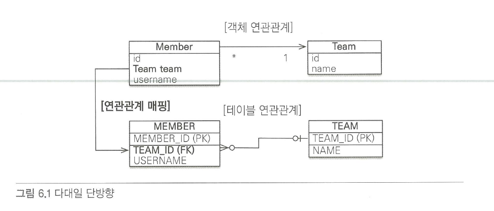

<br>

다대일 단방향 구현하기 

```java
@Getter
@Setter
@Entity
public class Member {
    @Id @GeneratedValue
    @Column(name="MEMBER_ID")
    private Long id;

    private String username;

    @ManyToOne
    @JoinColumn(name = "TEAM_ID")
    private Team team;

}

@Getter
@Setter
@Entity
public class Team {
    @Id @GeneratedValue
    @Column(name="TEAM_ID")
    private Long id;

    private String name;
}
```

위는 다대일 단방향 연관관계로 멤버(N)와 팀(1)의 관계를 나타내도록 작성한 코드이다.
**외래키는 다(N) 에 있으며, 연관관계의 주인은 항상 다(N) 쪽에 있음에 주의하자.**

만약 멤버가 어떤 팀인지 알 수 있도록 멤버가 팀 참조 필드를 가지고 있듯이 팀도 멤버를 알 수있도록 하고 싶다면 팀에 멤버 참조 필드를 만들어주면 된다. 이렇게 두 객체가 서로를 참조하는 필드를 가진다면 두 객체가 다대일 양방향 연관관계를 갖게되는 것이다.

<br>
<br>

### 다대일 양방향 연관관계 

<br>

다대일 양뱡항 연관관계 이미지

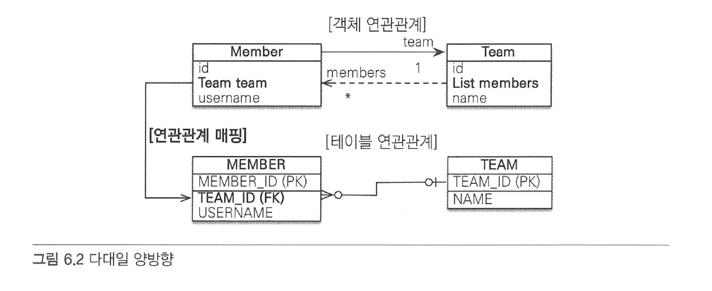

위는 팀과 멤버를 다대일 연관관계를 가질 때, 객체 연관관계와 테이블 연관관계를 보여주는 이미지이다. 객체 연관관게에서 실선과 점선이 보일텐데 **실선은 연관관계의 주인임을 나타내고 점선은 연관관계의 주인이 아님을 나타낸다.**

다대일 양방향 구현하기 

```java
@Getter
@Setter
@Entity
public class Member {
    @Id @GeneratedValue
    @Column(name="MEMBER_ID")
    private Long id;

    private String username;

    @ManyToOne
    @JoinColumn(name = "TEAM_ID")
    private Team team;

}

@Getter
@Setter
@Entity
public class Team {
    @Id @GeneratedValue
    @Column(name="TEAM_ID")
    private Long id;

    private String name;

    @OneToMany(mappedBy = "team")
    private List<Member> members = new ArrayList<Member>();

    public void addMember(Member member) {
        this.members.add(member);
        if (member.getTeam() != this) {
            member.setTeam(this);
        }
    }
}
```

다대일 단방향 연관관계를 구현한 코드와 다대일 양방향 연관관계를 구현한 코드의 다른 점은 팀 엔티티에 멤버를 참조하는 필드가 생겼다는 것 뿐이다. 

### 다대일 연관관계 정리

- **양방향은 외래 키가 있는 쪽이 연관관계의 주인이다.**

두 객체가 서로를 참조하는 양방향에서 외래 키가 있는 쪽은 항상 다(N) 쪽이며, 다(N) 쪽이 외래키를 관리하므로 연관관계의 주인이다. 연관관계의 주인이 아니라면 데이터를 저장할 때 사용할 수 없고 읽을 때(조회)만 사용할 수 있다.

- **양방향 연관관계는 항상 서로를 참조해야 한다.**

양방향 연관관계는 두 객체가 서로를 참조한다는 의미이다. 그러므로 두 객체가 서로를 참조하지 않으면 양방향 연관관계가 성립되지 않는다. **항상 양방향 연관관계가 성립되도록 연관관계 편의 메소드를 작성하는 것이 좋으나 두 객체 모두 연관관계 편의 메소드를 작성하면 무한루프에 빠지므로 주의해야한다.**


## 일대다[1:N] 연관관계

일대다 관계는 다대일 관계의 반대 방향으로 일대다 관계는 엔티티를 하나 이상 참조할 수 있어 자바 컬렉션(Collection, List, Set, Map)을 사용해야한다.

### 일대다 단방향 연관관계

일대다 양뱡항 연관관계 이미지

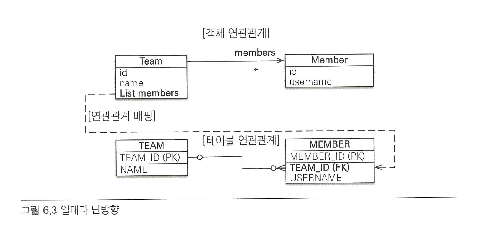

위의 이미지를 보면 Team 엔티티의 members로 회원 테이블의 TEAM_ID 외래 키를 관리하는 것을 볼 수 있다. **보통 자신이 매핑한 테이블의 외래 키를 관리하는데, 이 매핑은 반대쪽 테이블에 있는 외래 키를 관리한다.** 이렇게 반대쪽 테이블에 있는 외래 키를 관리할 수 밖에 없는 이유는 외래 키는 항상 다(N) 쪽에 존재하기 때문에 Member 엔티티에는 외래 키를 매핑할 수 있는 참조 필드가 없기 때문이다.

일대다 단방향 구현하기 

```Java
@Getter
@Setter
@Entity
public class Team {
    @Id @GeneratedValue
    @Column(name="TEAM_ID")
    private Long id;

    private String name;

    @OneToMany
    @JoinColumn(name="TEAM_ID")
    private List<Member> members = new ArrayList<Member>();

}

@Getter
@Setter
@Entity
public class Member {
    @Id @GeneratedValue
    @Column(name="MEMBER_ID")
    private Long id;

    private String username;


}
```

**일대다 단방향 관계를 매핑할 때는 @JoinColumn을 명시해야 한다. 그렇지 않으면 JPA는 연결 테이블을 중간에 두고 연관관계를 관리하는 조인 테이블(JoinTable) 전략을 기본으로 사용해서 매핑한다.**

일대다 단방향 매핑의 단점은 매핑한 객체가 관리하는 외래키가 다른 테이블에 있다는 것이다. 쉽게 말하자면 외래키가 팀이 아닌 멤버에 있기 때문에 팀 객체 생성, 멤버 객체 생성, 팀과 멤버가 서로 참조하도록 업데이트의 과정을 거쳐야 하는 것이다. 그렇기 때문에 **일대다 단방향 매핑보다는 다대일 양방향 매핑을 사용하는 것이 좋다.**

### 일대다 양방향 연관관계

사실 일대다 양방향 매핑은 존재하지 않기 때문에 다대일 양방향 매핑을 사용해야 한다.
더 정확히 말하자면 양방향 매핑에서 @OneToMany는 연관관계의 주인이 될 수 없다. 왜냐하면 관계형 데이터베이스의 특성상 일대다, 다대일 관계는 항상 다쪽에 외래 키가 있다. 그렇기 때문에 @OneToMany, @ManyToOne 둘 중에 연관관계의 주인은 항상 다 쪽인 @ManyToOne을 사용한 곳이다. 그렇기 때문에 @ManyToOne에는 mappedBy 속성이 없다.

그렇다고 일대다 양방향 매핑이 완전히 불가능한것은 아닌데 일대다 단방향 매핑 반대편에 같은 외래 키를 사용하는 다대일 단방향 매핑을 읽기 전용으로 하나 추가하면 된다.

일대다 양뱡항 연관관계 이미지

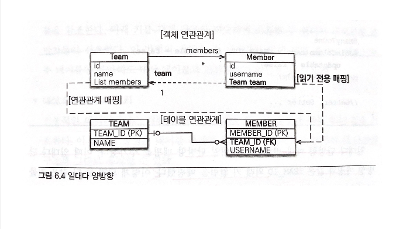

일대다 양방향 구현하기 

```java
@Getter
@Setter
@Entity
public class Team {
    @Id @GeneratedValue
    @Column(name="TEAM_ID")
    private Long id;

    private String name;

    @OneToMany
    @JoinColumn(name="TEAM_ID")
    private List<Member> members = new ArrayList<Member>();

}

@Entity
public class Member {
    @Id @GeneratedValue
    @Column(name="MEMBER_ID")
    private Long id;
    private String username;

    @ManyToOne
    @JoinColumn(name="TEAM_ID", insertable = false,
    updatable = false)
    private Team team;
}
```

일대다 단뱡항 매핑은 반대편에 다대일 단방향 매핑을 추가했다. 이 때 일대다 단방향 매핑과 같은 TEAM_ID 외래 키 컬럼을 매핑했다. 이렇게 하면 둘 다 같은 키를 관리하므로 문제가 발생할 수 있어 반대편 다대일 쪽은 insertable과 updatable을 false로 설정해 읽기만 가능하게 했다.

## 일대일[1:1] 연관관계

일대일 관계는 양쪽이 서로 하나의 관계만 가지기 때문에 항상 다(N)쪽이 가져야하던 외래 키를 일대일 관계에서는 어느 쪽이든 가질 수 있다는 특징이 있다. 그렇기 때문에 주 테이블과 대상 테이블 중 어느 테이블이 외래 키를 가질 지 선택해야 한다.

- 주 테이블에 외래 키

    **주 객체가 대상 객체를 참조하는 것처럼 주 테이블에 외래 키를 두고 대상 테이블을 참조한다. 주 테이블이 외래 키를 가지면 주 테이블만 확인해도 대상 테이블과 연관관계가 있는지 알 수 있다는 장점이 있다.**

- 대상 테이블에 외래 키

    **대상 테이블이 외래 키를 가지면 테이블 관계를 일대일에서 일대다 관계로 변경할 때 테이블 구조를 그대로 유지할 수 있다는 장점이 있다.**


이번에는 팀과 멤버의 관계가 아닌 멤버와 사물함의 관계를 예로들어 구현해보자. 한 명의 멤버는 하나의 사물함을 사용할 수 있다.


### 주 테이블에 외래 키 (단방향)

이번 예에서는 MEMBER가 주 테이블이고 LOCKER가 대상 테이블이다.

주 테이블에 외래키 (단방향) 이미지

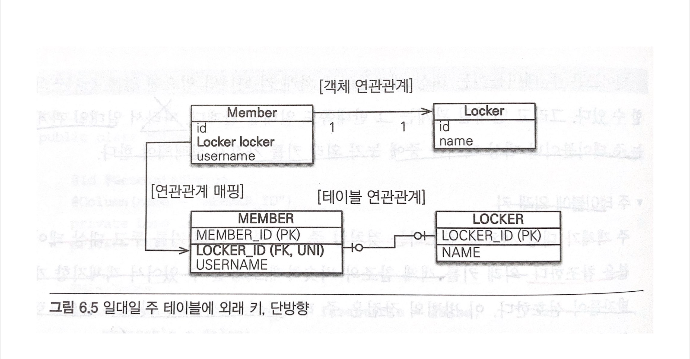

주 테이블에 외래키 (단방향) 구현하기

```java
@Entity
public class Member {
    @Id @GeneratedValue
    @Column(name="MEMBER_ID")
    private Long id;

    private String username;

    @OneToMany
    @JoinColumn(name="LOCKER_ID")
    private Locker locker;

}

@Entity
public class Locker {
    @Id @GeneratedValue
    @Column(name="LOCKER_ID")
    private Long id;

    private String name;

}
```


### 주 테이블에 외래 키 (양방향)

주 테이블에 외래키 (양방향) 이미지

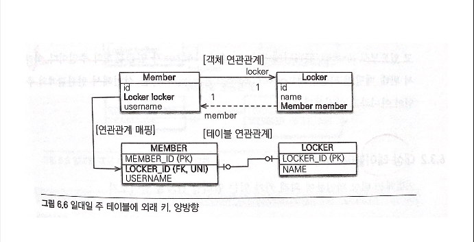

주 테이블에 외래키 (양방향) 구현하기

```java
@Entity
public class Member {
    @Id @GeneratedValue
    @Column(name="MEMBER_ID")
    private Long id;

    private String username;

    @OneToMany
    @JoinColumn(name="LOCKER_ID")
    private Locker locker;

}

@Entity
public class Locker {
    @Id @GeneratedValue
    @Column(name="LOCKER_ID")
    private Long id;

    private String name;
    
    @OneToMany(mappedBy="locker")
    private Member member;

}
```

양방향일때는 꼭 연관관계의 주인을 정해줘야 한다. 이번 예에서 연관관계의 주인을 정해주기 위해서 Locker 엔티티의 @OneToOne에 mappedBy 속성을 사용해 Locker 엔티티가 연관관계의 주인이 아님을 알려줬다.


### 대상 테이블에 외래 키 (단방향)

대상 테이블에 외래키 (단방향) 이미지

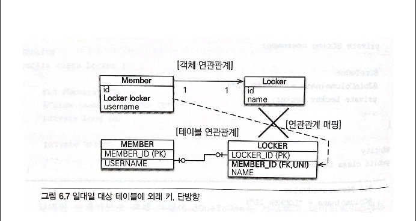

위는 대상 테이블에 외래키가 있는 단방향 관계를 보여주는 이미지이다. 일대일 관계 중 대상 테이블에 외래 키가 있는 단방향 관계는 JPA에서 지원하지 않는다. 그리고 이런 모양으로 매핑할 수 있는 방법도 없다.

### 대상 테이블에 외래 키 (양방향)

대상 테이블에 외래키 (양방향) 이미지

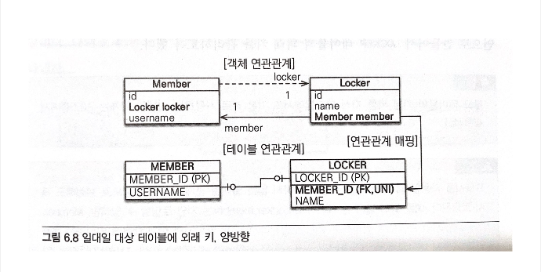

대상 테이블에 외래키 (양방향) 구현하기

```java
@Entity
public class Member {
    @Id @GeneratedValue
    @Column(name="MEMBER_ID")
    private Long id;

    private String username;

    @OneToMany
    @JoinColumn(name="member")
    private Locker locker;

}

@Entity
public class Locker {
    @Id @GeneratedValue
    @Column(name="LOCKER_ID")
    private Long id;

    private String name;
    
    @OneToMany
    @JoinColumn(mappedBy="MEMBER_ID")
    private Member member;

}
```

일대일 매핑에서 대상 테이블에 외래 키를 두고 싶다면 양방향으로 매핑해야한다.


## 다대다[N:N] 연관관계

<br>

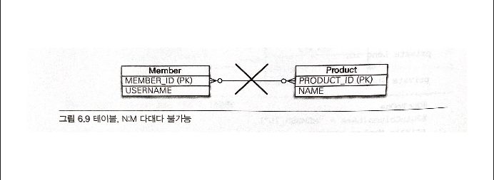

**관계형 데이터베이스는 정규화된 테이블 2개로 다대다 관계를 표현할 수 없다. 그렇기 때문에 다대다 관계를 일대다, 다대일 관계로 풀어내는 연결 테이블을 사용한다.**

<br>

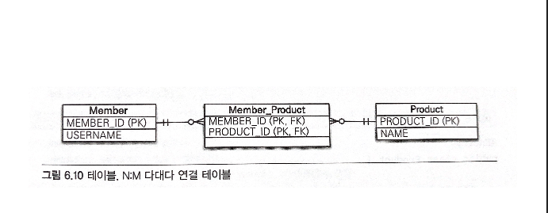

위의 그림을 보면 다대다 관계를 표현하기위해서 Member_Product라는 연결 테이블이 Member와 Locker 테이블 중간에 추가된 것을 볼 수 있다. 이렇게 연결 테이블을 사용해서 다대다 관계를 일대다, 다대일 관계로 풀어낼 수 있다.

### 다대다 단방향 연관관계

다대다 단방향 연관관계 구현하기

```java
@Entity
public class Member {
    @Id @Column(name="MEMBER_ID")
    private String id;

    private String username;

    @ManyToMany
    @JoinTable(name="MEMBER_PRODUCT",
    joinColumns = @JoinColumn(name="MEMBER_ID"),
    inverseJoinColumns = @JoinColumn(name = "PRODUCT_ID"))
    private List<Product> products = new ArrayList<Product>();
}

@Entity
public class Product {
    @Id @Column(name = "PRODUCT_ID")
    private String id;
    
    private String name;
}
```

위에서 멤버 엔티티와 상품 엔티티를 @ManyToMany로 매핑했다. 여기서 중요한 점은 @ManyToMany와 @JoinTable을 사용해서 연결 테이블을 바로 매핑한 것이다. 이렇게 함으로써 멤버와 상품을 연결하는 회원상품 엔티티 없이 매핑을 완료할 수 있었다.

- @JoinTable 속성 알아보기

    1. JoinTable.name : 연결 테이블을 지정한다. 여기서는 MEMBER_PRODUCT 테이블을 선택했다.
    2. JoinTable.joinColumns : 현재 방향인 회원과 매핑할 조인 컬럼 정보를 지정한다.
    3. JoinTable.inverseJoinColumns : 반대 방향인 상품과 매핑할 조인 컬럼 정보를 지정한다.


### 다대다 양방향 연관관계

<br>

다대다 단방향을 구현하면서 Member > Product 참조는 이미 만들어둔 상태이다. 여기서 Member와 Product가 양방향으로 참조를 하기 위해서는 Product가 Member를 참조하도록 @ManyToMany를 사용해서 구현해주면 된다.

<br>
<br>

#### 다대다 단방향 연관관계 구현하기

<br>

```java
@Entity
public class Member {
    @Id @Column(name="MEMBER_ID")
    private String id;

    private String username;

    @ManyToMany
    @JoinTable(name="MEMBER_PRODUCT",
    joinColumns = @JoinColumn(name="MEMBER_ID"),
    inverseJoinColumns = @JoinColumn(name = "PRODUCT_ID"))
    private List<Product> products = new ArrayList<Product>();

    // 연관관계 편의 메소드 추가
    public void addProduct(Product product) {
        products.add(product);
        product.getMembers().add(this);
    }
}

@Entity
public class Product {
    @Id @Column(name = "PRODUCT_ID")
    private String id;
    
    private String name;

    @ManyToMany(mappedBy="products")
    private List<Member> members;
}
```

### 다대다 : 매핑의 한계와 극복, 연결 엔티티 사용


지금까지 우리는 다대다 연결관계를 구현하기 위해서 @ManyToMany를 사용해 연결 테이블을 만들고 일대다, 다대일로 연관관계를 풀어줬다. @ManyToMany를 사용하면 연결테이블을 자동으로 생성해주므로 도메인 모델이 단순해지고 여러가지로 편하지만 연결 테이블에 특정 컬럼을 만들어줘야하는 경우에는 @ManyToMany가 만들어주는 연결테이블을 사용할 수 없게된다. 만약 연결 테이블에 날짜와 같은 컬럼들을 만들어줘야한다면 @ManyToMany가 아닌 연결테이블을 직접 만들어줘야한다.


주문 수량(ORDERAMOUNT)과 주문 날짜(ORDERDATE) 컬럼이 추가된 연결 테이블을 만들어보자.

<br>

- 연결 테이블 만들기 이미지 (테이블) 


<br>

- 연결 테이블 만들기 이미지 (엔티티)

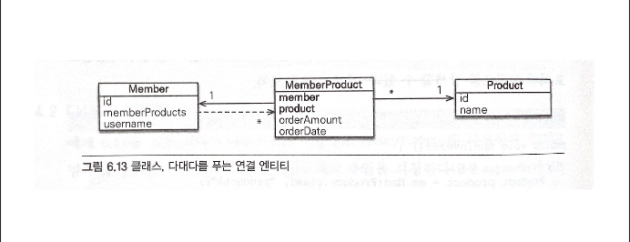

<br>

```java
@Entity
public class Member {
    @Id @Column(name="MEMBER_ID")
    private String id;

    @OneToMany(mappedBy="member")
    private List<MeberProduct> memberProducts;
}

@Entity
public class Product {
    @Id @Column(name="PRODUCT_ID")
    private String id;

    private String name;

}

@Entity
@IdClass(MemberProductId.class)
public class MemberProduct {
    @Id
    @ManyToOne
    @JoinColumn(name="MEMBER_ID")
    private Member member;

    @Id
    @ManyToOne
    @JoinColumn(name="PRODUCT_ID")
    private Product product;

    private int orderAmount;
}

public class MemberProductId implements Serializable {
    private String member;
    private String product;

    @Override
    public boolean equals(Object o) { ... }


    @Override
    public int hashCode() { ... }
}
```

위의 회원상품(MemberProduct) 엔티티를 보면 기본 키를 매핑하는 @Id와 외래 키를 매핑하는 @JoinColumn을 동시에 사용해서 기본 키 + 외래 키를 한번에 매핑했다. 그리고 @IdClass를 사용해서 복합 기본 키를 매핑했다.


- 복합 기본 키 

    회원상품 엔티티는 기본 키가 MEMBER_ID와 PRODUCT_ID로 이루어진 복합 기본키(복합 키)다. JPA에서 복합 키를 사용하려면 별도의 식별자 클래스를 만들어야 하며 엔티티에 @IdClass를 사용해서 식별자 클래스를 지정하면 된다. 위에서는 MemberProductId 클래스를 복합 키를 위한 식별자 클래스로 사용한다.

    복합키를 위한 식별자 클래스는 다음과 같은 특징이 있다.
 
    1. 복합 키는 별도의 식별자 클래스로 만들어야 한다.
    2. Serializable을 구현해야 한다.
    3. euqals와 hashCode 메소드를 구현해야 한다.
    4. 기본 생성자가 있어야 한다.
    5. 식별자 클래스는 public이어야 한다.
    6. @IdClass를 사용하는 방법 외에 @EmbeddedId를 사용하는 방법도 있다.


- 식별 관계

    **회원상품은 회원과 상품의 기본 키를 받아서 자신의 기본 키로 사용한다. 이렇게 부모 테이블의 기본 키를 받아서 자신의 기본 키 + 외래 키로 사용하는 것을 데이터베이스 용어로 식별관계라 한다.** 회원상품은 회원의 기본 키를 받아서 자신의 기본 키로 사용하과 동시에 회원과의 관계를 위한 외래 키로 사용한다. 그리고 상품의 기본 키도 받아서 자신의 기본 키로 사용함과 동시에 상품과의 관계를 위한 외래 키로 사용한다. 또한 MemberProductId 식별자 클래스로 두 기본 키를 묶어서 복합 기본 키로 사용한다.

지금까지는 기본 키가 단순해서 기본 키를 위한 객체를 사용하는 일이 없었지만 복합 키는 항상 식별자 클래스를 만들어야 하기 때문에 사용하기에 복잡하다. 단순히 컬럼 하나만 기본 키로 사용하는 것과 비교해서 복합 키를 사용하면 ORM 매핑에서 처리할 일이 상당히 많아진다. 그렇기 때문에 복합 키를 사용하지 않고 간단히 다대다 관계를 구성하는 방법을 알아보자.

### 다대다 : 새로운 기본 키 사용 

간단하게 다대다 관계를 구성하기 위해서 우리는 데이터베이스에서 자동으로 생성해주는 대리 키를 Long 값으로 사용하는 것이다. 이 방법은 간단하고 영구적으로 쓸 수 있으며 비즈니스에 의존하지 않는다. 그리고 ORM 매핑 시에 복합 키를 만들지 않아도 되므로 간단히 매핑을 완성할 수 있다.

- 연결 테이블에 새로운 기본 키 사용

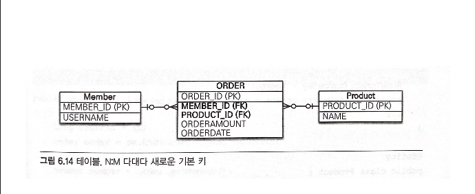

```java
@Entity
public class Order {
    @Id @GeneratedValue
    @Column(name="ORDER_ID")
    private Long id;

    @ManyToOne
    @JoinColumn(name="MEMBER_ID")
    private Member member;
    
    @ManyToOne
    @JoinColumn(name="PRODUCT_ID")
    private Product product;

    private int orderAmount;
    
}

@Entity
public class Member {
    @Id @Column(name="MEMBER_ID")
    private String id;
    private String username;

    @OneToMany(mappedBy = "member")
    private List<Order> orders = new ArrayList<Order>();
}

@Entity
public class Product {
    @Id @Column(name="PRODUCT_ID")
    private String id;
    private String name;

}
```
 
위와 같이 식별자 클래스를 사용하지 않음으로써 코드가 간결해지고 단순해졌다. 이렇게 새로운 기본 키를 사용해 다대다 관계를 풀어내는 것도 좋은 방법이다.


### 다대다 연관관계 정리

다대다 관계를 일대다 다대일 관계로 풀어내기 위해 연결 테이블을 만들 때 식별자를 어떻게 구성할지 선택해야 한다.

- **식별관계** : 받아온 식별자를 기본 키 + 외래 키로 사용한다.
- **비식별관계** 받아온 식별자는 외래 키로만 사용하고 새로운 식별자를 사용한다.


