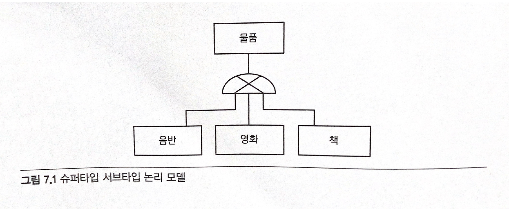
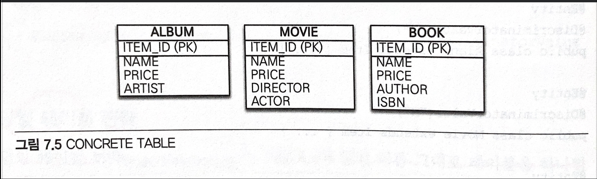
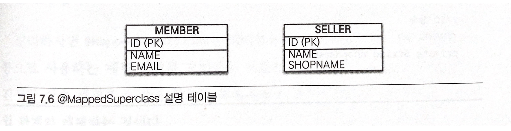
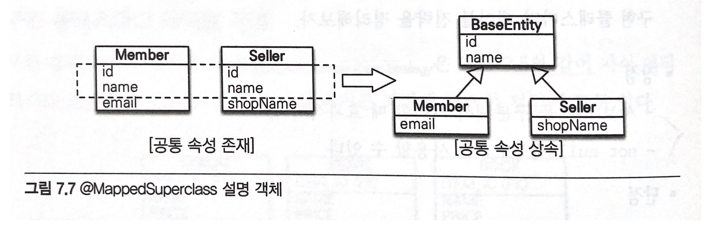
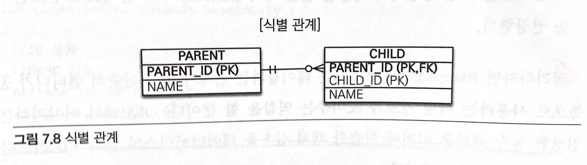
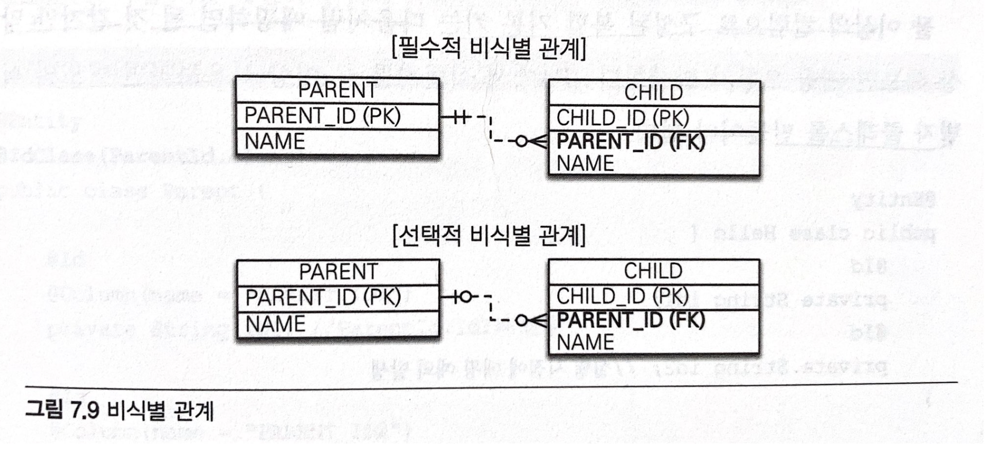
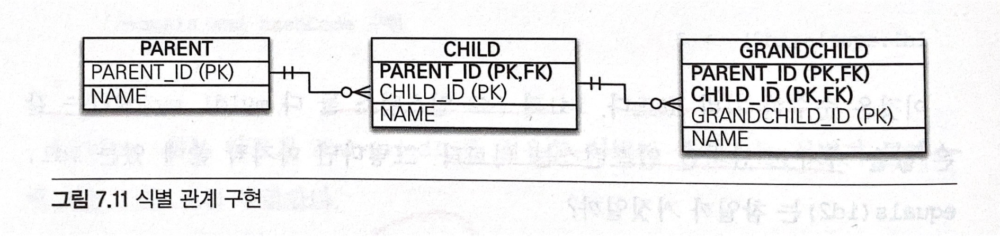

> 자바 ORM 표준 JPA 프로그래밍을 읽고 작성한 내용입니다.
>

<br>
<br>

# 고급 매핑

## 상속 관계 매핑

자바와 같은 객체지향 프로그래밍 언어에서는 상속이라는 개념이 존재하지만 관계형 데이터베이스에서는
상속이라는 개념이 존재하지 않는다. 대신, 슈퍼타입 서브타입 관계 (Super-Type Sub-Type Relationship) 라는
모델링 기법이 객체의 상속개념과가장 유사하며 **ORM에서 말하는 상속 관계 매핑은 객체의 상속과 데이터베이스의 
슈퍼타입 서브타입 관계를 매핑하는 것이다.**

- 슈퍼타입 서브타입 논리 모델
    

슈퍼타입 서브타입 논리모델을 실제 물리 모델인 테이블로 구현할 때는 아래의 3가지 방법을 선택할 수 있다.

1. 각각의 테이블로 변환
    

    각각을 모두 테이블로 만들고 조회할 때 조인을 사용한다. JPA에서는 조인 전략이라고 한다.

2. 통합 테이블로 변환


    테이블을 하나만 사용해서 통합한다. JPA에서는 단일 테이블 전략이라고 한다.

3. 서브타입 테이블로 변환


    서브 타입마다 하나의 테이블을 만든다. JPA에서는 구현 클래스마다 테이블 전략이라 한다.


당연하게도 이렇게 글로만 읽는다면 무슨 말인지 단번에 이해하기 어렵다. 하나하나 공부해보자.


### 조인 전략

조인 전략은 **엔티티 각각을 모두 테이블로 만들고 자식 테이블이 부모 테이블의 기본 키를 받아서 기본 키 + 외래 키로 사용하는 전략이다.**
각 엔티티를 테이블로 만들기 때문에 조회할 때 조인을 사용한다. 만약 조인 전략을 사용한다면 주의해야할 점이 있는데
**객체는 타입으로 구분할 수 있지만 테이블은 타입의 개념이 없기때문에 타입을 구분하는 컬럼을 추가해야한다.**

- 조인 전략 사용 예

```java
@Entity
@Inheritance(stratehy = InheritanceType.JOINED)
@DiscriminatorColumn(name = "DTYPE")
public abstract class Item {

    @Id
    @GeneratedValue
    @Column(name = "ITEM_ID")
    private Long id;

    private String name;
    private int price;
    
}

@Entity
@DiscriminatorValue("A")
public class Album extends Item {
    private String artist;
}

@Entity
@DiscriminatorValue("M")
public class Movie extends Item {
    private String director;
    private String actor;
}
```

- 매핑 정보 분석
>
> 1. @Inheriance(strategy = InheritanceType.JOINED) : 상속 매핑은 부모 클래스에 @Inheritance를 사용해야한다.
     그리고 매핑 전략을 지정해야 하는데 여기서는 조인 전략을 사용하므로 InheritanceType.JOINED를 사용했다.
> 
> 
> 2. @DiscriminatorColumn(name = "DTYPE"): 부모 클래스에 구분 컬럼을 지정한다.
>
> 
> 3. 이 컬럼으로 저장된 자식 테이블을 구분할 수 있다. 기본값이 DTYPE이므로 @DiscriminatorColumn으로 줄여 사용해도 된다.


기본값으로 자식 테이블은 부모테이블의 ID 컬럼명을 그대로 사용하는데, 만약 자식 테이블의 기본 키 컬럼명을 변경하고 싶으면
@PrimaryKeyJoinColumn을 사용하면 된다.

```java
@Entity
@DiscriminatorValue("B")
@PrimaryKeyJoinColumn(name = "BOOK_ID")
public class Book extends Item {
    private String author;
    private String isbn;
}
```

BOOK 테이블의 ITEM_ID 기본 키 컬럼명을 BOOK_ID로 변경했따.

조인 전략의 장점과 단점을 정리해보자.
- 장점
  - 테이블이 정규화된다.
  - 외래 키 참조 무결성 제약조건을 활용할 수 있다.
  - 저장공간을 효율적으로 사용한다.
  
- 단점
  - 조회할 때 조인이 많이 사용되므로 성능이 저하될 수 있다.
  - 조회 쿼리가 복잡하다.
  - 데이터를 등록할 INSERT SQL을 두 번 실행한다.


### 단일 테이블 전략

단일 테이블 전략은 이름 그대로 테이블을 하나만 사용하는 것으로 구분 컬럼(DTYPE)으로 어떤 자식 데이터가 저장되었는지 구분한다.
**조회할 때 조인을 사용하지 않으므로 일반적으로 가장 빠르다.**

단일 테이블 전략을 사용할 때 주의할 점은 자식 엔티티가 매핑한 컬럼은 모두 null을 허용해야 한다는 점이다.
예를들어 Book 엔티티를 저장하면 ITEM 테이블의 AUTHOR, ISBN 컬럼만 사용하고 다른 엔티티와 매핑된 ARTIST, DIRECTOR, ACTOR 컬럼은 사용하지 않으므로 null이 입력되기 때문이다.

```java
@Entity
@Inheritance(strategy = InheritanceType.SINGLE_TABLE)
@DiscriminatorColumn(name = "DTYPE")
public abstract class Item {
    @Id @GenerateValue
    @Column(name = "ITEM_ID")
    private Long id;
    
    private String name;
    private int price;
}

@Entity
@DiscriminatorValue("A")
public class Album extends Item { ... }

@Entity
@DiscriminatorValue("M")
public class Movie extends Item { ... }

@Entity
@DiscriminatorValue("B")
public class Book extends Item { ... }
```

InheritanceType.SINGLE_TABLE로 지정하면 단일테이블 전략을 사용하며 이 전략은 테이블 하나에 모든 것을
통합하므로 구분 컬럼을 필수로 사용해야 한다. 단일 테이블 전략의 장단점은 하나의 테이블을 사용하는 특징과 관련 있다.
단일 테이블의 전략을 정리해보자.

- 장점
  - 조인이 필요없으므로 일반적으로 조회 성능이 빠르다
  - 조회 쿼리가 단순하다.
- 단점
  - 자식 엔티티가 매핑한 컬럼은 모두 null을 허용해야 한다.
  - 단일 테이블에 모든 것을 저장하므로 테이블이 커질 수 있다. 그러므로 상황에 따라서는 조회 성능이 오히려 느려질 수 있다.

- 특징
  - 구분 컬럼을 꼭 사용해야 한다. 따라서 @DiscriminatorColumn을 꼭 설정해야 한다.
  - @DiscriminatorValue를 지정하지 않으면 기본으로 엔티티 이름을 사용한다.


### 구현 클래스마다 테이블 전략

테이블 전략은 구현 클래스마다 자식 엔티티마다 테이블을 만든다. 그리고 자식 테이블 각각에 필요한 컬럼이 모두 있다.




- 테이블 전략 사용하기

```java
@Entity
@Inheritance(strategy = InheritanceType.TABLE_PER_CLASS)
public abstract class Item {
    @Id @GeneratedValue 
    @Column(name = "ITEM_ID")
    private Long id;
    
    private String name;
    private int price;
}

@Entity
public class Album extends Item { ... }

@Entity
public class Movie extends Item { ... }

@Entity
public class Book extends Item { ... }
```

구현 클래스마다 테이블 전략을 정리해보자. 

- 장점
  - 서브 타입을 구분해서 처리할 때 효과적이다.
  - not null 제약조건을 사용할 수 있다.
- 단점
  - 여러 자식 테이블을 함께 조회할 때 성능이 느리다.
  - 자식 테이블을 통합해서 쿼리하기 어렵다.
- 특징
  - 구분 컬럼을 사용하지 않는다.
  
**이 전략은 데이터베이스 설계자와 ORM 전문가 둘 다 추천하지 않는 전략이다.
조인이나 단일 테이블 전략을 고려하자.**

## @MappedSuperclass

지금까지의 상속 관계 매핑은 부모 클래스와 자식 클래스 모두 데이터베이스 테이블과 매핑했다. 부모 클래스는 테이블과 매핑하지 않고
부모 클래스를 상속받는 자식 클래스에게 매핑 정보만 제공하고 싶으면 @MappedSuperclass를 사용하면 된다.

@MappedSuperclass는 비유하자면 추상 클래스와 비슷한데 @Entity는 실제 테이블과 매핑되지만 @MappedSuperclass는 실제 테이블과 매핑되지 않는다.
**이것은 단순히 매핑 정보를 상속할 목적으로만 사용된다.**

- @MappedSuperclass 설명 테이블
  

- @MappedSuperclass 설명 객체
  

회원과 판매자는 서로 관계가 없는 테이블과 엔티티다. 테이블은 그대로 두고 객체 모델의 id, name 
두 공통 속성을 부모 클래스로 모으고 객체 상속 관계로 만들어보자.

```java
@MappedSuperclass
public abstract class BaseEntity {
    @Id @GeneratedValue 
    private Long id;
    private String name;
}

@Entity
public class Member extends BaseEntity {
    // ID 상속
    // Name 상속
  private String email;
}

@Entity
public class Member extends BaseEntity {
  // ID 상속
  // Name 상속
  private String shopName;
}
```

BaseEntity에는 객체들이 주로 사용하는 공통 매핑 정보를 정의했다. 그리고 자식 엔티티들은 상속을 통해
BaseEntity의 매핑 정보를 물려받았다. 여기서 BaseEntity는 테이블과 매핑할 필요가 없고 자식 엔티티에게 공통으로 사용되는 매핑 정보만 제공하면 된다.
따라서 @MappedSuperclass 를 사용했다.

부모로부터 물려받은 매핑 정보를 재정의하려면 @AttributeOverrides나 @AttributeOverride를 사용하고, 연관관계를
재정의하려면 @AssociationOverridessk @AssociationOverride를 사용한다.

@MappedSuperclass의 특징을 정리해보자.

- 테이블과 매핑되지 않고 자식 클래스에 엔티티의 매핑 정보를 상속하기 위해 사용한다.
- @MappedSuperclass로 지정한 클래스는 엔티티가 아니므로 em.find()나 JPQL에서 사용할 수 없다.
- 이 클래스를 직접 생성해서 사용할 일은 거의 없으므로 추상 클래스로 만드는 것을 권장한다.

**@MappedSuperclass는 테이블과는 관련이 없고 단순히 엔티티가 공통으로 사용하는 매핑 정보를 모아주는 역할을 할 뿐이다.**


## 복합 키와 식별 관계 매핑

데이터베이스 테이블 사이에 관계는 외래 키가 기본 키에 포함되는지 여부에 따라 식별관계와
비식별 관계로 구분한다.

> **식별관계** : Identifying Relationship
> 
> **비식별관계** : Non-Identifying Relationship

- 식별 관계

식별 관계는 부모 테이블의 기본 키를 내려받아서 자식 테이블의 기본 키 + 외래 키로 사용하는 관계다.



-  비식별관계

비식별 관계는 부모 테이블의 기본 키를 받아서 자식 테이블의 외래 키로만 사용하는 관계다.



위의 그림을 보면 PARENT 테이블의 기본 키 PARENT_ID를 받아서 CHILD 테이블의 외래 키(FK)로만 사용한다.
비식별 관계는 외래 키에 NULL을 허용하는지에 따라 필수적 비식별 관계와 선택적 비식별 관계로 나눈다.

> **필수적 비식별 관계(Mandatory)** : 외래 키에 NULL을 허용하지 않는다. 연관관계를 필수적으로 맺어야 한다.
> 
> **선택적 비식별 관계(Optional)** : 외래 키에 NULL을 허용한다. 연관관계를 맺을지 말지 선택할 수 있다.

데이터베이스 테이블을 설계할 때 식별 관계나 비식별 관계 중 하나를 선택해야 한다. 최근에는 비식별 관계를 주로 사용하고 꼭 필요한 곳에만 식별 관계를 사용하는 추세이며,
JPA는 식별 관계와 비식별 관계를 모두 지원한다.

### 복합 키 : 비식별 관계 매핑

기본 키를 구성하는 컬럼이 하나면 단순하게 매핑할 수 있지만, 둘 이상의 컬럼으로 구성된 복합 기본 키는 다음처럼 매핑하면
될 것 같지만 막상 해보면 오류가 발생한다. JPA에서 식별자를 둘 이상 사용하려면 별도의 식별자 클래스를 만들어야 한다.

```java
@Entity
public class Hello {
    @Id
    private String id1;
    @Id
    private String id2;
}
```

JPA는 영속성 컨텍스트에 엔티티를 보관할 때 엔티티의 식별자를 키로 사용한다. 그리고
식별자를 구분하기 위해 equals와 hashCode를 사용해서 동등성 비교를 한다. 그런데 **식별자
필드가 하나일 때는 보통 자바의 기본 타입을 사용하므로 문제가 없지만, 식별자 필드가 2개 이상이면 
별도의 식별자 클래스를 만들고 그곳에 equals와 hashCode를 구현해야 한다.**

#### @IdClass

- 복합 키 테이블


PARENT 테이블을 보면 기본 키를 PARENT_ID1, PARENT_ID2로 묶은 복합 키로 구성했다. 따라서 복합 키를 매핑하기 위해서는
식별자 클래스를 별도로 만들어야 한다.

- 부모 클래스

```java
@Entity
@IdClass(ParentId.class)
public class Parent {
    @Id
    @Column(name = "PARENT_ID1")
    private String id1;
  
    @Id
    @Column(name = "PARENT_ID2")
    private String id2;
  
    private String name;
}
```

- 식별자 클래스
```java
public class ParentId implements Serializable {
    private String id1;
    private String id2;
    
    public ParentId() {
        
    }
    public ParentId(String id1, String id2) { 
        this.id1 = id1;
        this.id2 = id2;
    }
    
    @Override
    public boolean equals(Object o) { ... }
  
    @Override
    public int hashCode() { ... }
}
```

@IdClass를 사용할 때 식별자 클래스는 다음 조건을 만족해야 한다.

1. 식별자 클래스의 속석명과 엔티티에서 사용하는 식별자의 속성명이 같아야한다.
2. Serializable 인터페이스를 구현해야 한다.
3. equals, hashCode를 구현해야 한다.
4. 기본 생성자가 있어야 한다.
5. 식별자 클래스는 public 이어야 한다.

그러면 실제로 어떻게 사용하는지 알아보자.

- 사용해보기
```java
Parent parent = new Parent();
parent.setId1("myId1");
parent.setId2("myId2");
parent.setName("parentName");
em.persist(parent);
```

저장 코드를 보면 식별자 클래스인 ParentId가 보이지 않는데 em.persist()를 호출하면
영속성 컨텍스트에 엔티티를 등록하기 직전에 내부에서 Parent.id1, Parentid2 값을 사용해 식별자 클래스인
ParentId를 생성하고 영속성 컨텍스트의 키로 사용한다.

- 자식 클래스 
```java
@Entity
public class Child {
    @Id
    private String id;
    
    @ManyToOne
    @JoinColumns({
            @JoinColumn(name = "PARENT_ID1", 
            referencedColumnName = "PARENT_ID1"),
                    @JoinColumn(name = "PARENT_ID2",
                            referencedColumnName = "PARENT_ID2")})
    private Parent parent;
  
}
```

부모 테이블의 기본 키 컬럼이 복합 키이므로 자식 테이블의 외래 키도 복합 키다. 따라서 외래 키 매핑 시 여러 컬럼을
매핑해야 하므로 @JoinColumns 어노테이션을 사용하고 각각의 외래 키 컬럼을 @JoinColumn으로 매핑한다.


#### EmbeddedId

@IdClass가 데이터베이스에 맞춘 방법이라면 @EmbeddedId는 좀 더 객체지향적인 방법이다.

```java
@Entity
public class Parent {
    @EmbeddedId
    private ParentId id;
    
    private String name;
}
```

Parent 엔티티에서 식별자 클래스를 직접 사용하고 @EmbeddedId 어노테이션을 적어주면 된다.

```java
@Embeddable
public class ParentId implements Serializable {
    @Column(name = "PARENT_ID1")
    private String id1;
    
    @Column(name = "PARENT_ID2")
    private String id2;
    
    // equals and hashCode 구현
  
}
```

@IdClass와는 다르게 @EmbeddedId를 적용한 식별자 클래스는 식별자 클래스에 기본 키를 직접 매핑한다.
@EmbeddedId를 적용한 식별자 클래스는 다음 조건을 만족해야 한다.

- @Embeddable 어노테이션을 붙여주어야 한다.
- Serializable 인터페이스를 구현해야 한다.
- equals, hashCode를 구현해야 한다.
- 기본 생성자가 있어야 한다.
- 식별자 클래스는 public이어야 한다.

@EmbeddedId를 사용하는 코드를 보자.

- 엔티티 저장
```java
Parent parent = new Parent();
ParentId parentId = new ParentId("myId1", "myId2");
parent.setId(parentId);
parent.setName("parentName");
em.persist(parent);
```

- 엔티티 조회
```java
ParentId parentId = new ParentId("myId1", "myId2");
Parent parent = em.find(Parent.class, parentId);
```

#### @IdClass VS @EmbeddedId

@IdClass와 @EmbeddedId 모두 각각의 장단점이 존재하므로 취향에 맞는 것을 일관성 있게 사용하면 된다.
@EmbeddedId가 @IdClass와 비교해 좀 더 객체지향적이고 중복도 없어 좋아보이긴 하지만 특정 상황에 JPQL이 더 길어질 수 있다.

```java
em.createQuery("select p.id.id1, p.id.id2 from Parent p"); // @EmbeddedId
em.createQuery("select p.id1, p.id2 from Parent p");       // @IdClass
```


### 복합 키 : 식별 관계 매핑



위 그림에서 보면 부모, 자식, 손자까지 계속 기본 키를 전달하는 것이 식별 관계이다.
식별 관계에서 자식 테이블은 부모 테이블의 기본 키를 포함해서 복합 키를 구성해야 하므로 @IdClasssk 
@EmbeddedId를 사용해서 식별자를 매핑해야 한다.


### 식별, 비식별 관계의 장단점

데이터베이스 설계 관점에서 보면 다음과 같은 이유로 식별 관계보다는 비식별 관계를 선호한다.

1. 식별 관계는 부모 테이블의 기본 키를 자식 테이블로 전파하면서 자식 테이블의 기본 키 컬럼이 점점 늘어난다.
2. 식별 관계는 2개 이상의 컬럼을 합해서 복합 기본 키를 만들어야 하는 경우가 많다.
3. 식별 관계를 사용할 때 기본 키로 비즈니스 의미가 있는 자연 키 컬럼을 조합하는 경우가 많다.
반면에 비식별 관계의 기본 키는 비즈니스와 관계가 없는 대리 키를 주로 사용한다. 비즈니스 요구 사항은 시간이 지남에 따라 언젠가는 변하기 때문에
식별 관계의 자연 키 컬럼들이 자식에 손자까지 전파되면 변경하기 힘들다.
4. 식별 관계는 부모 테이블의 기본 키를 자식 테이블의 기본 키로 사용하므로 비식별 관계보다 테이블 구조가 유연하지 못하다.
5. 식별 관계를 사용함으로써 별도의 인덱스를 생성할 필요없기 기본 키 인덱스만 사용해도 된다.

#### 선택적 비식별 관계 VS 필수적 비식별 관계

선택적 비식별 관계보다는 필수적 비식별 관계를 사용하는 것이 좋다.

**선택적 비식별 관계는 NULL을 허용하므로 조인할 때 외부 조인을 사용해야하는 반면에 필수적 관계는 NOT NULL로 항상 관계가 있다는 것을 보장하므로
내부 조인만 사용해도 되기 때문이다.**


