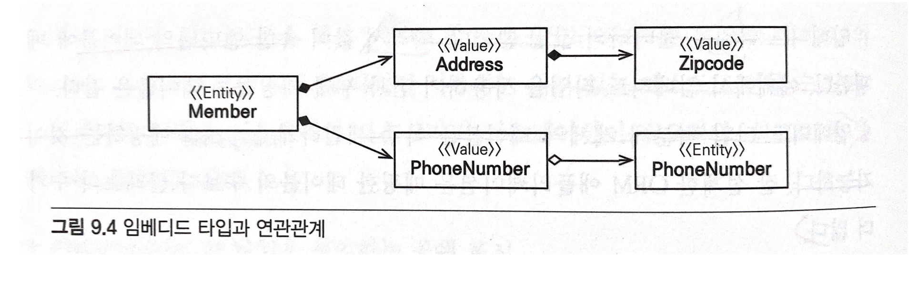
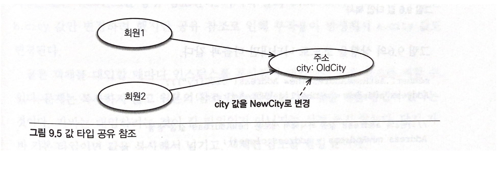
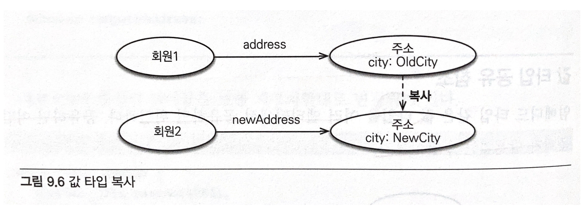

> 자바 ORM 표준 JPA 프로그래밍을 읽고 작성한 내용입니다.
>

<br>
<br>

# 값 타입

JPA는 데이터 타입을 가장 크게 분류하면 **엔티티 타입**과 **값 타입**으로 나눌 수 있는데
엔티티 타입은 @Entity로 정의하는 객체이고, 값 타입은 int, Integer와 같이 단순한 값으로 사용하는 자바 기본 타입이나 객체를 말한다.

**엔티티 타입은 식별자를 통해서 지속해서 추적할 수 있지만, 값 타입은 식별자가 없고 숫자나 문자같은 속성만 있으므로 추적할 수 없다.**

- 기본 타입(Basic Value Type)
  - 자바 기본 타입
  - 래퍼 클래스
  - String
- 임베디드 타입(Embedded Type / 복합 값 타입)
- 컬렉션 타입(Collection Value Type)

## 기본값 타입

기본값 타입은 위에서 말했다시피 String, int와 같이 자바에서 기본적으로 제공하는 타입과 객체를 의미한다.
식별자와 생명주기가 있는 엔티티와는 달리, 값 타입 데이터는 식별자도 없으며 생명주기도 엔티티에 의존하며 공유되서는 안된다는 특징을 가지고 있다.

## 임베디드 타입(복합 값 타입)

**새로운 값 타입을 정의**해서 사용할 수 있는데 이렇게 정의된 값 타입을 **임베디드 타입**이라고 한다. **임베디드 타입에서
중요한 것은 임베디드 타입도 값 타입이라는 것이다.**

- 임베디드 타입 예

```java
@Entity
public class Member {
    @Id @GeneratedValue
    private Long id;
    private Strinbg name;
    
    @Embedded Period workPeriod;
    @Embedded Address homAddress;
}

@Embeddable
public class Period {
    @Temporal(TemporalType.DATE) java.util.Date startDate;
    @Temporal(TemporalType.DATE) java.util.Date endDate;
    
    public boolean isWork(Date date) { 
        // .. 값 타입을 위한 메소드 정의
    }
}

@Embeddable
public class Address {
    
    @Column(name = "city")
    private String city;
    
    private String street;
    private String zipcode;
}
```

Member 엔티티 안에 직접적으로 startDate, endDate, city 등의 필드를 작성하지 않고 임베디드 타입을 사용함으로써
Member 엔티티가 더욱 의미있고 응집력있게 변한 것을 확인할 수 있다.

임베디드 타입은 기본 생성자가 필수이며, 임베디드 타입을 포함한 모든 값 타입은 엔티티의 생명주기에 의존하므로
엔티티와 임베디드 타입의 관계를 UML로 표현하면 컴포지션(Composition) 관계가 된다.

### 임베디드 타입 사용하기 위해 필요한 어노테이션

- @Embeddable : 값 타입을 정의하는 곳에 표시
- @Embedded : 값 타입을 사용하는 곳에 표시


## 임베디드 타입과 테이블 매핑

임베디드 타입은 엔티티의 값일 뿐이다. 그렇기 떄문에 값이 속한 엔티티의 테이블에 매핑하며 임베디드 타입을 사용함으로써
객체와 테이블을 아주 세밀하게 매핑하는 것이 가능해진다.


### 임베디드 타입과 연관관계

임베디드 타입은 값 타입을 포함하거나 엔티티를 참조할 수 있다.

- 임베디드 타입과 연관관계



- 임베디드 타입과 연관관계 예시
  ```java
  @Entity
  public class Member {
      @Embedded Address address;
      @Embedded PhoneNumber phoneNumber;
  }
  
  @Embeddable 
  public class Address {
      String street;
      String city;
      String state;
      @Embedded Zipcode zipcode;
  }
  
  @Embeddable
  public class Zipcode {
      String zip;
      String plusFour;
  }
  
  @Embeddable
  public class PhoneNumber {
      String areaCode;
      String localNumber;
      @ManyToOne PhoneServiceProvider provider;
  }
  
  @Entity
  public class PhoneServiceProvicer {
      @Id String name;
  }
  ```
  
위의 예제를 보면 값 타입인 Address가 값 타입인 Zipcode를 포함하고,
값 타입인 PhoneNumber가 엔티티 타입인 PhoneServiceProvider를 참조한다.


### @AttributeOverride: 속성 재정의

만약 위의 예시에서 한 멤버가 두 개의 주소를 가져야만 한다면 어떻게 해야할까 ?

```java
@Entity
public class Member {
    @Embedded Address homeAddress;
    @Embedded Address companyAddress;
    @Embedded PhoneNumber phoneNumber;
}
```

위의 예시처럼 코드를 작성한다면 컬럼명이 중복되기 떄문에 문제가 된다.
그렇다면 어떻게 하면 컬럼명을 중복되지 않게끔 변경해줄 수 있을까? 바로 @AttributeOverride 어노테이션을 사용하면 된다.

```java
@Entity
public class Member {
    @Embedded Address homeAddress;
    @Embedded
    @AttributeOverrides({
            AttributeOverride(name = "city", column=@Column(name = "COMPANY_CITY")),
            AttributeOverride(name = "street", column=@Column(name = "COMPANY_STREET")),
            AttributeOverride(name = "zipcode", column=@Column(name="COMPANY_ZIPCODE"))
    })
    Address companyAddress;
    @Embedded PhoneNumber phoneNumber;
}
```

하지만 위처럼 @AttributeOverride를 사용하면 어노테이션을 너무 많이 사용하게되어 엔티티 코드가 지저분해지므로 주의하자.


### 임베디드 타입과 null

임베디드 타입 값이 null이면 매핑한 컬럼의 값이 모두 null이 된다.


## 값 타입과 불변 객체


### 값 타입 공유 참조

임베디드 타입과 같은 값 타입은 여러 엔티티에서 공유하면 위험하다. 그 이유를 알아보기 위해서 아래의 예시를 한번 보도록 하자.



```java
member1.setHomeAddress(new Address("OldCity"));
Address address = member1.getHomeAddress();

address.setCity("NewCity");
member2.setHomeAddress(address);
```

위의 예시처럼 코드를 작성하게되면 member1과 member2의 address 값이 모두 NewCity로 변경된 것을 확인할 수 있다.
member2 뿐만 아니라 member1의 address 값이 바뀐 이유는 이 두 멤버 객체가 같은 Address 객체를 참조하고 있었기 떄문이다.
이러한 **공유참조**로 인해 발생하는 버그는 찾아내기 어렵기떄문에 조심해야한다. 그렇다면 다른 방법으로도 한번 멤버의 address 값을 변경해보자.


### 값 타입 복사

위의 예처럼 실제 인스턴스 값을 공유하는 것은 위험하다. 그렇다면 이번에는 값을 복사해서 사용해보도록 하자.



```java
member1.setHomeAddress(new Address("OldCity"));
Address address = member1.getHomeAddress();

Address newAddress = address.clone();

newAddress.setCity("NewCity");
member2.setHomeAddress(newAddress);
```

위의 예는 address 객체를 clone() 메서드를 사용해서 복사한 후 사용한 것을 볼 수 있다.
이 경우 member2 의 address 값만 변경되는 것을 확인할 수 있는데 이렇게 값을 복사하여 사용하면 공유참조로
인해 발생하는 문제를 막을 수 있다.

그렇다면 우리는 매번 객체를 복사한 후에 사용해야 할까 ? 꼭 그렇지만 않다. 객체의 값을 변경할 수 없도록 만들면 된다.
그렇게되면 공유 참조를 하더라도 값을 바꿀수 없기때문에 공유 참조로 발생하는 문제를 해결할 수 있다.
이렇게 값을 바꿀 수 없는 객체를 불변 객체라고 한다.

### 불변 객체

값 타입은 공유 참조를 했을 때 부작용이 발생하기 떄문에 주의하고 있어야 한다..
하지만 이러한 부작용은 값을 변경하지 못하게 함으로써 해결할 수 있는데
값 변경이 불가능한 객체를 불변 객체(Immutable Object)라고 한다.

- Address 객체를 불변 객체로 만들기
```java
@Embeddable
public class Address {
    private String city;
    
    protected Address() { }
  
  public Address(String city) {
        this.city = city;
  }
  
  public String getCity() {
        return city;
  }
}
```

이렇게 수정자(Setter)를 만들지 않으면 객체의 값을 수정할 수 없기 때문에 해당 객체는 불변 객체가 된다.

## 값 타입 컬렉션

값 타입을 하나 이상 저장하려면 컬렉션에 보관하고 @ElementCollection, @CollectionTable 어노테이션을 사용하면 된다.

```java
@Entity
public class Member {
    @Id @GeneratedValue
  private Long id;
    
    @Embedded
  private Address homeAddress;
    
    @ElementCollection
  @CollectionTable(name = "FAVORITE_FOODS", 
  joinColumns = @JoinColumn(name = "MEMBER_ID"))
  @Column(name="FOOD_NAME")
  private Set<String> favoriteFoods = new HashSet<String>();

  @ElementCollection
  @CollectionTable(name = "ADDRESS",
          joinColumns = @JoinColumn(name = "MEMBER_ID"))
  private List<Address> addressHistory = new ArrayList<Address>();
}

@Embeddable
public class Address {
    
    @Column
    private String city;
    
    private String street;
    private String zipcode;
}
```

위의 Member 엔티티를 보면 값 타입 컬렉션을 사용하는 favoriteFoods, addressHistory에 @ElementCollection
을 지정했다. **관계형 데이터베이스에서는 컬렉션을 포함할 수 없기떄문에 별도의 테이블을 추가하고 @CollectionTable을 사용해서 추가한 테이블을 매핑해야 한다. 그리고
favoriteFoods처럼 값으로 사용되는 컬럼이 하나면 @Column을 사용해서 컬럼명을 지정할 수 있다.**

addressHistory는 임베디드 타입인 Address를 컬렉션으로 가진다. 이것도 마찬가지로 별도의 테이블을 사용해야 하며, 테이블 매핑정보는 @AttributeOverride를 사용해서
재정의 할 수 있다.

### 값 타입 컬렉션 사용

> 값 타입 컬렉션은 영속성 전이(Cascade) + 고아 객체 제거(ORPHAN REMOVE) 기능을 필수로 가진다
> 
> 또한 값 타입 컬렉션도 조회할 때 패치 전략을 선택할 수 있는데 LAZY(ElementCollection(fetch = FetchType.LAZY))가 기본이다.

- 임베디드 값 타입 수정 : 엔티티를 수정하는 것과 같다.
- 기본 값 타입 컬렉션 수정 : String 타입은 수정할 수 없으므로, 제거 후 추가방식을 사용해야한다.
- 임베디드 값 타입 컬렉션 수정 : 값 타입은 불변해야 한다. 따라서 컬렉션에서 기존 값을 삭제하고 새로운 값을 추가해야한다. 또한 값 타입은 equals와 hashCode를 꼭 구현해야한다.

### 값 타입 컬렉션의 제약사항

엔티티는 식별자가 있으므로 엔티티의 값을 변경해도 식별자로 데이터베이스에 저장된 원본 데이터를 쉽게 찾아서 변경할 수 있다.
하지만 값 타입은 식별자라는 개념이 존재하지 않으며 단순한 값들의 모음이므로 값을 변경해버리면 데이터베이스에 저장된 원본 데이터는 찾기가 어렵다.

그렇기 때문에 값 타입 컬렉션이 매핑된 테이블에 데이터가 많다면 값 타입 컬렉션 대신 일대다 관계를 고려해야한다.
추가로 **값 타입 컬렉션을 매핑하는 테이블은 모든 컬럼을 묶어서 기본 키를 구성해야 한다.**


## JPA 데이터 타입 정리하기

JPA의 데이터 타입은 엔티티 타입과 값 타입이 있으며 각각의 특징은 다음과 같다.

### 엔티티 타입의 특징
- 식별자가 존재한다.
- 생명주기가 있다.
- 공유할 수 있다.

### 값 타입의 특징
- 식별자가 존재하지 않는다.
- 생명 주기를 엔티티에 의존한다.
- 공유하지 않는 것이 안전하다.

**값 타입은 정말 값 타입이라 판단될 때만 사용해야 한다. 특히 엔티티와 값 타입을 혼동해서 엔티티를 값 타입으로 만들면 안된다.
식별자가 필요하고 지속해서 값을 추적하고 구분하고 변경해야 한다면 그것은 값 타입이 아닌 엔티티다.**


