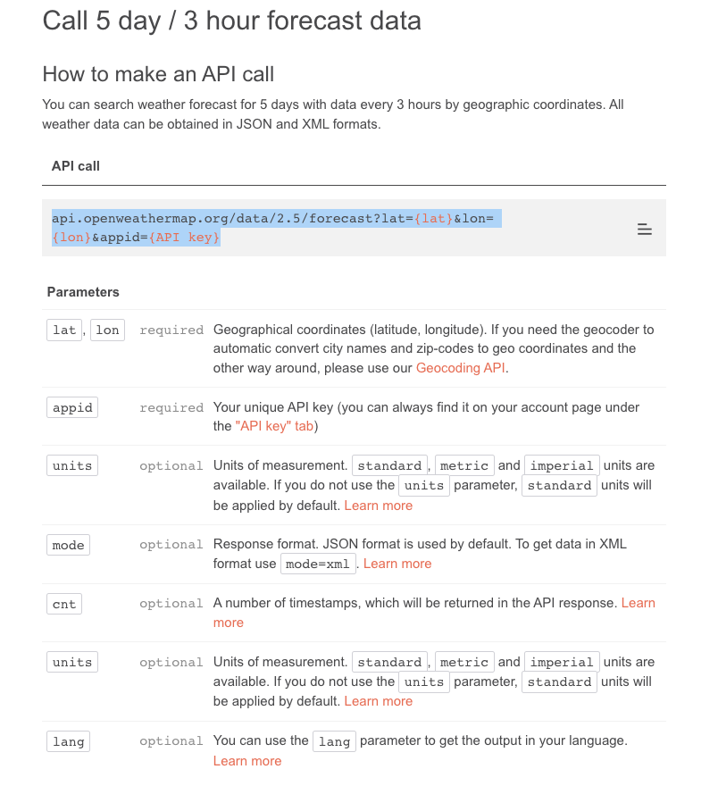
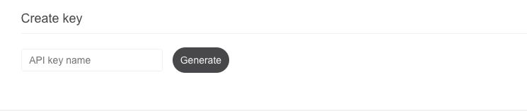
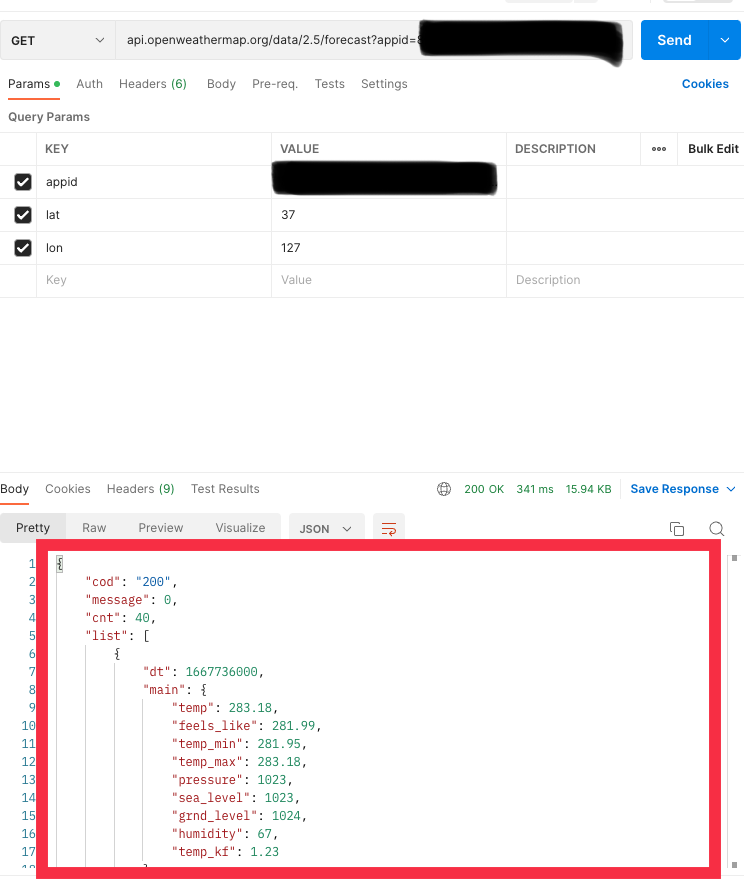
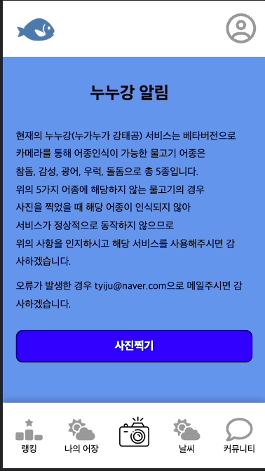

# API (Application Programming Interface)

API란 Application Programming Interface의 약자로 *응용 프로그램에서 사용할 수 있도록, 운영 체제나 프로그래밍 언어가 제공하는 기능을 제어할 수 있게 만든 인터페이스를 뜻합니다. (위키백과)* 

위키백과에서 API의 정의한 것은 어렵게 느껴지기때문에 간단하게 생각해보자면 두 개의 소프트웨어가 서로 소통을 하기위한 도로? 라고 생각을 해보자.
내가 부산을 가고싶다면 경부고속도로를 타고 전라도로 가고싶으면 호남고속도로를 타면 되듯이 A라는 기능을 사용하고싶으면 A라는 기능을 사용할 수 있게 해주는 도로로 가면 된다.

보통 API는 두 소프트웨어 간에 정보를 주고받기 위해서 사용되며 API에서 정해준 규격에 맞는 요청을 보내면 요청에 맞는 응답을 받을 수 있다. 내가 토이프로젝트를 만들 때 어떻게 API를 사용했는지를 보면서 API에 대해서 좀 더 이해해보자.

<br>
<br>

## API 실제 사용 예

내가 토이프로젝트에 사용했던 API를 통해 API가 실제로 어떻게 사용되는지 알아보자.
내가 사용했던 API는 OpenWeather 홈페이지(https://openweathermap.org/api)의 5 Day / 3 Hour Forecast API로 3시간 간격으로 5일동안의 날씨 데이터를 가져올 수 있는 API이다.

API는 무료일수도 있고 유료일수도 있으며 어떤 조건을 충족하는 사람만 사용할 수 있는 API도 있으며 모든 사람이 사용할 수 있는 API일 수도 있다. 그렇기 때문에 내가 API를 사용할 수 있는지 확인하기 위해서는 API를 제공하는 회사에서 제공하는 API Document를 봐야하는데 내가 사용한 API의 도큐먼트는 https://openweathermap.org/forecast5 에서 볼 수 있다.

<br>



<br>

위의 이미지는 3시간 간격으로 5일간의 날씨 정보를 받기위해서 어떤 데이터들이 필요한지 어떤 방식으로 데이터들을 보내야하는지를 API를 제공하는 회사에서 규격화?한 내용이다. API에게서 제대로된 응답을 받기 위해서는 API 도큐먼트에서 제공하는 형식에 맞게 응답을 보내야한다.

```
api.openweathermap.org/data/2.5/forecast?lat={lat}&lon={lon}&appid={API key}
```
위의 이미지를 보게되면 파라미터 값으로 lat, lon, appid, units, mode 등등 여러가지를 보낼 수 있는데 필수로 보내야하는 파라미터(Required)와 필요한 경우에 보내는 파라미터 값(Optional)으로 나뉘어져있다.

또 appid의 파라미터 값으로 API key라는 것을 보내야 하는데 이 API key는 API를 제공하는 곳에서 발급해주는 값으로 이 API를 사용하기 위한 자격이라고 생각하면된다. 요청을 보낼 때 appid 파라미터 값으로 유효한 API key를 보내지 않는다면 해당 API를 사용할 수 없다.

내가 사용한 openweather 홈페이지에서 API key를 발급받으려면 회원가입을 한 후에 사이트에서 아래의 이미지와 같이 API key를 발급받아야한다.

<br>



<br>

만약 API key를 발급받았다면 다른 사람이 사용하지 못하게 혼자만 잘 간직하고 있도록 하자.
그렇다면 이제 postman으로 API에 API 요청 규격?에 맞는 요청을 보내서 정상적으로 응답을 받아오는지 확인해보자.

<br>



<br>

나는 https://openweathermap.org/forecast5 에서 정한 것과 같이 GET 방식으로 api.openweathermap.org/data/2.5/forecast로 필수 파라미터 값인 lat, lon, appid 값을 넣어 요청을 보냈더니 빨간색 박스처럼 응답을 잘 받아온 것을 확인할 수 있다.

<br>
<br>

## API 유형

API 유형에는 private API, public API, partner API로 3가지가 존재한다.

1. private API :  내부 API로 제 3자는 사용할 수 없는 API이다.
2. public API : 제 3자도 사용할 수 있는 API다. 
3. partner API : 제 3자가 나와 파트너쉽을 맺는 사람만 사용할 수 있는 API이다.

<br>
<br>

## 토이프로젝트 API 사용 예



토이프로젝트에서는 API에서 내 위치의 오늘 날씨를 3시간 간격으로 받아온 데이터를 화면에 보여주고 주소를 입력하면 주소의 위도 경도를 API로 요청 보내 3시간 간격으로 날씨 데이터를 받아오게 했다.

