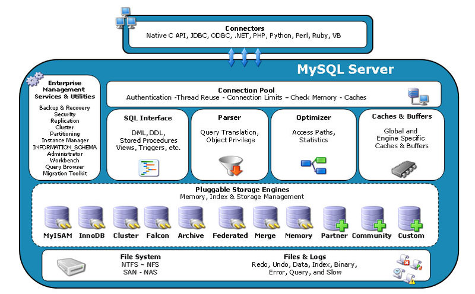
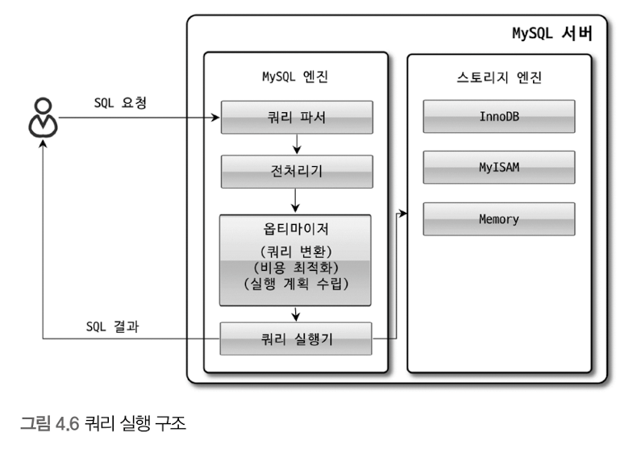
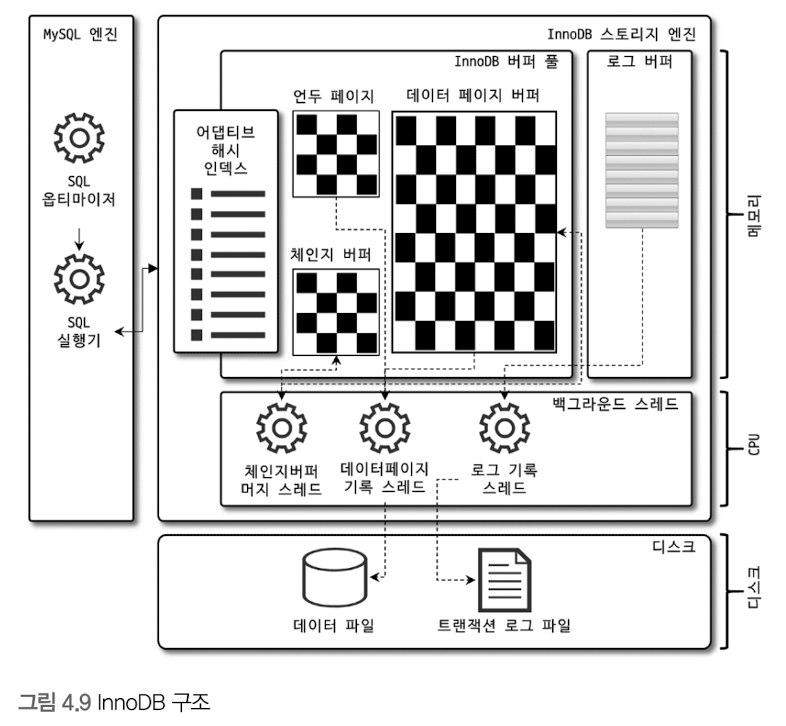
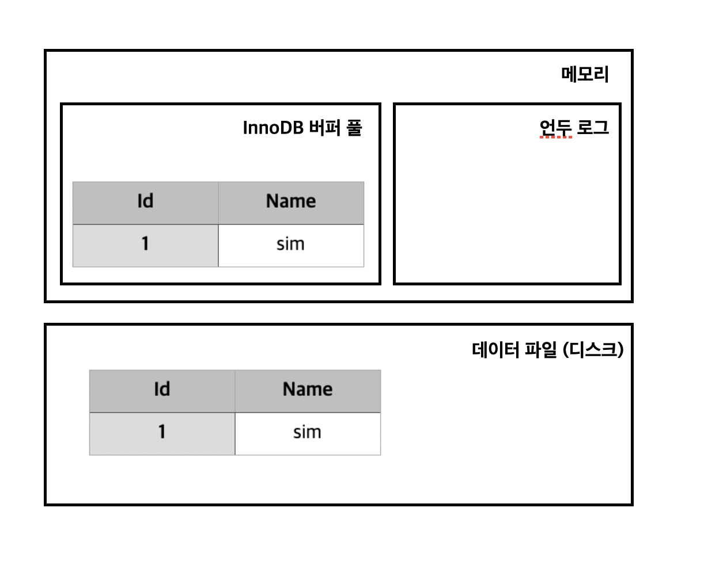
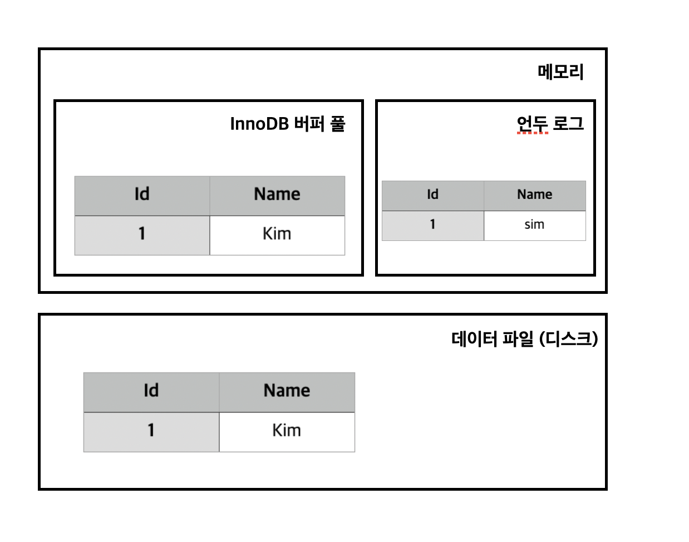
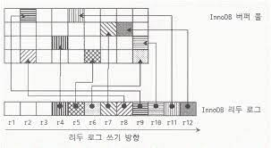
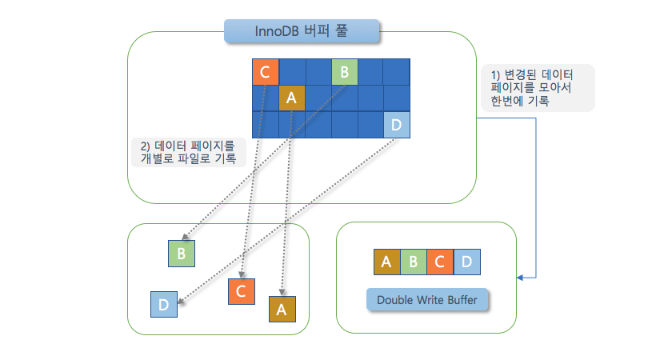

# MySQL 아키텍쳐

MySQL 서버는 두뇌의 역할을 하는 MySQL 서버 엔진과 손발의 역할을 하는 스토리지 엔진으로 구분할 수 있는데
스토리지 엔진은 핸들러 API만 만족하면 누구든 스토리지 엔진을 구현해서 MySQL 서버에 추가해서 사용할 수 있다.

<br>

## MySQL 전체 구조

- 이미지 출처 : https://www.theopenforce.com/2006/11/new_mysql_stora.html

<br>



<br>

위의 이미지는 MySQL의 전체 구조를 나타내는 이미지이다.
다른 DBMS에 비해 MySQL은 구조가 독특한데 이 독특한 구조 때문에 다른 DBMS가 가질 수 없는 혜택을 누릴 수 있지만 반대로 이 구조 때문에 다른 DBMS에서는 문제되지 않는 것들이 가끔 문제가 되기도 한다.
위에서 말했듯이 MySQL 서버는 MySQL 엔진과 스토리지 엔진으로 구분할 수 있으며 이 둘을 합쳐서 MySQL 또는 MySQL 서버라고 부른다.

<br>
<br>

## MySQL 엔진과 스토리지 엔진

<br>


### MySQL 엔진

MySQL 엔진은 MySQL 서버에서 클라이언트로부터의 접속 및 쿼리 요청을 처리하는 커넥션 핸들러와 SQL 파서 및 전처리기, 옵티마이저가 중심을 이룬다.
또 MySQL은 ANSI 표준 SQL문을 따르기때문에 표준 문법에 따라 작성된 쿼리는 다른 DBMS와 호환되어 실행될 수 있다.


<br>
<br>

### 스토리지 엔진

스토리지 엔진은 MySQL 엔진에서 SQL문장의 처리를 수행한 후 실제 데이터를 디스크 스토리지에 저장하거나 디스크 스토리지로부터 읽어오는 역할을 수행한다.
또 MySQL 서버 한 대에서 MySQL 엔진은 하나만 존재하지만 스토리지 엔진은 여러 개 존재할 수 있다. 

- 스토리지 엔진 예

```bash
CREATE TABLE test_table (fd1 INT, fd2, INT) ENGINE=INNODB;
```

위 예제처럼 테이블에 엔진을 설정해주면 이 테이블의 모든 읽기 작업이나 변경 작업은 정의된 스토리지 엔진이 처리한다.


<br>
<br>

### 핸들러 API

MySQL 엔진의 쿼리 실행기에서 데이터를 쓰거나 읽어야할 때는 스토리지 엔진에 쓰기 또는 읽기 작업을 요청한다.
이 요청을 핸들러 요청이라고 하는데 핸들러 요청을 처리하는 API를 핸들러 API라고 한다.
스토리지 엔진도 MySQL 엔진과 데이터를 주고받기 위해서 핸들러 API를 사용하는데 이 핸들러 API를 통해 얼마나 많은 데이터 작업이 있었는지는 "SHOW GLOBAL STATUS LIKE 'Handler%'"와 같은 명령어로 확인할 수 있다.

- SHOW GLOBAL STATUS LIKE 'Handler%' 명령어 사용 예

```bash
mysql> SHOW GLOBAL STATUS LIKE 'Handler%';

# 결과
+----------------------------+-------+
| Variable_name              | Value |
+----------------------------+-------+
| Handler_commit             | 637   | # 커밋 수
| Handler_delete             | 8     | # 딜리트 수
| Handler_discover           | 0     |
| Handler_external_lock      | 6441  |
| Handler_mrr_init           | 0     |
| Handler_prepare            | 0     |
| Handler_read_first         | 40    | 
| Handler_read_key           | 1751  | # 읽은 횟수
| Handler_read_last          | 0     |
| Handler_read_next          | 4108  |
| Handler_read_prev          | 0     |
| Handler_read_rnd           | 0     |
| Handler_read_rnd_next      | 163   |
| Handler_rollback           | 0     |
| Handler_savepoint          | 0     |
| Handler_savepoint_rollback | 0     |
| Handler_update             | 329   | # 업데이트 횟수
| Handler_write              | 8     | # 쓰기 횟수
+----------------------------+-------+
18 rows in set (0.00 sec)
```

<br>
<br>


## MySQL 스레딩 구조

MySQL 서버는 프로세스 기반이 아닌 스레드 기반으로 작동한다. 크게 포어그라운드 스레드와 백그라운드 스레드로 구분되며 MySQL 서버에서 실행 중인 스레드는 preformance_schema 데이터베이스의 threads 테이블을 통해 확인할 수 있다.

<br>

- 스레드 목록 확인하기 예

```bash
mysql> SELECT thread_id, name, type, processlist_user, processlist_host FROM performance_schema.threads ORDER BY type, thread_id;

# 결과
+-----------+---------------------------------------------+------------+------------------+------------------+
| thread_id | name                                        | type       | processlist_user | processlist_host |
+-----------+---------------------------------------------+------------+------------------+------------------+
|         1 | thread/sql/main                             | BACKGROUND | NULL             | NULL             |
|         2 | thread/mysys/thread_timer_notifier          | BACKGROUND | NULL             | NULL             |
|         4 | thread/innodb/io_ibuf_thread                | BACKGROUND | NULL             | NULL             |
|         5 | thread/innodb/io_log_thread                 | BACKGROUND | NULL             | NULL             |
                                                        ...

|        44 | thread/sql/event_scheduler                  | FOREGROUND | event_scheduler  | localhost        |
|        48 | thread/sql/compress_gtid_table              | FOREGROUND | NULL             | NULL             |
|        53 | thread/sql/one_connection                   | FOREGROUND | root             | localhost        |
+-----------+---------------------------------------------+------------+------------------+------------------+
40 rows in set (0.01 sec)

```

<br>

내가 PC에서 작동하고 있는 MySQL 서버에서 실행하고 있는 스레드는 총 40개로 포어그라운드 스레드 3개, 백그라운드 스레드 37개이다. 
그런데 이 중에서 마지막 'thread/sql/one_connection' 스레드 만이 실제로 사용자의 요청을 처리하는 포어그라운드 스레드이다. 
백그라운드 스레드 개수는 MySQL 서버에서 설정 내용에 따라서 가변적일 수 있으며 같은 스레드가 2개 이상인 경우 여러 스레드가 해당 작업을 병렬로 처리하고 있음을 의미한다.

<br>

### 포어그라운드 스레드

<br>

포어그라운드 스레드는 주로 각 클라이언트 사용자가 요청하는 쿼리 문장을 처리한다. 그렇기 때문에 포어그라운드 스레드의 개수는 최소 MySQL 서버에 접속된 클라이언트의 수만큼 존재한다.
만약 클라이언트가 MySQL 서버와의 커넥션을 끊는다면 해당 클라이언트가 사용하던 포어그라운드 스레드는 스레드 캐시로 되돌아간다. 하지만 일정 개수 이상의 스레드가 스레드 캐시 내에 존재할 경우에는 스레드를 스레드 캐시에 넣지 않고 바로 종료한다.
이렇게 스레드 캐시 내에 존재할 스레드의 개수는 thread_cache_size라는 시스템 변수를 통해 설정할 수 있다.

<br>
<br>

### 백그라운드 스레드

<br>

MyISAM 같은 경우에는 별로 해당 사항이 없지만 InnoDB는 여러 작업들을 백그라운드로 처리한다.
InnoDB에서는 데이터를 읽는 작업은 주로 클라이언트 스레드에서 처리되기 때문에 MySQL 서버의 읽기 스레드는 많이 설정할 필요가 없다.
하지만 데이터 쓰기 스레드같은 경우에는 아주 많은 작업을 백그라운드로 처리하기 때문에 디스크를 최적으로 사용할 수 있을 만큼 충분히 설정하는 것이 좋다.

사용자의 요청을 처리하는 중에 데이터 쓰기 작업은 지연될 수 있지만 데이터를 읽는 작업은 지연될 수 없다. 그래서 InnoDB에서는 대부분의 쓰기 작업을 버퍼링해서 일괄 처리(배치)하는 방식으로 처리한다.

<br>
<br>
<br>


## 메모리 할당 및 사용 구조

<br>

MySQL 서버에서 사용되는 메모리 공간은 크게 글로벌 메모리 영역과 로컬 메모리 영역으로 구분된다.
모든 메모리 공간 ( 글로벌 메모리 영역 + 로컬 메모리 영역 )은 MySQL 서버가 실행될 때 운영체제로부터 할당된다. 처음부터 요청된 메모리 공간의 100퍼센트를 할당해줄 수도 있고
예약해두고 조금씩 할당해주는 경우도 있다.

<br>


### 글로벌 메모리 영역

<br>

글로벌 메모리 영역은 글로벌 시스템 변수와 마찬가지로 클라이언트 스레드 수와 무관하게 하나의 메모리 공간만 할당되며 모든 스레드에게 공유된다.
대표적인 글로벌 메모리 영역으로는 아래의 것들이 있다.

- 대표적인 글로벌 메모리 영역의 예
1. 테이블 캐시
2. InnoDB 버퍼 풀
3. InnoDB 어탭티브 해시 인덱스
4. InnoDB 리두 로그 버퍼


<br>

### 로컬 메모리 영역

<br>

로컬 메모리 영역은 MySQL 서버 상에 존재하는 클라이언트 스레드가 쿼리를 처리하는 데 사용하는 메모리 영역으로 세션 메모리 영역이라고도 부르기도하고
MySQL 서버가 클라이언트 커넥션으로부터 요청을 처리하기 위해서 스레드를 하나씩 할당해줄때 클라이언트 스레드가 사용하는 메모리 공간이라고 해서 클라이언트 메모리 영역이라고도 부른다.
**이 로컬 메모리는 각 클라이언트 스레드별로 독립적으로 할당되며 절대 공유되어 사용되지 않는다는 특징이 있고 각 쿼리의 용도별로 필요할 때만 공간이 할당되고 필요하지 않은 경우에는 메모리 공간을 할당조차 하지 않을수도 있다는 특징이 있다.**

- 로컬 메모리 영역 예
1. 정렬 버퍼
2. 조인 버퍼
3. 바이너리 로그 캐시
4. 네트워크 버퍼

<br>
<br>

## 플러그인 스토리지 엔진 모델과 컴포넌트 

<br>

MySQL 서버는 플러그인 스토리지 엔진이 가진 단점을 보완하기 위해 컴포넌트라는 아키텍처를 만들었다고 사용자 권한 및 관리에서 말한 적이 있다. 
간단하게 어떤 단점이 있는지 알아보자.

<br>


### 플러그인 스토리지 엔진

<br>

우선 플러그인 스토리지 엔진은 사용자 권한 및 관리에서 얘기했던 Native Authentication 또는 Caching SHA-2 Authentication 만 있는 것이 아니다.
이 플러그인 스토리지 엔진은 MySQL에서 기본적으로 제공하는 스토리지 엔진만으로는 여러가지 문제들을 처리하는데 어려움을 겪을 수 있기 때문에 여러가지 문제들을 해결하기 위해서 기본적으로 제공되는 스토리지 엔진 이외의 부가적인 기능을 제공하는 스토리지 엔진이 플러그인 스토리지 엔진이다.

스토리지 엔진은 MySQL 엔진과 핸들러 요청 및 데이터를 주고 받기 위한 핸들러 API가 필요하므로 MySQL 엔진이 플러그인 스토리지 엔진에게 요청을 보내기위해 핸들러가 필요하다.
핸들러 요청 이전에 해야하는 복잡한 처리들은 MySQL 엔진이 처리해주기 때문에 스토리지 엔진이 하는 작업은 대부분 데이터 쓰기/읽기 작업들 뿐이다.

스토리지 엔진이 하는 작업들 중에서 쓰기/읽기 작업이 대부분이기 때문에 InnoDB 혹은 MyISAM 등의 스토리지 엔진 중 무엇을 사용해도 상관이 없지 않을까? 하는 생각이 들 수 있다. 하지만 데이터 쓰기 및 읽기 작업 처리 방식의 차이에 따라 많은 성능 차이가 발생할 수 있으므로 스토리지 엔진도 상황에 맞게 잘 선택하는 것이 중요하다. 그렇다면 MySQL 서버에서 지원하는 스토리지 엔진이 어떤 것이 있는지 확인해보자.

<br>


```bash
mysql> SHOW ENGINES;
+--------------------+---------+----------------------------------------------------------------+--------------+------+------------+
| Engine             | Support | Comment                                                        | Transactions | XA   | Savepoints |
+--------------------+---------+----------------------------------------------------------------+--------------+------+------------+
| ARCHIVE            | YES     | Archive storage engine                                         | NO           | NO   | NO         |
| BLACKHOLE          | YES     | /dev/null storage engine (anything you write to it disappears) | NO           | NO   | NO         |
| MRG_MYISAM         | YES     | Collection of identical MyISAM tables                          | NO           | NO   | NO         |
| FEDERATED          | NO      | Federated MySQL storage engine                                 | NULL         | NULL | NULL       |
| MyISAM             | YES     | MyISAM storage engine                                          | NO           | NO   | NO         |
| PERFORMANCE_SCHEMA | YES     | Performance Schema                                             | NO           | NO   | NO         |
| InnoDB             | DEFAULT | Supports transactions, row-level locking, and foreign keys     | YES          | YES  | YES        |
| MEMORY             | YES     | Hash based, stored in memory, useful for temporary tables      | NO           | NO   | NO         |
| CSV                | YES     | CSV storage engine                                             | NO           | NO   | NO         |
+--------------------+---------+----------------------------------------------------------------+--------------+------+------------+
9 rows in set (0.00 sec)
```

<br>

Support 칼럼에 표시될 수 있는 값은 4가지로 YES, NO, DEFAULT, DISABLED가 있다. 이 값들이 각각 어떤 것을 의미하는지 알아보자.

<br>


1. YES : MySQL 서버에 해당 스토리지 엔진이 포함되어 있고 사용 가능으로 활성화된 상태
3. No : MySQL 서버에 포함되지 않았음을 의미
2. DEFAULT : YES와 동일한 상태이지만 필수 스토리지 엔진임을 의미
4. DISABLED : MySQL 서버에는 포함되어 있지만 파라미터에 의해 비활성화된 상태임을 의미

<br>

위의 Support 컬럼의 값이 NO인 스토리지 엔진을 활성화 하기 위해서는 MySQL 서버를 다시 컴파일해야한다.
또 SHOW PLUGINS 명령으로 스토리지 엔진뿐 아니라 인증 및 전문 검색용 파서와 같은 플러그인도 확인할 수 있다.

<br>


- SHOW PLUGINS 예
```bash
mysql> SHOW PLUGINS;
+---------------------------------+----------+--------------------+---------+---------+
| Name                            | Status   | Type               | Library | License |
+---------------------------------+----------+--------------------+---------+---------+
| binlog                          | ACTIVE   | STORAGE ENGINE     | NULL    | GPL     |
| mysql_native_password           | ACTIVE   | AUTHENTICATION     | NULL    | GPL     |
| sha256_password                 | ACTIVE   | AUTHENTICATION     | NULL    | GPL     |
| caching_sha2_password           | ACTIVE   | AUTHENTICATION     | NULL    | GPL     |
                                            ...
| FEDERATED                       | DISABLED | STORAGE ENGINE     | NULL    | GPL     |
| ngram                           | ACTIVE   | FTPARSER           | NULL    | GPL     |
| mysqlx_cache_cleaner            | ACTIVE   | AUDIT              | NULL    | GPL     |
| mysqlx                          | ACTIVE   | DAEMON             | NULL    | GPL     |
+---------------------------------+----------+--------------------+---------+---------+
45 rows in set (0.00 sec)
```

<br>
<br>

### 컴포넌트

<br>

위에서 컴포넌트가 플러그인의 단점을 해결하기 위해서 만들어졌다고 말한 적이 있다. 이번에 플러그인이 가진 단점에 대해서 알아보자.

<br>

- 플러그인의 단점
1. 플러그인은 오직 MySQL 서버나 인터페이스할 수 있고, 플러그인끼리는 통신할 수 없다.
2. 플러그인은 MySQL 서버의 변수나 함수를 직접 호출하기 때문에 안전하지 않다. (캡슐화되지 않음)
3. 플러그인은 상호 의존 관계를 설정할 수 없어서 초기화하기 어렵다.

<br>

컴포넌트를 추가했던 방법에 대해서 다시 한번 보고 싶다면 사용자 권한 및 관리의 "validate_password 플로그인과 컴포넌트 차이" 부분을 다시 한번 보고 오자.
플러그인과 마찬가지로 컴포넌트 또한 설치하면서 새로운 시스템 변수를 설정해야 할 수 도 있으므로 컴포넌트를 추가하기 전에 관련 매뉴얼을 보는 것이 좋다.

<br>

## 쿼리 실행 구조

MySQL 은 클라이언트에게 쿼리 처리를 요청받았을 때 어떻게 쿼리를 처리할까 ?
우선 아래의 이미지를 보도록 하자.

<br>



<br>

클라이언트가 MySQL 서버에게 보낸 SQL 쿼리 요청을 MySQL 엔진의 쿼리 파서, 전처리기, 옵티마이저, 쿼리 실행기 순으로 쿼리 요청을 처리하는데 각각 어떤 작업을 하는지 알아보도록 하자.

<br>

### 1. 쿼리 파서

쿼리 파서는 사용자 요청으로 들어온 쿼리 문장을 토큰(MySQL이 인식할 수 있는 최소 단위의 어휘나 기호)으로 분리해 트리 형태의 구조로 만들어 내는 작업을 의미한다. 클라이언트가 보낸 요청에 쿼리 문장의 기본 문법 오류가 있다면 사용자에게 오류 메시지를 전달하게된다.

<br>

### 2. 전처리기 

쿼리 파서가 사용자가 요청한 쿼리 문장을 토큰으로 분리해 트리 형태의 구조로 만들어내면 전처리기가 해당 트리 형태의 구조의 구조적인 문제점이 있는지 확인한다. 
각 토큰을 테이블 이름이나 칼럼 이름, 또는 내장 함수와 같은 개체를 매핑해 해당 객체의 존재 여부와 객체의 접근 권한 등을 확인하는 과정을 이 단계에서 수행하는데
실제로 존재하지 않거나 권한상 사용할 수 없는 개체의 토큰은 걸러지게된다.

<br>

### 3. 옵티마이저

쿼리 파서와 전처리기에서 사용자가 보낸 쿼리 문장의 유효성을 판단?했다면 옵티마이저는 해당 쿼리 문장을 어떻게 하면 효율적으로 실행할 수 있을지 결정한다.

<br>

### 4. 쿼리 실행기
쿼리 실행기는 옵티마이저에서 효율적이라고 판단한 순서에 맞춰 쿼리를 실행하기 위해 필요한 핸들러에게 요청을 보낸다.
쿼리를 실행하기 위해 필요한 핸들러의 개수는 여러 개가 될 수 있으며 한 개의 핸들러들이 응답해준 결과는 또 다른 핸들러의 요청의 입력으로 사용될 수 있다.

<br>

## 쿼리 캐시

쿼리 캐시는 MySQL 서버에서 빠른 응답을 위해 사용되었다.
쿼리 캐시는 SQL의 실행 결과를 메모리에 캐시하고, 동일 SQL이 실행되면 테이블을 읽지 않고 메모리에 캐시되어있는 결과를 반환한다.
쿼리 캐시를 사용함으로서 동일 쿼리 요청의 응답은 매우 빠른 속도로 반환될 수 있었지만 테이블의 데이터가 변경되면 캐시에 저장된 결과 중에서 변경된 테이블과 관련된 것들은 모두 삭제해야했다.
이 과정에서 동시 처리의 심각한 성능 저하가 발생했고 그로인해 MySQL 8.0 버전 부터는 쿼리 캐시의 기능, 이와 관련된 시스템 변수들이 모두 삭제되었다.

<br>

## InnoDB 스토리지 엔진

아래는 InnoDB의 아키텍처를 보여주는 이미지다.

<br>



<br>

InnoDB는 MySQL 에서 사용할 수 있는 스토리지 엔진 중 거의 유일하게 레코드 기반 잠금을 제공하며 그 때문에 높은 동시성 처리가 가능하고 안정적이며 성능이 뛰어난 스토리지 엔진이다.
그렇다면 이제 InnoDB의 주요 특징에 대해서 알아보자.


<br>
<br>

### 프라이머리 키에 의한 클러스터링

InnoDB의 모든 테이블은 기본적으로 프라이머리 키를 기준으로 클러스터링되어 저장된다. 이는 프라이머리 키 값을 기준으로 순서대로 디스크에 저장된다는 뜻이며, 모든 세컨더리 인덱스는 레코드의 주소 대신 프라이머리 키 값을 논리적인 주소로 사용한다.
MySQL 엔진의 옵티마이저가 계획한 실행계획에서 프라이머리 키는 다른 보조 인덱스에 비해 비중이 높게 설정된다.

<br>

### 외래 키 지원

외래 키에 대한 지원은 InnoDB 스토리지 엔진 레벨에서 지원하는 기능으로 MyISAM이나 MEMORY 테이블에서는 사용할 수 없다.
외래키는 부모 테이블과 자식 테이블 모두 해당 칼럼에 인덱스 생성이 필요하고, 변경 시에는 반드시 부모 테이블이나 자식 테이블에 데이터가 있는지 체크하는 작업이 필요해 잠금이 여러 테이블로 전판되고, 그로 인해 데드락이 발생할 때가 많으므로 외래 키에 주의하며 개발해야한다. 

만약 당장에 빠른 조치를 취해야 하는데 외래 키가 복잡하게 얽혀있어 조치하기 어려운 경우에는 foreign_key_checks 시스템 변수를 OFF로 설정하면 외래 키 관계에 대한 체크 작업을 일시적으로 멈출 수 있다.
foreign_key_checks 시스템 변수를 OFF로 설정한 후에 조치가 완료되었다면  부모와 자식테이블 간에 관계가 깨진 상태로 두면 안되고 반드시 두 테이블 간의 일관성을 맞춰준 후에 foreign_key_checks 시스템 변수를 ON으로 변경해줘야 한다.

<br>

## MVCC ( Multi Version Concurrency Control )

MVCC는 레코드 레벨의 트랜잭션을 지원하는 DBMS가 제공하는 기능이다. MVCC는 테이블을 잠금하지 않고 일관되게 읽기를 제공할 수 있도록 하는데 이를 위해 언두 로그 (Undo log)를 이용한다.

MVCC의 Multi Version은 하나의 레코드에 여러 개의 버전이 동시에 관리된다는 의미이다. 이를 이해하기 위해서 예를 보도록 하자. 

<br>

### MVCC 예

예를 들어 Id 컬럼과 Name 컬럼이 존재하는 A라는 테이블이 있다고 해보자.
이 테이블에 Id : 1, Name : sim 의 데이터를 삽입하면 아래의 이미지와 같은 상태가 될 것이다.

<br>

- 변경 전 예

    

<br>

위의 이미지와 같은 상태에서 Id 값이 1이고 Name 값이 sim인 레코드의 Name 값을 Kim으로 변경한다면 어떻게 될까 ? 
아래의 이미지를 보자.

<br>

- 변경 후 예

    

<br>

만약 레코드의 값이 변경되었다면 커밋 여부와 상관없이 InnoDB의 버퍼 풀은 Id 값이 1이고 Name 값이 sim인 레코드의 Name 값이 Kim으로 업데이트 되었을 것이다. 디스크의 데이터 파일의 값은 체크 포인트나 InnoDB의 Write 스레드에 의해 새로운 값으로 업데이트되어 있을 수도 있고 아닐 수도 있다. 만약 커밋이 되어 있지 않은 상태에서 Name 값이 Kim인 레코드를 조회한다면 어디에 있는 레코드를 조회할까 ?

어디에 있는 레코드를 조회할 지는 MySQL 서버의 시스템 변수에 설정된 격리 수준에 따라 달라진다. 만약 격리 수준이 READ_UNCOMMITTED인 경우에는 InnoDB 버퍼 풀에 있는 데이터를 가져올 것이다. 하지만 격리 수준이 READ_COMMITTED 혹은 그 이상의 격리 수준일 경우에는 레코드의 값이 변경되기 전인 언두 로그에 있는 데이터를 반환한다. 

위의 변경 후 예의 이미지와 같은 상태에서 커밋을 하게된다면 이 상태를 영구적인 상태로 만든다. 커밋이 된다고해서 언두 영역의 백업 데이터가 바로 삭제되는 것은 아니고 언두 영역을 필요로 하는 트랜잭션이 더는 없을 때 비로소 삭제되는데 만약 롤백을 하게된다면 언두 로그에 있는 데이터를 InnoDB의 버퍼 풀로 복구하고 언두 영역의 데이터를 삭제시킨다. 

<br>

### MVCC를 이용한 잠금없는 일관된 읽기 ( Non-Locking Consistent Read )

InnoDB에서는 테이블에 잠금을 걸지 않기떄문에 읽기 작업을 다른 트랜잭션이 가지고 있는 잠금을 기다리지 않고, 읽기 작업이 가능하다. 만약 A 유저가 a라는 레코드를 변경 a\'레코드가 되었다고 하더라도 B 유저는 A유저가 변경한 a\' 레코드가 아닌 언두 로그에 있는 a 레코드를 읽을 수 있다.

만약 관리해야하는 데이터가 많은 상황에서는 이렇게 여러 버전의 레코드를 언두 로그에 가지고 있기때문에 레코드를 읽는데 많은 시간이 걸릴 수 있다. 그렇기 때문에 트랜잭션이 시작되었다면 가능한 한 빨리 롤백이나 커밋을 통해 트랜잭션을 완료하는 것이 좋다.

만약 Non-Locking Consistent Read에 대해서 좀 더 알고싶다면 MySQL의 Non-Locking Consistent Read 관련 도큐먼트인 https://dev.mysql.com/doc/refman/8.0/en/innodb-consistent-read.html 를 참고하도록 하자.

<br>

## 자동 데드락 감지

InnoDB 스토리지 엔진은 내부적으로 잠금이 교착 상태에 빠지지 않았는지 체크하기 위해서 잠금 대기 목록을 그래프 형태(Wait-for List)로 관리한다. InnoDB 스토리지 엔진은 데드락 감지 스레드를 가지고 있어 주기적으로 이 스레드가 잠금 대기 그래프를 검사해 교착 상태에 빠진 트랜잭션을 찾아 그중 하나를 강제 종료한다. 이때 어느 트랜잭션을 먼저 강제 종료할 것인지를 판단하는 기준은 언두 로그의 양으로 언두 로그 레코드를 더 적게 가진 트랜잭션이 일반적으로 롤백의 대상이 된다.

<br>

## 자동화된 장애 복구
 
InnoDB에는 손실이나 장애로부터 보호하기 위한 여러 매커니즘이 탑재되어 있는데 이러한 매커니즘을 이용해서 MySQL 서버가 시작될 때 완료되지 못한 트랜잭션이나 디스크에 일부만 기록된 (Partial write) 데이터 페이지 등에 대한 일련의 복구 작업이 자동으로 진행된다.

InnoDB 스토리지 엔진은 매우 견고하기 때문에 데이터 파일이 손상되거나 MySQL 서버가 시작되지 못하는 경우는 거의 발생하지 않는다. 하지만 MySQL 서버와는 무관하게 하드디스크 또는 서버 하드웨어 이슈로 InnoDB가 자동으로 복구를 못하는 경우가 발생할 수 있다. 보통 MySQL 서버가 시작될 때 항상 자동 복구를 수행하지만 이 때 복구할 수 없는 손상이 있다면 자동 복구를 멈추고 MySQL 서버가 종료되어 버린다.

이런 경우에는 MySQL 서버의 설정 파일의 innodb_force_recovery 시스템 변수를 설정해서 MySQL 서버를 시작한다.

<br>

- 상황에 맞는 innodb_force_recovery 값 설정하기
1. 로그 파일이 손상되었을 경우에는 innodb_force_recovery 값을 6으로 설정한 후 MySQL 서버를 켠다.
2. InnoDB 테이블의 데이터 파일이 손상되었다면 innodb_force_recovery 값을 1로 설정하고 MySQL 서버를 켠다.

<br>

만약 어떤 문제인지 알 수 없다면 innodb_force_recovery 값을 1부터 6까지 변경하면서 MySQL 서버를 실행시켜보면 된다. innodb_force_recovery의 값이 커질수록 데이터 손실 가능성이 커지고 복구 가능성은 적어진다. 그리고 MySQL 서버가 기동되고 InnoDB 테이블이 인식된다면 mysqldump를 이용해서 데이터를 가능한 만큼 백업하고 그 데이터로 MySQL 서버의 DB와 테이블을 다시 생성하는 것이 좋다.

만약 innodb_force_recovery 값을 변경하면서 MySQL 서버를 여러 번 재기동했봤음에도 불구하도 MySQL 서버가 실행되지 않는다면 백업을 이용해서 다시 구축하는 방법밖에 없다. 마지막 백업을 통해 데이터베이스를 새로 구축하고, 바이너리 로그를 사용해 최대한 장애 시점까지의 데이터를 복구해야한다.

innodb_force_recovery 의 값은 1부터 6까지로 innodb_force_recovery에 관해서 더 자세히 알고싶다면 https://dev.mysql.com/doc/refman/8.0/en/forcing-innodb-recovery.html 에서 확인해보자.

<br>

## InnoDB 버퍼 풀

InnoDB 스토리지 엔진에서 버퍼 풀은 핵심적인 부분으로, 디스크의 데이터 파일이나 인덱스 정보를 메모리에 캐시해 두는 공간이다. 쓰기 작업 지연을 통해 일괄 작업(Batch)으로 처리할 수 있게 해주는 버퍼 역할도 같이 한다. 일반적인 애플리케이션에서 INSERT, UPDATE, DELETE 처럼 데이터를 변경하는 쿼리는 데이터 파일의 이곳저곳에 위치한 레코드를 변경하기 때문에 랜덤한 디스크 작업을 발생시킨다. 하지만 버퍼 풀이 이러한 변경된 데이터를 모아서 처리를 하면 랜덤한 디스크 작업의 횟수를 줄일 수 있다.

<br>

### InnoDB 버퍼 풀 크기 설정

InnoDB 버퍼 풀의 크기를 정할 때는 운영체제와 각 클라이언트 스레드가 서버에서 사용할 메모리도 충분히 고려해서 설정해야 한다. *MySQL 서버에서 메모리를 크게 사용하는 경우는 없지만 때때로 레코드를 읽고 쓸 때 버퍼로 사용하는 레코드 버퍼가 상당한 메모리를 사용하기도 한다.* 만약 커넥션도 많고 사용하는 클라이언트 세션이 많다면 레코드 버퍼 용도로 사용되는 메모리 공간이 꽤 많이 필요해질 수도 있다. *하지만 이 레코드 버퍼의 공간은 따로 설정할 수 없고 전체 커넥션 개수와 각 커넥션에서 일고 쓰는 테이블의 개수에 따라 결정된다. 또 이 공간들은 동적으로 해제되기도 하기때문에 정확히 크기를 계산할 수 없다.*

하지만 MySQL 5.7 버전부터 InnoDB 버퍼 풀의 크기를 동적으로 조절할 수 있게되었는데 만약 적절한 InnoDB 버퍼 풀의 크기를 어떻게 설정해야할지 좀 더 알고싶다면 Real MySQL 1권의 108 ~ 109 페이지를 읽어보자.

<br>

### InnoDB 버퍼 풀의 구조

InnoDB 스토리지 엔진의 버퍼 풀이라는 메모리 공간을 페이지 크기의 조각으로 쪼개어 InnoDB 스토리지 엔진이 데이터를 필요로 할 때 해당 데이터 페이지를 읽어서 각 조각에 저장한다.
이 때 사용하는 페이지 크기는 innodb_page_size 시스템 변수로 설정할 수 있다. 버퍼 풀의 페이지 크기 조각을 관리하기 위해서 InnoDB 스토리지 엔진은 크게 LRU(Least Recently Used) 리스트와 Flush 리스트, Free 리스트와 같은 3가지 자료 구조를 관리한다.

<br>

- InnoDB 버퍼 풀의 3 가지 자료 구조

1. LRU (Least Recently Used) 리스트

    

    LRU 리스트는 위와 같은 구조를 띄고 있으며 엄밀하게 말하자면 LRU(Least Recently Used)와 MRU(Most Recently Used) 리스트가 결합된 형태를 띄고 있다. 위의 이미지에서 Old Sublist 영역은 LRU 에 해당하며 New Sublist는 MRU 에 해당한다.

    LRU 리스트를 사용하는 이유는 디스크로부터 한 번 읽어온 페이지를 최대한 오랫동안 메모리에 유지해 디스크로부터 다시 읽지 않기 위해서이다. InnoDB 스토리지 엔진에서 데이터를 찾는 과정에 대해서 자세히 알고싶다면 Real MySQL 1권의 110 페이지를 읽어보자.


2. 플러시(Flush) 리스트

    *플러시 리스트는 디스크로 동기화되지 않은 데이터를 가진 데이터 페이지(더티 페이지)의 변경 시점 기준의 페이지 목록을 관리한다.* 만약 데이터를 읽은 상태에서 변화가 없다면 플러시 리스트가 관리하지 않지만 한 번이라도 데이터 변경이 이루어진 상태라면 플러시 리스트가 변경 내용을 관리한다. 그리고 플러시 리스트가 관리하고 있는 변경 내용은 언젠가는 디스크에 기록되어야 한다.

    *데이터가 변경되면 InnoDB의 리두 로그에 변경 내용을 기록하고 버퍼 풀의 데이터 페이지에도 변경 내용을 반영한다. 그렇기 때문에 리두 로그의 각 엔트리는 특정 데이터 페이지와 연결되지만 리두 로그가 디스크로 기록됐다고 해서 데이터 페이지가 디스크로 기록됐다는 것을 항상 보장하지 않는다. 그리고 반대 경우도 그러하다.* 그렇기 때문에 InnoDB는 스토리지 엔진은 체크포인트를 발생시켜 디스크의 리두 로그와 데이터 페이지의 상태를 동기화하며 체크포인트는 MySQL 서버가 실행될 때 InnoDB 스토리지 엔진이 리두 로그의 어느 부분부터 복구를 실행해야 할지 판단하는 기준점을 만드는 역할을 한다.

3. 프리(Free) 리스트

    이 리스트는 InnoDB 버퍼 풀에서 실제 사용자 데이터로 채워지지 않은 비어있는 페이지들의 목록으로 사용자의 쿼리가 새롭게 디스크의 데이터 페이지를 읽어와야 하는 경우에 사용된다.

<br>

### 버퍼 풀과 리두 로그

> 
> 관련 내용은 아직 잘 이해하지 못해서 넘어가도록 함.
>

InnoDB의 버퍼 풀과 리두 로그는 밀접한 연관을 가지고 있다. InnoDB의 버퍼 풀은 서버의 메모리가 허용하는 만큼 크게 늘릴 수록 쿼리 속도를 빠르게 만들어줄 수 있다는 장점을 가지고 있다. 만약 하드디스크의 모든 데이터를 버퍼 풀에 적재할 수 있을 정도의 버퍼 풀 공간이라면 더 크게 만들어도 성능에 도움이 되지 않겠지만 그렇지 않다면 버퍼 풀 공간을 늘릴 수록 성능에 도움이 될 것이다. 하지만 InnoDB 버퍼 풀은 데이터베이스의 성능 향상을 위해서 데이터 캐시와 쓰기 버퍼링이라는 두 가지 용도로 사용된다. 버퍼 풀 메모리 공간만 단순힌 늘리는 것은 데이터 캐시 기능만 향상시키는 것이다. 그렇다면 쓰기 버퍼링 기능을 어떻게 향상시킬 수 있을까 ? 이 질문에 답을 하기 위해서는 InnoDB 버퍼 풀과 리두 로그의 관계에 대해서 알아봐야 한다.

<br>

- 버퍼 풀과 리두 로그 관계 이미지 / 이미지 출처 : http://www.gurubee.net/lecture/4202

    

<br>

InnoDB 버퍼 풀은 데이터를 디스크에서 읽은 상태로 전혀 변경되지 않은 클린 페이지와 함께 변경된 데이터를 가진 더티페이지도 가지고 있다. 더티 페이지는 계속해서 버퍼 풀에 머무를 수 있는 것이 아니고 언젠가는 디스크에 기록되어야 한다.

*InnoDB 스토리지 엔진에서 리두 로그는 1개 이상의 고정 크기 파일을 연결해서 순환 고리처럼 사용한다. ( 위 이미지 참고 )*

<br>

### 버퍼 풀 플러시 (Buffer Pool Flush)

MySQL 5.6 버전까지는 InnoDB 스토리지 엔진의 더티 페이지 플러시 기능이 그다지 부드럽게 처리되지 않았다. 예를들어 갑자기 디스크 기록이 폭증해서 MySQL 서버의 사용자 쿼리 처리 성능에 영향을 받는 경우가 많았다. *하지만 8.0 버전부터는 더티 페이지를 디스크에 동기화 하는 더티 페이지 플러시 중 예전과 같은 디스크 기록 폭증 현상이 발생하지 않았다.*

*InnoDB 스토리지 엔진은 더티 페이지를 디스크에 기록하기 위해서 2 가지의 플러시 기능을 백그라운드에서 실행한다.*

<br>

- 플러시 방법 2 가지

1. 플러시 리스트(Flush_list) 플러시
2. LRU 리스트(LRU_list) 플러시

그러면 이 두 플러시 방법에 대해서 알아보자.

<br>

#### 플러시 리스트 플러시

우선 첫번째로 플러시 리스트 플러시 방법이다. InnoDB 스토리지 엔진에서는 리두 공간의 재활용을 위해 주기적으로 오래된 리두 로그 엔트리가 사용되는 공간을 비워줘야한다. 하지만 오래된 리두 로그 엔트리가 사용되는 공간을 비워주려면 버퍼 풀에 존재하는 더티페이지가가 먼저 디스크로 동기화되어야 한다. 이를 위해서 InnoDB 스토리지 엔진은 주기적으로 플러시 리스트 플러시 함수를 호출해서 플러시 리스트에서 오래전에 변경된 데이터를 순차적으로 디스크에 동기화하는 작업을 수행하는데 이 때 얼마나 많은 더티 페이지를 디스크에 기록하느냐에 따라서 성능차이가 발생할 수 있다. 이를 위해서 InnoDB 스토리지 엔진은 많은 시스템 변수를 제공한다. 

<br>

- 플러시 리스트 플러시에 사용되는 시스템 변수들

1. innodb_page_cleaners
2. innodb_max_dirty_pages_pct_lwm
3. innodb_max_dirty_pages_pct
4. innodb_io_capacity
5. innodb_io_capacity_max
6. innodb_flush_neighbors
7. innodb_adaptive_flushing
8. innodb_adaptive_flushing_lwm

<br>

InnoDB 스토리지 엔진에서 더티 페이지를 디스크로 동기화하는 스레드를 클리너 스레드라고 한다. innodb_page_cleaners 시스템 변수는 이 클리너 스레드의 개수를 조정할 수 있게 해주는 시스템 변수이다.

InnoDB 스토리지 엔진은 여러 개의 InnoDB 버퍼 풀 인스턴스를 동시에 사용할 수 있는데 innodb_page_cleaners 설정값이 버퍼 풀 인스턴스 보다 많은 경우에는 innodb_buffer_pool_instances 설정값으로 자동으로 변경된다. *하나의 클리너 스레드가 하나의 버퍼 풀을 관리하도록 자동으로 맞춰주는 것이다.* 하지만 innodb_page_cleaners 설정값이 innodb_buffer_pool_instances 값보다 작다면 하나의 클리너 스레드가 여러 개의 버퍼 풀 인스턴스를 처리한다.
*그렇기 때문에 버퍼 풀의 수와 클리너 스레드의 수는 같도록 설정해주는 것이 좋다.*

<br>

또 버퍼 풀이 가질 수 있는 더티페이지의 한계를 innodb_max_dirty_pages_pct 시스템 변수를 통해서 설정할 수 있다. 일반적으로 InnoDB 버퍼 풀은 더티 페이지를 많이 가지고 있을 수록 디스크 쓰기 작업을 버퍼링함으로써 여러 번의 디스크 쓰기를 한 번으로 줄일 수 있다. 그렇지만 innodb_max_dirty_pages_pct 값은 기본 값으로 설정하는 것이 좋으므로 왠만하면 변경하지 않도록 하자.

innodb_max_dirty_pages_pct 변수의 값을 크게 설정했을 때 발생할 수 있는 문제가 있다. 그 문제는 바로 쓰기 폭발 (Dist IO Burst) 문제로 버퍼 풀이 가질 수 있는 버퍼 풀의 한계를 나타내는 innodb_max_dirty_pages_pct 변수의 값을 갑자기 넘기게 되었을 때 InnoDB 스토리지 엔진은 당장 더티페이지를 디스크에 기록해야한다고 판단하고 디스크 쓰기가 폭증하게 된다. 그렇기때문에 한계점에 도달하기 몇 퍼센트 전에 디스크 쓰기를 조금씩 하도록 만들 수 있다. 
그러기 위해서는 innodb_max_dirty_pages_lwm 시스템 변수를 늘리거나 줄이면 된다. 만약 innodb_max_dirty_pages_lwm의 값이 10%라면 innodb_max_dirty_pages_pct의 10% 이전에 조금씩 버퍼 풀에 존재하는 더티페이지들을 조금씩 디스크에 기록할 것이다.
하지만 *innodb_max_dirty_pages_lwm 값이 큰 것도 좋은 것은 아니기 때문에 디스크 쓰기를 적게할 수 있도록 적정한 수준의 값으로 설정해줘야한다.*

마지막으로 innodb_io_capacity와 innodb_io_capacity_max 변수에 관한 내용이다. innodb_io_capacity 변수는 일반적인 상황에서 디스크가 적절히 처리할 수 있는 수준의 값을 의미하고 innodb_io_capacity_max는 디스크가 최대의 성능을 발휘할 때 어느 정도의 디스크 읽고 쓰기가 가능한지를 설정하는 값이다.
여기서의 디스크 읽고 쓰기는 백그라운드 스레드가 수행하는 디스크 작업을 의미하며 InnoDB의 버퍼 풀의 더티 페이지 쓰기가 이에 해당한다.

innodb_io_capacity와 innodb_io_capacity_max 값을 현재 서버가 가지고 있는 디스크의 최대 성능 값으로 설정하는 것은 좋지 않은 방법인데 그 이유는 MySQL 서버는 디스크를 읽고 쓰기하는 것만 수행하는 것이 아닌 여러가지 다른 작업들도 같이 수행하기 때문이다.
그렇다고 각각의 값들을 하나하나 설정해주는 것 또한 어렵기때문에 InnoDB 스토리지 엔진은 어댑티브 플러시(Adaptive flush)라는 기능을 제공한다.
이 기능은 innodb_io_capacity와 innodb_io_capacity_max의 값에 의존하는 것이 아니라 리두 로그의 증가속도를 통해 새로운 알고리즘을 만들어 디스크 쓰기 작업을 수행할 수 있도록 도와준다.

<br>

#### LRU 리스트 플러시

InnoDB 스토리지 엔진은 LRU 리스트에서 사용 빈도가 낮은 데이터 페이지들을 제거하고 새로운 페이지들을 읽어올 공간을 만들어야 하는데 이 때 LRU 리스트 플러시 함수를 사용한다.
InnoDB 스토리지 엔진은 LRU 리스트의 끝부분부터 시작해서 최대 innodb_lru_scan_depth 시스템 변수에 설정된 개수만큼의 페이지들을 스캔하는데 스캔 중에 더티페이지는 디스크에 동기화하게 하며, 클린 페이지는 프리 리스트로 페이지를 옮긴다.
*InnoDB 스토리지 엔진은 InnoDB 버퍼 풀 인스턴스별로 최대 innodb_lru_scan_depth 개수만큼 스캔하기 때문에 실질적으로 LRU 리스트의 스캔은 ( innodb_buffer_pool_instances * innodb_lru_scan_depth ) 수 만큼 수행한다.*

<br>

#### Double Write Buffer

InnoDB 스토리지 엔진의 *리두 로그는 리두 로그 공간의 낭비를 막기 위해 페이지의 변경된 부분만을 기록한다.*
이로 인해서 더티 페이지를 디스크 파일로 플러쉬 할 때 일부만 기록되는 문제가 발생하면 그 페이지의 내용은 복구할 수 없을 수도 있다. 이렇게 페이지가 일부만 기록되는 현상을 파셜 페이지 (Partial-page) 또는 톤 페이지(Torn-page)라고 하는데, 이런 현상은 하드웨어의 오작동이나 시스템의 비정상 종료 등으로 발생할 수 있다.

InnoDB 스토리지 엔진에서는 이러한 문제를 해결하기 위해서 Doubble-Write 기법을 이용한다.

<br>

- Double Write Buffer 이미지 / 출처 : https://hoing.io/archives/1114



<br>

위의 이미지 처럼 InnoDB에서 A ~ D까지의 더티 페이지를 디스크로 플러시한다고 했을 때 *실제 데이터 파일에 변경 내용을 기록하기 전에 A부터 D까지의 더티 페이지를 묶어서 한 번은 디스크 쓰기로 Double Write Buffer에 기록한다. 그리고 InnoDB 스토리지 엔진은 각 더티 페이지를 파일의 적당한 위치에 하나씩 랜덤으로 쓰기를 진행한다.*

이렇게 Double Write Buffer에 기록된 변경 내용들은 디스크에 더티 페이지가 정상적으로 기록되면 더 이상 필요가 없어진다.
하지만 하드웨어 이슈 또는 운영체제 이슈 등으로 정상적으로 기록되지 않았을 경우에는 Double Write Buffer 의 내용과 데이터 파일의 페이지들을 모두 비교해서 Double Write Buffer 의 내용과 다른 페이지가 있는 경우에 경우에 Double Write Buffer에 있는 내용을 데이터 파일로 복사한다. innodb_doublewrite 시스템 변수를 통해 DoubleWrite 기능을 사용할지 말지 결정할 수 있다.

*하지만 이런 Double Write 기능은 HDD 처럼 자기 원판(Platter)이 회전하는 저장 시스템에서는 어차피 한 번의 순차 디스크 쓰기를 하는 것이기 때문에 별로 부담이 되지 않지만 SSD 처럼 랜덤 IO나 순차 IO의 비용이 비슷한 저장 시스템에서는 부담스럽다.*
그래서 데이터베이스의 성능을 위해 InnoDB 리두 동기화 설정(innodb_flush_log_at_trx_commit 시스템 변수)을 1이 아닌 값으로 설정했다면 DoubleWrite도 비활성화 하는 것이 좋다.

<br>

### 언두 로그

InnoDB 스토리지 엔진은 트랜잭션과 격리 수준을 보장하기 위해서 DML로 변경되기 이전의 데이터를 별도로 백업하고 이렇게 백업된 데이터를 언두 로그(Undo log)라고 한다.

<br>

- 언두로그를 역할

1. *트랜잭션 보장*

    트랜잭션이 롤백되면 트랜잭션 도중 변경된 데이터를 변경 전으로 복구해야 한다. 이때 언두 로그에 백업해둔 이전 버전의 데이터를 사용해 복구한다.

2. *격리 수준 보장*

    특정 커넥션에서 데이터를 변경하는 도중에 다른 커넥션에서 데이터를 조회하면 트랜잭션 격리 수준에 맞게 변경 중인 레코드를 읽지 않고 언두 로그에 백업해둔 데이터를 읽어서 반환하기도 한다.


<br>

언두 로그가 격리 수준을 보장한다는 것의 의미가 조금 어려울 수 있다. 간단하게 말하면 계정 A와 B가 MySQL 서버에 접속해 있을 때 A가 a 레코드의 데이터를 a'로 변경해도 B는 a 레코드의 정보를 조회했을 때 a'가 아닌 a 레코드의 정보를 조회할 수 있도록 한다고 생각하면 된다.

하지만 언두 로그를 사용해 격리 수준을 보장해주기 때문에 생기는 문제가 있다. 그 문제는 트랜잭션이 오랜 시간 동안 실행되면 언두 로그의 양이 급격히 증가할 수 있다는 것이다. 또 트랜잭션이 완료되었다고 해서 언두 로그를 즉시 삭제할 수 있는 것도 아니고 언두 로그의 양이 많다면 레코드를 조회하는 쿼리의 성능이 떨어지게 되기때문에 문제가 생기지 않도록 하기위해서는 트랜잭션 관리를 잘 해주어 언두 로그의 양을 적절하게 조절해주어야 한다.

MySQL 5.5 버전까지는 언두 로그의 사용 공간이 한 번 늘어나면 MySQL 서버를 새로 구축하지 않는 이상 줄일 수 없었다. 하지만 5.7과 8.0 버전으로 업그레이드 되면서 언두 로그를 돌아가면서 순차적으로 사용해 디스크 공간을 줄이는 것도 가능하고 MySQL 서버가 필요한 시점에 사용 공간을 자동으로 줄여주는 것이 가능하게 됨으로써 문제가 해결되었다.

<br>

#### 언두 테이블스페이스 관리

MySQL 5.6 이전 버전에서는 언두 로그가 모두 시스템 테이블스페이스(ibdata.ibd)에 저장되었다. 하지만 이 시스템 테이블스페이스의 언두 로그는 MySzQL 서버가 초기화될 때 생성되었기 떄문에 확장의 한계가 존재했다. 그래서 5.6 버전부터는 innodb_undo_tablespaces 시스템 변수를 2보다 큰 값으로 설정해 언두 로그를 시스템 테이블스페이스에 저장하지 않고 별도의 언두 로그 파일을 사용할 수도 있었으며 innodb_undo_tablespaces 값을 0으로 설정해 시스템 테이블스페이스를 사용할 수도 있었다.
하지만 그 이후 MySQL 8.0부터는 innodb_undo_tablespaces 시스템 변수의 효력이 없어졌으며 언두 로그는 항상 외부의 별도 로그 파일에 기록되도록 변경되었다.

<br>

### 체인지 버퍼

RDBMS에서 레코드가 INSERT 되거나 UPDATE 될 때 데이터 파일을 변경하는 작업 뿐만 아니라 해당 테이블에 포함된 인덱스를 업데이트하는 작업도 필요하다. 하지만 인덱스를 업데이트하는 작업은 랜덤하게 디스크를 읽는 작업이 필요하므로 테이블에 인덱스가 많다면 이 작업은 자원을 많이 사용하게 되어버린다. 그래서 *InnoDB에서는 변경해야 할 인덱스 페이지가 버퍼 풀에 있으면 바로 업데이트를 수행하지만 디스크로부터 데이터를 읽어와 업데이트를 해야한다면 데이터를 체인지 버퍼라는 임시 공간에 저장해 둔 후 바로 사용자에게 반환하는 형태로 성능을 향상시킨다.*

사용자에게 결과를 전달하기 전에 반드시 중복 여부를 체크해야 하는 유니크 인덱스는 체인지 버퍼를 사용할 수 없으며 체인지 버퍼에 임시 저장된 인덱스 레코드 조각은 백그라운드 스레드에 의해서 병합되는데 이 스레드를 체인지 버퍼 머지 스레드라고 한다. 5.5 이전 버전같은 경우에는 INSERT 작업에 대해서만 이러한 버퍼링이 가능했지만 8.0부터 INSERT, DELETE, UPDATE로 인해 키를 추가하거나 삭제하는 작업에 대해서도 버퍼링할 수 있도록 개선되었다.

innodb_change_buffering 시스템 변수를 체인지 버퍼에 관한 설정을 변경할 수 있다.

<br>

- innodb_change_buffering 설정
1. all : 모든 인덱스 관련 작업을 버퍼링
2. none : 사용하지 않음
3. inserts : INSERT만 버퍼링
4. deletes : DELETE만 버퍼링
5. changes : INSERT + DELETE 버퍼링
6. purges : 인덱스 아이템을 영구적으로 삭제하는 작업만 버퍼링

<br>

### 리두 로그 및 로그 버퍼

데이터가 변경될 때마다 디스크에 변경된 값을 기록하는 것이 효율적이지 못하기 때문에 리두 로그에 변경 내용을 디스크에 기록하는 것보다 먼저 기록한다. 하지만 리두 로그 안에 기록한 변경내용을 디스크에 기록하기 전에 비정상적으로 데이터베이스 서버가 종료되어버린다면 복구 작업을 위해 리두 로그를 사용한다.

MySQL 서버가 비정상적으로 종료되는 경우에는 InnoDB 스토리지 엔진의 데이터 파일은 아래와 같이 두 가지 종류의 일관되지 않은 데이터를 가질 수 있다.

<br>

1. 커밋됐지만 데이터 파일에 기록되지 않은 데이터
2. 롤백됐지만 데이터 파일에 이미 기록된 데이터

<br>

1번의 경우에는 리두 로그에 있는 데이터들을 데이터 파일에 복사하기만 하면 되지만 2번의 경우에는 변경이 커밋됐는지, 롤백됐는지, 아니면 트랜잭션의 실행 중간 상태였는지를 확인하기 위해서 필요하다.

그렇기 때문에 리두 로그는 트랜잭션이 커밋되면 즉시 디스크로 기록되도록 해야한다. 하지만 이 작업은 많은 부하를 유발하기 때문에 어느 주기로 디스크에 동기화할지를 결정하는 innodb_flush_log_at_trx_commit 시스템 변수 제공한다. innodb_flush_log_at_trx_commit 시스템 변수에 대해서 더 알아보고 싶다면 Real MySQL 138 페이지를 살펴보도록 하자.

<br>

### 리두 로그 활성화 및 비활성화

리두 로그는 MySQL 서버가 비정상적으로 종료되었을 때 데이터 파일에 기록되지 못한 트랜잭션을 복구하기 위해서 항상 활성화되어있다.
MySQL 서버에서 데이터 파일은 즉시 디스크에 동기화되지 않지만 리두 로그는 항상 디스크로 기록된다.
그렇기 때문에 데이터를 복구하거나 대용량 데이터를 한번에 적재하는 경우에는 리두 로그를 비활성화해 시간을 단축시켜줄 수 있다.

<br>

```bash
# 리두 로그 비활성화
mysql> ALTER INSTANCE DISABLE INNODB REDO_LOG;

# 리두 로그 활성화
mysql> ALTER INSTANCE ENABLE INNODB REDO_LOG;
```


이렇게 리두 로그를 비활성화한 이후에 꼭 다시 활성화 시켜주도록 하자.

<br>
<br>

### 어댑티브 해시 인덱스

어댑티브 해시 인덱스란 InnoDB 스토리지 엔진에서 사용자가 자주 요청하는 데이터에 대해 자동으로 생성하는 인덱스이다. 이 인덱스를 사용할지 말지는 innodb_adaptive_hash_index 시스템 변수를 통해 결정할 수 있다.

어댑티브 해시 인덱스는 B-Tree 검색 시간을 줄여주기 위해 도입된 기능으로 자주 읽히는 데이터 페이지의 값을 이용해 해시 인덱스를 만들고, 필요할 때마다 어댑티브 해시 인덱스를 검색해서 레코드가 저장된 페이지를 즉시 찾아갈 수 있다.

여기서 *해시 인덱스는 '인덱스 키 값'과 해당 인덱스 키 값이 저장된 '데이터 페이지 주소'의 쌍으로 관리되는데, 인덱스 키 값은 'B-Tree  인덱스의 고유번호와 B-Tree 인덱스의 실제 키 값' 조합으로 생성된다.*
해시 인덱스의 키 값에 인덱스 고유 번호가 포함되는 이유는 InnoDB 스토리지 엔진에서 어댑티브 해시 인덱스는 하나만 존재하기 때문이다.

또 데이터 페이지 주소는 실제 키 값이 저장된 데이터 페이지의 메모리 주소를 가진다. *이 메모리 주소는 버퍼 풀에 로딩된 페이지의 주소를 의미하며 버퍼 풀에서 해당 데이터 페이지가 사라지면 어댑티브 해시 인덱스에서도 해당 페이지의 정보가 사라진다.*

어댑티브 해시 인덱스는 모든 상황에서 효율적으로 쿼리를 처리할 수 있는 것은 아니다. 어댑티브 해시 인덱스는 메모리(버퍼 풀)에서 데이터를 읽어오는 것이기 때문에 디스크에서 데이터를 읽어야하는 경우에는 도움이 되지 않기 때문이다. 또 어댑티브 해시 인덱스 또한 저장 공간으로 메모리를 사용하는데 이 메모리의 크기가 상당히 큰 경우도 존재한다. 그렇기 때문에 데이터가 삭제되거나 변경되는 경우에 많은 자원을 사용하며 데이터베이스의 성능이 느려질 수 있다.

어댑티브 해시 인덱스는 기본적으로 활성화되어있기 때문에 설정을 변경하지 않았다면 사용여부를 판단하기 위한 통계를 서버가 가지고 있을 것이다. 

<br>

- 통계 확인하기

```bash
mysql> SHOW ENGINE INNODB STATUS\G

# 결과
-------------------------------------
INSERT BUFFER AND ADAPTIVE HASH INDEX
-------------------------------------
Ibuf: size 1, free list len 0, seg size 2, 0 merges
merged operations:
 insert 0, delete mark 0, delete 0
discarded operations:
 insert 0, delete mark 0, delete 0
Hash table size 34679, node heap has 0 buffer(s)
Hash table size 34679, node heap has 0 buffer(s)
Hash table size 34679, node heap has 3 buffer(s)
Hash table size 34679, node heap has 0 buffer(s)
Hash table size 34679, node heap has 0 buffer(s)
Hash table size 34679, node heap has 0 buffer(s)
Hash table size 34679, node heap has 1 buffer(s)
Hash table size 34679, node heap has 0 buffer(s)
0.00 hash searches/s, 0.00 non-hash searches/s
```

위처럼 통계를 확인하여 어댑티브 해시 인덱스를 사용할지 결정하도록 하자.


