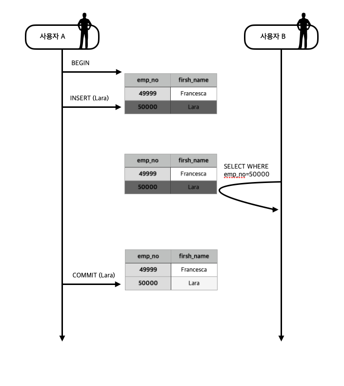
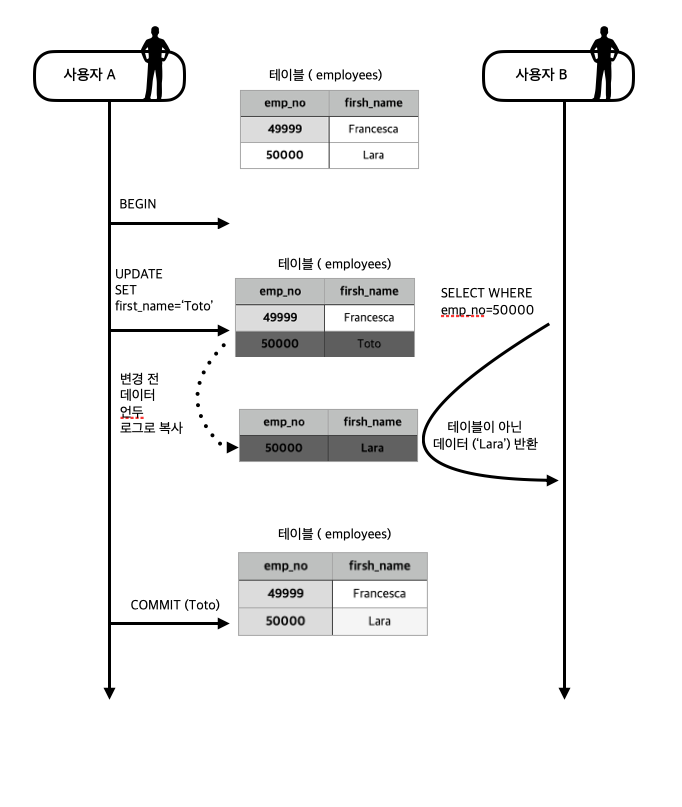
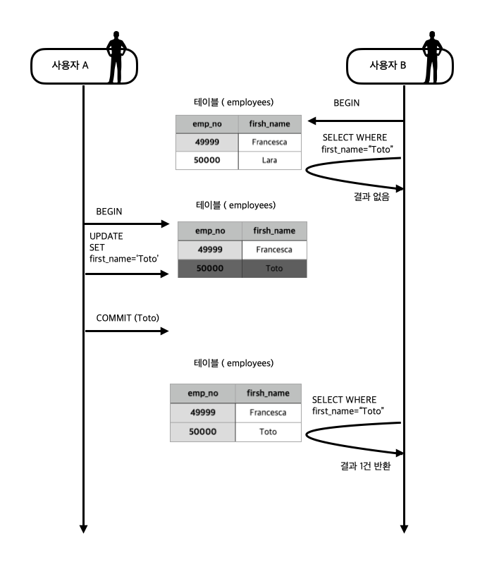
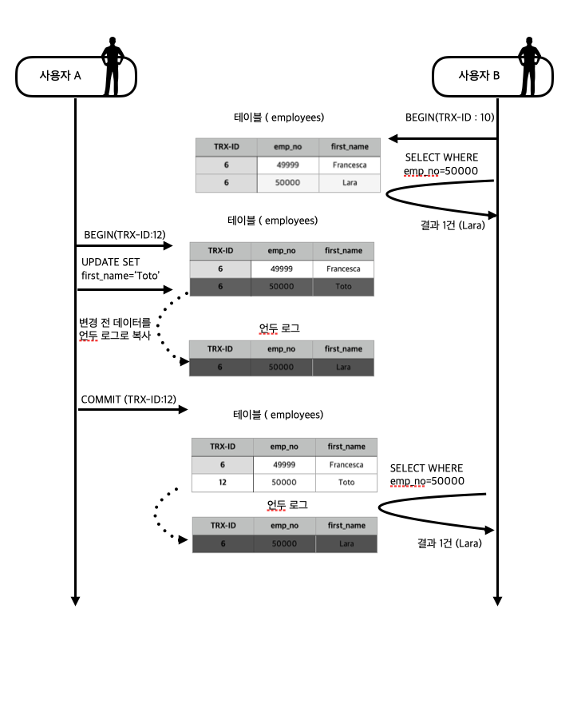
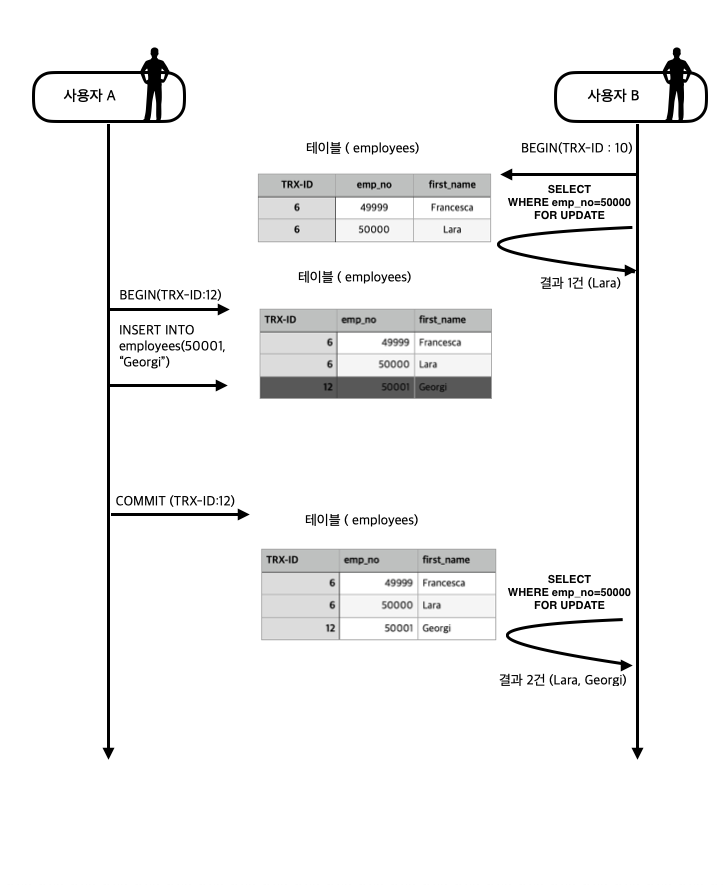

# 트랜잭션과 잠금

이번에는 트랜잭션과 잠금, 격리수준에 대해서 알아보자.


## 트랜잭션

데이터베이스에서 트랜잭션이란 아주 중요한 역할을 하는데 트랜잭션은 작업의 일부만 실행되지않도록 하여 작업의 완전성을 보장해주는 것으로 데이터의 정합성을 보장한다.
MySQL에서는 MyISAM이나 MEMORY 스토리지 엔진은 트랜잭션을 지원하지 않고 InnoDB 스토리지엔진만 트랜잭션을 지원하는데 예를통해 트랜잭션에 대해 알아보자.
 
### 트랜잭션의 예

MySQL 서버에서는 InnoDB 스토리지 엔진만 트랜잭션을 지원한다.
그렇기 때문에 우리는 트랜잭션에 대해서 이해하기 위해서 트랜잭션을 지원하는 InnoDB 스토리지 엔진과 트랜잭션을 지원하지 않는 MyISAM 스토리지 엔진을 비교하며 예를 보도록 하자.

우선 예를 위한 테이블을 만들어보자. 

```mysql
## MyISAM 스토리지 엔진의 tab_myisam 테이블 생성 
mysql> CREATE TABLE tab_myisam (fdpk INT NOT NULL, PRIMARY KEY (fdpk)) ENGINE=MyISAM;
mysql> INSERT INTO tab_myisam (fdpk) values(3);

## INNODB 스토리지 엔진의 tab_innodb 테이블 생성
mysql> CREATE TABLE tab_innodb (fdpk INT NOT NULL, PRIMARY KEY (fdpk)) ENGINE=INNODB;
mysql> INSERT INTO tab_innodb (fdpk) values(3);

## tab_myisam 테이블에 정상적으로 데이터가 들어간 것을 확인할 수 있음.
mysql> select * from tab_myisam;
+------+
| fdpk |
+------+
|    3 |
+------+
1 row in set (0.00 sec)

## tab_innodb 테이블에 정상적으로 데이터가 들어간 것을 확인할 수 있음.
mysql> select * from tab_innodb;
+------+
| fdpk |
+------+
|    3 |
+------+
1 row in set (0.00 sec)
```

위에서 만든 테이블은 MyISAM 스토리지 엔진의 tab_myisam과 InnoDB 스토리지 엔진의 tab_innodb 이며 각각 테이블에는 3이 저장되어 있다.
만약 각각의 테이블에 1, 2, 3의 데이터를 추가한다면 어떻게 될까 ? 처음 공부하는 사람이라면 아마도 두 테이블 모두 1, 2, 3의 데이터가 정상적으로 들어갔을 것이라고 생각할 것이다.
하지만 아래의 1, 2, 3 의 데이터를 넣는 쿼리를 실행한 후 테이블을 조회해본다면 다른 결과가 나오는 것을 확인할 수 있을 것이다.


만약 A 클라이언트가가 a 테이블에 3개의 데이터를 넣기 위해서 INSERT 쿼리를 3번 실행했다고 해보자.
```mysql
# 두 테이블 모두 에러가 발생하는 것을 볼 수 있음
mysql> INSERT INTO tab_innodb (fdpk) values(1), (2), (3);
ERROR 1062 (23000): Duplicate entry '3' for key 'tab_innodb.PRIMARY'
    
mysql> INSERT INTO tab_myisam (fdpk) values(1), (2), (3);
ERROR 1062 (23000): Duplicate entry '3' for key 'tab_myisam.PRIMARY'
    
## 트랜잭션을 지원하지 않는 tab_myisam 스토리지 엔진은 에러가 발생한 부분에서 쿼리를 종료시킴 
mysql> select * from tab_myisam;
+------+
| fdpk |
+------+
|    1 |
|    2 |
|    3 |
+------+
3 rows in set (0.00 sec)    
    
## 트랜잭션을 지원하는 tab_innodb 스토리지 엔진은 에러가 발생한 부분에서 쿼리를 종료시키고 쿼리 실행 전으로 롤백
mysql> select * from tab_innodb;
+------+
| fdpk |
+------+
|    3 |
+------+
1 row in set (0.00 sec)
```

두 테이블 모두 이미 3이라는 데이터를 가지고 있었기 때문에 키 중복 오류가 발생해 쿼리가 중간에 종료된다.
하지만 트랜잭션을 지원하지 않는 tab_myisam은 쿼리가 종료된 후 추가적으로 작업이 실행되지 않지만 트랜잭션을 지원하는 tab_innodb는 쿼리가 종료된 후 쿼리 실행 전으로 롤백하는 작업을 거친다..

tab_myisam과 같은 현상을 부분 업데이트(Partial-Update)라고 하는데 이 부분 업데이트는 데이터의 정합성을 유지시키는데 많은 문제를 발생키긴다.
이렇게 부분 업데이트되어 테이블에 저장된 데이터들을 삭제작업을 추가적으로 해야할 수 있다. 이러한 경우에는 아래와 같이 IF-ELSE 문을 덕지덕지 붙여서 코드를 작성해야하기때문에 매우 비효율적이다.

- 트랜잭션을 지원하지 않는 경우
```mysql
# 트랜잭션을 지원하지 않는 경우 부분 업데이트된 데이터를 삭제하기 위한 코드
INSERT INTO tab_a ...;

IF(_is_insert1_succeed) {
    INSERT INTO tab_b ...;

    IF(_is_insert2_succeed){
        // 처리 완료
    }
} ELSE {
    DELETE FROM tab_a WHERE ...;

    IF (_is_delete_succeed){
        //처리 실패 및 tab_a, tab_b 모두 원상 복구 완료
    } ELSE {
        // 해결 불가한 상황 발생
    }
}
```

- 트랜잭션을 지원하는 경우
```mysql
## 트랜잭션을 지원하는 경우 롤백
try {
    START TRANSACTION;

    INSERT INTO tab_a ...;
    INSERT INTO tab_b ...;

    COMMIT;
} catch(exception) {
    ROLLBACK;
}
```

이렇게 트랜잭션은 개발시에 생기는 많은 문제들을 줄여주는 역할을 한다. 하지만 그렇다고 모든 코드에 트랜잭션을 적용시키는 것은 좋지 않기 때문에 최소한의 범위에만 트랜잭션을
적용시키는 것이 좋다. 예를들어 메일을 보내기 위해서 네트워크에 연결하는 부분까지 트랜잭션 범위에 포함시킨다면 데이터가 정상적으로 들어갔음에도 불구하고 네트워크 문제로 롤백되는
상황이 발생할 수 있다. 그렇기 때문에 네트워크 연결과 같은 부분은 트랜잭션의 범위에서 제외하는 것이 좋다.

## 잠금

잠금이란 동시성을 제어하기 위한 기능이다. 만약 하나의 레코드를 여러 커넥션에서 변경하려고 하는데 잠금이 없다면 하나의 데이터를 여러 커넥션에서 동시에 변경할 수 있다.
이렇게되면 내 예상과는 다른 결과가 나오는 등 예상치 못한 결과를 얻을 수 있다. 이렇듯 잠금은 여러 커넥션에서 동시에 동일한 자원을 요청할 경우에
순서대로 한 시점에는 하나의 커넥션만 변경할 수 있게 해주는 역할을 한다.

MySQL에서 사용되는 **잠금은 MySQL 엔진 레벨과 스토리지 엔진 레벨로 나눌 수 있으며 MySQL 엔진 레벨의 잠금은 모든 스토리지 엔진에 영향을 미치지만 스토리지 엔진 레벨의 잠금은
스토리지 엔진 간 상호 영향을 미치지 않는다는 특징을 가지고 있다.**

### MySQL 엔진 레벨의 잠금
#### 글로벌 락

글로벌 락은 이름에서 알 수 있듯이 가장 큰 범위를 가지는 잠금으로 영향을 미치는 범위는 MySQL 서버 전체이며 테이블이 다르거나 데이터베이스가 달라도 동일하게 영향을 미친다.
만약 한 세션에서 글로벌 락을 획득하면 다른 세션에서 SELECT를 제외한 대부분의 DDL, DML 문장을 실행하는 경우 글로벌 락이 해제되기 전까지 해당 문장이 대기 상태로 남는다.

글로벌락은 MySQL 서버 전체에 영향을 미치기 때문에 서비스용으로 사용되는 MySQL 서버에서는 가급적 사용하지 않는 것이 좋으며 여러 데이터베이스에 존재하는 MyISAM이나
MEMORY 테이블에 대해 mysqldump로 일관된 백업을 받아야 할 때는 글로벌 락을 사용해야 한다.

하지만 MySQL 버전이 업그레이드 되면서 InnoDB 스토리지 엔진의 사용이 일반화되었는데 InnoDB 스토리지 엔진이 트랜잭션을 지원하기 때문에 일관된 데이터 상태를 유지하기 위해
모든 데이터 변경 작업을 멈출 필요가 없어졌다. 그렇기 때문에 좀 더 가벼운 글로벌 락의 필요성이 대두되어 백업 락이라는 것이 도입되었다.

#### 백업 락

트랜잭션을 지원하지 않는 MyISAM이나 MEMORY 스토리지 엔진의 백업 시, 일관된 데이터 상태를 보장하기 위해서 모든 데이터 변경 작업을 중단해야 했는데 MySQL 버전이 업그레이드 되면서
트랜잭션을 지원하는 InnoDB 스토리지 엔진이 일반적으로 사용되기 시작해 백업 시 데이터 변경 작업을 중단할 필요가 없어졌다. 그렇기 때문에 글로벌 락보다 좀 더 가벼운 백업 락이 도입되었다.

특정 세션에서 백업 락을 획득하면 모든 세션에서 다음과 같이 테이블의 스키마나 사용자의 인증 관련 정보를 변경할 수 없게되지만 일반적인 테이블의 데이터 변경은 허용된다.
하지만 백업의 실패를 막기 위해서 DDL 명령이 실행되면 복제를 일시 중지하는 역할을 한다.

#### 테이블 락

테이블 락이란 개별 테이블 단위로 설정되는 잠금으로 명시적 또는 묵시적으로 특정 테이블 락을 획득할 수 있다.
명시적으로는 LOCK TABLES table_name [ READ | WRITE ]" 명령으로 특정 테이블의 테이블 락을 획득할 수 있으며 테이블 락은 MyISAM뿐 아니라
InnoDB 스토리지 엔진에서도 사용하는 테이블도 동일하게 사용할 수 있다. 이렇게 명시적으로 테이블 락을 사용했을 경우 글로벌 락과 동일하게 온라인 작업에 상당향 영향을 미치기 때문에
특별한 상황이 아니라면 사용할 필요가 거의 없다.

묵시적 테이블 락은 MyISAM이나 MEMORY 스토리지 엔진을 사용하는 테이블에 데이터를 변경하는 쿼리를 실행하면 발생하는데 테이블을 잠금한 후 데이터를 변경하고 데이터가
변경되면 테이블 락을 해제하는 형태로 사용된다. 하지만 InnoDB 스토리지 엔진을 사용하는 테이블의 경우에는 스토리지 엔진 차원에서 레코드 기반의 잠금을 제공하기 떄문에
단순 데이터 변경 쿼리로는 테이블 락이 설정되지 않는다. 정확히는 대부분의 데이터 변경 쿼리(DML)에서는 무시되고 스키마를 변경하는 쿼리(DDL)의 경우에만 테이블 락이 설정된다.

#### 네임드 락

네임드 락은 GET_LOCK() 함수를 이용해 임의의 문자열에 대해 잠금을 설정할 수 있다. 네임드 락은 테이블, 레코드 또는 AUTO_INCREMENT 와 같은 데이터베이스 객체가 아닌
사용자가 지정한 문자열에 잠금을 하는 것으로 MySQL 8.0 버전부터는 네임드 락을 중첨해서 사용할 수 있게 되었으며 한 번에 모두 해제하는 기능도 추가되었다.

#### 메타데이터 락

메타 데이터 락은 데이터베이스(테이블 혹은 뷰) 객체의 이름이나 구조를 변경하는 경우에 획득하는 잠금이다. 메타데이터 락은 명시적으로 획득하거나 해제할 수 없으며
데이터베이스 객체의 이름이나 구조를 변경하는 경우에 자동으로 획득한다.

- 메타데이터 락 예
```mysql
## 한번에 실행하는 경우
mysql> RENAME TABLE  rank TO rank_backup, rank_new TO rank;

## 나눠서 실행하는 경우
RENAME TABLE  rank TO rank_backup;
RENAME TABLE  rank_new TO rank;
```

위와 같이 RENAME TABLE 명령문에 두 개의 RENAME 작업을 한꺼번에 실행하면 실제 애플리케이션에서는 "Table not found 'rank'"같은 상황을 발생시키지 않고 적용하는 것이 가능하다.
하지만 나눠서 실행하면 아주 짧은 시간 rank 테이블이 존재하지 않는 순간이 생기며, 그 순간 실행되는 쿼리는 "Table not found 'rank'" 오류를 발생시킨다.

### InnoDB 스토리지 엔진 레벨의 잠금

InnoDB 스토리지 엔진은 MySQL에서 제공하는 잠금과는 별개로 스토리지 엔진 내부에서 레코드 기반의 잠금 방식을 탑재하고 있다. InnoDB 스토리지 엔진은 이 레코드 기반의 잠금
방식을 사용하기 때문에 뛰어난 동시성 처리 능력을 가지고 있지만 이원화된 잠금 탓에 InnoDB 스토리지 엔진에서 제공하는 잠금에 대한 정보는 MySQL 명령을 통해 접근하기가 상당히 까다롭다.
하지만 최근 버전에서는 InnoDB의 트랜잭션과 잠금, 그리고 잠금 대기 중인 트랜잭션의 목록을 조회할 수 있는 방법이 도입되었는데 MySQL 서버의 information_schema 데이터베이스에 존재하는
INNODB_TRX, INNODB_LOCKS, INNODB_LOCK_WAITS라는 테이블을 조인해서 조회하면 현재 어떤 트랜잭션이 어떤 잠금을 대기하고 있고 해당 잠금을 어느 트랜잭션이 가지고 있는지 확인할 수 있으며,
또한 장시간 잠금을 가지고 있는 클라이언트를 찾아서 종료시킬 수도 있다.

InnoDB 스토리지 엔진은 일반 상용 DBMS와는 다르게 레코드 락뿐만 아니라 레코드와 레코드 사이의 간격을 잠그는 갭(GAP) 락이라는 것이 존재한다.

#### 레코드 락

레코드 자체만을 잠그는 것을 레코드 락이라고 하며 다른 상용 DBMS가 제공하는 레코드 락과 동일한 역할을 한다. 하지만 InnoDB 스토리지 엔진이 제공하는 레코드 락은
레코드 자체가 아닌 인덱스의 레코드를 잠근다. 인덱스가 하나도 없는 테이블이라도 내부에서 자동 생성된 클러스터 인덱스를 이용해 잠금을 설정한다.
대부분의 보조 인덱스를 사용한 변경 작업은 넥스트 키 락 또는 갭 락을 사용하지만 프라이머리 키 또는 유니크 인덱스에 의한 변경 작업에서는 갭에 대해서는 잠그지 않고 레코드 자체에 대해서만 락을 건다.

#### 갭 락

갭 락은 레코드 자체가 아니라 레코드와 바로 인접한 레코드 사이의 간격만을 잠그는 것을 의미한다. 
갭 락을 통해서 레코드와 레코드 사이의 간격에 새로운 레코드가 생성되는 것을 제어할 수 있으며 갭 락 자체로 사용하기 보다는 넥스트 키 락의 일부로 자주 사용된다.

#### 넥스트 키 락

레코드 락과 갭 락을 합쳐 놓은 형태의 잠금을 넥스트 키 락이라고 하며 STATEMENT 포맷의 바이너리 로그를 사용하는 MySQL 서버에서는 REPEATABLE READ 격리 수준을 사용해야 한다.
그리고 innodb_locks_unsafe_for_binlog 시스템 변수가 비활성화되면 변경을 위해 검색하는 레코드에는 넥스트 키 락 방식으로 잠금이 걸린다. 
InnoDB의 갭 락이나 넥스트 키 락은 바이너리 로그에 기록되는 쿼리가 레플리카 서버에서 실행될 때 소스 서버에서 만들어 낸 결과와 동일한 결과를 만들어 내도록 보장하는 것이 주 목적이다.
하지만 넥스트 키 락과 갭 락으로 인해서 데드락이 발생하거나 다른 트랜잭션을 기다리게 만드는 일이 자주 발생하기 때문에 가능하다면 바이너리 로그 포맷을 ROW 형태로 바꿔서 넥스트 키 락이나 갭 락을 줄이는 것이 좋다.

#### 자동 증가 락

MySQL에서 자동 증가하는 숫자 값을 추출하기 위해서 AUTO_INCREMENT 칼럼 속성을 제공하며 AUTO_INCREMENT 락은 여러 레코드가 동시에 INSERT 되는 경우에 사용된다.
AUTO_INCREMENT 락은 INSERT, REPLACE 문장에서 AUTO_INCREMENT 값을 가져오는 순간만 락이 걸렸다가 즉시 해제되고 AUTO_INCREMENT 락은 테이블에 단 하나만
존재하기 때문에 두 개의 INSERT 쿼리가 동시에 실행되는 경우에는 하나의 쿼리가 AUTO_INCREMENT 락을 걸면 다른 한 쿼리는 AUTO_INCREMENT 락을 기다려야 한다.

AUTO_INCREMENT 락은 명시적을 획득하고 해제하는 방법이 없으며 아주 짧은 시간동안 걸렸다가 해제되는 잠금이기때문에 대부분의 경우 문제가 발생하지 않는다.
MySQL 5.1 버전이상부터는 innodb_autoinc_lock_mode 시스템 변수를 통해 AUTO_INCREMENT 락의 작동 방식을 변경할 수 있다.

## 격리 수준

트랜잭션의 격리 수준이란 여러 트랜잭션이 동시에 처리될 때 특정 트랜잭션이 다른 트랜잭션에서 변경하거나 조회하는 데이터를 볼 수 있게 허용할지 말지를 결정하는 것이다.
격리 수준은 크게 "READ UNCOMMITTED", "READ COMMITTED", "REPEATABLE READ", "SERIALIZABLE"의 4가지로 나뉜다.
"DIRTY READ" 라고 불리는 READ UNCOMMITTED는 일반적인 데이터베이스에서는 거의 사용하지 않고 "SERIALIZABLE"도 동시성이 중요한 데이터베이스에서는 거의
사용되지 않는다.
 
격리 수준은 "READ UNCOMMITTED"에서 "SERIALIZABLE"로 갈수록 격리 수준과 트랜잭션간 고립 정도가 높아지며 동시성 처리 성능이 낮아진다. 
격리 수준이 높아질 수록 동시 처리 성능이 많이 떨어진다고 생각할 수 있는데 "SERIALIZABLE" 격리 수준이 아니라면 크게 성능 개선이나 저하는 발생하지 않는다.

### READ UNCOMMITTED

READ UNCOMMITTED 격리 수준에서는 아래의 그림과 같이 각 트랜잭션에서의 변경 내용이 COMMIT이나 ROLLBACK 여부에 상관없이 다른 트랜잭션에서 보인다.



사용자 A는 emp_no가 50000이고 first_name이 "Lara"인 새로운 사원을 INSERT했는데 사용자 A가 COMMIT하기 전임에도 불구하고 사용자 B가 사용자 A가 
INSERT한 Lara를 검색하고 있는 것을 볼 수 있다. 만약 사용자 A가 INSERT한 내용이 잘못되어 롤백하여도 사용자 B는 Lara가 정상적인 사원이라고 생각할 것이기 때문에
일반적인 데이터베이스에서 격리수준으로 사용하지 않는다. READ UNCOMMITTED과 같이 어떤 트랜잭션에서 처리한 작업이 완료되지 않았음에도 불구하고 다른 트랜잭션에서 볼 수 있는 현상을 더티 리드
라고 한다. 이렇게 더티 리드가 발생하는 READ UNCOMMITTED는 RDBMS 표준에서는 트랜잭션의 격리 수준으로 인정하지 않을 정도로 정합성에 문제가 많은 격리수준이며 사용을
추천하지 않는다.

### READ COMMITTED

READ COMMITTED은 오라클 DBMS에서 기본적으로 사용되는 격리 수준이며, 온라인 서비스에서 가장 많이 선택되는 격리 수준이다.
이 격리 수준에서는 더티 리드가 발생하지 않으며 어떤 트랜잭션에서 데이터를 변경했더라도 COMMIT이 완료된 데이터만 다른 트랜잭션에서 조회할 수 있다. 



위의 이미지처럼 사용자 A가 emp_no가 50000인 사원의 first_name을 Toto로 변경했어도 사용자 A가 COMMIT하기 전까지 사용자 B는 사용자 A가 변경한 내용을 볼 수 없다.
만약 사용자 A가 커밋하기 전에 사용자 B가 emp_no가 50000인 사원을 조회하면 언두로그에서 emp_no가 50000인 사원을 찾아 반환하며 사용자 A가 커밋한 이후에는 언두로그가 아닌 테이블에서 emp_no가 50000인 사원을 조회한다.



위의 이미지를 보면 READ COMMITTED 격리 수준에서도 NON_REPEATABLE READ("REPEATABLE READ"가 불가능하다)라는 부정합이 문제가 존재한다는 것을 볼 수 있는데
사용자 B가 하나의 트랜잭션 내에서 똑같은 SELECT 쿼리를 실행했을 때는 항상 같은 결과를 가져와야 하기때문에 "REPEATABLE READ" 정합성에 어긋나는 것이다.
일반적인 웹 프로그램에서는 크게 문제가 되지 않을수도 있지만 하나의 트랜잭션에서 동일 데이터를 여러 번 읽고 변경하는 작업이 금전적인 처리와 연결되면 문제가 될 수 있으며
중요한 것은 사용중인 트랜잭션의 격리 수준에 의해 실행하는 SQL 문장이 어떤 결과를 가져오게 되는지를 정확히 예측할 수 있어야 한다는 것이다.

### REPEATABLE READ

REPEATABLE READ는 MySQL InnoDB 스토리지 엔진에서 기본으로 사용되는 격리 수준으로 바이너리 로그를 가진 MySQL 서버에서는 최소 REPEATABLE READ 격리 수준 이상을 사용해야 한다.
이 격리 수준에서는 READ COMMITTED 격리 수준에서 발생하는 NON_REPEATABLE READ 부정합이 발생하지 않으며 InnoDB 스토리지 엔진은 트랜잭션이 ROLLBACK 될 가능성에 대비해 변경되기 전
레코드를 언두 공간에 백업해두고 실제 레코드 값을 변경하는데 이러한 방식을 MVCC(Multi Version Concurrencfy Control) 라고 한다.

모든 트랜잭션은 고유한 트랜잭션 번호를(순차적으로 증가하는 값)을 가지며 언두 영역에 백업된 모든 레코드에는 변경을 발생시킨 트랜잭션의 번호가 포함되어 있으며 백업된 데이터는 InnoDB가 불필요하다고
판단한 시점에 주기적으로 삭제한다.
또 REPEATABLE READ 격리 수준에서는 현재 실행 중인 트랜잭션 가운데 가장 오래된 트랜잭션 번호 이전의 언두 영역 데이터는 삭제할 수 없다.
아래의 이미지는 REPEATABLE READ 격리 수준이 작동하는 방식을 보여주는데 사용자 A가 emp_no가 50000인 사원의 first_name을 Toto로 변경한 후,
사용자 B가 emp_no가 50000인 사원을 검색하는 과정을 보여주는 이미지이다.



위의 이미지에서는 언두 로그에 있는 데이터가 하나밖에 없지만 언두 로그에 데이터는 얼마든지 많을 수 있다.



추가로 위의 이미지는 REPEATABLE READ 격리 수준에서도 부정합이 발생하는 경우를 보여주는데 이처럼 다른 트랜잭션에서 수행한 변경 작업에 의해 레코드가 보였다 안보였다 하는 현상을
PHANTOM READ(또는 PHANTOM ROW) 라고 한다. SELECT ... FOR UPDATE나 SELECT ... FOR LOCK IN SHARE MODE로 조회되는
레코드는 언두 영역의 변경 전 데이터를 가져오는 것이 아니라 현재 레코드의 값을 가져오게 되는 것이다.

### SERIALIZABLE

SERIALIZABLE 격리 수준은 가장 단순한 격리 수준이면서 동시에 가장 엄격한 격리 수준이다. 그만큼 동시 처리 성능도 다른 트랜잭션 격리 수준보다 떨어진다.
트랜잭션의 격리 수준이 SERIALIZABLE로 설정되면 읽기 작업도 공유 잠금(읽기 잠금)을 획득해야만 하며, 동시에 다른 트랜잭션은 그러한
레코드를 변경하지 못하게 된다. 즉 한 트랜잭션에서 일고 쓰는 레코드를 다른 트랜잭션에서는 절대 접근할 수 없으며 PHANTOM READ 문제가 발생하지 않는다.
하지만 InnoDB 스토리지 엔진에서는 갭 락과 넥스트 키 락 덕분에 REPEATABLE READ 격리 수준에서도 PHANTOM READ 문제가 발생하지 않으므로
SERIALIZABLE를 사용하지 않아도 될 것 같다.


