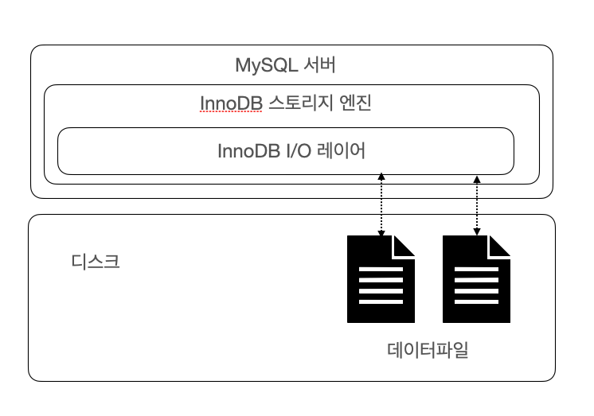
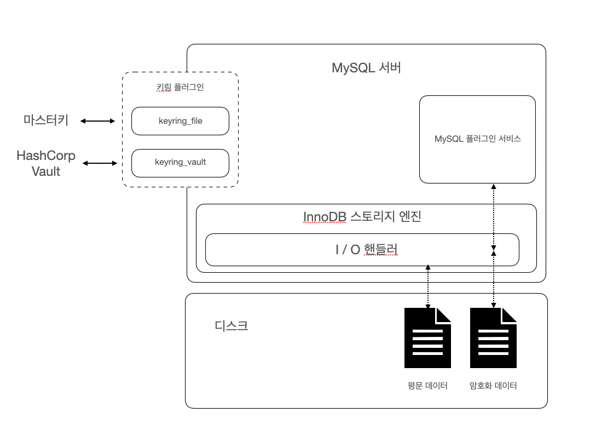

# 데이터 암호화

MySQL 5.7버전까지는 데이터 파일(테이블스페이스)에 대해서만 암호화 기능이 제공되었지만 MySQL8.0으로 업그레이드되면서 데이터 파일 뿐 아니라 리두 로그나 언두 로그, 복제를 위한 바이너리 로그 등도 모두 암호화 기능을 지원하기 시작했다.

데이터 암호화 여부는 보안 감사에서 필수적으로 언급되는 부분이며 핀테크 서비스처럼 중요한 정보를 저장하는 서비스에서는 응용 프로그램에서 암호화한 데이터를 데이터베이스 서버에서 다시 암호화하는 이중 암호화 방법을 선택하기도 한다.
또 *응용 프로그램의 암호화는 주로 중요 정보를 가진 칼럼 단위로 암호화를 수행하며 데이터베이스 수준에서는 테이블 단위로 암호화를 수행한다.*

## MySQL 서버에서의 데이터 암호화

<br>



<br>

MySQL 서버의 암호화 기능은 *데이터베이스 서버와 디스크 사이의 데이터를 읽고 쓰는 지점에서 암호화 또는 복호화를 수행한다.* 그렇기 때문에 이 이외의 부분에서는 암호화 처리가 필요하지 않으며 사용자의 쿼리를 처리하는 과정에서도 데이터 암호화 여부와 상관없이 동일한 처리 과정을 거친다. 이러한 암호화 방식을 **TDE**(Transparent Data Encryption) 혹은 Data at Rest Encryption이라고도 하는데 **Data at Rest** 는 메모리나 네트워크 전송 단계가 아닌 디스크에 저장된 단계에서만 암호화된다는 의미로 사용되는 표현이다.

<br>
<br>


### 2단계 키 관리

<br>


MySQL 서버의 TDE에서 암호화 키는 키링(KeyRing) 플러그인에 의해 관리되며 MySQL 8.0버전에서는 아래와 같은 키링 플러그인들을 지원한다.

- MySQL 8.0버전에서 지원하는 키링 플러그인

1. keyring_file File_Based 플러그인
2. keyring_encrypted_file Keyring 플러그인
3. keyring_okv KMIP 플러그인
4. keyring_aws Amazon Web Services Keyring 플러그인

위의 플러그인들은 마스터 키를 관리하는 방법만 다를 뿐 MySQL 서버 내부적으로 작동하는 방식은 모두 동일하며 MySQL 서버의 키링 플러그인은 2단계(2-Tier) 키 관리 방식을 사용하는데 아래의 이미지는 2단계 키 관리 아키텍처를 보여준다.

<br>



<br>

MySQL 서버의 데이터 암호화는 마스터키와 테이블스페이스 키라는 두 가지 종류의 키를 가지고 있는데 테이블 스페이스 키는 프라이빗 키라고도 한다.

위의 그림과 같이 MySQL 서버는 HashiCorp Vault 와 같은 외부 키 관리 솔루션(KMS, Key Management Service) 또는 디스크의 파일(keyring_file 또는 keyring_encrypted_file 플러그인 사용 시)에서 마스터 키를 가져오고, 암호화된 테이블이 생성될 때마다 해당 테이블을 위한 임의의 테이블스페이스 키를 발급한다. 그리고 MySQL 서버는 마스터 키를 이용해 테이블스페이스 키를 암호화해서 각 테이블의 데이터 파일 헤더에 저장한다. 이렇게 생성된 테이블스페이스 키는 테이블이 삭제되지 않는 이상 절대 변경되지 않는다. 하지만 테이블스페이스 키는 절대 MySQL 서버 외부로 노출되지 않기 때문에 테이블스페이스 키를 주기적으로 변경하지 않아도 된다.

하지만 마스터키는 외부의 파일을 이용하기 때문에 노출될 가능성이 있기 때문에 주기적으로 변경해줘야한다. MySQL 서버의 마스터키는 아래와 같은 명령어로 변경할 수 있다. 

<br>

```MySQL
mysql> ALTER INSTANCE ROTATE INNODB MASTER KEY;
```

<br>

마스터 키를 변경하면 MySQL 서버는 기존의 마스터 키를 이용해 각 테이블의 테이블스페이스 키를 복호화 한 후 새로운 마스터키로 다시 암호화한다. 이러한 2단계 암호화 방식을 사용하는 이유는 암호화 키 변경으로 인한 과도한 시스템 부하를 피하기 위해서인데 테이블 스페이스 키가 변경된다면 MySQL 서버는 데이터 파일의 모든 데이터를 다시 복호화했다가 다시 암호화해야 해야하는데 이 때 MySQL 서버의 성능에 상당항 영향을 미치기 때문이다.

<br>
<br>
<br>

### 암호화 성능 

MySQL 서버의 암호화는 TDE(Transparent Data Encryption) 방식이기 때문에 디스크로부터 한 번 읽은 페이지는 복호화되어 InnoDB의 버퍼 풀에 적재된다. 그렇기 때문에 데이터 페이지가 한 번 메모리에 적재되면 암호화하지 않는 테이블과 동일한 성능을 보인다. 하지만 쿼리가 InnoDB 버퍼 풀에 존재하지 않는 데이터 페이지를 읽어아햐는 경우에는 복호화 과정을 거치기 때문에 복호화 시간 동안 쿼리 처리가 지연되며 다시 암호화된 테이블이 변경되면 다시 디스크로 동기화될 때 암호화해야하기 때문에 저장할 때도 시간이 걸린다.

*하지만 데이터 페이지 저장은 사용자의 쿼리를 처리하는 스레드가 아닌 MySQL 서버의 백그라운드 스레드가 수행하기 때문에 실제 사용자 쿼리가 지연되는 것은 아니다.* 하지만 쿼리 처리를 위해 읽거나 변경하고자 하는 레코드를 InnoDB 버퍼 풀로 읽어와야 하기 때문에 새롭게 디스크에서 읽어아 햐는 데이터 페이지의 개수에 따라서 그만큼의 복호화 지연이 발생한다.

AES(Advanced Encryption Standard) 암호화 알고리즘은 암호화하고자 하는 평문의 길이가 짧은 경우 암호화 키의 크기에 따라 암호화된 결과의 용량이 더 커질수도 있지만, **이미 데이터 페이지는 암호화 키보다 훨씬 크기 때문에 암호화 결과가 평문의 결과와 동일한 크기의 암호문을 반환한다.**

그렇기 때문에 **TDE를 적용한다고 해도 데이터 파일의 크기는 암호화되지 않는 테이블과 동일한 크기를 가지기 때문에 암호화때문에 InnoDB 버퍼 풀의 효율이 달라지거나 메모리 사용 효율이 떨어지는 현상은 발생하지 않는다.**

<br>

- 정리
1. 암호화를 하더라도 동일한 크기의 암호문을 반환한다.
2. 데이터 파일의 크기는 암호화되지 않는 테이블과 동일한 크기를 가진다.
3. 그렇기 때문에 성능이 떨어지지 않는다.

<br>

같은 테이블에 대해 암호화와 압축이 동시에 적용되면 MySQL 서버는 압축을 먼저 실행하고 암호화를 적용하는데 그 이유는 **암호문은 아주 랜덤한 바이트 배열을 가지게되는데, 이는 압축률을 상당히 떨어뜨린다. 그렇기 때문에 압축 후 암호화를 해 압축 효율을 높인다.** 또 **암호화된 테이블의 데이터 페이지는 복호화된 상태로 InnoDB 버퍼 풀에 저장되지만, 압축된 데이터 페이지는 압축 또는 압축 해제의 모든 상태로 InnoDB 버퍼 풀에 존재할 수 있다. 그래서 암호화가 먼저 실행되고 압축이 적용된다면 MySQL 서버는 InnoDB 버퍼 풀에 존재하는 데이터 페이지에 대해서도 매번 암복호화 작업을 수행해야한다.**

<br>
<br>

### 암호화와 복제

<br>

MySQL 서버의 복제에서 레플리카 서버는 소스 서버의 모든 사용자 데이터를 동기화하기 때문에 실제 데이터 파일도 동일할 것이라고 생각할 수 있다. *하지만 TDE를 이용한 암호화 사용 시 마스터 키와 테이블스페이스 키는 그렇지 않다.* MySQL 서버에서 모든 노드는 각자의 마스터 키를 할당해야 한다. 데이터베이스 서버의 로컬 디렉토리에 마스터 키를 관리하는 경우에는 소스 서버와 레플리카 서버가 다른 키를 가질 수 밖에 없겠지만 **원격으로 키 관리 솔루션을 사용하는 경우에도 소스 서버와 레플리카 서버는 서로 다른 마스터 키를 갖도록 설정해야 한다.** 마스터 키 자체가 레플리카로 복제되지 않기 때문에 테이블 스페이스 키 또한 레플리카로 복제되지 않는다. **결국 소스 서버와 레플리카 서버는 서로 각자의 마스터 키와 테이블스페이스 키를 관리하기 때문에 복제 멤버들의 데이터 파일은 암호화되기 전의 값이 동일하더라도 실제 암호화된 데이터가 저장된 데이터 파일의 내용은 완전히 달라진다.**

복제 소스 서버의 마스터 키를 변경할 때 ALTER INSTANCE ROTATE INNODB MASTER KEY 명령을 실행하는데, 이때 ALTER INSTANCE ROTATE INNODB MASTER KEY 명령 자체는 레플리카 서버로 복제되지만 실제 소스 서버의 마스터 키 자체가 레플리카 서버로 전달되는 것은 아니다. **그래서 마스터 키 로테이션을 실행하면 소스 서버와 레플리카 서버가 각각 서로 다른 마스터 키를 발급받는다.**

<br>
<br>

## keyring_file 플러그인 설치

MySQL 서버의 데이터 암호화 기능인 TDE의 암호화 키 관리는 플러그인 방식으로 제공된다. MySQL 엔터프라이즈 에디션과는 달리 MySQL 커뮤니티 에디션에는 keyring_file 플러그인만 가능하다. 

keyring_file 플러그인은 테이블스페이스 키를 암호화하기 위한 마스터 키를 디스크의 파일로 관리하는데, 이때 마스터 키는 평문으로 디스크에 저장된다. 그렇기 대문에 마스터 키가 저장된 파일이 외부로 노출되면 데이터 암호화의 의미가 없어지므로 주의하자.

MySQL 서버의 다른 플러그인과 달리, TDE 플러그인의 경우 MySQL 서버가 시작되는 단계에서도 가장 빨리 초기화되어야 한다. **그렇기 때문에 MySQL 서버의 설정파일인 my.cnf에 early-plugin-load 시스템 변수에 keyring_file 플러그인을 위한 라이브러리("keyring_file.so")를 명시해야한다. 그리고 keyring_file 플러그인이 마스터 키를 저장할 키링 파일의 경로를 keyring_file_data 설정에 명시하면된다.** 
그리고 keyring_file_data 설정의 경로는 오직 하나의 MySQL 서버만 참조해야 한다.

<br>

- my.cnf
```
early-plugin-load = keyring_file.so
keyring_file_data = /very/secure/directroy/tde_master.key
```

<br>

```bash
# mysql 서버 재실행
mysql.server restart

# mysql 접속 
mysql -u root -p

mysql> SHOW PLUGINS;
+---------------------------------+----------+--------------------+-----------------+---------+
| Name                            | Status   | Type               | Library         | License |
+---------------------------------+----------+--------------------+-----------------+---------+
| keyring_file                    | ACTIVE   | KEYRING            | keyring_file.so | GPL     |
| binlog                          | ACTIVE   | STORAGE ENGINE     | NULL            | GPL     |
```

<br>

위와 같이 MySQL 서버의 설정 파일이 준비된 후 MySQL 서버를 재시작하면 자동으로 keyring_file 플러그인이 초기화된다. keyring_file 플러그인의 초기화 여부는 다음과 같이 SHOW PLUGINS 명령으로 확인 가능하다.

<br>
<br>
<br>

## 테이블 암호화

키링 플러그인은 마스터 키를 생성하고 관리하는 부분까지만 담당하기 때문에 어떤 키링 플러그인을 사용하든 관계없이 암호화된 테이블을 생성하고 활용하는 방법은 모두 동일하다.

### 테이블 생성

TDE를 이용하는 테이블은 다음과 같이 생성할 수 있다.

<br>

```MYSQL
mysql> use RealMySQL;

mysql> CREATE TABLE tab_encrypted (
    id INT,
    data VARCHAR(100),
    PRIMARY KEY(id)
) ENCRYPTION='Y';

mysql> INSERT INTO tab_encrypted VALUES (1, 'test_data');
mysql> SELECT * FROM tab_encrypted;
+----+-----------+
| id | data      |
+----+-----------+
|  1 | test_data |
+----+-----------+
1 row in set (0.00 sec)
```

<br>

일반적인 테이블 생성 방법과 동일하지만 마지막에 "ENCRYPTION='Y'" 옵션만 추가로 넣으면 된다. 그러면 이제부터 이 테이블의 데이터가 디스크에 기록될 때는 데이터가 자동으로 암호화 되어 저장되고 다시 디스크에서 메모리로 읽어올 때 복호화된다. MySQL 서버에서 암호화된 테이블만 검색할 때는 information_schema TABLES 뷰를 이용하면 된다.

<br>

```MySQL
mysql> SELECT table_schema, table_name, create_options FROM information_schema.tables WHERE table_name='tab_encrypted';
+--------------+---------------+----------------+
| TABLE_SCHEMA | TABLE_NAME    | CREATE_OPTIONS |
+--------------+---------------+----------------+
| RealMySQL    | tab_encrypted | ENCRYPTION='Y' |
+--------------+---------------+----------------+
1 row in set (0.00 sec)
```

<br>

**테이블 생성 시 ENCRYPTION 옵션을 항상 적용하고 싶다면 default_table_encryption 시스템 변수를 ON으로 설정하면 된다.**

<br>
<br>

### 응용 프로그램 암호화와 비교

응용 프로그램에서 직접 암호화해서 MySQL 서버에 저장하는 경우도 있는데 이 경우 저장되는 칼럼의 값이 이미 암호화된 것인지 MySQL 서버는 인지하지 못한다. 그래서 *응용 프로그램에서 암호화된 칼럼은 인덱스를 생성하더라도 인덱스의 기능을 100% 활용할 수 없다.*

예를 들어 유저의 출생연도 정보를 응용프로그램을 사용해 암호화한 후 MySQL 서버에 저장한 경우, 출생연도 정보를 기준으로 정렬해 데이터를 조회할 수 없다. MySQL 서버에서는 암호화되기 전의 정보를 기준으로 정렬할 수 없기 때문이다.

그렇기 때문에 일반적인 상황에서 응용 프로그램 암호화와 MySQL 서버의 암호화 기능 중 선택해야 하는 상황이라면 MySQL 서버의 암호화 기능을 사용하는 것이 좋다. 

### 테이블스페이스 이동

MySQL 서버의 데이터베이스 관리자라면 테이블스페이스만 이동하는 기능을 자주 사용하게 될 것이다. 테이블을 다른 서버로 복사해야 하는 경우 또는 특정 테이블의 데이터 파일만 백업했다가 복구하는 경우라면 테이블스페이스 이동 기능이 레코드를 덤프했다가 복구하는 방식보다 훨씬 효율적이고 빠르다.

하지만 TDE가 적용되어 암호화된 테이블의 경우 원본 MySQL 서버의 마스터 키와 목적지 MySQL 서버의 마스터키가 다르기 때문에 FLUSH TABLES 명령으로 테이블스페이스를 익스포트해야 한다.

<br>

```MySQL
mysql> FLUSH TABLES source_table FOR EXPORT;
```

<br>

**이 명령이 실행되면 MySQL 서버는 source_table의 저장되지 않은 변경사항을 모두 디스크로 기록한 후, 더이상 source_table에 접근할 수 없게 잠금을 건다. 그와 동시에 source_table의 구조를 source_table.cfg 파일로 기록해두고 source_table.ibd 파일과 source_table.cfg 파일을 목적지 서버로 복사한다.** 복사가 모두 완료되면 UNLOCK TABLES 명령을 실행해 source_table을 사용할 수 있게 하면 된다.

TDE로 암호화된 테이블에 대해 "FLUSH TABLES source_table FOR EXPORT" 명령을 실행하면 **MySQL 서버는 임시로 사용할 마스터 키를 발급한 후 source_table.cfp라는 파일에 기록한다. 그 이후 암호화된 테이블의 테이블스페이스 키를 기존 마스터 키로 복호화한 후, 임시로 발급한 마스터 키를 이용해 다시 암호화해서 데이터 파일의 헤더 부분에 저장한다.**

 그렇기 때문에 **암호화된 테이블의 경우 테이블스페이스 이동 기능을 사용할 때는 반드시 데이터 파일과 임시 마스터 키가 저장된 *.cfp 파일을 함께 복사해야 한다.**

<br>
<br>
<br>

## 언두 로그 및 리두 로그 암호화

**위의 방식으로 테이블의 암호화를 적용하더라도 디스크로 저장되는 데이터만 암호화되고 MySQL 서버의 메모리에 존재하는 데이터는 복호화된 평문으로 관리되며, 이 평문 데이터가 테이블의 데이터 파일 이외의 디스크 파일로 기록되는 경우에는 여전히 평문으로 저장된다. 그렇기 때문에 테이블 암호화를 적용하더라도 리두, 언두 로그와 바이너리 로그에는 평문으로 저장되는 것이다.**

MySQL 8.0.16 버전부터는 innodb_undo_log_encrypt, innodb_redo_log_encrypt 시스템 변수를 이용해 InnoDB 스토리지 엔진의 리두 로그와 언두 로그를 암호화된 상태로 저장 할 수 있도록 개선되었다.

테이블 암호화와는 다르게 리두 로그, 언두 로그의 모든 데이터에 암호화를 적용할 수 없기 때문에 위의 두 가지의 시스템 변수를 활성화한 시점부터 데이터가 암호화되어 저장된다. 만약 시스템 변수가 비활성화된다면 비활성화된 시점부터 데이터가 평문으로 저장된다. 그렇기 때문에 활성화되거나 비활성화된 즉시 암호화에 필요한 키가 불필요해지는 것이 아니기 때문에 오랜 기간동안 암호화된 데이터를 복호화하기 위한 키가 필요할 수 있다.

리두 로그와 언두 로그 데이터의 암호화는 모두 각각의 테이블스페이스 키로 암호화되고 테이블 스페이스 키는 마스터 키로 다시 암호화된다. 그리고 테이블스페이스 키는 마스터 키로 암호화되어 리두 로그 언두와 언두 로그 파일의 헤더에 저장된다.

<br>

```bash
# innodb_redo_log_encrypt 시스템 변수 값 확인
mysql> SHOW GLOBAL VARIABLES LIKE 'innodb_redo_log_encrypt';

# innodb_redo_log_encrypt 활성화
mysql> SET GLOBAL innodb_redo_log_encrypt=ON;
```

<br>
<br>
<br>

## 바이너리 로그 암호화

리두 로그와 언두 로그와 마찬가지로 테이블 암호화가 적용되어도 바이너리 로그는 암호화되지 않고 평문으로 저장된다. 일반적으로 언두 로그와 리두 로그는 길지 않은 시간 동안의 데이터만 가지기 때문에 크게 보안에 민감하지 않을 수 있지만 바이너리 로그는 상당히 긴 시간 동안 보관하는 서비스도 존재하며 증분 백업(Incremental Backup)을 위해 바이너리 로그를 보관하기도 한다. 이런 이유로 리구, 언두 로그보다 바이너리 로그의 암호화는 중요도가 높아질 수 있다.

바이너리 로그와 릴레이 로그 파일 암호화 기능은 디스크에 저장된 로그 파일에 대한 암호화만 담당하기때문에 MySQL 서버의 메모리 내부 또는 소스 서버와 레플리카 서버 간의 네트워크 구간에서 로그 데이터를 암호화하지 않는다. **복제 멤버 간의 네트워크 구간에서도 바이너리 로그를 암호화하고자 한다면 MySQL 복제를 위한 계정이 SSL을 사용하도록 설정하면 된다.**

<br>
<br>

### 바이너리 로그 암호화 키 관리

바이너리 로그와 릴레이 로그 파일 데이터의 암호화를 위해서도 MySQL 서버는 2단계 암호화 키 관리 방식을 사용한다.

*바이너리 로그와 릴레이 로그 파일의 데이터는 파일 키(File Key)로 암호화해서 디스크로 저장하고, 파일 키는 **바이너리 로그 암호화 키**로 암호화해서 각 바이너리 로그와 릴레이 로그 파일의 헤더에 저장된다.*

<br>

- 바이너리 로그 암호화 정리
1. 파일 키는 각 로그 파일 별로 자동으로 생성된다. 테이블 암호화의 프라이빗 키와 동일한 역할을 한다.
2. 바이너리 로그 암호화 키는 테이블 암호화의 마스터 키와 동일한 역할을 한다.

<br>
<br>

### 바이너리 로그 암호화 키 변경

<br>

바이너리 로그 암호화 키는 아래와 같은 명령어로 변경할 수 있다.

```mysql
mysql> ALTER INSTANCE ROTATE BINLOG MASTER KEY;
```

위의 명령어로 바이너리 로그 암호화 키를 변경하면 아래와 같은 과정을 거치게 된다.

<br>

- 바이너리 로그 암호화 키 변경 과정
1. 증가된 시퀀스 번호와 함께 새로운 바이너리 로그 암호화 키 발급 후 키링 파일에 저장
2. 바이너리 로그 파일과 릴레이 로그 파일 스위치
3. 새로 생성되는 바이너리 로그와 릴레이 로그 파일의 암호화를 위해 파일 키를 생성하고, 파일 키는 바이너리 로그 파일 키(마스터 키)로 암호화해서 각 로그 파일에 저장
4. 기존 바이너리 로그와 릴레이 로그 파일의 파일 키를 읽어서 새로운 바이너리 로그 파일 키로 암호화해서 다시 저장
5. 모든 바이너리 로그와 릴레이 로그 파일이 새로운 바이너리 로그 암호화 키로 다시 암호화됐다면 기존 바이너리 로그 암호화 키를 키링 파일에서 제거


위의 과정에서 4번 과정은 특히 시간이 많이 걸리는 작업일 수 있다. 이를 위해 키링 파일에서 "바이너리 로그 암호화 키"는 내부적으로 버전(시퀀스 번호) 관리가 이뤄진다. 예를 들어, 많은 바이너리 로그와 릴레이 로그를 가진 MySQL 서버에서 ALTER INSTANCE ROTATE BINLOG MASTER KEY 명령을 연속으로 2번 실행한다면 키링 파일에는 순차적인 시퀀스 번호를 가지는 3개의 바이너리 로그 암호화 키가 존재할 것이다. 그리고 바이너리 로그와 릴레이 로그 파일들을 최근 순서대로 파일 키를 다시 암호화해서 저장하는 작업을 수행하고 필요없어진 기존 바이너리 로그 암호화 키는 필요하지 않으므로 키링 파일에서 제거된다.

MySQL 서버의 바이너리 로그 파일이 암호화되어 있는지 여부는 다음과 같이 확인할 수 있다.

<br>

```mysql
mysql> SHOW BINARY LOGS;
+---------------+-----------+-----------+
| Log_name      | File_size | Encrypted |
+---------------+-----------+-----------+
| binlog.000013 |     80523 | No        |
| binlog.000014 |      3282 | No        |
| binlog.000015 |       180 | No        |
| binlog.000016 |    208286 | No        |
| binlog.000017 |       157 | Yes
+---------------+-----------+-----------+
5 rows in set (0.01 sec)
```