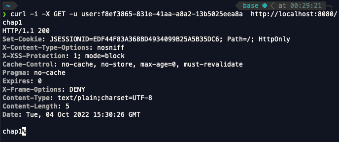
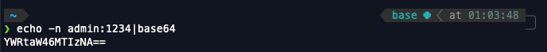
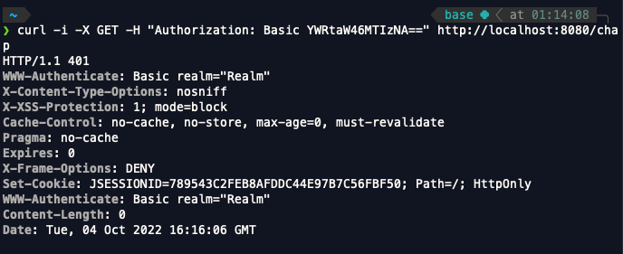

 

스프링 시큐리티를 사용하면서 이것 저것 찾아보면서 여러 블로그를 읽고 스프링 시큐리티 인 액션을 읽으며 궁금했던 HTTP Basic Authentication 에 대한 내용을 정리하는 MD파일입니다.

 

# HTTP Basic Authentication

우선 내가 공부하고 있는 웹 프레임워크인 스프링 부트를 생각해보자. 스프링부트로 회원가입, 로그인 페이지, 어드민 페이지, 이미지를 업로드하는 페이지, 자신이 업로드한 이미지를 볼 수 있는 페이지 등등의 기능을 사용할 수 있는 프로젝트를 만들었다고 했을 때 여러가지의 이미지들과 회원가입과 로그인 과정에서 생기는 유저들의 개인정보들 등등해서 많은 리소스들이 만들어지게된다.
 

유저들이 해당 프로젝트에 있는 리소스들에 마음대로 접근하게 해서는 안된다. 왜냐하면 예를들어서 은행 어플에 해커가 A라는 사람의 아이디와 비밀번호를 마음대로 가져와서 해당 계좌에 있는 돈을 송금해버린다면 큰 문제가 되기때문이다.

그렇기 때문에 A유저는 A유저의 계좌에만 접근할 수 있도록 해야하고 서버는 사용자가 누구인지 식별할 수 있어야 한다. 그렇게 하기위해서 보통은 로그인 과정에서 유저의 아이디와 비밀번호를 입력하고 입력한 아이디와 비밀번호가 디비에 있는 아이디와 비밀번호가 같다면 서버의 세션에 해당 유저를 저장하고 쿠키를 사용해 로그인 후에 유저가 어떤 요청을 보내면 서버가 요청을 보낸 유저를 식별할 수 있도록 하고있다.

그렇다면 어떻게 로그인을 할 때 어떻게 입력한 아이디와 비밀번호가 서버에 전달되는지를 알기위해서 chap_1.md에서 curl을 사용해서 http://localhost:8080/chap1로 GET 요청을 보냈을 때를 생각해보자. 
 
 

    

 

위의 이미지를 보면 -u user:password의 형식으로 아이디와 비밀번호를 적었던 것을 확인할 수 있다. curl -u 플래그를 사용해서 username:password로 아이디와 비밀번호를 보내면 username: password는 BASE64로 인코딩된 결과를 Basic이 붙은 Authorization 헤더의 값으로 보낸다. 

그렇다면 username = admin, password = 1234인 상황을 가정하고 직접 user:password를 BASE64로 인코딩한 후에 Authorization 헤더의 값으로 사용해보자.

 

echo -n admin:1234|base64는 admin:1234라는 문자열을 base64로 인코딩한 값을 출력해준다.

 

당연하게도 admin:1234는 chap1 프로젝트에 등록된 아이디와 비밀번호가 아니므로 Status Code 401 Unauthorized(권한없음)을 확인할 수 있다.

이렇게 아이디와 비밀번호를 서버에 전송해 로그인하여 유저를 식별하고 유저의 권한에 따라 리소스에 접근권한을 부여한다면 좀 더 보안적으로 좋은 프로젝트를 만들수 있다.

하지만 BASE64로 인코딩하는 것만으로는 보안문제가 발생할 수 있다. 만약 유저가 서버에 아이디와 비밀번호를 Authorization 헤더에 BASE64로 인코딩한 후 보낸 요청을 어떤 누군가가 가로챈다면 아이디와 비밀번호를 알수 있을지도 모른다. 왜나하면 기본인증에서 BASE64로 인코딩된 아이디와 비밀번호는 쉽게 디코딩될 수 있기 때문이다. 그렇기 때문에 **HTTP트랜잭션을 SSL암호화 채널을 통해 보내거나, 보안이 더 강화된 다이제스트 인증 같은 프로토콜을 사용하는 것이 좋다고 한다.**
해당 부분에 대해서는 아직 잘 모르기때문에 추후에 공부한 후 관련 글을 작성해봐야겠다.

 
 
 

 

> 참고 URL : https://en.wikipedia.org/wiki/Basic_access_authentication, https://simple-ing.tistory.com/17, 스프링 시큐리티 인 액션 (책)