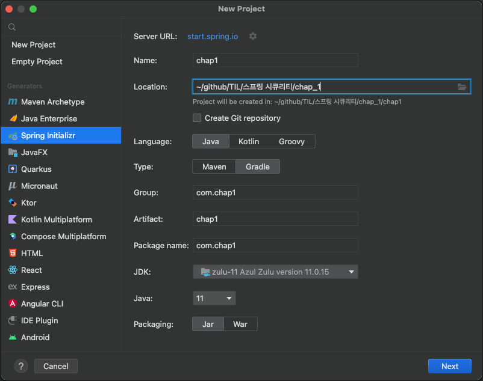
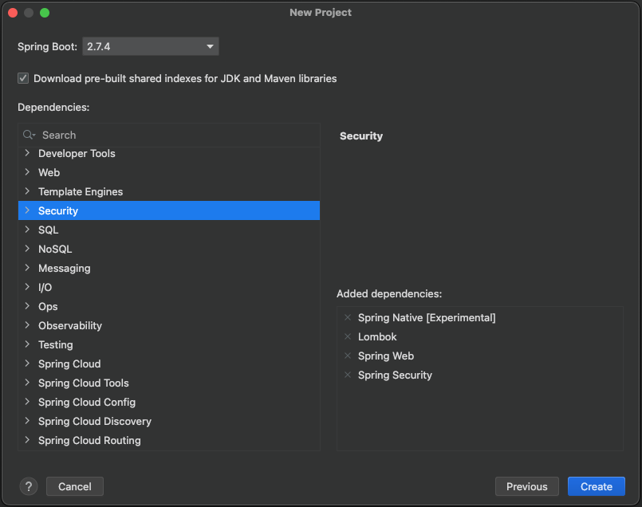
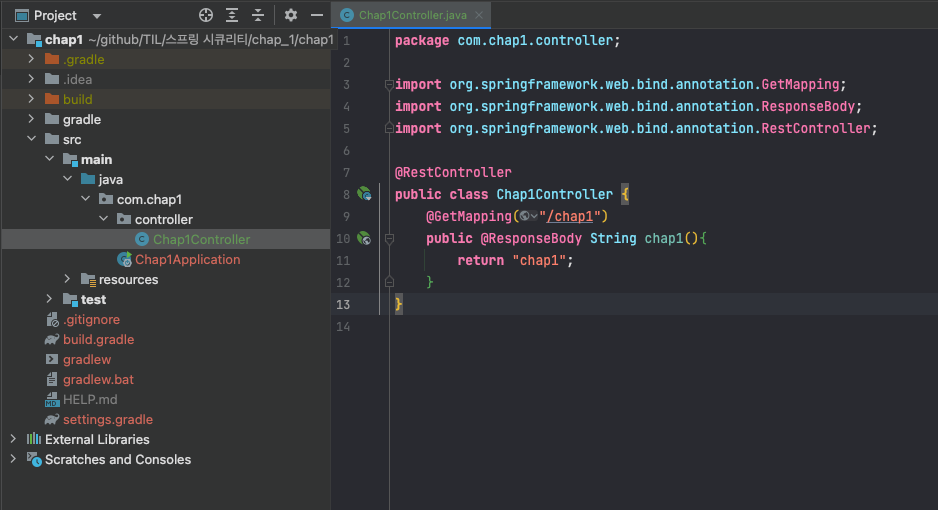
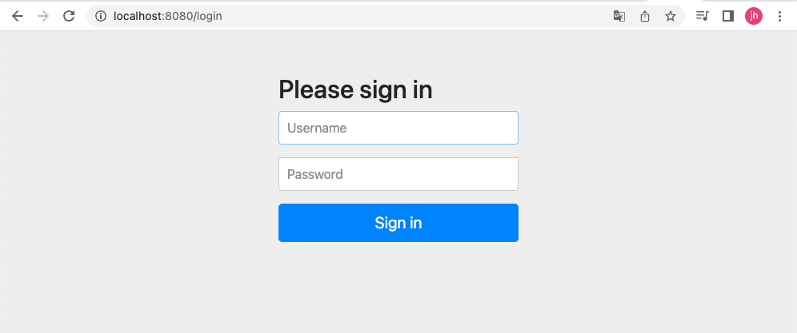
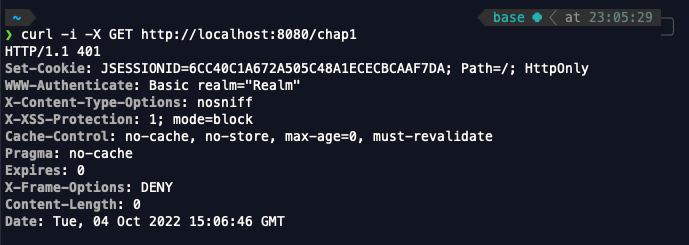
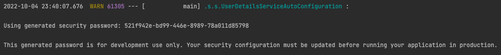
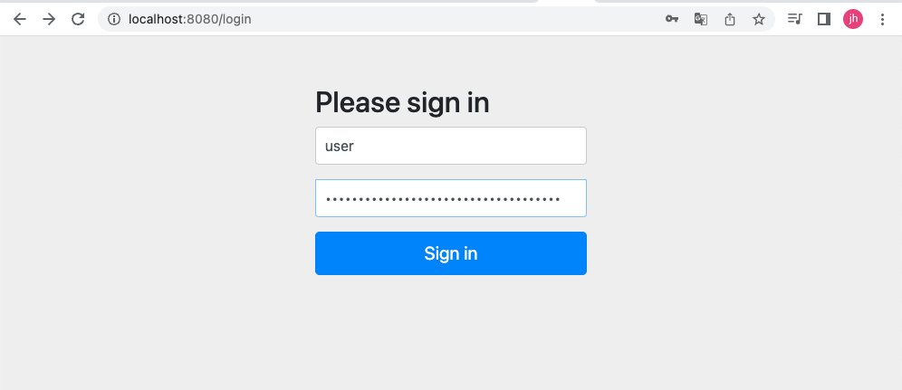
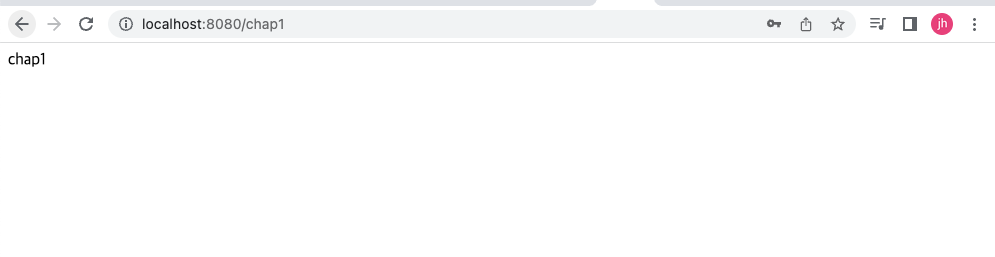
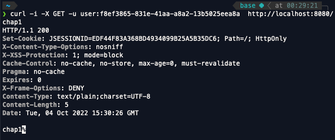

 
스프링 시큐리티 인 액션을 읽고 내용을 정리한 파일입니다.

 

# 스프링부트 프로젝트 생성하기

- 인텔리제이 기준 file > new > project

 
 
책의 스프링 시큐리티 예제를 공부하기 위해서 스프링부트 프로젝트를 생성합니다.
제 기준으로 언어는 자바, jdk는 11버전을 사용했습니다.

 

## 의존성 추가하기
--- 
 

이번 프로젝트에서는 위 이미지의 Added dependencies 아래에 적혀있는 것들을 추가해주시면 되겠습니다.

1. Spring Native [Experimental]
2. Lombok
3. Spring Web
4. Spring Security

 

위의 4가지의 것들을 추가한 후 프로젝트를 생성한 후에 조금 기다리면 자동으로 데몬이 필요한 것들을 다운해줄것입니다.

프로젝트를 실행하기에 앞서 간단한 엔드포인트를 만들어서 나중에 프로젝트를 실행하고 해당 엔드포인트를 호출했을 때 어떤 일이 일어나는지 확인해보도록 하겠습니다.

 

위처럼 Chap1Controller를 생성하고 GET 방식으로 /chap1 요청이 왔을 때 "chap1"을 리턴해주도록 코드를 작성했습니다. 어플리케이션을 실행하고 브라우저에 http://localhost:8080/chap1를 입력해봅시다.

 

 

위의 이미지를 보면 /chap1이 아닌 /login으로 이동한 것을 볼 수 있습니다. 
분명 http://localhost:8080/chap1로 요청을 보냈음에도 불구하고 localhost:8080/login 페이지로 이동한 이유는 /chap1으로의 이동을 위해 스프링 시큐리티가 사용자에게 로그인을 요구했다고 생각하면 됩니다.

 
한번 curl을 사용해서 http://localhost:8080/chap1로 GET 요청을 보내보도록 하겠습니다.
위의 이미지를 보면 401 Unauthorized(권한없음)이 반환된 것을 확인할 수 있습니다. 그렇다면 나의 권한을 인증하기 위해서 로그인을 해야할텐데 어떻게 로그인을 할 수 있을까요 ?

 
사실 프로젝트가 실행될때마다 스프링 시큐리티는 아이디와 비밀번호를 생성해주고 있습니다.

 

- 스프링 부트 콘솔창 

프로젝트의 콘솔창에 "Using generated security password: ~~" 의 형식으로 ~~에는 user라는 아이디의 비밀번호가 생성되어 적혀있는데 프로젝트가 실행될때마다 스프링 시큐리티는 user라는 아이디의 비밀번호를 만들어서 콘솔창에 적어줍니다.

 

위의 이미지처럼 user라는 아이디에 스프링 시큐리티가 만들어준 비밀번호를 입력해서 로그인을 한 후 /chap1의 요청을 하면 /login으로 이동하는 것이 아닌 /chap1으로 정상적으로 이동한 것을 볼 수 있습니다.

 
 

- 정상적으로 이동한 모습

이렇게 엔드포인트마다 접근할 수 있는 유저의 권한을 설정하고 해당 권한을 가진 유저가 아니면 로그인 페이지 혹은 알림을 띄워 해당 엔드포인트에 접근제한을 만들어 줄 수 있습니다.

마지막으로 curl을 사용하여 올바른 자격증명을 하고 /chap1 요청을 보내 정상적으로 작동하는지 확인해보도록 하겠습니다.

 

- 프로젝트를 다시 실행시켜서 위와 비밀번호가 다름 주의

http://localhost:8080/chap1로 요청을 보냈을 때 200의 Status Code와 함께 chap1이라는 문자열이 출력된 것을 확인할 수 있습니다.

