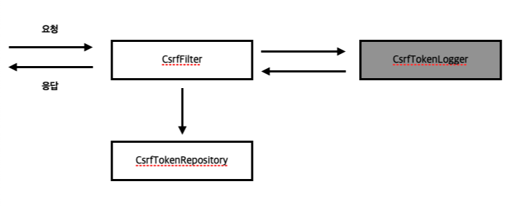
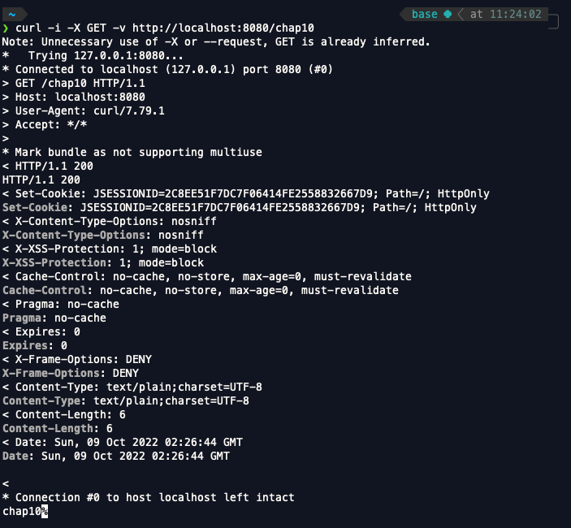
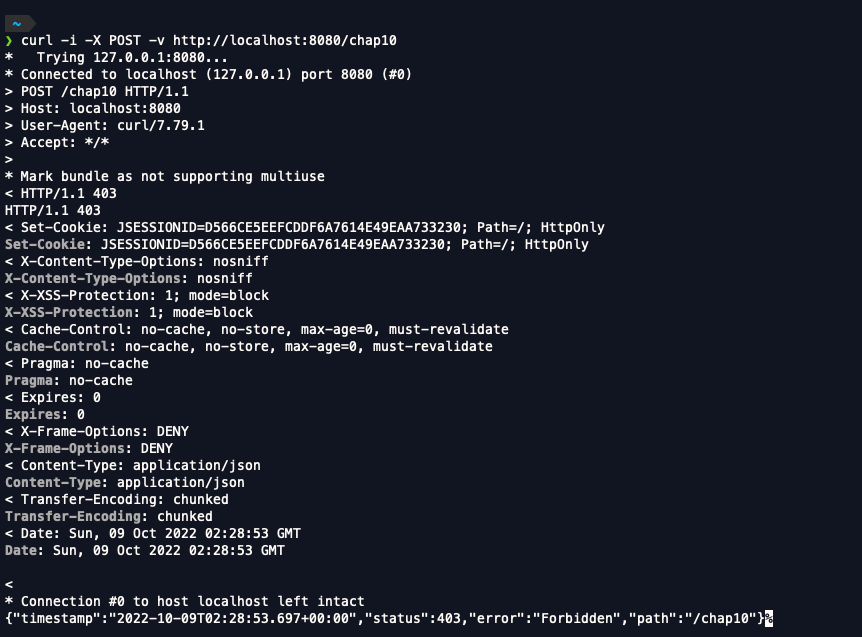
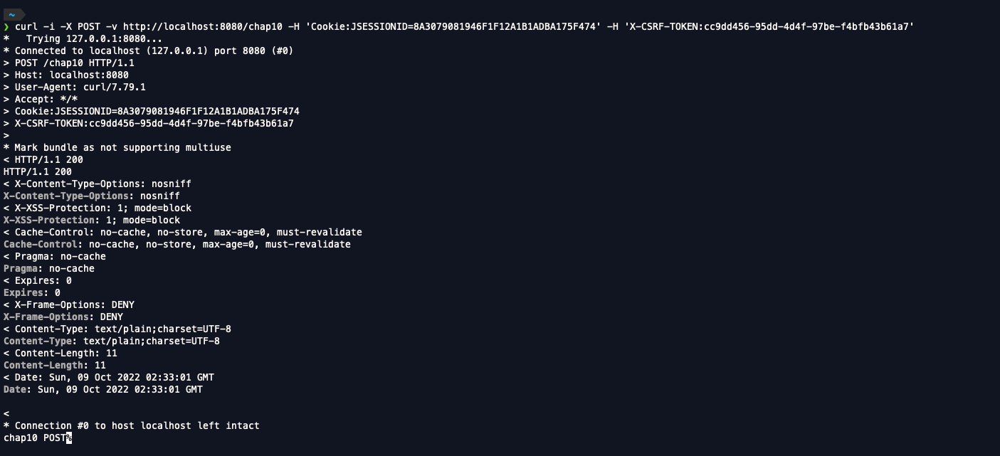
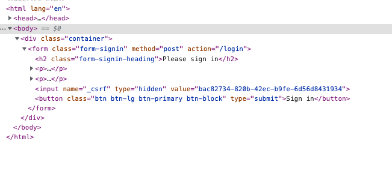
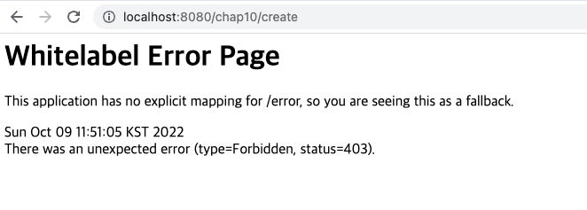
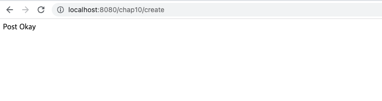

<br>

- 스프링 시큐리티 인 액션을 읽고 내용을 정리한 파일입니다.

<br>
<br>
<br>

# CSRF(사이트 간 요청 위조)

지금까지는 HTTP GET 으로만 엔드포인트를 구현했다. HTTP POST로 직접 엔드포인트를 호출할 수 없어 http.csrf().disable()를 사용해서 csrf를 비활성화 시켜준후 POST 로 엔드포인트를 호출했다. HTTP POST로 직접 엔드포인트를 호출할 수 없는 이유는 스프링 시큐리티에 기본적으로 활성화되는 CSRF 보호때문이다.

CSRF란 광범위한 공격 유형이며 애플리케이션 인증 후 사용자가 웹 애플리케이션에서 원치않는 작업을 실행하게 하는 것이다. 사용자가 원치않는 작업이 실행되는 상황은 좋은 상황이 아니기 때문에 스프링 시큐리티는 기본적으로 CSRF 보호를 지원하고있다.

## CSRF 보호 기본 메커니즘

우선 사용자가 웹 애플리케이션에 로그인을 했다고 생각해보자. 즉 사용자는 서버로부터 인증을 받은 상황이다. 이 사용자는 이메일에 알 수 없는 링크를 클릭해서 외부 페이지를 열면 이 페이지가 서버를 호출하고 사용자 대신 작업을 실행한다. 이런 일이 가능한 이유는 사용자가 인증을 마친 후이기 때문에 서버는 사용자가 보낸 요청을 모두 신뢰하기 때문이다. 이런 일은 꽤 자주 일어나는데 사용자가 보안 위험에 대해서 제대로 인식하고있지 못하기 때문이다. 그렇기 때문에 앱이 사용자가 자신을 보호하도록 기대하고 방치하기보다는 우리 개발자가 앱을 안전하게 보호하는 것이 좋다.

어떻게하면 CSRF 공격에서 사용자를 보호할수있을까 ? 사용자가 데이터를 변경하는 작업을 하려면 우선 GET 방식으로 웹 페이지에 요청해야하는데 이 때 애플리케이션은 고유한 토큰을 생성한다. 해당 토큰을 CSRF 토큰이라고 부른다. 이 토큰이 있을 경우에만 데이터 변경작업(POST, PUT DELETE)등의 작업을 수행할 수 있으며 토큰 값을 안다는 것은 다른 시스템이 아닌 애플리케이션 자체가 변경 요청을 보낸 것이라고 보기때문에 POST, PUT, DELETE 의 작업을 할 수 있다. 데이터 변경작업을 하기 위해서는 CSRF 토큰을 이용해야 한다.

### CsrfFilter

CSRF 보호의 시작점은 CsrfFilter라는 필터다. CsrfFilter는 요청을 가로채고 GET, HEAD, TRACE, OPTIONS를 포함하는 HTTP 방식의 요청을 모두 허용하고 다른 모든 요청에는 CSRF 토큰이 포함된 헤더가 있는지 확인한다. 이 헤더가 없거나 헤더의 값이 잘못된 경우에는 응답의 상태를 403 Forbidden으로 설정한다. 이 토큰은 문자열 값이며 GET, HEAD, TRACE, OPTIONS 외의 HTTP 방식을 이용할 때 요청의 헤더에 이 토큰을 추가해야한다. 토큰을 포함하는 헤더를 추가하지 않으면 애플리케이션은 요청을 수락하지 않는다.

CsrfFilter는 CsrfTokenRepository 를 이용해서 새 토큰 생성, 저장, 검증에 필요한 Csrf 토큰 값을 관리한다. 기본적으로 CsrfTokenRepository는 토큰을 HTTP 세션에 저장하고 랜덤 UUID로 토큰을 생성한다.

Csrf는 생성된 CSRF 토큰을 HTTP 요청의 _csrf 특성을 추가한다. 이것을 알면 CsrfFilter 뒤에서 이 특성을 찾아 토큰 값을 가져올 수 있다는 것을 알 수 있다.



우리는 위의 이미지처럼 CsrfTokenLogger라는 필터를 CsrfFilter의 뒤에 생성해서 CsrfTokenRepository가 생성한 Csrf토큰의 값을 CsrfTokenLogger를 사용해 출력하는 예제를 작성해보자.

```java
// config.filter.CsrfTokenLogger
public class CsrfTokenLogger implements Filter {
    private Logger logger = Logger.getLogger(CsrfTokenLogger.class.getName());
    @Override
    public void doFilter(ServletRequest request,
                         ServletResponse response,
                         FilterChain chain) throws IOException, ServletException {

        Object o = request.getAttribute("_csrf");
        CsrfToken token = (CsrfToken) o;
        logger.info("CSRF Token "+ token.getToken());

        chain.doFilter(request, response);
    }
}

// config.SecurityConfig
@Configuration
public class SecurityConfig extends WebSecurityConfigurerAdapter {

    @Override
    protected void configure(HttpSecurity http) throws Exception {
        http.addFilterAfter(new CsrfTokenLogger(), CsrfFilter.class).
                authorizeRequests().anyRequest().permitAll();
    }
}

// controller.Chap10Controller
@RestController
public class Chap10Controller {
    @RequestMapping(value = "/chap10", method = RequestMethod.GET)
    public String chap10(){
        return "chap10";
    }

    @RequestMapping(value = "/chap10", method = RequestMethod.POST)
    public String chap10POST(){
        return "chap10 POST";
    }
}
```

CsrfTokenLogger를 CsrfFilter 뒤에 생성해 요청이 왔을 때 _csrf 특성의 값을 가져와서 출력하도록 코드를 작성했다.

- 요청 1 (GET)

```java
curl -i -X GET -v http://localhost:8080/chap10
```

- 응답



- 로그


- 요청 2 (POST)

```java
curl -i -X POST -v http://localhost:8080/chap10
```

- 응답 



POST로 보낸 요청이 403 Forbidden의 StatusCode가 뜬 이유는 POST 방식으로 요청을 보낼때는 Cookie : 세션ID의 헤더와 X-CSRF-TOKEN : CSRF 토큰 값으로 헤더를 추가해서 보내줘야 하기 때문이다.

POST 요청에 대한 정상적인 응답을 받고싶다면 GET 요청을 보낸 후 로그에 찍힌 CSRF TOKEN의 값과 Cookie 값을 복사해서 헤더에 추가해주면 된다.

- 요청

```bash
curl -i -X POST -v http://localhost:8080/chap10 -H 'Cookie:JSESSIONID=8A3079081946F1F12A1B1ADBA175F474' -H 'X-CSRF-TOKEN:cc9dd456-95dd-4d4f-97be-f4bfb43b61a7'
```

- 응답 




## 실제 프로젝트에 적용해보기

```java
@Configuration
public class SecurityConfig extends WebSecurityConfigurerAdapter {

    @Override
    protected void configure(HttpSecurity http) throws Exception {
        http.formLogin();
        http.addFilterAfter(new CsrfTokenLogger(), CsrfFilter.class).
                authorizeRequests().anyRequest().authenticated();
    }
}
```
우선 위처럼 SecurityConfig 클래스를 수정하고 스프링 시큐리티가 제공하는 기본 로그인 페이지로 이동해보자.

로그인을 할 때 사용자의 username과 password를 받는데 이 데이터들은 GET 방식으로 데이터를 보낼 경우 사용자의 username과 password가 담긴 요청을 누군가가 가로채 사용할 수 있기 때문에 보통 POST 방식으로 보낸다. 그렇기때문에 csrf_token의 값을 헤더에 담아 보내야하는데 스프링 시큐리티는 어떤 방법을 사용해서 csrf_token의 값을 서버에 보내고 있을까?



위의 이미지를 보면 input 태그의 타입을 hidden으로 바꾼 후 사용자에게 보이지 않게 하고 해당 데이터의 값을 폼 username과 password와 함께 서버에 보내고 있다. 그렇다면 이제 직접 페이지를 만들어 post로 요청을 보내보자.

```gradle
// 의존성 추가 (Thymeleaf)
    implementation 'org.springframework.boot:spring-boot-starter-thymeleaf'
    implementation 'nz.net.ultraq.thymeleaf:thymeleaf-layout-dialect'
```

```html
<!DOCTYPE html>
<html lang="en" xmlns:th="http://www.thymeleaf.org">
<head>
    <meta charset="UTF-8">
    <title>Title</title>
</head>
<body>
    <form action="/chap10/create" method="post">
        <input name="product">
        <button type="submit" >Create</button>
    </form>
</body>
</html>
```

```java
@Controller
public class Chap10Controller {
    @RequestMapping(value = "/chap10", method = RequestMethod.GET)
    public String chap10(){
        return "createPage";
    }

    @RequestMapping(value = "/chap10/create", method = RequestMethod.POST)
    public @ResponseBody String create(){
        return "Post Okay";
    }
}

@Configuration
public class SecurityConfig extends WebSecurityConfigurerAdapter {

    @Override
    protected void configure(HttpSecurity http) throws Exception {
        http.formLogin();
        http.addFilterAfter(new CsrfTokenLogger(), CsrfFilter.class).
                authorizeRequests().anyRequest().permitAll();
    }
}
```

이렇게 코드를 변경하고 /chap10으로 가서 submit버튼을 눌러보자



버튼을 눌러서 요청을 보내보니 위와 같이 403 Forbidden이 뜨는것을 확인할 수 있었다. 403이 뜨는 이유는 당연하게도 csrf 토큰의 값을 함께 보내주지 않아서인데 그렇다면 csrf_token의 값을 어떻게 추가해줄 수 있을까 ? 

```html
<form action="/chap10/create" method="post">
    <input name="product">
    <button type="submit" >Create</button>
    <input type="hidden" th:name="${_csrf.parameterName}" th:value="${_csrf.token}">
</form>
```

바로 세션에 저장된 _csrf특성을 사용하면 된다. 위처럼 꼭 타임리프를 사용해야하는 것은 아니며 자유롭게 추가해주면 된다.

위처럼 변경 후에 다시 submit 버튼을 누르면 아래처럼 정상적으로 동작하는 것을 확인할 수 있다.



csrf 토큰은 서버가 프론트엔드 백엔드 모두를 담당하는 단순한 아키텍처에서 잘 작동한다. 하지만 클라이언트와 클라이언트가 이용하는 백엔드 솔루션이 독립적일 때는 CSRF 토큰이 잘 작동하지 않으므로 주의하자.

## HTTP 세션이 아닌 데이터베이스를 사용해 토큰을 관리하는 방법

데이터베이스를 사용해서 토큰을 관리하려면 CsrfToken과 CsrfTokenRepository에 대해서 알 필요가 있다.

1. CsrfToken : CSRF 토큰 자체를 기술한다.
2. CsrfTokenRepository : CSRF 토큰을 생성, 저장, 로드하는 객체를 기술한다.

CsrfToken 객체에는 구현할 때 지정해야하는 세가지 주요 특징이 있다. 주요특징으로는
1. 요청에서 CSRF 값을 포함하는 헤더의 이름 (기본이름은 X-CSRF-TOKEN)
2. 토큰의 값을 저장하는 요청의 특성 이름 (기본 이름은 _csrf)
3. 토큰의 값

일반적으로 CsrfToken 형식의 인스턴스만 이용하면 인스턴스의 특성에 이 세가지 세부 정보를 저장할 수 있다. 이 기능을 위해 스프링 시큐리티는 DefaultCsrfToken이라는 구현을 제공하는데 DefaultCsrfToken은 CsrfToken 계약을 구현하고 필요한 값을 포함하는 변경이 불가능한 인스턴스를 만든다.

CsrfTokenRepository는 스프링 시큐리티에서 CSRF 토큰을 관리하는 책임을 맡으며 토큰을 관리하는 방법을 변경하려면 CsrfTokenRepository 인터페이스를 구현해 맞춤형 구현을 프레임워크에 연결해야 한다. 그렇다면 이제부터 토큰을 데이터베이스에 저장하도록 CsrfTokenRepository를 구현하는 맞춤형 클래스를 작성해보자.


```gradle
compileOnly('org.springframework.boot:spring-boot-starter-data-jpa')
runtimeOnly('mysql:mysql-connector-java')
```
위처럼 의존성을 추가해주고 
```yml
// application.yml
spring:
  datasource:
    url: jdbc:mysql://localhost/security
    username: root
    password: 1234
```

```sql
CREATE TABLE IF NOT EXISTS `security`.`token` (
    `id` INT NOT NULL AUTO_INCREMENT,
    `identifier`  VARCHAR(45) NULL,
    `token` TEXT NULL,
    PRIMARY KEY (`id`)
);
```
위와 같이 application.yml에 데이터베이스와 관련된 정보를 추가한 후 DB에 token이라는 테이블을 만들어주자. 해당 테이블에 토큰에 대한 정보를 추가할 것이다.

```java
@Getter
@Setter
@Entity
public class Token {
    @Id
    @GeneratedValue(strategy = GenerationType.IDENTITY)
    private int id;

    private String identifier;
    private String token;
}

public interface JpaTokenRepository extends JpaRepository<Token, Integer> {

    Optional<Token> findTokenByIdentifier(String identifier);
}
```
Token 엔티티 클래스를 작성하고 Token 테이블에서 Token 데이터를 가져올 JpaTokenRepository 인터페이스를 작성해주자. 

```java
public class CustomCsrfTokenRepository implements CsrfTokenRepository {

    @Autowired
    private JpaTokenRepository jpaTokenRepository;

    @Override
    public CsrfToken generateToken(HttpServletRequest request) {
        String uuid = UUID.randomUUID().toString();
        return new DefaultCsrfToken("X-CSRF-TOKEN", "_csrf", uuid);
    }

    @Override
    public void saveToken(CsrfToken csrfToken, HttpServletRequest request, HttpServletResponse response) {
        String identifier = request.getHeader("X-CSRF-TOKEN");
        Optional<Token> existingToken = jpaTokenRepository.findTokenByIdentifier(identifier);

        if (existingToken.isPresent()){
            Token token = existingToken.get();
            token.setToken(csrfToken.getToken());
        } else {
            Token token = new Token();
            token.setToken(csrfToken.getToken());
            token.setIdentifier(identifier);
            jpaTokenRepository.save(token);
        }
    }

    @Override
    public CsrfToken loadToken(HttpServletRequest request) {
        String identifier = request.getHeader("X-IDENTIFIER");
        Optional<Token> exisitngToken = jpaTokenRepository.findTokenByIdentifier(identifier);

        if (exisitngToken.isPresent()){
            Token token = exisitngToken.get();
            return new DefaultCsrfToken(
                    "X-CSRF-TOKEN",
                    "_csrf",
                    token.getToken()
            );
        }
        return null;
    }
}
```

지금 생성한 CustomCsrfTokenRepository 는 CsrfToken을 생성하고 관리하고 검증해주는 CsrfTokenRepository를 구현한 클래스이다. CustomCsrfTokenRepository는 generateToken를 통해 CsrfToken을 생성하고 saveToken를 통해 CsrfToken을 저장하고 loadToken를 통해 저장된 토큰을 불러온다.

마지막으로 이렇게 만든 CustomCsrfTokenRepository를 CsrfTokenRepository로 구현한 객체로서 사용할 수 있도록 SecurityConfig 클래스에 등록해줘야 한다.

```java
@Configuration
public class SecurityConfig extends WebSecurityConfigurerAdapter {

    @Bean
    public CsrfTokenRepository customTokenRepository(){
        return new CustomCsrfTokenRepository();
    }
    @Override
    protected void configure(HttpSecurity http) throws Exception {
        http.csrf(c -> {
                    c.csrfTokenRepository(customTokenRepository());
                });
        http.formLogin();
        http.addFilterAfter(new CsrfTokenLogger(), CsrfFilter.class).
                authorizeRequests().anyRequest().authenticated();
    }
}
```

이렇게 SecurityConfig를 수정해주면 데이터베이스에 생성된 토큰이 저장되고 저장된 토큰을 사용할 수 있다. 해당 부분은 어렵기때문에 여러번 반복해서 보기로 하자.

## CORS(교차 출처 리소스 공유)

CORS(Cross-Origin Resource Sharing)는 무엇이고 알아야하는 이유는 무엇일까? CORS의 필요성은 웹 애플리케이션에서 나온다. 기본적으로 브라우저는 사이트가 로드된 도메인 이외의 도메인에 대한 요청을 허용하지 않는다. 예를들어서 example.com에서 사이트를 열었다면 브라우저는 api.example.com에 요청하는 것을 허용하지 않는다.
브라우저는 CORS 매커니즘으로 이 엄격한 정책을 완화하고 일부 조건에서 서로 다른 출처 간의 요청을 허용한다고 할 수 있다.

특히 프론트엔드와 백엔드가 별도의 애플리케이션인 요즘에는 이를 애플리케이션에 적용해야 할 가능성이 크기 때문에 이를 알아야 한다.

애플리케이션은 두 개의 서로 다른 도메인 간에 호출하는 것은 모두 금지한다. 그러나 물론 그러한 호출이 필요할 때가 있는데 이때 CORS를 이용하면 애플리케이션이 요청을 허용할 도메인, 그리고 공유할 수 있는 세부 정보를 지정할 수 있다. CORS는 HTTP 헤더를 기반으로 작동하며 가장 중요한 헤더는 다음과 같다.

1. Access-Control-Allow-Origin : 도메인의 리소스에 접근할 수 있는 외부 도메인을 지정한다.
2. Access-Control-Allow-Methods : 다른 도메인에 대해 접근을 허용하지만 특정 HTTP 방식만 허용하고 싶을때 일부 HTTP 방식을 지정할 수 있다.
3. Access-Control-Allow-Headers : 특정 요청에 이용할 수 있는 헤더에 제한을 추가한다.

스프링 시큐리티는 기본적으로 이러한 헤더를 응답에 추가하지 않는다. 만약에 애플리케이션에서 CORS를 구성하지 않고 교차 출처 호출을 하면 어떤 일이 생길까? 애플리케이션은 요청하고 응답을 받을때 여기에 서버가 수락하는 출처가 나열된 Access-Control-Allow-Origin 헤더가 있다고 예상한다. 스프링 시큐리티의 기본 동작과 같이 이 헤더가 없으면 브라우저는 응답을 수락하지 않는다.

```java
@Controller
public class MainController {
    private Logger logger = Logger.getLogger(MainController.class.getName());

    @GetMapping("/")
    public String main(){
        return "main";
    }

    @PostMapping("/test")
    public @ResponseBody String test(){
        logger.info("Test method called");
        return "Hello";
    }
}
```

```java
@Configuration
public class SecurityConfig extends WebSecurityConfigurerAdapter {

    @Override
    protected void configure(HttpSecurity http) throws Exception {
        http.csrf().disable();
        http.authorizeRequests().anyRequest().authenticated();
    }
}
```

```java
<script>
    const http = new XMLHttpRequest();
    const url = "http://127.0.0.1:8080/test";
    http.open("POST", url);
    http.send();
    http.onreadystatechange = (e) => {
        document.getElementById("output")
            .innerHTML = http.responseText;
    }
</script>
```

위처럼 자바스크립트 코드에서 IP 주소 127.0.0.1을 호출해도 localhost와 127.0.0.1은 같은 호스트를 나타내더라도 브라우저는 문자열이 다르므로 서로 다른 도메인이라고 인식한다. 

이렇게 코드를 작성한 후 애플리케이션을 시작해 localhost:8080을 지정해 페이지를 열면 페이지에 아무것도 표시되지 않는다. 또 브라우저 콘솔을 보면 자바스크립트 호출에 대한 오류 항목이 있는데 오류 메시지의 내용은 Access-Control-Allow-Origin HTTP 헤더가 없어서 응답이 수락되지 않았다는 것이다. 이 동작은 스프링 부트 애플리케이션에 CORS에 관해 아무 것도 구성하지 않았기 때문에 발생한다. 스프링 부트는 기본적으로 CORS 관련 헤더를 설정하지 않기때문이다.

CORS는 제한을 가하기보다 교차 도메인 호출의 엄격한 제약 조건을 완화하도록 도와주는 기능이다. 그리고 제한이 적용되어도 일부 상황에서는 엔드포인트를 호출할 수 있다. 이 동작이 항상 수행되는 것은 아니고 브라우저는 종종 요청을 허용해야 하는지 테스트하기 위해 먼저 HTTP OPTIONS 방식으로 호출하는 경우가 있는데 이 테스트 요청을 사전 요청이라고 한다. 이 요청이 실패하면 브라우저는 원래 요청을 수락하지 않는다.

## @CrossOrigin 어노테이션으로 CORS 정책 적용하기

```java
@RequestMapping(value="/test", method=RequestMethod.POST)
@CrossOrigin("http://localhost:8080")
public @ResponseBody String test(){
    return "test";
}
```

@CrossOrigin의 값 매개 변수는 여러 출처를 정의하는 배열을 받는다 예를들어서 @CrossOrigin({"localhost:8080", "localhost:5000"})과 같이 지정할 수 있다. 또한 어노테이션의 allowdHeaders 특성과 methods 특성으로 허용되는 헤더와 메서드를 설정할 수 있지만 출처와 헤더에 별표(*)를 이용해서 모든 헤더나 출처를 허용하는 것은 주의하는 것이 좋다.

## CorsConfigurer로 CORS 적용하기

```java
@Configuration
public class SecurityConfig extends WebSecurityConfigurerAdapter {

    @Override
    protected void configure(HttpSecurity http) throws Exception {
        http.cors(c -> {
            CorsConfigurationSource source = request -> {
                CorsConfiguration config = new CorsConfiguration();
                config.setAllowedOrigins(
                    List.of("example.com" ,"example.org"));
                config.setAllowedMethods(
                    List.of("GET","POST","PUT","DELETE"));
                return config;
            };
            c.configurationSource(source);
        })
        http.csrf().disable();
        http.authorizeRequests().anyRequest().authenticated();
    }
}
```

HttpSecurity 객체에서 호출하는 cors() 메서드는 Customizer<CorsConfigurer> 객체를 매개 변수로 받는데 이 객체를 위해 HTTP 요청의 CorsConfiguration을 반환하는 CorsCinfigurationSource를 설정했다.
CorsConfiguration은 허용되는 출처, 메서드, 헤더를 지정하는 객체다. 이 방식을 이용하려면 최소한 허용할 출처와 메서드를 지정해야 하며  출처만 지정하면 애플리케이션이 요청을 허용하지 않는다. 