<br>

- 스프링 시큐리티 인 액션을 읽고 내용을 정리한 파일입니다.

<br>
<br>
<br>

# 실전 : 책임의 분리

이번에는 시스템의 세 가지 요소인 클라이언트, 인증 서버, 비즈니스 논리 서버를 설계하고 이 세 요소를 인증 서버의 백엔드 부분과 비즈니스 논리서버로 구현해보자. 

## 예제의 시나리오와 요구 사항 및 시나리오

이 시나리오는 스프링 시큐리티 인 액션의 11장에서 임의로 만든 시나리오다. 자세한 내용을 알고싶다면 스프링 시큐리티 인 액션의 11장 실전 : 책임의 분리 부분을 읽기를 추천한다.

### 시나리오 1 )  클라이언트가 인증서버를 통해 회원가입 & 인증서버가 클라이언트에게 OTP 전송

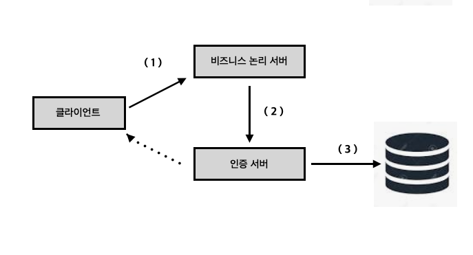

1. 클라이언트가 비즈니스 논리 서버가 노출하는 엔드포인트를 호출한다.
2. 비즈니스 논리 서버는 클라이언트를 위해 백엔드를 구현하고 필요할 때 인증 서버를 호출하여 사용자를 인증한다.
3. 인증 서버는 사용자 세부 정보를 자체 데이터베이스에 저장하고 인중 중에 사용자를 인증하고 SMS 메세지를 통해 OTP 를 전송한다.

위의 시나리오에서는 SMS 메세지를 통해 OTP 를 전송한다고 했지만 OTP를 전송하기 위해 SMS 메세지를 사용하지는 않는다. 많은 서비스에서 SMS로 클라이언트에게 OTP를 전송하기 때문에 시나리오에서 저렇게 작성한 것 같고 SMS로 OTP를 전송하고 싶다면 따로 구현해야한다.

### 시나리오 2 ) 클라이언트가 비즈니스 로직 서버에게 OTP 코드와 사용자 이름을 보내고 토큰을 발급받는다. 

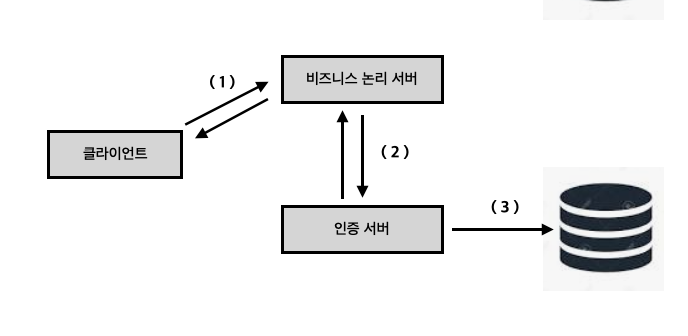

1. 클라이언트는 비즈니스 로직에 인증을 위해 OTP와 사용자 이름을 보낸다.
2. 비즈니스 논리 서버는 인증 서버를 호출해 OTP를 검증한다.
3. 클라이언트가 보낸 OTP 및 사용자 이름을 인증 서버가 유효하다고 판단하면 클라이언트에게 토큰을 발급하고 이 토큰을 사용해 클라이언트는 비즈니스 논리 서버의 엔드포인트를 호출할 수 있다.

위의 시나리오에서 말하는 토큰은 액세스 카드와 비슷하다. 쉽게 말하자면 토큰은 애플리케이션의 리소스에 접근하기 위해서 필요한 액세스 카드로 로그인 시 서버는 클라이언트에게 토큰을 발급해주고 클라이언트는 비즈니스 로직의 리소스에 접근하기 위해 토큰을 사용하는데 이 토큰은 HTTP 헤더를 통해 보내는 문자열이다. 토큰은 순수 UUID(범용 고유 식별자)처럼 단순할 수도 있고 JWT(JSON 웹 토큰)처럼 복잡한 형식일 수도 있다.

## 클라이언트가 토큰을 발급받는 기본적인 흐름

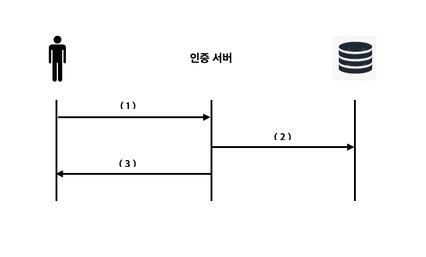

1. 클라이언트는 인증 서버에게 자격 증명으로 인증받는다.
2. 인증 서버는 자격증명을 받아 토큰을 생성하고 데이터베이스에 저장한다.
3. 애플리케이션이 클라이언트에게 토큰을 반환한다.

## 클라이언트가 토큰을 사용하는 기본적인 흐름

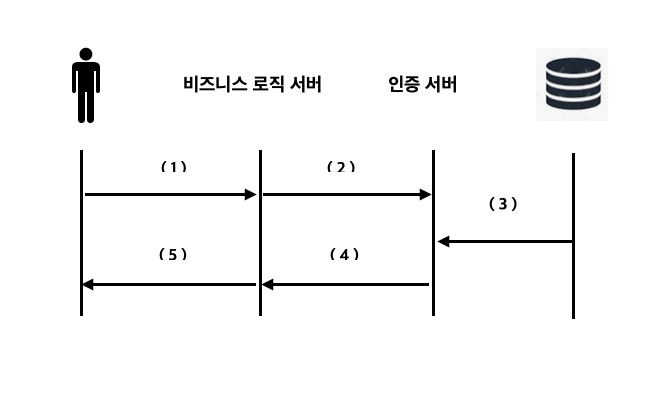

1. 클라이언트는 인증 서버에게 받은 토큰을 HTTP 헤더에 담아 비즈니스 로직 서버의 리소스에 접근 요청을 보낸다.
2. 비즈니스 로직은 클라이언트에게 받은 토큰을 검증하기 위해 인증서버에 검증 요청을 보낸다.
3. 인증 서버는 데이터베이스에 저장되어있는 토큰 정보를 통해 요청으로 받은 토큰을 검증한다.
4. 인증 서버는 토큰의 검증여부를 비즈니스 로직 서버에 전달한다.
5. 비즈니스 로직 서버는 인증 서버가 토큰을 유효한 토큰이라고 판단한 경우 리소스에 접근할 수 있는 권한을 주고 유효하지 토큰이라고 판단한 경우 클라이언트의 리소스 접근을 거부한다.


왜 기존에 사용하던 인증과 권한부여 흐름을 더 복잡하게 만듦에도 불구하고 토큰을 사용해 인증 및 권한 부여 로직을 구현하는 것일까? 그 이유는 토큰을 사용했을 때 얻을 수 있는 장점때문이다.

## 토큰 사용의 장점
1. HTTP Basic 방식을 사용했을 떄와 같이 매번 자격증명을 공유할 필요가 없다.
2. 세션을 이용한 방식보다 확장성이 좋다.
3. 토큰은 세션처럼 사용자의 정보를 저장하고 사용할 수 있다.

위에 적은 토큰 사용시 얻을 수 있는 장점 이외에도 많은 장점이 있다. 이번 기회에 잘 공부해두도록 하자.

# 인증 서버 구현하기

우리는 유저의 정보를 받아서 유저를 등록하고 또 유저를 인증하고 발급한 OTP를 검증해줄 인증 서버를 구현할 것이다. 아래는 우리가 구현할 인증서버가 구현할 엔드포인트들이다.

1. /user/add : 나중에 구현을 테스트하기 위해 사용자를 추가한다.
2. /user/auth : 사용자를 인증하고 OTP를 반환한다. 
3. /otp/check : OTP 값이 인증 서버가 특정 사용자를 위해 이전에 생성한 값인지 확인한다.

우리가 지금 구현할 인증서버는 데이터베이스에 유저 정보와 생성한 OTP 정보를 넣어야하기때문에 아래의 종속성을 추가해줘야한다.

```gradle
dependencies {
	implementation 'org.springframework.boot:spring-boot-starter-data-jdbc'
	implementation 'org.springframework.boot:spring-boot-starter-data-jpa'
	implementation 'org.springframework.boot:spring-boot-starter-security'
	implementation 'org.springframework.boot:spring-boot-starter-web'
	compileOnly 'org.projectlombok:lombok'
	runtimeOnly 'mysql:mysql-connector-java'
	annotationProcessor 'org.projectlombok:lombok'
	testImplementation 'org.springframework.boot:spring-boot-starter-test'
	testImplementation 'org.springframework.security:spring-security-test'
}
```
위는 내가 인증서버를 구현한 스프링 부트 프로젝트의 추가한 dependencies 들인데 필요한 것들은 따로 추가하자.

또 데이터베이스 설정을 application.yml에 작성하고 이전의 챕터에서와 마찬가지로 SecurityCOnfig 클래스를 작성하자. 

- SecurityConfig
```java
@Configuration
public class SecurityConfig extends WebSecurityConfigurerAdapter {

    @Bean
    public PasswordEncoder passwordEncoder(){
        return new BCryptPasswordEncoder();
    }

    @Override
    protected void configure(HttpSecurity http) throws Exception {
        http.csrf().disable();
        http.authorizeRequests().anyRequest().permitAll();
    }
}
```

- application.yml

```yml
spring:
  datasource:
    url: jdbc:mysql://localhost/chap11
    username: root
    password: tlawjdgns1!


  jpa:
    database: mysql
    database-platform: org.hibernate.dialect.MySQL5Dialect
    show-sql: true
    generate-ddl: true

    hibernate:
      ddl-auto: update

    properties:
      hibernate:
        format_sql: true

```

여기까지 작성했다면 이제 모든 준비가 끝났다. 이제 도메인 클래스를 작성하자.

## 인증서버 User, Otp 클래스 작성하기
우리는 유저 정보와 생선한 OTP 정보를 데이터베이스에 저장해야한다. 그러기 위해서 우리는 Entity 클래스를 작성해야하는데 이번엔 테스트만을 위한 인증 서버를 구현할 것이므로 간단하게 작성해보자.

### User 클래스

```java
@Setter
@Getter
@Entity
public class User {
    @Id
    private String username;
    private String password;
}


public interface UserRepository extends JpaRepository<User, String> {
    Optional<User> findUserByUsername(String username);
}

@Service
@Transactional
public class UserService {
    @Autowired
    private PasswordEncoder passwordEncoder;

    @Autowired
    private UserRepository userRepository;

    @Autowired
    private OtpRepository otpRepository;

    public void addUser(User user){
        user.setPassword(passwordEncoder.encode(user.getPassword()));
        userRepository.save(user);
    }

    public void auth(User user){
        // 데이터베이스 내의 요청으로 받은 username과 같은 username을 가진 유저정보가 있는지 확인
        Optional<User> o = userRepository.findUserByUsername(user.getUsername());

        // 데이터베이스 내에 같은 username을 가진 유저가 있어 해당 유저의 정보를 가져왔을 경우
        if(o.isPresent()){
            User u = o.get();
            if (passwordEncoder.matches(
                    user.getPassword(),
                    u.getPassword()
            )){
                // OTP 생성 및 OTP 정보를 데이터베이스 내에 저장
                renewOtp(u);
            } else {
                // 데이터베이스 내에 같은 username을 가진 유저의 Password가 요청으로 들어온 password가 일치하지 않은경우
                // BadCredentialsException 예외 발생
                throw new BadCredentialsException("Bad credentials");
            }
        } else {
            // 데이터베이스 내에 같은 username을 가진 유저가 없을 경우
            // BadCredentialsException 예외 발생
            throw new BadCredentialsException("Bad credentials");
        }
    }

    public void renewOtp(User u){
        // GenerateCodeUtil 클래스의 generateCode() 메서드를 통해 4자리 OTP 인증번호를 생성함
        String code = GenerateCodeUtil.generateCode();

        // 데이터베이스 내에 요청으로 들어온 username의 값을 가지는 OTP 값을 가져옴
        // 없을 경우 null 있을경우 Otp 클래스 객체가 반환 
        Optional<Otp> userOtp = otpRepository.findOtpByUsername(u.getUsername());
        // userOtp 에 Otp 클래스 객체가 저장되었을 경우
        if (userOtp.isPresent()){
            // 새로 생성한 Otp 인증번호로 Otp 정보를 업데이트
            Otp otp = userOtp.get();
            otp.setCode(code);
        } else {
            // null이 반환된 경우 새로 Otp 클래스를 생성한 후 저장
            Otp otp = new Otp();
            otp.setUsername(u.getUsername());
            otp.setCode(code);
            otpRepository.save(otp);
        }
    }


    public boolean check(Otp otpToValidate) {
        // Otp 정보를 받아 데이터베이스에 otpToValidate 객체의 username 값을 가진 데이터가 있는지 확인
        // 있을지 Otp 객체가 반환, 없다면 null
        Optional<Otp> userOtp = otpRepository.findOtpByUsername(otpToValidate.getUsername());

        // Otp 객체가 반환되었다면 Otp 인증번호가 일치하는지 확인 
        // 일치한다면 true, 일치하지 않는다면 false 반환
        if (userOtp.isPresent()){
            Otp otp = userOtp.get();
            if (otpToValidate.getCode().equals(otp.getCode())){
                return true;
            }
        }

        return false;
    }
}
```

유저 정보를 담을 User 엔티티 클래스와 UserRepository, UserService 클래스를 작성했다. UserService의 addUser() 메서드를 통해 인증 서버는 유저 정보를 받아 데이터베이스에 유저 정보를 저장할 것이다. 그렇다면 이제 OTP 생성을 위한 OTP 엔티티 클래스를 작성하자. 


### OTP 클래스

```java
@Getter
@Setter
@Entity
public class Otp {
    @Id
    private String username;
    private String code;
}

public interface OtpRepository extends JpaRepository<Otp, String> {
    Optional<Otp> findOtpByUsername(String username);
}
```

Otp 정보를 담을 Otp 엔티티 클래스와 OtpRepository 인터페이스를 작성했다. Otp 를 저장하고 찾는 코드들은 UserService 클래스에 작성되어있어 엄청 간단하게만 작성되었다. 그리고 Otp 코드를 생성해줄 final 클래스인 GenerateCodeUtil 이라는 클래스도 작성해야한다.

```java
@NoArgsConstructor
public final class GenerateCodeUtil {

    public static String generateCode(){
        String code;

        try {
            SecureRandom random = SecureRandom.getInstanceStrong();

            int c = random.nextInt(9000)+ 1000;
            code = String.valueOf(c);
        } catch (NoSuchAlgorithmException e){
            throw new RuntimeException("Problem when generating the random code.");
        }
        return code;
    }
}
```
이제 OTP로 사용할 숫자 4자리를 자동으로 생성해줄 GenerateCodeUtil 클래스까지 작성되었다. 지금까지 작성된 메서드들과 클래스들을 사용해서 어플리케이션의 컨트롤러에 포함할 논리를 작성하자. 

```java
@RestController
public class AuthController {
    @Autowired
    private UserService userService;

    @RequestMapping(value = "/user/add", method = RequestMethod.POST)
    public void addUser(@RequestBody User user){
        userService.addUser(user);
    }

    @RequestMapping(value = "/user/auth", method = RequestMethod.POST)
    public void auth(@RequestBody User user){
        userService.auth(user);
    }

    @RequestMapping(value = "/otp/check", method = RequestMethod.POST)
    public void addUser(@RequestBody Otp otp, HttpServletResponse response){
        if (userService.check(otp)){
            response.setStatus(HttpServletResponse.SC_OK);
        } else {
            response.setStatus(HttpServletResponse.SC_FORBIDDEN);
        }

    }
}
```

지금까지 작성된 코드들은 별로 어려울게 없다. 인증서버와 비즈니스 로직 서버를 따로 구현했기때문에 저번 프로젝트보다 어렵다고 생각할 수 있지만 작성된 코드를 보면 그렇게 어렵지 않다는 것을 금방 알 수 있을 것이다. 여기까지 코드를 잘 작성했다면 인증서버는 구현을 마친 것이다. 인증 서버가 잘 작동하는지 테스트를 한 후 비즈니스 로직 서버 구현으로 넘어가 보자.

## 인증서버 테스트

- /user/add

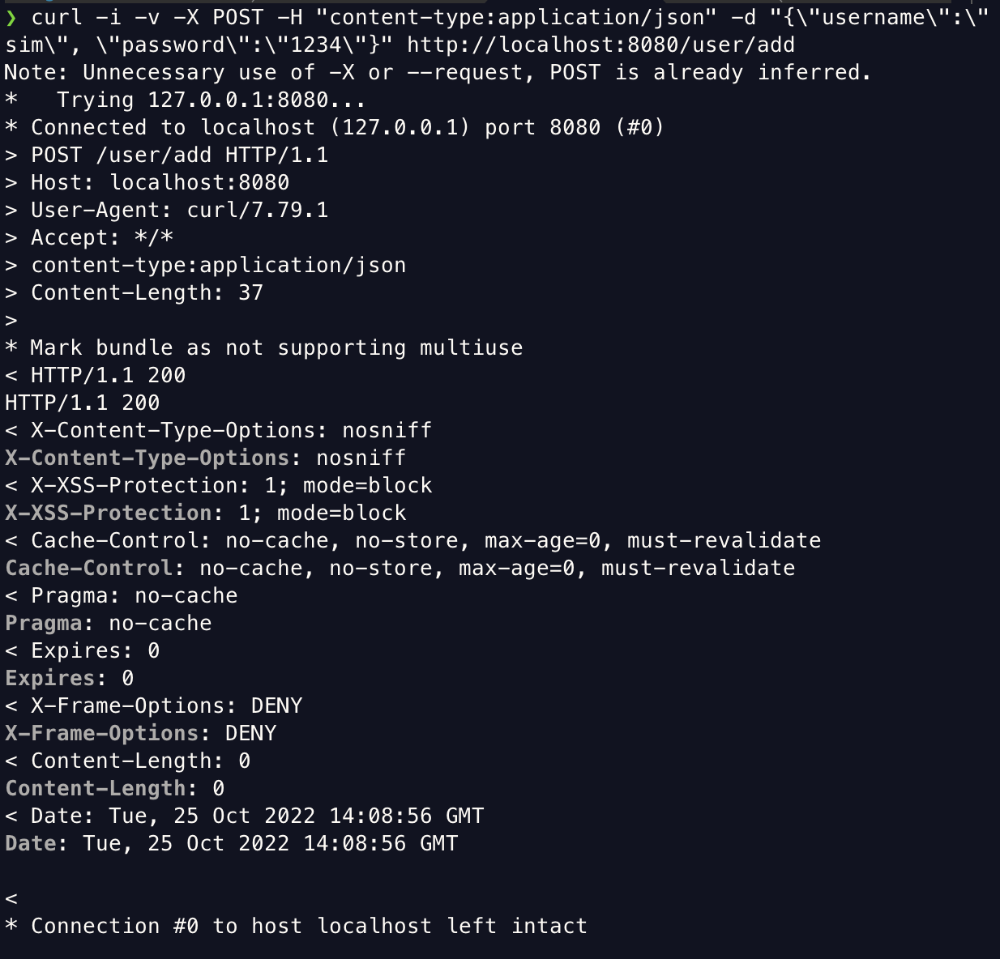

- /user/auth

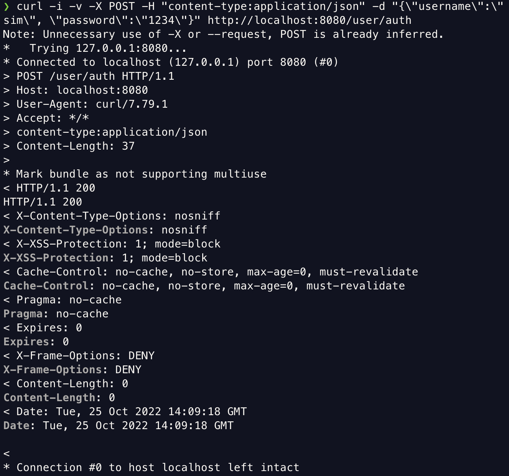

- user 테이블과 otp 테이블 데이터 정보

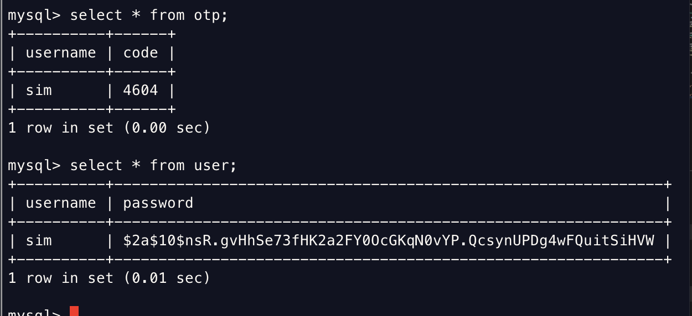

정상적으로 username 이 sim 이고 password 가 1234인 유저가 생성되었고 otp도 정상적으로 생성되었다. 마지막으로 생성된 otp 정보를 가지고 /otp/check 엔드포인트 또한 정상적으로 동작하는지 확인해보자.

- /otp/check

1. 맞는 OTP 인증번호를 입력한 경우

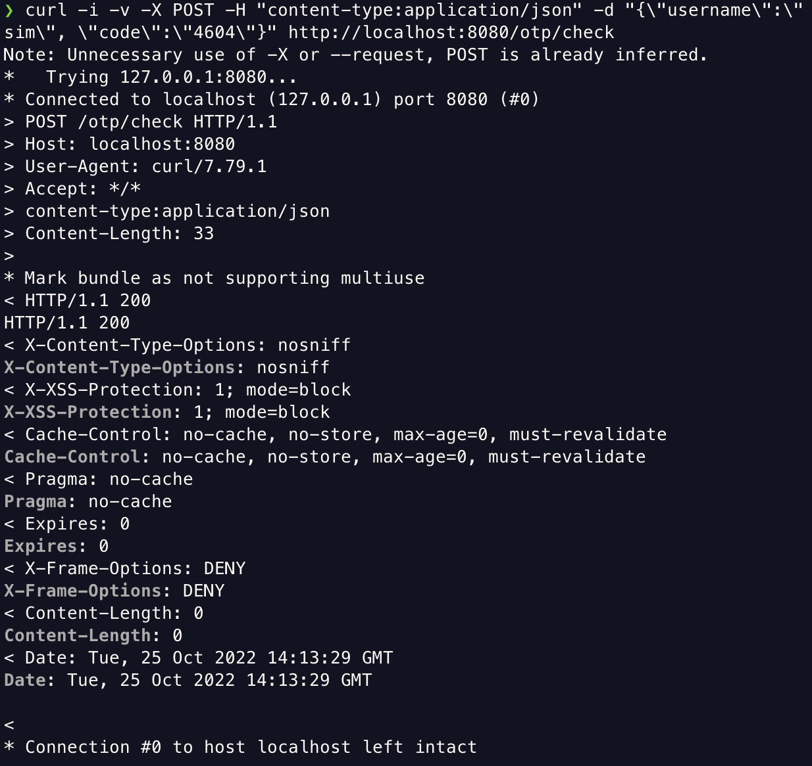

2. 맞지않는 OTP 인증번호를 입력한 경우

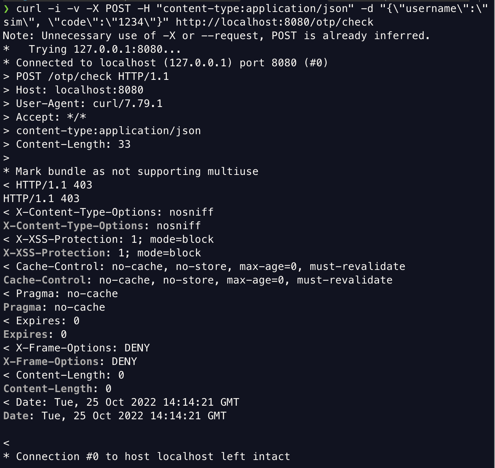

이렇게 맞는 otp 인증번호를 입력한 경우에는 엔드포인트에 대한 접근을 허용해주고 맞지 않는 경우 엔드포인트에 대한 접근을 거부하는 것을 확인할 수 있다. 이제 인증 서버는 잘 구현했기떄문에 비즈니스 로직 서버 구현으로 넘어가자.


# 비즈니스 로직 서버 구현하기

비즈니스 로직 서버는 username과 otp 인증번호와 함께 요청을 보냈을 때 데이터베이스 안의 정보와 일치한다면 클라이언트에게 JWT토큰을 발급할 수 있게 코드를 작성해야한다. 또 클라이언트가 JWT 토큰과 함께 요청을 보내면 해당 유저의 권한에 맞는 엔드포인트의 접근을 허용하도록 해야한다. 그렇다면 이제 비즈니스 로직 서버를 구현해보자.

## 비즈니스 로직 서버 스프링부트 프로젝트 세팅하기

- dependencies
```gradle
dependencies {
    implementation 'org.springframework.boot:spring-boot-starter-data-jdbc'
    implementation 'org.springframework.boot:spring-boot-starter-data-jpa'
    implementation 'org.springframework.boot:spring-boot-starter-security'
    implementation 'org.springframework.boot:spring-boot-starter-web'
    compileOnly 'org.projectlombok:lombok'
    runtimeOnly 'mysql:mysql-connector-java'
    annotationProcessor 'org.projectlombok:lombok'
    testImplementation 'org.springframework.boot:spring-boot-starter-test'
    testImplementation 'org.springframework.security:spring-security-test'

    // JWT 토큰을 위한 종속성 
    compileOnly('org.springframework.boot:spring-boot-starter-web')
    compileOnly('io.jsonwebtoken:jjwt-api:0.11.1')
    runtimeOnly('io.jsonwebtoken:jjwt-impl:0.11.1', 'io.jsonwebtoken:jjwt-jackson:0.11.1')
}
```

- application.yml
```yml
spring:
  datasource:
    url: jdbc:mysql://localhost/chap11
    username: root
    password: tlawjdgns1!

server:
  port : 9090

auth:
  server:
    base:
      url: http://localhost:8080

jwt:
  signing:
    key: ymLTU8rq83j4fmJZj60wh4OrMNuntIj4fmJ
```


## 인증 서버와 비즈니스 로직 서버의 인증 과정 정리하기

### OTP 토큰 발급받기


1. 클라이언트는 인증 서버에게 자격 증명으로 인증받는다.
2. 인증 서버는 자격증명을 받아 OTP를 생성하고 데이터베이스에 저장한다.
3. 애플리케이션이 클라이언트에게 OTP 값을 반환한다.

## JWT 토큰 발급받기


1. 클라이언트는 인증 서버에게 받은 OTP와 username을 비즈니스 로직 서버에 보낸다.
2. 비즈니스 로직은 클라이언트에게 받은 OTP을 검증하기 위해 인증서버에 OTP 검증 요청을 보낸다.
3. 인증 서버는 데이터베이스에 저장되어있는 OTP 정보를 통해 요청으로 받은 OTP을 검증한다.
4. 인증 서버는 OTP의 검증결과를 비즈니스 로직 서버에 전달한다.
5. OTP의 검증결과가 참이라면 클라이언트에게 JWT토큰을 생성한 후 반환한다.

## JWT 토큰을 사용해 비즈니스 로직 서버의 엔드포인트에 접근하기

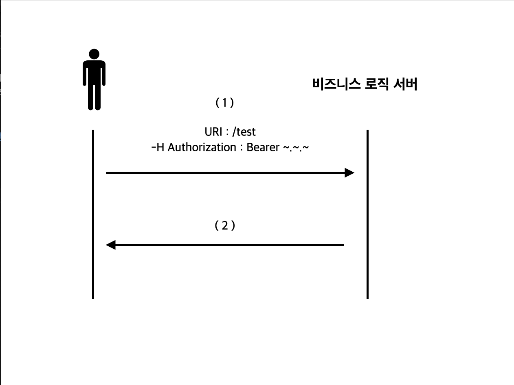

1. JWT 토큰을 Authorization 헤더에 담아 /test 로 요청을 보낸다.
2. JWT 토큰을 통해 유저의 정보를 가져온 후 해당 유저가 /test 에 접근이 가능하면 요청에 맞는 응답을 해주고 접근이 가능하지 않다면 403 응답코드를 반환한다.


사실 여기까지 처음보면 너무 복잡해서 머리가 아픈 내용이다. 지금까지 했던 것들을 간단하게 얘기해보자면 인증 서버에서 유저의 생성 및 OTP 생성을 하는 역할을 할 수 있도록 코드로 구현해준게 전부다. 이번 챕터에서 메인은 비즈니스 로직 서버의 구현이며 어떻게 클라이언트에게 JWT 토큰을 발급하며 JWT 토큰을 유저 검증에 사용하는지이다. 이 부분의 코드를 작성하면서 우리는 맞춤 필터를 만들것이며 이 다음의 내용이다. 너무 어렵게만 생각하지말고 천천히 이해해가보자.


## 인증 로직 구현하기 

우리가 지금 구현하려고하는 인증 로직은 꽤나 복잡해졌기때문에 기존의 우리가 사용하던 HTTP Basic 인증은 적합하지 않다. 그렇기 때문에 복잡해진 우리의 인증 로직을 구현하기 위해서 맞춤 필터 및 인증 공급자를 구현해야 한다. 당연하게도 우리의 인증로직을 구현하기 위한 맞춤 필터와 인증 공급자를 구현하는 여러가지 방법들 중에서 하나를 선택해야한다. 어떤 방법이 좋을지 생각해보자.

### 맞춤형 필터와 인증 공급자 구현 방법

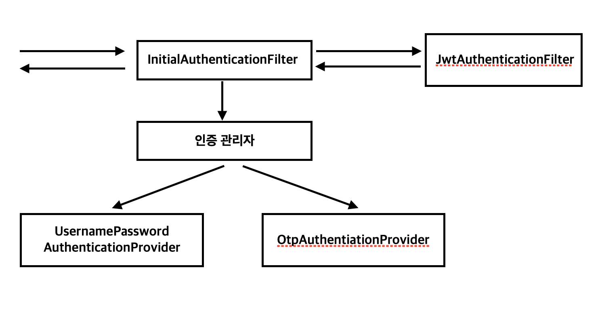

우리는 2개의 맞춤형 Authentication 객체와 2개의 AuthenticationProvider를 구현할 것이다. 아래의 이미지와 같이 우선 우리가 인증로직을 구현할 수 있는 방법은 3개의 Authentication 객체와 3개의 AuthenticationProvider 객체 1개의 맞춤형 필터를 정의하고 AuthenticationManager를 이용해 이들 객체에 위임하는 방법도 있지만 교재에 위의 방식으로 작성되어있기때문에 위의 방법으로 코드를 작성하고 나중에 아래의 방법은 따로 해보는 걸로 하자.


- 3개의 Authentication 객체와 3개의 AuthenticationProvider 객체 1개의 맞춤형 필터를 정의하고 AuthenticationManager를 이용해 이들 객체에 위임하는 방법

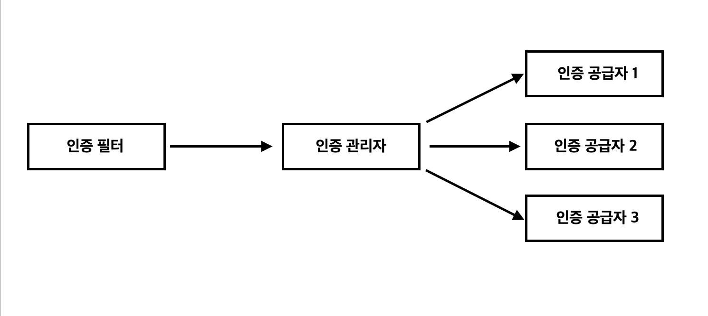


### Authentication 객체 구현하기

이제 UsernamePasswordAuthenticationProvider와 OtpAuthenticationProvider가 username과 password를 담아 인증에 사용할 Authentication 객체와 OTP 정보를 담아 인증에 사용할 Authentication 객체를 구현해야 한다.

우선 username과 password 정보를 담아줄 UsernamePasswordAuthentication 코드를 작성해보자.

- UsernamePasswordAuthentication
```java
public class UsernamePasswordAuthentication extends UsernamePasswordAuthenticationToken {

    // 1번
    public UsernamePasswordAuthentication(Object principal,
                                          Object credentials,
                                          Collection<? extends GrantedAuthority> authorities ){
        super(principal, credentials, authorities);

    }

    // 2번
    public UsernamePasswordAuthentication(Object principal, Object credentials) {
        super(principal, credentials);
    }
}
```

UsernamePasswordAuthentication의 매개변수 종류가 다른 생성자가 두개 있는데 이 두 생성자의 차이를 알아야한다. 우선 Collection<? extends GrantedAuthority> authorities 가 매개변수로 들어간 생성자는 인증을 마쳤음을 의미한다. 1번 생성자는 인증을 마친 UsernamePasswordAuthentication 객체를 생성할 때 사용하고 2번 생성자는 인증을 마치기 전 UsernamePasswordAuthentication 객체를 생성할 때 사용한다.

이제 OTP 정보를 담아줄 OtpAuthentication 코드를 작성해보자.

- OtpAuthentication

```java
public class OtpAuthentication extends UsernamePasswordAuthenticationToken {
    // 1번
    public OtpAuthentication(Object principal, Object credentials){
        super(principal, credentials);
    }

    // 2번
    public OtpAuthentication(Object principal, Object credentials, Collection<? extends GrantedAuthority> authorities){
        super(principal, credentials, authorities);
    }
}
```

OtpAuthentication도 UsernamePasswordAuthentication와 마찬가지로 1번 생성자와 2번 생성자의 차이에 주목하자. 1번 생성자는 인증을 마치기 전 OtpAuthentication 객체를 생성할 때 사용하고, 2번 생성자는 인증을 마친 OtpAuthentication 객체를 생성할 때 사용한다.

### 인증 서버에 대한 프락시 구현

비즈니스 로직 서버에서는 클라이언트에게서 받은 username과 otp 정보를 인증 서버로 보내 클라이언트에게서 받은 otp의 검증해야하기떄문에 비즈니스 로직 서버가 username과 otp 정보를 인증 서버로 보내야 한다. 그러기 위해서 인증 서버에 대한 프락시를 구현해보자.

인증 서버에 대한 프락시를 구현하기 위해서 아래의 작업을 해줘야한다.
1. 인증 서버가 노출하는 REST 서비스를 호출하는 데 이용할 모델 클래스 User를 정의한다.
2. 인증 서버가 노출하는 REST 엔드포인트를 호출하는 데 이용할 RestTemplate 형식의 빈을 선언한다.
3. 사용자 이름/암호 인증과 사용자 이름/otp 인증을 수행하는 메서드 두 개를 정의하는 프락시 클래스를 구현한다.

1번부터 차례로 구현해보자. 

- 인증 서버가 노출하는 REST 서비스를 호출하는 데 이용할 모델 클래스 User를 정의하기

```java
@Setter
@Getter
public class User {
    private String username;
    private String password;
    private String code;
}

```

- 인증 서버가 노출하는 REST 엔드포인트를 호출하는 데 이용할 RestTemplate 형식의 빈을 선언하기

```java
@Configuration
public class ProjectConfig {
    @Bean
    public RestTemplate restTemplate(){
        return new RestTemplate();
    }
}

```

- 사용자 이름/암호 인증과 사용자 이름/otp 인증을 수행하는 메서드 두 개를 정의하는 프락시 클래스를 구현하기

```java
@Component
public class AuthenticationServerProxy {

    // projectConfig에서 빈으로 등록한 RestTemplate 의존성 주입
    @Autowired
    private RestTemplate rest;

    // application.yml 파일에서 가져옴
    @Value("${auth.server.base.url}")
    private String baseUrl;

    // /user/auth로 요청 보내기
    public void sendAuth(String username, String password){
        String url = baseUrl +"/user/auth";

        // User 객체에 usernam과 password 저장
        var body = new User();
        body.setUsername(username);
        body.setPassword(password);

        // http://localhost:8080/user/auth에 User정보 보내기
        var request = new HttpEntity<>(body);
        rest.postForEntity(url, request, Void.class);
    }


    // /user/add 요청 보내기
    public boolean sendOTP(String username, String code){
        String url = baseUrl + "/otp/check";

        // User 객체에 usernam과 OtpCode 저장
        var body = new User();
        body.setUsername(username);
        body.setCode(code);


        // http://localhost:8080/otp/check User정보 보내기
        var request = new HttpEntity<>(body);
        var response = rest.postForEntity(url ,request, Void.class);

        return response.getStatusCode().equals(HttpStatus.OK);
    }

}
```


여기까지 구현했다면 비즈니스 로직 서버에서 인증 서버로 요청을 보낼 준비까지 마쳤다. 여기까지 모두 마쳤다면 이제 인증 공급자, 위의 이미지에서 UsernamePasswordAuthenticationProvider와 OtpAuthenticationProvider를 구현해보자.

### AuthenticationProvider 구현하기

- UsernamePasswordAuthenticationProvider

```java
@Component
public class UsernamePasswordAuthenticationProvider implements AuthenticationProvider {

    @Autowired
    private AuthenticationServerProxy proxy;

    @Override
    public Authentication authenticate(Authentication authentication) throws AuthenticationException {
        // username과 password를 받아서 인증서버의 /user/auth로 요청을 보낸다.
        String username = authentication.getName();
        String password = String.valueOf(authentication.getCredentials());
        proxy.sendAuth(username, password);
        // UsernamePasswordAuthenticationToken 객체 반환
        return new UsernamePasswordAuthenticationToken(username, password);
    }

    @Override
    public boolean supports(Class<?> aClass) {
        return UsernamePasswordAuthentication.class.isAssignableFrom(aClass);
    }
}
```


- OtpAuthenticationProvider

```java
@Component
public class OtpAuthenticationProvider implements AuthenticationProvider {
    @Autowired
    private AuthenticationServerProxy proxy;

    @Override
    public Authentication authenticate(Authentication authentication) throws AuthenticationException {
        // username과 OTP code를 받아서 인증서버의 /otp/check로 요청을 보낸다.
        String username = authentication.getName();
        String code = String.valueOf(authentication.getCredentials());
        boolean result = proxy.sendOTP(username, code);

        // 결과가 참이라면 OtpAuthentication 객체를 생성 후 반환한다.
        if (result) {
            return new OtpAuthentication(username, code);
        } else {
            // 결과가 거짓이라면 BadCredentialsException 예외를 투척한다.
            throw new BadCredentialsException("Bad credentials.");
        }
    }

    @Override
    public boolean supports(Class<?> aClass) {
        return OtpAuthentication.class.isAssignableFrom(aClass);
    }
}
```

이렇게 맞춤형 AuthenticationProvider를 구현했다. 이제 요청을 가로채고 인증논리를 적용할 수 있도록 필터를 구현해보자.

### 필터 구현하기

우리는 클라이언트가 요청과 보냈을 때 요청과 함께 username과 password를 함께 보냈다면 UsernamePasswordAuthenticationProvider를, username과 code를 함께 보냈다면 OtpAuthenticationProvider를 통해 인증 논리를 사용하도록하는 필터를 구현해야한다.

```java
@Component
public class InitialAuthenticationFilter extends OncePerRequestFilter {

    @Autowired
    private AuthenticationManager manager;

    // application.yml에서 JWT 의 signing key를 가져온다.
    @Value("${jwt.signing.key}")
    private String signingKey;

    @Override
    protected void doFilterInternal(HttpServletRequest request, HttpServletResponse response, FilterChain filterChain) throws ServletException, IOException {
        // UsernamePasswordAuthenticationProvider와 OtpAuthenticationProvider 중 어떤 걸 사용해야 할 지 모르기때문에 username, password, code를 모두 request에서 값을 받아서 변수에 저장한다.
        String username = request.getHeader("username");
        String password = request.getHeader("password");
        String code = request.getHeader("code");

        // code가 요청과 함께 보내지지 않았다면
        if (code == null) {
            // UsernamePasswordAuthentication 객체를 받아 authenticate 메서드를 실행한다.  
            Authentication a = new UsernamePasswordAuthentication(username, password);
            manager.authenticate(a);
        } else {
            // OtpAuthentication 객체를 받아 authenticate 메서드를 실행한다.
            Authentication a = new OtpAuthentication(username, code);
            manager.authenticate(a);

            // username과 Otp code를 인증서버가 검증한 결과가 참이라면 JWT토큰을 생성한 후 Authorization 헤더에 담은 후 응답한다.
            SecretKey key = Keys.hmacShaKeyFor(signingKey.getBytes(StandardCharsets.UTF_8));
            String jwt = Jwts.builder()
                    .setClaims(Map.of("username", username))
                    .signWith(key)
                    .compact();
            response.setHeader("Authorization", jwt);
        }

    }

    // /login 을 제외한 다른 요청에는 해당 필터를 실행하지 않는다.
    @Override
    protected boolean shouldNotFilter(HttpServletRequest request) {
        return !request.getServletPath().equals("/login");
    }
}
```

여기까지 했다면 /login으로 온 모든 요청은 InitialAuthenticationFilter 필터가 가로채 유저에 대한 인증 처리를 할 것 이다. 필터, 인증 공급자, Authentication 객체 등 여러가지 코드를 작성했지만 아직 끝나지 않았다. 그 이유는 JWT 토큰을 InitialAuthenticationFilter가 인증을 마친 유저에게 Authorization 헤더에 담은 후에 반환해주겠지만 이 JWT 토큰을 통해 유저의 권한을 확인해 엔드포인트의 접근을 허용하거나 거부해줘야 하는데 아직 그 부분에 대한 코드를 작성해주지 않았기 때문이다.

이제 클라이언트의 요청의 Authorization 헤더에 담긴 JWT 토큰을 확인해줄 필터를 구현할 것이다. 이 필터는 /login이 아닌 모든 엔드포인트에 적용되어 JWT 토큰을 확인한 후에 시큐리티 컨텍스트에 인증된 Authentication 객체를 저장한다.

- JwtAuthenticationFilter

```java
@Component
public class JwtAuthenticationFilter extends OncePerRequestFilter {

    // application.yml에서 JWT 의 signing key를 가져온다.
    @Value("${jwt.signing.key}")
    private String signingKey;

    @Override
    protected void doFilterInternal(HttpServletRequest request, HttpServletResponse response, FilterChain filterChain) throws ServletException, IOException {
        // Authorization 헤더에 담긴 JWT 토큰 값을 jwt 변수에 저장한다.
        String jwt = request.getHeader("Authorization");


        SecretKey key = Keys.hmacShaKeyFor(signingKey.getBytes(StandardCharsets.UTF_8));
        Claims claims = Jwts.parserBuilder()
                .setSigningKey(key)
                .build()
                .parseClaimsJws(jwt)
                .getBody();

        // JWT 토큰의 claims에 있는 username 값을 username 변수에 저장
        String username = String.valueOf(claims.get("username"));

        GrantedAuthority a = new SimpleGrantedAuthority("user");

        // 인증된 Authentication 객체 생성
        var auth = new UsernamePasswordAuthentication(username, null, List.of(a));
        // 시큐리티 컨텍스트에 인증된 Authentication 객체 저장
        SecurityContextHolder.getContext().setAuthentication(auth);

        filterChain.doFilter(request, response);
    }

    // /login 이 아닌 모든 요청에 적용
    @Override
    protected boolean shouldNotFilter(HttpServletRequest request) {
        return request.getServletPath().equals("/login");
    }
}
```

이제 비즈니스 로직 서버 프로젝트에 지금까지 만들었던 모든 코드들을 적용하기 위해서 WebSecurityConfigurerAdapter를 구현하는 SecurityConfig 클래스를 작성해보자.

```java
@Configuration
public class SecurityConfig extends WebSecurityConfigurerAdapter {

    @Autowired
    private InitialAuthenticationFilter initialAuthenticationFilter;

    @Autowired
    private JwtAuthenticationFilter jwtAuthenticationFilter;

    @Autowired
    private OtpAuthenticationProvider otpAuthenticationProvider;

    @Autowired
    private UsernamePasswordAuthenticationProvider usernamePasswordAuthenticationProvider;

    // otpAuthenticationProvider와 authenticationProvider를 authenticationProvider로 등록
    @Override
    protected void configure(AuthenticationManagerBuilder auth) {
        auth.authenticationProvider(otpAuthenticationProvider)
                .authenticationProvider(usernamePasswordAuthenticationProvider);
    }

    @Override
    protected void configure(HttpSecurity http) throws Exception {
        http.csrf().disable();

        // BasicAuthenticationFilter 위치에 initialAuthenticationFilter 필터를 생성
        http.addFilterAt(
                        initialAuthenticationFilter,
                        BasicAuthenticationFilter.class)
                // BasicAuthenticationFilter 다음 위치에 jwtAuthenticationFilter 필터를 생성
                .addFilterAfter(
                        jwtAuthenticationFilter,
                        BasicAuthenticationFilter.class);

        http.authorizeRequests()
                .anyRequest().authenticated();
    }

    @Override
    @Bean
    protected AuthenticationManager authenticationManager() throws Exception {
        return super.authenticationManager();
    }
}
```

이제 인증 서버와 비즈니스 로직 서버를 다른 포트로 실행한 후 테스트하면 정상적으로 동작하는 것을 확인할 수 있을 것이다. 이렇게 볼륨이 커질 줄 몰랐지만 인증 서버와 비즈니스 로직 서버를 구분해 사용하고 JWT 토큰도 한 번 사용해봄으로써 대략적으로 스프링 시큐리티 11장의 내용에 대해서 정리한 것 같다. 