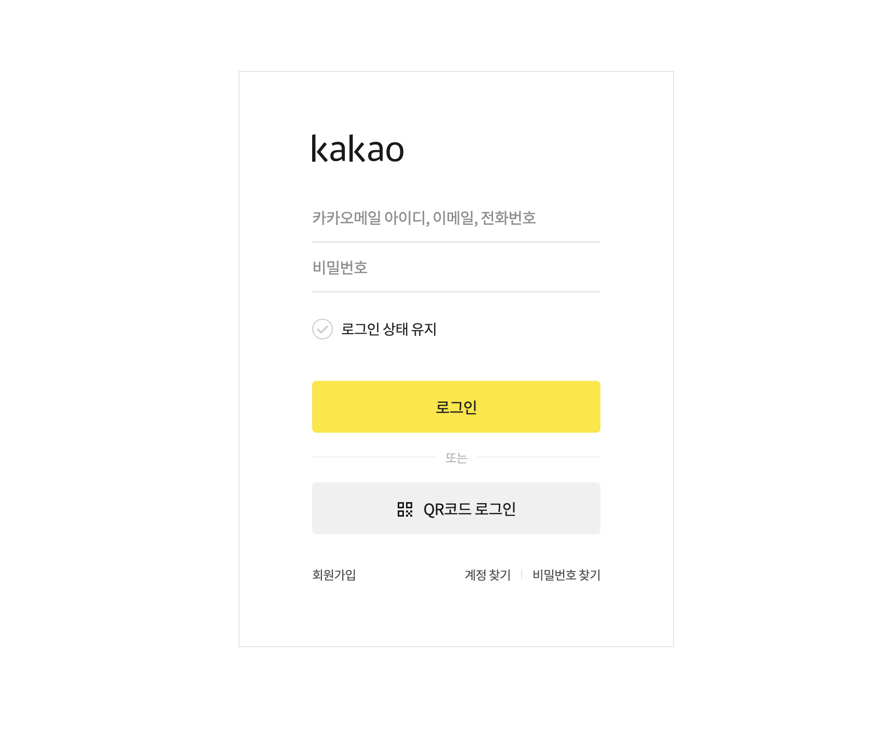
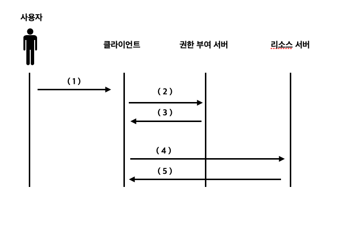
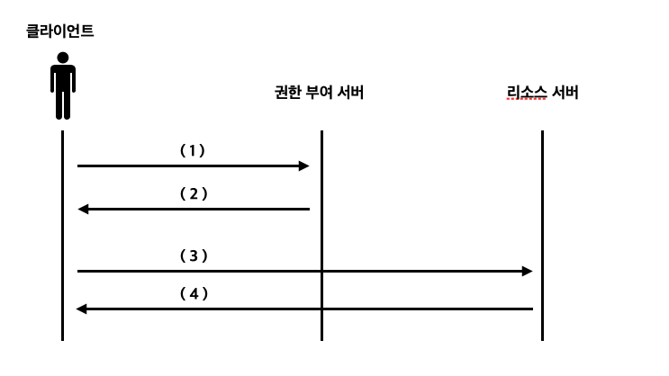
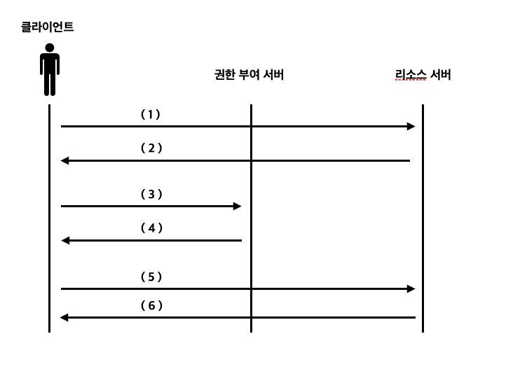
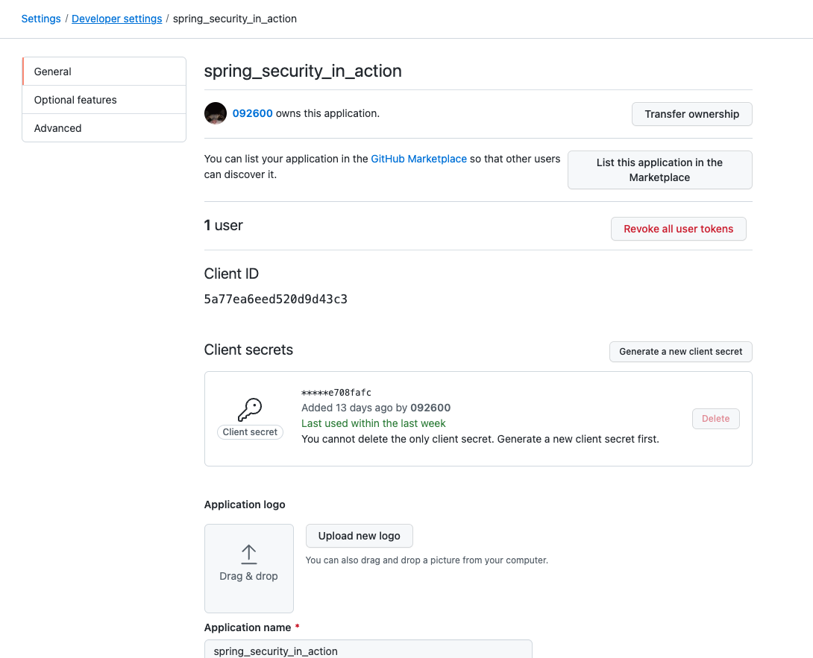
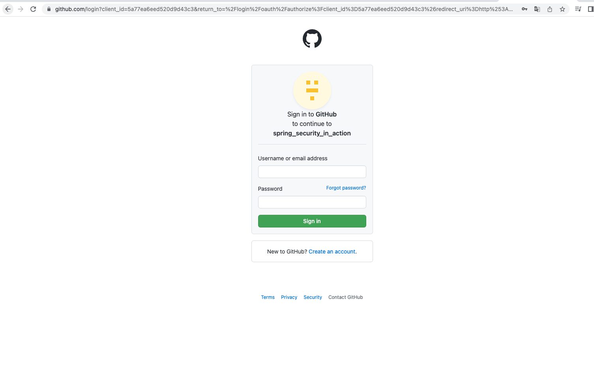
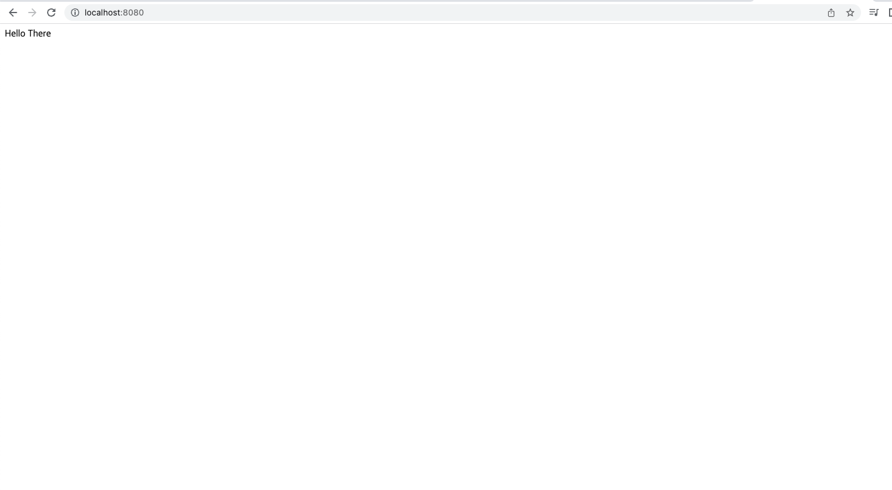

<br>

- 스프링 시큐리티 인 액션을 읽고 내용을 정리한 파일입니다.

<br>
<br>
<br>

# OAuth2가 작동하는 방법

따로 개인 프로젝트를 하면서 구글 로그인, 네이버 로그인 등 타 웹사이트나 웹이 리소스에 접근할 수 있도록 하는 기능을 구현해 본 적이 있다. 
사실 구현해봤다기보다 코드를 복사 붙여넣기한 정도에 가깝지만 말이다. 이 과정에서 OAuth2-Client 종속성을 추가해 사용했는데 내부에서 어떻게 동작하는지 궁금했는데
스프링 시큐리티 인 액션의 12장부터 14장까지의 내용을 이해하기만 해도 어느정도 OAuth2가 어떻게 동작하는지에 대한 기본적인 지식은 얻을 수 있을 것 같다.

<br>
<br>
<br>

# OAuth2 프레임워크란

OAuth2는 권한 부여 프레임워크 또는 사양 프레임워크라고 부르는 경우가 많으며 위임 프로토콜이라고도 부르기도 한다. 어떻게불러도 상관은 없지만 OAuth2가 라이브러리가 아니라는 점에 주목하도록 하자.
OAuth2가 좋은 이유 혹은 필요한 이유에 대해서 말하기 위해 앞장에서 많이 사용한 HTTP Basic 예제를 생각해보자. HTTP Basic을 사용한 인증 방법은 몇 가지의 문제가 있었다.

- HTTP Basic 인증 방식의 문제
1. 모든 요청에 자격증명을 보내야 한다.
2. 클라이언트가 자격증명을 가지고 있어야 한다.

이렇게 매번 자격증명을 보내야하거나 클라이언트가 자격증명을 가지고 있도록 하는 것은 보안상 좋지 않은데 매번 자격증명을 보내야 한다는 것은 요청 과정에서 클라이언트의 자격증명 정보가 노출되기 때문에 보안에 취약하다라는 문제점이 있으며 클라이언트가 자격증명을 가지고 있어야 한다라는 문제점도 마찬가지로 보안에 취약하다라는 문제점이 있다. OAuth2 프레임워크를 사용하면 HTTP Basic을 사용했을때 생기는 문제를 해결하고 아키텍쳐를 간소화하며 유지 관리도 쉬워진다는 이점을 가질 수 있다. 어떻게 OAuth2를 통해 위의 문제를 해결하는지 앞으로의 예제를 통해 공부해보자.


## OAuth2 인증 아키텍쳐의 구성 요소

OAuth2의 구성 요소는 아래의 4가지를 포함한다.

1. 리소스 서버
2. 사용자
3. 클라이언트
3. 권한 부여 서버

리소스 서버는 11장에서 공부했던 비즈니스 로직 서버와 같다. 리소스 서버를 통해 사용자는 사용자가 원하는 데이터를 가져오거나 사용자가 원하는 작업을 할 수 있다. 사용자와 클라이언트는 구분되는데 사용자는 사람, 클라이언트는 사용자의 핸드폰 혹은 컴퓨터라고 생각하면 좀 더 쉬울 것 같다. 권한 부여 서버는 클라이언트가 리소스 서버가 노출하는 사용자의 리소스에 접근할 권한을 부여하는 애플리케이션이다. 11장에서의 인증 서버라고 생각하자. 인증 서버가 클라이언트가 사용자 대신 리소스에 접근할 권한이 있다고 판단하면 토큰을 발급해준다. 리소스 서버는 클라이언트가 요청과 함꼐 보낸 토큰이 유효하다면 클라이언트에게 해당 리소스에 접근을 허용해준다.

## OAuth2 구현 방법

OAuth2가 어떤 구성요소를 가지고 있는지는 대충 알았기때문에 OAuth2가 어떻게 인증과 권한 부여를 구현하는지 알아보자.
OAuth2를 이용한다는 것은 권한 부여에 토큰을 이용한다는 의미이다. 11장에서 JWT토큰을 사용했던 것을 떠올려보자. OAuth2는 그랜트(grant)라고 하는 토큰을 얻는 여러 방법을 제공하는데 아래의 4가지는 가장 일반적인 OAuth2 그랜트 유형이다.

1. 승인 코드
2. 암호
3. 갱신 토큰
4. 클라이언트 자격 증명

위의 4가지 방식은 클라이언트에게 토큰을 발급하는 여려가지 방법으로 프로젝트의 성격에 맞게 알맞은 그랜트 유형을 사용하는 것이 좋다.


### 승인 코드 그랜트 유형 

승인 코드 그랜트 유형은 아래의 3가지 단계를 거쳐 작동한다.

1. 인증 요청을 보낸다.
2. 액세스 토큰을 받는다.
3. 보호된 리소스에 접근한다.

글만 보면 이해가 잘 가지 않기때문에 각 단계를 자세하게 알아보자.

### 인증 요청 보내기

클라이언트는 사용자가 인증해야 하는 권한 부여 서버의 엔드포인트로 사용자를 리다이렉션한다. 무신사에서 카카오톡으로 로그인하기 버튼을 눌렀을 때 넘어가는 페이지를 생각해보자.



우리는 무신사라는 홈페이지의 리소스에 접근하기 위해서 로그인을 해야한다. 만약 무신사 아이디가 없어 카카오톡으로 로그인 하기 위해 카카오톡 로그인 버튼을 눌렀을 때 무신사는 카카오톡 카카오톡 권한 부여 서버에게 인증을 위한 URI로 리다이렉션 시킨다.
아래는 리다이렉션을 위해 필요한 정보들이다.

1. response_type : 클라이언트가 코드를 기대한다는 것은 권한 부여 서버에 알리는 값인 code를 포함한다. 액세스 토큰의 얻기 위해서는 코드가 필요하다.
2. client_id : 애플리케이션 자체를 식별하는 값
3. redirect_uri : 인증 성공 후 사용자를 리다이렉션할 위치를 권한 부여 서버에 알려준다.
4. scope : 권한 부여 서버가 허가할 권한을 의미한다.
5. state : CSRF 보호를 위한 CSRF 토큰을 정의한다.

위의 이미지에서 아이디와 비밀번호를 입력하면 권한 부여 서버가 입력한 아이디와 비밀번호를 통해 유저 인증을 한다. 유저 인증이 성공적으로 완료됬다면 권한 부여 서버는 클라이언트를 리다이렉션 URI로 다시 호출하고 코드와 상태 값을 제공하는데 클라이언트는 상태 값이 요청에 보낸 것과 같은지 검사해 다른 사람이 리다이렉션 URI를 호출한 것이 아닌지 확인하고 코드를 이용해 액세스 토큰을 얻는다. 이 과정에서 권한 부여 서버로부터 받은 코드 값은 사용자가 리소스에 접근할 수 있도록 사용자가 인증했다는 클라이언트의 증명이며 승인 코드 그랜트 유형이라고 부르는 이유다.

### 액세스 토큰 얻기

인증 요청을 보낸 클라이언트는 토큰을 얻기 위해서 코드로 권한 부여 서버를 호출한다. 인증 요청을 보낼 때와 액세스 토큰 얻는 과정에서 권한 부여 서버를 두 번 호출하는데 왜 권한 부여 서버는 인증 요청을 보내는 과정에서 바로 액세스 토큰을 발급해주지 않는 것일까 ? 사시 인증 코드를 보낼 때 액세스 토큰을 바로 발급해주는 암시적 그랜트 유형이 존재한다. 하지만 이 암시적 그랜트 유형은 권장되지 않는 방식이며 현재 대부분의 권한 부여 서버에서 허용되지 않는다. 허용되지 않는 이유는 암시적 그랜트 유형이 승인 코드 그랜트 유형에 비해 덜 안전하기 때문이다.

승인 코드 그랜트 유형에 대한 설명으로 넘어가보자. 승인 코드 그랜트 유형은 먼저 승인 코드를 보낸 후 클라이언트는 액세스 토큰을 얻기 위해 자격증명으로 자신이 누구인지 다시 증명해야 한다. 클라이언트는 액세스 토큰을 얻기 위해 아래의 사항을 제시한 후 다시 호출해야한다.

1. 사용자의 허가를 입증하는 승인 코드
2. 자신이 승인 코드를 가로챈 다른 사람이 아니며 실제로 같은 클라이언트임을 증명하는 자격 증명

아래는 액세스 토큰을 얻기 위해 권한 부여 서버에 요청할 때 필요한 세부정보이다.

- 액세스 토큰을 얻기 위해 필요한 세부정보
1. code : 인증 요청를 보낸 후 받은 승인 코드, 사용자가 인증받았음을 의미한다.
2. client_id 및 client_secret : 클라이언트의 자격 증명
3. redirect_uri : 인증 요청에서 보낸 것과 동일하다.
4. grant_type : 이용된 흐름의 유형을 식별하며 authorization_code 값을 가진다.

위의 세부정보들을 권한 부여 서버에 보내면 권한 부여 서버는 이에 대한 응답으로 access_token을 반환한다. 이 토큰을 사용해서 리소스 서버에서 노출하는 리소스를 호출하는데 사용할 수 있다.

지금까지의 과정에 익숙하지 않은 사람이라면 사용자와 클라이언트가 어떻게 다른 것인지 정확하게 감이 오지 않을 수도 있고 인증 요청을 보내고 액세스 토큰을 얻는 과정에서 권한 부여 서버에 두 번 요청을 보내는 과정에 대해 잘 이해가 가지 않을수도 있다.
예를 들어서 내가 주민등록증을 잃어버려서 다시 만들었다고 생각해보자. 나는 주민등록증을 가지러 가야하는데 일이 있어서 가족이 대신해서 내 주민등록증을 가지러가줘야 한다. 가족이 동사무소로 가서 내 주민등록증을 가지러 왔다고 말을 하면 나에게 전화를 걸어 직접 전화를 걸어 가족에게 대신 주민등록증을 줘도 괜찮은지 동사무소에서 확인 후에 내 주민등록증을 가족에게 전달해 줄 것이다. 
나는 사용자고 가족이 클라이언트다. 동사무소는 권한 부여 서버다. 이 비유는 승인 코드의 처리와 암시적 그랜트 유형을 나타내는데 이 비유가 암시적 그랜트 유형의 비유인 이유는 토큰이 사용되지 않았기 때문이다. 비유가 적절하지 않아서 이해가 잘 가지 않을수도 있지만 천천히 공부해보자.

## 암호 그랜트 유형



1. 클라이언트에게 사용자의 자격 증명 정보를 전달함
2. 클라이언트가 권한 부여 서버에게 사용자의 자격 증명 정보를 전달함
3. 권한 부여 서버가 클라이언트에게 토큰을 전달함
4. 클라이언트가 권한 부여 서버에게 받은 토큰을 리소스 서버에게 전달함
5. 리소스 서버가 토큰을 가지고 유저 정보를 확인한 후 클라이언트에게 리소스를 전달

위는 암호 그랜트 유형의 과정이다. 암호 그랜트 유형은 승인 코드 그랜트 유형에서 클라이언트가 사용자를 리다이렉트하고 다시 권한 부여 서버에게 요청을 보내는 작업을 하지 않는다. 간단하게 말하자면 액세스 토큰을 요청하고 액세스 토큰을 이용해 리소스를 호출하는 과정만을 한다. 이제 암호 그랜트 유형을 통해 액세스 토큰을 요청하고 토큰을 통해 리소스를 호출하는 과정에 대해서 알아보자.

### 암호 그랜트 유형으로 액세스 토큰 요청하고 토큰을 사용해 리소스를 호출하기

암호 그랜트 유형의 흐름은 승인 코드 그랜트 유형에 비해 간단하다. 클라이언트는 사용자의 자격 증명을 수집한 후 권한 부여 서버를 호출해 액세스 토큰을 얻는 방식이다. 암호 그랜트 유형도 승인 코드 그랜트 유형과 비슷하게 액세스 토큰을 요청하기 위한 세부 정보가 필요한데 아래의 액세스 토큰을 요청하기 위해 필요한 세부 정보를 확인해보자.

1. grant_type : password 값을 가진다.
2. client_id 및 client_secret : 클라이언트가 자신을 인증하기 위한 자격 증명.
3. scope : 허가된 권한들
4. username 및 password : 사용자 자격 증명. 일반 텍스트 형식으로 요청 헤더의 값으로 전송된다.

이 세부 정보를 담은 요청을 권한 부여 서버로 보내면 클라이언트는 이에 대한 응답으로 액세스 토큰을 받는다. 이 액세스 토큰을 사용해서 클라이언트는 리소스를 호출할 수 있다.

암호 그랜트 유형은 직접 자격 증명을 요청과 함께 권한 부여 서버에게 보내 액세스 토큰을 받는다. 즉 클라이언트와 내 자격증명을 공유해야 한다는 것이다. 그렇기 때문에 암호 그랜트 유형에서는 리소스 소유자가 클라이언트를 신뢰할때만 가능하다.

## 클라이언트 자격 증명 그랜트 유형



1. 리소스에 접근하기 위해 클라이언트 자격 증명을 권한 부여 서버에게 전달한다.
2. 권한 부여 서버는 해당 클라이언트의 자격 증명을 확인하고 액세스 토큰을 전달한다.
3. 리소스에 접근하기 위해 리소스 서버에 토큰을 전달한다.
4. 리소스 서버는 토큰이 유효하다면 리로스를 전달한다.

클라이언트 자격 증명 그랜트 유형은 직접적으로 사용자의 자격 증명을 권한 부여 서버에게 전달하는 것이 아닌 클라이언트의 자격 증명을 권한 부여 서버에게 전달한다. 암호 그랜트 유형과의 차이는 액세스 토큰을 발급받는데 사용자의 자격 증명이 필요하지 않다는 것이고 나머지 과정들은 암호 그랜트 유형과 비슷하다.

## 클라이언트 자격 증명 그랜트 유형으로 액세스 토큰 얻기

클라이언트는 액세스 토큰을 얻기 위해서 아래의 세부정보와 함께 권한 부여 서버에 요청을 보낸다.
1. grant_type : client_credentials 값을 가진다.
2. client_id 및 client_secret : 클라이언트의 자격 증명을 가진다.
3. scope : 허가된 권한들

위의 세부 정보들과 함께 클라이언트가 권한 부여 서버에게 요청을 보내면 권한 부여 서버는 액세스 토큰을 반환하고 클라이언트는 이 액세스 토큰을 사용해 리소스 서버에 있는 리소스를 호출한다.

## 갱신 토큰으로 새 액세스 토큰 얻기

우리는 아직까지 갱신 토큰에 관해 얘기한 적이 없었다. 사실 토큰에 대해서 제대로 얘기를 한적이 없다. 토큰은 구현한 방식과는 관계없이 만료될 수 있으며 수명을 무한하게 만들 수 있다. 하지만 토큰의 수명을 무한하게 만드는 것은 보안상 좋지 않다. 토큰의 수명이 무한하다면 사용자의 토큰만 얻어낸다면 해당 사용자의 리소스에 마음대로 접근할 수 있다는 의미이기 때문이다. ( 아이디와 패스워드 정보를 알아낸 것과 같다. ) 토큰을 아이디와 패스워드를 대신해서 사용하는 이유는 확장성에 이점이 있을 뿐아니라 좀 더 안전하기 때문이다. 이 토큰의 안전함의 이점을 제대로 활용하려면 토큰의 수명을 짧게 유지해야하는데 이 수명의 토큰을 짧게 유지하기 위해서 우리는 갱신 토큰이라는 것을 사용한다. 우리는 이 갱신 토큰을 통해서 액세스 토큰이 수명을 다해 만료되었을때 권한 부여 서버로부터 액세스 토큰을 재발급받을 수 있도록 한다.

### 갱신 토큰을 사용해 액세스 토큰을 재발급받는 과정



1. 액세스 토큰을 리소스 서버에 전달하고 리소스 접근을 요청한다.
2. 액세서 트큰이 만료됬음을 클라이언트에게 알린다.
3. 액세스 토큰을 재발급받기 위해 권한 부여 서버에게 갱신 토큰을 전달한다.
4. 갱신토큰을 확인한 후 클라이언트에게 액세스 토큰을 재발급해준다.
5. 재발급받은 액세스 토큰을 리소스 서버에 전달하고 리소스 접근을 요청한다.
6. 재발급받은 액세스 토큰을 확인하고 클라이언트에게 리소스를 전달해준다.

위의 이미지와 내용은 클라이언트가 만료된 액세스 토큰을 재발급받아 사용하는 과정이다. 액세스 토큰의 수명을 짧게 유지하고 이 토큰의 수명이 다할때마다 로그인을 다시 다시해야 하는 방식은 사용자 친화적인 방식이 아니기때문에 한 번 로그인을 한 이후에 갱신 토큰을 사용해 액세스 토큰을 재발급받도록 하는 것이 좋다.

## 깃허브 소셜로그인 구현하기

이번에는 권한 부여 서버를 따로 구현하지 않고 깃허브를 사용할 것이다. 깃허브같이 타사의 서비스를 권한 부여 서버로 사용하려면 OAuth2 애플리케이션을 깃허브 권한 부여 서버에 등록해야 한다. 애플리케이션을 깃허브 권한 부여 서버에 등록할 때 애플리케이션의 이름과 홈페이지, 리다이렉트 URI를 지정해야 한다. 



깃허브에 애플리케이션을 등록하고나면 위와 같이 애플리케이션의 Client ID와 Client secrets를 얻을 수 있다. 원래 Client ID와 Client secrets는 남들에게 알려주면 안되지만 나는 테스트 후에 바로 이 애플리케이션을 삭제할 예정이므로 그냥 보여주도록 하겠다.

우선 리소스 서버로 사용할 스프링 부트 프로젝트를 생성한 후 
```gradle
dependencies {
    implementation 'org.springframework.boot:spring-boot-starter-oauth2-client'
    implementation 'org.springframework.boot:spring-boot-starter-security'
    implementation 'org.springframework.boot:spring-boot-starter-web'
    compileOnly 'org.projectlombok:lombok'
    annotationProcessor 'org.projectlombok:lombok'
    testImplementation 'org.springframework.boot:spring-boot-starter-test'
    testImplementation 'org.springframework.security:spring-security-test'
}
```
위에서 필요한 dependency를 추가하자

이제 WebSecurityConfigurerAdapter를 상속받는 클래스를 작성해보자. 

```java
@Configuration
public class SecurityConfig extends WebSecurityConfigurerAdapter {

    @Override
    protected void configure(HttpSecurity http) throws Exception {
        http.oauth2Login();
        http.authorizeRequests().anyRequest().authenticated();
    }
}
```
위와 같이 oauth2Login() 메서드를 추가하면 간단하게 필터 체인에 OAuth2LoginAuthenticationFilter를 추가한다.  
이제 깃허브가 우리 권한 부여 서버임을 설정해야 한다. 어떻게 깃허브가 우리 권한 부여 서버임을 설정할 수 있을까? 스프링 시큐리티는 권한 부여 서버의 설정을 위해 ClientRegistration 계약을 정의하고 있다.

ClientRegistration 인터페이스는 OAuth2 아키텍처의 클라이언트를 나타내며 아래의 세부 정보를 정의해야한다.
1. Client_id 및 Client_secret
2. 인증에 이용되는 그랜트 유형
3. 리다이렉션 URI
4. 범위 ( scope )

이 세부 정보들은 위에서 액세스 토큰을 발급받을때 필요한 세부정보들이였다. 이 많은 정보들을 하나하나 기입하는 것은 꽤 귀찮은 일인데 스프링 시큐리티가 OAuth2를 좀 더 쉽게 사용할 수 있도록 CommonOAuth22Provider라는 클래스를 제공한다. 우리는 이 클래스에 Client_id와 Client_secret만 입력해주면 된다. 

- ClientRegistration 객체 생성하기
```java
ClientRegistration cr = CommonOAuth2Provider.GITHUB // 깃허브 공급자를 선택한다.
    .getBuilder("github")
    .clientId("")
    .clientSecret("")
    .build(); // ClientRegistration 객체 생성
```

GITHUB의 경우에는 CommonOAuth2Provider가 공급자를 제공해주지만 네이버나 카카오톡같은 경우에는 CommonOAuth2Provider를 제공해주지 않는다.
그렇기 때문에 네이버나 카카오톡의 경우에는 직접 ClientRegistration 객체를 정의해줘야한다.

```java
@Configuration
public class SecurityConfig extends WebSecurityConfigurerAdapter {

    private ClientRegistration clientRegistration(){
        return ClientRegistration cr = CommonOAuth2Provider.GITHUB // 깃허브 공급자를 선택한다.
            .getBuilder("github")
            .clientId("5a77ea6eed520d9d43c3")
            .clientSecret("4d621c5cbabc9aef24007b40da4644fb3012897c")
            .build(); // ClientRegistration 객체 생성

    }

    @Override
    protected void configure(HttpSecurity http) throws Exception {
        http.oauth2Login();
        http.authorizeRequests().anyRequest().authenticated();
    }
}
```


### ClientRegistrationRepository 구현하기

이제 우리는 인증에 이용할 ClientRegistration 인스턴스를 스프링 시큐리티에 등록해야한다. 스프링 시큐리티에 ClientRegistration 인스턴스를 등록하기 위해서 우리는 ClientRegistrationRepository 인터페이스를 이용할 것인데 이전에 inmemoryuserdetailsmanager를 생각하면 이해가 좀 더 쉬울 것이다.

```java
@Configuration
public class SecurityConfig extends WebSecurityConfigurerAdapter {

    // 추가
    @Bean
    public ClientRegistrationRepository clientRepository(){
        var c = clientRegistration();
        return new InMemoryClientRegistrationRepository(c);
    }

    private ClientRegistration clientRegistration(){
        return ClientRegistration cr = CommonOAuth2Provider.GITHUB // 깃허브 공급자를 선택한다.
            .getBuilder("github")
            .clientId("5a77ea6eed520d9d43c3")
            .clientSecret("4d621c5cbabc9aef24007b40da4644fb3012897c")
            .build(); // ClientRegistration 객체 생성

    }

    @Override
    protected void configure(HttpSecurity http) throws Exception {
        http.oauth2Login();
        http.authorizeRequests().anyRequest().authenticated();
    }
}
```

이렇게 코드를 추가하고나면 스프링 시큐리티가 ClientRegistrationRepository 객체를 찾아 이용할 수 있다. 이렇게 ClientRegistration 객체와 ClientRegistrationRepository 객체를 생성하는 방법 말고도 yml파일에 설정을 등록하는 방법도 있다. 이 둘중에 편한 방법을 사용하면 된다.

### yml 파일 사용하기

- application.yml
```yml
spring:
  profiles:
    include: oauth2
```

- application-oauth.yml
```yml
spring:
  security:
    oauth2:
      client:
        registration:
          github:
            client-id: 5a77ea6eed520d9d43c3
            client-secret: 8a2cc56faa941b902a97d2c2911f9bc2e708fafc
```

이제 컨트롤러까지 생성한 후에 정상작동하는지 테스트해보자.

```java
@Controller
public class MainController {
    private Logger logger = Logger.getLogger(MainController.class.getName());

    @GetMapping("/")
    public @ResponseBody  String main(OAuth2AuthenticationToken token){
        logger.info(String.valueOf(token.getPrincipal()));
        return "Hello There";
    }
}
```


## 테스트하기



서버를 실행시키고 http://localhost:8080로 접속하면 로그인을 위해 깃허브의 로그인 페이지로 넘어간다.
아이디와 비밀번호를 입력하면 내가 깃허브에 애플리케이션을 등록할 때 입력했던 리다이렉트 URI로 넘어가는 것을 확인할 수 있다.



```text
Name: [96~~~~~], Granted Authorities: [[ROLE_USER, SCOPE_read:user]], User Attributes ~~
```

그리고 서버에는 위와 같은 내용들이 출력되고 있는 것을 확인할 수 있다.


