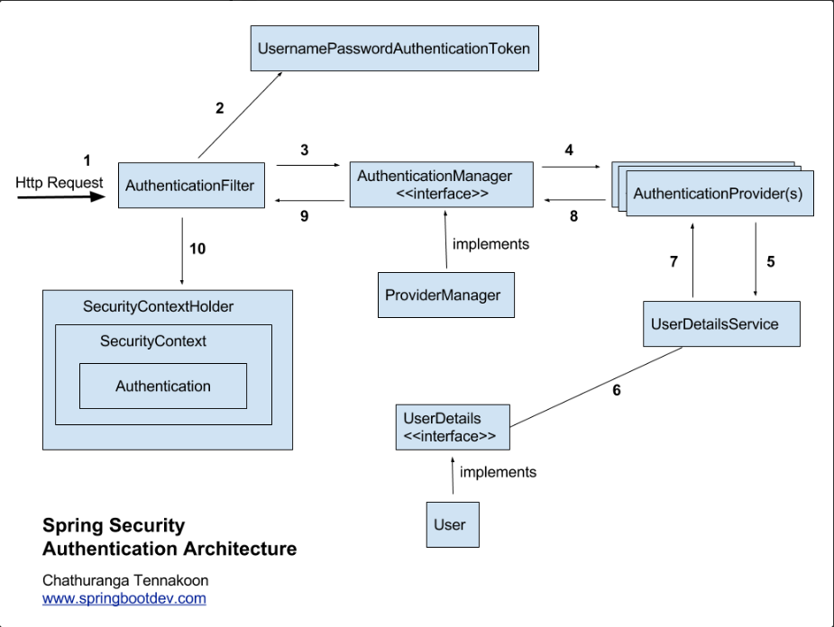
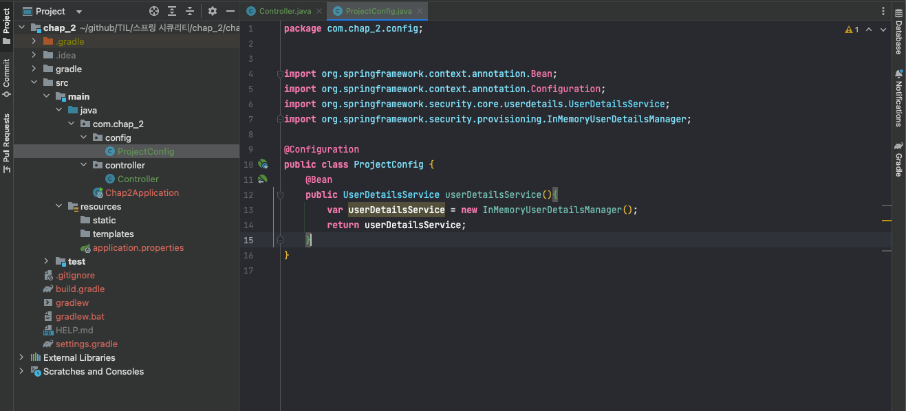
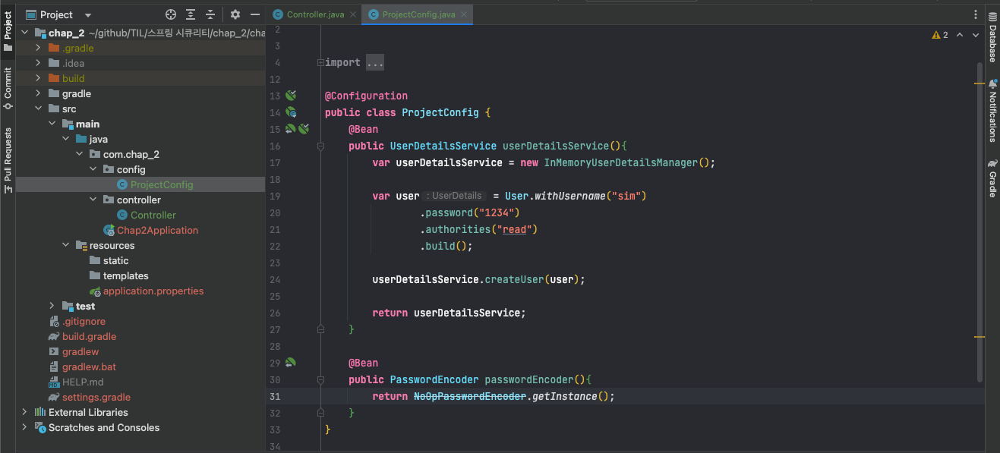
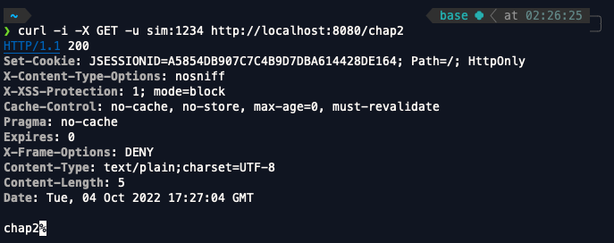
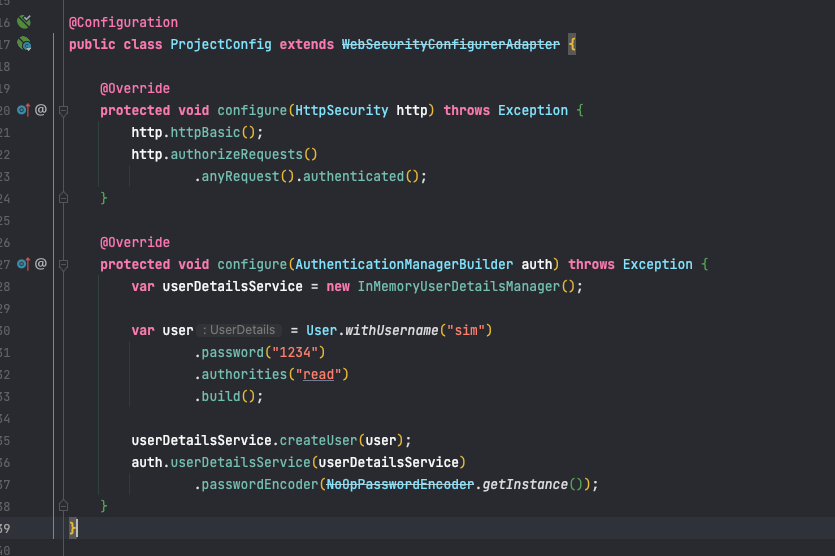
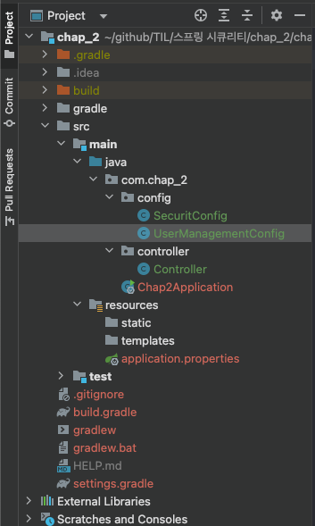

<br>
스프링 시큐리티 인 액션을 읽고 내용을 정리한 파일입니다.

<br>

# 기본구성이란 ? 
chap1에서는 우리가 따로 스프링 시큐리티에 인증과 권한 부여에 관해서 따로 작성한 코드가 없기때문에 스프링 시큐리티의 기본구성에 맞게끔 프로젝트가 실행됬다.

하지만 각각의 프로젝트의 성격에 맞게 스프링 시큐리티에 인증과 권한 부여에 관해서 따로 코드를 작성해야 하는 경우가 생길텐데 그럴때에는 어떻게 해야하는지 알아보도록 하자.

<br>
<br>

# 스프링 시큐리티 인증 프로세스



<br>

위의 아키텍쳐는 스프링 시큐리티로 인증을 구현하는 로직?을 보여준다. 위 아키텍쳐의 순서는 다음과 같다.

1. 인증필터(AuthenticationFilter)는 인증 요청을 인증관리자에 위임하고 응답을 바탕으로 보안 컨텍스트를 구성한다.
2.인증 관리자(AuthenticationManager)는 인증 공급자(AuthenticationProvider)를 이용해 인증을 처리한다.
3. 인증 공급자는 인증 논리를 구현한다.
4. 인증 공급자는 사용자 관리 책임을 구현하는 사용자 세부 정보 서비스를 인증 논리에 이용한다.
5. 인증 공급자는 암호 관리를 구현하는 암호 인코더를 인증 논리에 구현한다.
6. 보안 컨텍스트는 인증 프로세스 후 인증 데이터를 유지한다.

<br>

인증 공급자(Authentication Provider)는 UserDetailsService와 PasswordEncoder 를 빈으로 등록하여 사용차를 찾고 암호를 확인하며 사용자에 관한 세부 정보는 스프링 시큐리티로 UserDetailsService를 구현한 객체가 관리한다. 

chap1에서는 스프링 시큐리티 기본 구성을 사용했는데 여기서 UserDetailsService 구현은 기본 user와 매 실행마다 UUID *Universally Unique Identifier)형식으로 생성되는 password를 사용해서 기본 자격 증명을 등록하는 일만 한다.

UserDetailsService와 마찬가지로 인증관리자가 패스워드 인코더를 인증논리에 구현하는데 암호를 인코딩하고 암호가 기존 인코딩과 일치하는지 확인할 때 사용한다. UserDetailsService와 PasswordEncoder가 함께 존재한다는 것만 우선 알아두자 !

<br>
<br>

## 기본 프로세스 대체하기
각각의 스프링부트 프로젝트는 각각의 성격에 맞게 인증과 권한 부여 방식을 가진다. 이렇게 각각의 성격에 맞게 인증과 권한 부여 방식을 구현하기 위해서는 스프링 시큐리티의 기본 구성 방식을 코드 작성을 통해 대체해야한다. 그렇다면 어떻게 스프링 시큐리티의 기본 구성 방식을 대체할 수 있을까 ?

<br>


## UserDetailsService 구성 요소 재정의하기

<br>
UserDetailsService를 InMemoryUserDetailsManager라는 구현을 이용해서 UserDetailsService의 구성 요소를 재정의해보자.

<br>
InMemoryUserDetailsManager는 메모리에 자격 증명을 저장해서 인증할 때 메모리에서 저장된 자격 증명을 이용하도록 한다.


<br>



<br>

config 폴더에 ProjectConfig 클래스를 만들고 이 클래스 안에 UserDetailsService 클래스를 빈으로 등록하도록 코드를 작성했다. 이렇게 코드를 작성하면 chap1처럼 기본구성요소로 제공되는 UserDetailsService가 아닌 위의 코드에서 작성한 것 처럼 userDetailsService(InMemoryUserDetailsManager) 형식의 인스턴스를 이용한다. 

이렇게 코드를 작성하고 프로젝트를 실행하면 엔드포인트에 접근할 수 없다. 왜냐하면 모든 엔드포인트가 인증을 요구하지만 로그인을 할 수 없기 때문이다. 그 이유는 아래의 두가지이다.

<br>

1. 등록된 유저가 없다.
2. PasswordEncoder가 없다.

<br>

첫번째로 등록된 유저가 없는 것은 우리가 유저를 등록한 적이 없기 때문이다. 하지만 두번째는 뭘까 ? 전에 PasswordEncoder와 UserDetailsService는 함께 존재한다라고 말했던 것을 생각해보자. 우리가 PasswordEncoder와 관련된 코드를 작성한 적이 있던가 ? 당연히 없다. UserDetailsService로 InMemoryUserDetailsManager를 빈으로 등록한 것과 같이 그러면 PasswordEncoder를 빈으로 등록해줘야하지 않겠는가 ?

<br>



<br>

위의 코드를 보면 org.springframework.security.core.userdetails.User의 user 객체를 만들어서 username과 password, authorities를 설정해주고 InMemoryUserDetailsManager에 등록해줬다. 그리고 PasswordEncoder 객체를 빈으로 등록해서 관리해주도록 코드를 작성했다. 만약 Password 인코더를 빈으로 등록해주지 않았다면 There is no PasswordEncoder mapped for th id = "null"이라는 에러가 발생할 것이다.

<br>

그렇다면 이제 curl로 /chap2 엔드포인트로 요청을 보내보도록 하자.

<br>



<br>

방금 만든 username이 sim이고 비밀번호가 1234인 아이디를 기본인증방식을 사용해서 http://localhost:8080/chap2로 요청을 보냈는데 200으로 정상적으로 응답을 받은 것을 확인할 수 있다.


여기까지 했으면 이제 엔드포인트의 인증 방식과 구성에 관해서 논의해보도록 하자. 지금까지는 모든 엔드포인트가 인증을 필요로 했고 또 HTTP Basic 인증을 권한부여 방식으로 이용했지만 HTTP Basic은 보안에 있어 별로 좋지 않은 방식이다. (HTTP_Basic_Authentication 참고) 우선은 엔드포인트마다 다른 권한 부여 규칙을 설정하는법부터 알아보도록 하자.

엔드포인트마다 다른 권한을 부여하기 위해서는 WebSecurityConfigurerAdapter를 상속받는 클래스를 생성해야한다. 기존의 ProjectConfig를 WebSecurityConfigurerAdapter의 상속을 받는 클래스로 변경하도록 하자. 

<br>

```java 
@Configuration
public class ProjectConfig extends WebSecurityConfigurerAdapter {

    @Override
    protected void configure(HttpSecurity http) throws Exception {
        http.httpBasic();
        http.authorizeRequests()
                .anyRequest().authenticated();
    }

    // 생략
}
```

<br>

위의 코드처럼 WebSecurityConfigurerAdapter의 상속을 받게하고 configure 메서드를 오버라이드 해서 엔드포인트의 권한 부여를 구성할 수 있다.

<br>
<br>

### 간단 상식
```java
// 모든 요청 인증필요
http.authorizeRequests()
                .anyRequest().authenticated();

// 모든 요청 인증필요하지 않음
http.authorizeRequests()
                .anyRequest().permitAll();

// url 인증 필요
http.authorizeRequests()
        .antMatcher("url").authenticated()

// url 인증 필요하지 않음
http.authorizeRequests()
        .antMatcher("url").permitAll()
```

<br>
<br>

## configure 메서드로 UserDetailsService, PasswordEncoder 정의하기

위의 코드를 보면 configure 메서드를 통해 userDetailsService는 전에 생성했던 InMemoryUserDetailsManager와 passwordEncoder로는 NoOpPasswordEncoder의 인스턴스로 설정해준 것을 확인할 수 있다.

처음에 작성한 방식과 지금 작성한 방식 모두 사용할 수 있는 방식이지만 PasswordEncoder와 UserDetailsService는 함께 작성해서 헷갈리지 않도록 하자. 

<br>
<br>

## AuthenticationProvider 구현 재정의
<br>

AuthenticationProvider는 인증 논리를 구현하고 사용자 관리와 암호 관리를 각각 UserDetailsService와 PasswordEncoder에게 위임한다. 이렇게 스프링 시큐리티 아키텍쳐에 반영된 책임은 유지하는 것이 좋다.AuthenticationProvider를 UserDetailsService와 PasswordEncoder가 필요없도록 재정의할수있지만 나는 **굳이** 그렇게 해야하는지 잘 모르곘다. ( 책임분리원칙을 준수하기 위해서 . 귀찮은거 아님)

책임분리원칙을 말한김에 ProjectConfig에 프로젝트의 권한 부여 구성과 관련된 부분과 사용자 관리 구성과 관련된 부분이 ProjectConfig라는 클래스 안에 같이 있으므로 분리하는 것을 마지막으로 하고 끝내도록 하자.

<br>



config 패키지 안에 사용자 관리 구성과 관련된 UsermanagementConfig 클래스와 프로젝트의 권한 부여 구성과 관련된 SecurityConfig 클래스로 나누어 저장했다.


