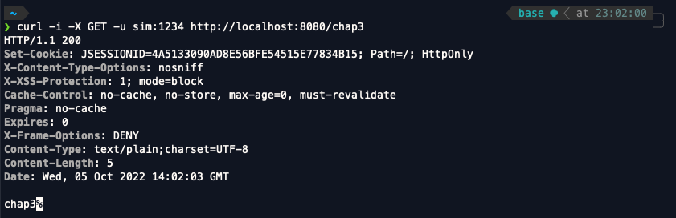

<br>
스프링 시큐리티 인 액션을 읽고 내용을 정리한 파일입니다.

<br>

# 스프링 시큐리티 사용자 관리
<br>

chap3에서는 스프링 시큐리티에서 사용자 관리해주는 역할을 하는 UserDetailsService, UserDetails, GrantedAuthority, UserDetailsManager 등에 대해서 정리합니다.

스프링 시큐리티는 아무 설정을 하지 않아도 기본적으로 제공하는 기본 구성?이 존재합니다. 하지만 이 기본 구성은 스프링 시큐리티를 사용하는 프로젝트들의 성격에 모두 맞지는 않습니다. 그렇기 때문에 프로젝트의 성격에 맞게 스프링 시큐리티를 변경해주는 것이 좋습니다.

스프링 시큐리티를 각각의 프로젝트의 성격에 맞게 수정하기 위해서 우선 기본적으로 스프링 시큐리티가 제공하는 기본 구성의 코드가 어떻게 작성되었고 어떻게 구성되었는지 확인해보도록 하겠습니다.

<br>
<br>
<br>

## 스프링 시큐리티 기본 구성 알아보기
<br>


<br>

우선 인증필터가 서버에 들어온 요청에 대해서 인증이 필요하다고 판단한 경우에 해당 요청을 가로챈 후 인증 책임을 AuthenticationManager에게 위임하고 AuthenticationManager는 인증 논리를 구현하는 AuthenticationProvider를 이용합니다.

AuthenticationProvider는 UserDetailsService와 PasswordEncoder를 통해 사용자를 찾고 암호를 검증한 후 인증 결과가 인증필터에 반환되고 인증된 엔티티에 관한 세부 정보가 보안 컨텍스트에 저장된다.

UserDetailsService와 PasswordEncoder, 이 두개의 클래스로 분리하여 진행하는 이유는 사용자 검색과 암호를 검증하는 두가지의 역할을 하나의 클래스에 담아 사용하기에는 적절하지 않기 때문이다.

<br>
<br>
<br>
<br>


## 스프링 시큐리티 사용자 관리 맞춤형 구현하기

<br>

스프링 시큐리티의 기본 사용자 관리 방법을 사용하는 것이 아니라 프로젝트에 맞춰 사용하기 위해서는 UserDetailsService와 UserDeatilsManager 구성요소에 사용자를 나타내기 위해서  UserDetails를 구현한 객체를 만들고 해당 객체를 프레임워크가 이해할 수 있도록 기술해야한다.

UserDetails를 구현한 객체를 만들기위해서 UserDetail 인터페이스가 어떻게 작성되어있는지 확인해보자.

<br>

```java
// UserDetails 인터페이스
public interface UserDetails extends Serializable {
	Collection<? extends GrantedAuthority> getAuthorities();

	String getPassword();
	String getUsername();

    // 계정만료
	boolean isAccountNonExpired();
    // 계정잠금
	boolean isAccountNonLocked();
    // 계정 자격 증명 만료
	boolean isCredentialsNonExpired();
    // 계정 비활성화
	boolean isEnabled();
}
```
<br>

UserDetails의 getPassword()와 getUsername()은 각각 패스워드와 유저네임을 반환하는데 해당 데이터는 사용자 인증을 위해 사용된다. 그리고  getAuthorities()는 유저가 가지고 있는 권한들을 컬렉션형태로 반환해준다. 마지막으로 리턴값이 boolean인 메서드들은 사용자 제한을 위해 작성된 메서드들로 해당 사용자가 사용되기 위해서는 각 메서드들의 리턴값이 true여야한다.

스프링 시큐리티에서는 사용자가 가지는 권한을 정의하기 위해서 GrantedAuthority 인터페이스를 정의한다. UserDetails 에서도 

<br>

```java
Collection<? extends GrantedAuthority> getAuthorities();
```
<br>

위와 같이 GrantedAuthority 인터페이스를 구현하는 객체가 요소로 저장된 Collection을 getAuthorities() 메서드가 리턴해주는 것을 확인할 수 있다.

지금까지 UserDetails 인터페이스에 대해서 알아봤으니까 이제 UserDetails를 구현하는 클래스를 작성해보도록 하자.

<br>
<br>

## UserDetails를 구현하는 클래스 작성하기

<br>

```java
public class User implements UserDetails {

    private final String username;
    private final String password;
    private final String authority;

    public User(String username, String password, String authority) {
        this.username = username;
        this.password = password;
        this.authority = authority;
    }


    @Override
    public Collection<? extends GrantedAuthority> getAuthorities() {
        return List.of(() -> this.authority);
    }

    @Override
    public String getPassword() {
        return password;
    }

    @Override
    public String getUsername() {
        return username;
    }

    @Override
    public boolean isAccountNonExpired() {
        return true;
    }

    @Override
    public boolean isAccountNonLocked() {
        return true;
    }

    @Override
    public boolean isCredentialsNonExpired() {
        return true;
    }

    @Override
    public boolean isEnabled() {
        return true;
    }
}
```
<br>


UserDetails를 구현하는 SecurityUser 클래스를 작성했다. 주목할 점으로는 username, password, authority 변수를 가지고 해당 값들을 get 함수가 해당 변수를 각각 리턴하도록 작성되었다는 점이다.

잘 작성되었지만 사용자를 데이터베이스에 저장했을때 애플리케이션에 지속성 엔티티를 나타내는 클래스가 필요하다. 그리고 다른 시스템에서 웹 서비스를 통해 사용자를 가져오면 사용자 인스턴스를 나타내는 데이터 전송 객체가 필요하다.

예를들어서 JPA로 User 클래스를 작성했다고 생각해보자.

<br>

```java
@Getter
@Setter
@Entity
public class User {
    @Id
    private Long id;
    private String username;
    private String password;
    private String authority;

}
```
<br>

만약 위처럼 클래스를 만들고 이 클래스에 UserDetails를 구현하게 코드를 작성한다면 한 클래스가 많은 책임을 가지게되어 별로 바람직하다고 볼 수 없다.

한 클래스는 한개의 책임을 가질수있도록 코드를 작성하는 것이 바람직하다. 그렇다면 위의 User클래스는 JPA 엔티티로서의 책임만을 가지도록하고 UserDetails 를 구현하는 클래스를 따로 만들어줘야할 것 같다.

<br>

```java
public class SecurityUser implements UserDetails {

    private final User user;

    public SecurityUser(User user) {
        this.user = user
    }


    @Override
    public Collection<? extends GrantedAuthority> getAuthorities() {
        return List.of(() -> this.authority);
    }

    @Override
    public String getPassword() {
        return password;
    }

    @Override
    public String getUsername() {
        return username;
    }

    @Override
    public boolean isAccountNonExpired() {
        return true;
    }

    @Override
    public boolean isAccountNonLocked() {
        return true;
    }

    @Override
    public boolean isCredentialsNonExpired() {
        return true;
    }

    @Override
    public boolean isEnabled() {
        return true;
    }
}
```

<br>

이렇게 엔티티 책임을 가지는 User 클래스와 UserDetails를 구현하는 SecurityUser 클래스를 작성해서 클래스 하나에 한 책임을 가지도록 코드를 작성하는 것이 바람직하다.

UserDetails 를 구현하는 클래스를 만들었으니까 이제 이 클래스를 UserDetailsService 가 어떻게 사용하는지 궁금해졌다.

우선 UserDetailsService 인터페이스가 어떻게 작성되었는지 확인해보자.

<br>

```java
public interface UserDetailsService {
	UserDetails loadUserByUsername(String username) throws UsernameNotFoundException;

}
```

<br>

UserDetailsService는 매개변수로 들어온 username과 일치하는 UserDetails를 구현한 객체를 반환하는 loadUserByUsername 메서드만을 가지고 있다.

만약에 username과 일치하는 객체가 있다면 해당 객체를 반환하고 만약 일치하는 객체가 없다면 UsernameNotfoundException을 발생시킨다.

그렇다면 지금까지 공부한 내용을 바탕으로 UserDetails를 구현한 클래스인 SecurityUser 클래스와 UserDetailsService를 구현하는 클래스를 사용해서 코드를 작성해보자.

<br>

```java
// UserDetails 를 구현한 클래스
public class SecurityUser implements UserDetails {

    private final String username;
    private final String password;
    private final String authority;

    public SecurityUser(String username, String password, String authority) {
        this.username = username;
        this.password = password;
        this.authority = authority;
    }


    @Override
    public Collection<? extends GrantedAuthority> getAuthorities() {
        return List.of(() -> this.authority);
    }

    @Override
    public String getPassword() {
        return password;
    }

    @Override
    public String getUsername() {
        return username;
    }

    @Override
    public boolean isAccountNonExpired() {
        return true;
    }

    @Override
    public boolean isAccountNonLocked() {
        return true;
    }

    @Override
    public boolean isCredentialsNonExpired() {
        return true;
    }

    @Override
    public boolean isEnabled() {
        return true;
    }
}
```

```java
// UserDetailsService를 구현한 클래스인 InMemoryUserDetailsManager 클래스 사용
@Configuration
public class ProjectConfig {

    @Bean
    public UserDetailsService userDetailsService(){
        UserDetails u = new SecurityUser("sim","1234","read");

        List<UserDetails> users = List.of(u);
        return new InMemoryUserDetailsManager(users);
    }

    @Bean
    public PasswordEncoder passwordEncoder(){
        return NoOpPasswordEncoder.getInstance();
    }
}
```

ProjectConfig에서 UserDetailsService를 구현한 클래스인 InMemoryUserDetailsManager를 빈으로 등록해서 사용할 수 있도록 했다. 그리고 해당 클래스가 생성될때 username은 sim, password는 1234, authority는 read인 유저를 만들어줬다.

PasswordEncoder는 이전과 마찬가지로 NoOpPasswordEncoder 인스턴스를 빈으로 등록해서 사용하도록 했다.

이제 프로젝트를 실행하고 curl을 이용해 /chap3로 GET 요청을 보내보자.

<br>

```java
curl -i -X GET -u sim:1234 http://localhost:8080/chap3
```

- 요청결과


요청을 보냈더니 해당 요청에 대해 정상적으로 응답을 받은것을 볼 수 있다.
요청을 보내고 응답을 받기까지의 과정을 생각해보자.

http://localhost:8080/chap3 으로 username은 sim이고 password는 1234의 아이디로? 요청이 보냈다. 그 후 스프링 시큐리티가 해당 요청을 AuthenticationFilter가 가로채 AuthenticationManager에게 인증을 위임하고 또 AuthenticationManager는 인증 논리를 구현하는 AuthenticationProvider를 이용하게 된다.

인증논리를 구현하는 AuthenticationProvider는 유저의 검색하기 위해서 위의 코드에서 UserDetailsService를 구현하는 InMemoryUserDetailsManager 클래스의 도움을 요청한다.요청을 받은 InMemoryUserDetailsManager는 loadUserByUsername 메서드를 통해 유저를 검색해 있으면 해당 유저를 리턴하는데 아래에 InMemoryUserDetailsManager가 loadUserByUsername를 구현한 코드를 보면 어떻게 유저를 검색하고 리턴하는지 이해하기 쉬울것이다.

```java
public class InMemoryUserDetailsManager implements UserDetailsManager, UserDetailsPasswordService {

    @Override
	public UserDetails loadUserByUsername(String username) throws UsernameNotFoundException {
		UserDetails user = this.users.get(username.toLowerCase());
		if (user == null) {
			throw new UsernameNotFoundException(username);
		}
		return new User(user.getUsername(), user.getPassword(), user.isEnabled(), user.isAccountNonExpired(),
				user.isCredentialsNonExpired(), user.isAccountNonLocked(), user.getAuthorities());
	}
    // loadUserByUsername 이외의 코드들 생략
}
```

UserDetails 객체가 있는 users에 요청으로 받은 username과 같은 유저가 있으면 해당 User 객체를 리턴하는걸 볼 수 있다. 이렇게 loadUserByUsername가 리턴한 유저의 패스워드와 요청으로 받은 패스워드가 같다면 해당 유저를 시큐리티 컨텍스트에 저장해서 사용한다.

이렇게 스프링 시큐리티에서 기본적으로 유저를 인증하는 방법에 대해서 알아봤다.
그렇다면 이제 DB에 유저를 저장하고 로그인할때 어떻게 동작하는지를 알기위해서 코드를 작성해보도록 하자.

DB는 MySQL을 사용할 것이고 우리는 DB 사용을 위해 의존성을 추가해줘야한다.

```gradle
dependencies {
    compileOnly 'org.projectlombok:lombok'
    annotationProcessor 'org.projectlombok:lombok'
    implementation 'org.springframework.boot:spring-boot-starter-security'
    implementation 'org.springframework.boot:spring-boot-starter-web'
    
    // DB관련 의존성 추가 
    runtimeOnly 'mysql:mysql-connector-java'
    implementation 'org.springframework.boot:spring-boot-starter-data-jdbc'
}
```
이렇게 의존성을 추가해주고 application.yml 파일에 DB 연결을 위한 정보들을 적어주도록 하자.

```yml
spring:
  datasource:
    url: jdbc:mysql://localhost/security
    username: root
    password: 1234
```

데이터베이스는 security를 사용할 건데 기본적으로 사용할 users 컬럼과 authorities 컬럼을 만들어주자
우선 디비에 접속한 후
```mysql
create table if not exists `security`.`users` (
    `id` int not null auto_increment,
    `username` varchar(45) not null,
     `password` varchar(45) not null,
      `enabled` int not null, primary key(`id`)
);

create table if not exists `security`.`authorities` (
	`id` int not null auto_increment,
	`username` varchar(45) not null,
	`authority` varchar(45) not null,
	primary key (`id`));
)

insert into `security`.`authorities` values (null, 'sim', 'write');
insert into `security`.`users` values (null, 'sim', '1234', '1');
```
위의 코드들을 작성해주면 기본적인 준비는 끝이다. 이제 DB를 사용해서 로그인해보도록 하자 !

어떻게하면 DB에 있는 유저를 가져와서 요청으로 온 username과 password 값을 비교해서 로그인성공인지 실패인지 판단할 수 있을까 ? 어떻게 할지 생각하기 위해서 요청이 왔을 때 로그인을 위해서 유저의 값을 가져왔던 순서를 생각해보자.

1. 요청이 오면 시큐리티 필터가 가로챈다.
2. 필터가 AuthenticationManager에게 인증을 위임한다.
3. AuthenticationManager는 인증을 위해 AuthenticationProvider가 가진 인증 논리를 활용한다.
4. AuthenticationProvider는 유저 검색을 위해 UserDetailsService를 사용하고 암호검증을 위해 PasswordEncoder를 사용한다.

여기까지보면 대충 어떤걸 써서 디비의 유저 정보를 가져와야할지 대충 감이 올것이다. 여기서 생각해야할 것은 유저 검색을 누가 하는가에 관한 것이다. 유저 검색은 바로 UserDetailsService가 한다. 유저 검색을 UserDetailsService가 하기때문에 우리는 UserDetailsService를 사용해서 디비에 유저 정보를 가져올것이다.

처음 공부하고있는 사람은 당연히 모르겠지만 UserDetailsService를 구현하는 클래스 중에 JdbcUserDetailsManager라는 클래스가있다. 엥 ? 클래스 뒤에 Manager가 붙어있는데 이게 맞나 ? 하고 생각할 수 잇지만 InMemoryUserDetailsManager를 생각해보자. 

InMemoryUserDetailsManager가 어떻게 구현되었는지 기억하는가 ?

<br>

```java
public class InMemoryUserDetailsManager implements UserDetailsManager, UserDetailsPasswordService {
```

<br>

UserDetailsManager와 UserDetailsPasswordService를 구현하는 클래스가 바로 InMemoryUserDetailsManager다. UserDetailsPasswordService는 딱봐도 Password관련이니까 UserDetailsManager가 어떻게 구현되어있는지 다시 한번 확인해보자.

<br>

```java
public interface UserDetailsManager extends UserDetailsService {
```

<br>

바로 UserDetailsService를 구현한다. InMemoryUserDetailsManager < UserDetailsManager < UserDetailsService 으로 구현되어 있었기 때문에 이전 코드에서도 유저 검색을 위해서 InMemoryUserDetailsManager를 사용할 수 있었던 것이다.

그렇다면 JdbcUserDetailsManager도 그런지 확인해보자.

<br>

```java
public class JdbcUserDetailsManager extends JdbcDaoImpl implements UserDetailsManager, GroupManager {
```

<br>

여기까지만 확인해도 위와 같은 방식으로 구현되어있음을 알 수 있을 것이다.

이제 JdbcUserDetailsManager의 loadUsersByUsername 메서드를 확인해보자.

<br>

```java
public class JdbcUserDetailsManager extends JdbcDaoImpl implements UserDetailsManager, GroupManager {
    public static final String DEF_DELETE_USER_SQL = "delete from users where username = ?";

	@Override
	protected List<UserDetails> loadUsersByUsername(String username) {
		return getJdbcTemplate().query(getUsersByUsernameQuery(), this::mapToUser, username);
	}
```

<br>

빈틈없이 코드가 잘 작성되어있는게 너무 신기하다. 이렇게 username을 매개변수로 받아서 디비에서 username을 가진 유저를 리턴해주고 있었다.

이전의 코드와 디비에서 유저를 가져오는 것 이외에는 다 같으니까 뭐 이쯤하면 유저인증하는 방식에 대해서 이해가 됬을것이라고 생각하기때문에 디비 안의 유저 정보를 사용해 인증이 가능하도록 코드를 작성해보자

이번에는 정말 쉽다.

<br>

```java
@Configuration
public class ProjectConfig {
    @Bean
    public UserDetailsService userDetailsService(DataSource dataSource){
        return new JdbcUserDetailsManager(dataSource);
    }
}
```
JdbcUserDetailsManager 객체 생성해 빈으로 등록해주면 된다. 그렇다면 여기서 dataSource와 관련해서 코드를 작성해준게 없는데 저 DataSource 객체는 어디서 오는걸까? 

정답은 DataSource는 우리가 이전에 작성한 application.yml에 작성해준 설정을 바탕으로 생성되어 빈으로 등록되어있다. 빈으로 등록된 DataSource 객체가 JdbcUserDetailsManager 객체를 생성해 빈으로 등록할때 사용되는 것이다.

그러면 이제 프로젝트를 실행하고 이전과 같이 요청을 보내보자

<br>

- 요청보내기 


```java
curl -i -X GET -u sim:1234 http://localhost:8080/chap3
```

<br>

- 요청결과

<br>


<br>

당연하게도 정상적으로 요청에대한 응답을 받아온것을 볼 수 있다. 요청으로  보낸 username과 password가 일치하는 유저가 디비에 저장되어 있음을 AuthenticationProvider가 JdbcUserDetailsManager와 PasswordEncoder를 사용해서 알아낸 후 시큐리티 컨텍스트에 해당 유저를 저장한 후 해당 유저에 대한 인증을 완료한 것이다.

<br>

그러면 지금까지 스프링 시큐리티의 UserDetailsService를 활용해서 기본구성이 아닌 방식으로 스프링 시큐리티의 인증 아키텍처를 구현해보았다.


