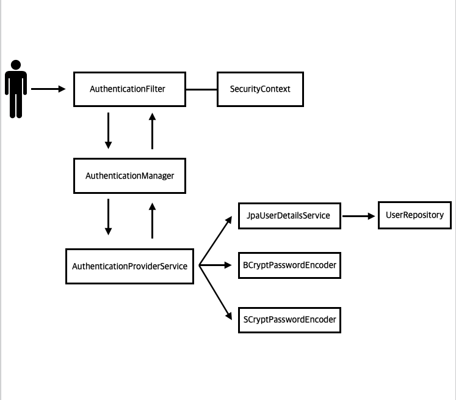
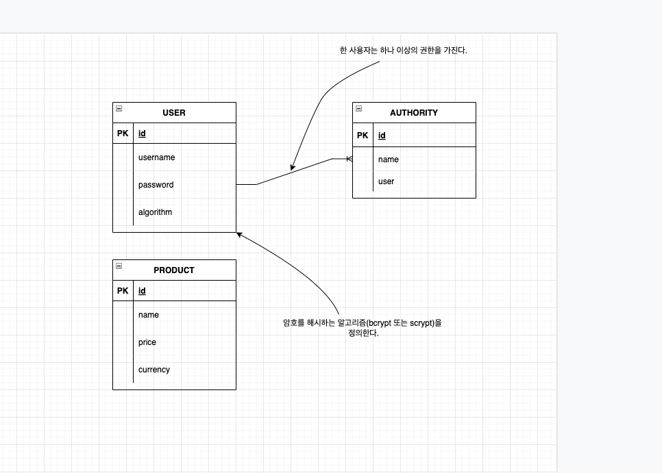

<br>

- 스프링 시큐리티 인 액션을 읽고 내용을 정리한 파일입니다.

<br>
<br>
<br>

# 실전 : 작고 안전한 웹 애플리케이션

이번에는 간단한 웹 애플리케이션을 만들어볼건데 이 애플리케이션은 사용자가 인증에 성공하면 주 페이지에서 제품 목록을 볼 수 있는 애플리케이션으로 지금까지
배웠던 내용들을 바탕으로 만들 것이다.

이 프로젝트에서 애플리케이션의 제품 정보와 사용자는 데이터베이스에 저장되고 각 사용자의 암호는 bcrypt나 scrypt로 해쉬되며 사용자의 암호에 사용된 암호화 유형은 user 테이블의 한 열에 저장되고 두 번째 테이블에는 사용자의 권한이 저장된다.



위의 이미지는 이번 프로젝트의 인증 흐름을 나타낸 이미지다. 이번 프로젝트에서는 이 이미지에 나오는 인증 흐름의 관한 모든 사항을 구현할 것이며 스프링 시큐리티의 표준 로그인 양식을 사용자 인증에 이용할 것이다.

아래의 이미지는 우리가 사용할 user, authority, product 테이블의 엔티티 관계 다이어그램(ERD)이다. 



웹 애플리케이션을 만들기 전에 이 애플리케이션의 대략적인 인증 흐름 및 ERD에 대해서 알아봤으니까 이제 만들어보자.

# 웹 애플리케이션 구현하기

웹 애플리케이션을 구현하기에 앞서 어떤 순서로 이 웹 애플리케이션을 구현할 것인지 한 번 보고 넘어가자.

1. 데이터베이스 설정
2. 사용자 관리 정의
3. 인증 논리 구현
4. 주 페이지 구현
5. 애플리케이션 실행 및 테스트

우리는 위의 순서로 웹 애플리케이션을 구현할 것이다. 1번부터 5번로 구현할 것이므로 위의 사항을 인지한 후 구현하는 과정을 따라오면 좋을 것 같다.

##  1. 데이터베이스 설정

나는 이번 웹 애플리케이션을 구현을 위해 MySQL을 사용할 것이고 chap6 이라는 이름의 데이터베이스를 만들어서 사용할 것이다. 또 테이블은 user, product, authority 테이블을 만들 것인데 user 테이블부터 어떻게 만들 것인지 알아보자.

### User 테이블 

User 테이블의 필드는 아래와 같다.
- id : 테이블의 기본 키로 자동 증가하도록 설정한다.
- username : 사용자 이름
- password : bcrypt 또는 scrypt 방식으로 암호를 해쉬해 저장한다.
- algorithm : 어떤 방식으로 암호를 해쉬했는지 저장한다. 

위의 User 테이블의 필드 정보를 바탕으로 테이블을 구성하면 된다. 스프링 시큐리티 인 액션에서는 schema.sql 파일에 User 테이블 생성을 위한 스크립트을 넣어 스프링 부트가 실행될 때 스크립트를 실행시켜 테이블을 생성하도록 했다. 하지만 우리는 JPA를 사용해 테이블을 만들어보자.

- User

```java
@Setter
@Getter
@Entity
public class User {
    @Id
    @GeneratedValue(strategy = GenerationType.IDENTITY)
    @Column(name = "id")
    private int id;

    @Column(length = 45, nullable = false)
    private String username;

    @Column(nullable = false)
    private String password;
    
    @Enumerated(EnumType.STRING)
    private EncryptionAlgorithm algorithm;

    @OneToMany(mappedBy = "user", fetch = FetchType.EAGER)
    private List<Authority> authorities;

}
```

EncryptionAlgorithm 는 암호 인코더를 정의하는 enum이다. 이 enum 은 아래와 같이 작성하자.

- EncryptionAlgorithm
```java
public enum EncryptionAlgorithm {
    BCRYPT, SCRYPT
}
```

User 엔티티 클래스는 위와 같이 작성하면 된다. 이 엔티티 클래스는 데이터베이스의 테이블과 대응하는 클래스이기 때문에 이 클래스가 작성된 방식의 테이블과 대응된다. 만약 SQL문을 통해 이 테이블을 만들고싶다면 아래의 SQL문을 실행하도록 하자.

```MYSQL
CREATE TABLE IF NOT EXISTS `chap6`.`user` (
    `id` INT NOT NULL AUTO_INCREMENT,
    `username` VARCHAR(45) NOT NULL,
    `password` VARCHAR(255) NOT NULL,
    `algorithm` VARCHAR(45) NOT NULL,
    PRIMARY KEY (`id`)
);
```

이제 유저 테이블에 대한 정보는 다 적상했으므로 authority 테이블을 생성해보자. 이 테이블도 마찬가지로 JPA로 작성해보자. 


### authority 테이블

authority 테이블의 필드 정보는 아래와 같다.

- id : 테이블의 기본 키를 나타내며 자동 증가함
- name : 인증의 이름
- user : user 테이블에 대한 외래 키

- Authority
```java
@Setter
@Getter
@Entity
public class Authority {
    @Id
    @GeneratedValue(strategy = GenerationType.IDENTITY)
    private int id;

    @Column(length = 45, nullable = false)
    private String name;

    @JoinColumn(name = "user")
    @ManyToOne
    private User user;
}
```

솔직히 말하면 이게 맞는지는 잘 모르겠지만 이렇게 작성했다. 이 테이블을 SQL문으로 만들려면 아래의 SQL을 사용하면 된다. 

```MYSQL
CREATE TABLE IF NOT EXISTS `chap6`.`authority` {
    `id` INT NOT NULL AUTO_INCREMENT,
    `name` VARCHAR(45) NOT NULL,
    `user` INT NOT NULL,
    PRIMARY KEY (`id`)
};
```

마지막으로 product 테이블을 만들어보자.

### product 테이블 

이번에도 테이블을 만들기 위해서 필요한 테이블의 필드 정보 먼저 보자.

- id : 테이블의 기본 키를 나타내며 자동 증가하도록 정의됨
- name : 제품의 이름
- price : 제품의 가격
- currency : 통화 ( USD, EUR 등 )

- Product
```java
@Setter
@Getter
@Entity
public class Product {
    @Id
    @GeneratedValue(strategy = GenerationType.IDENTITY)
    private int id;

    @Column(length = 45, nullable = false)
    private String name;

    @Column(length = 45, nullable = false)
    private String price;

    @Enumerated(EnumType.STRING)
    private Currency currency;
}
```

- Currency
```java
public enum Currency {
    USD, GBP, EUR
}
```

위의 Product 엔티티 클래스과 대응하는 테이블과 같은 테이블을 만들기 위한 SQL은 아래와 같다.

```MYSQL
CREATE TABLE IF NOT EXISTS `chap6`.`product` {
    `id` INT NOT NULL AUTO_INCREMENT,
    `name` VARCHAR(45) NOT NULL,
    `price` VARCHAR(45) NOT NULL,
    `currency` VARCHAR(45) NOT NULL,
    PRIMARY KEY (`id`)
};
```

또 JpaRepository를 구현하는 ProductRepository 인터페이스와 데이터베이스에서 Product 객체를 리스트로 반환해줄 findAll() 메서드가 있는 ProductService를 정의하고 가자.

- ProductRepository
```java
@Repository
public interface ProductRepository extends JpaRepository<Product, Integer> {
}
```

- ProductService
```java
@Service
public class ProductService {

    @Autowired
    private ProductRepository productRepository;

    public List<Product> findAll(){
        return productRepository.findAll();
    }

}
```
 
여기까지 마무리했다면 스프링부트 프로젝트 실행시에 우리가 만든 엔티티 클래스와 대응하는 테이블이 자동 생성되도록 yml 파일에 코드를 추가해야한다. 아래의 내용을 application.yml 에 추가하도록 하자.

```yml
spring:
  datasource:
    url: jdbc:mysql://localhost/chap6
    username: root
    password: 1234


  jpa:
    database: mysql # 사용 DB
    database-platform: org.hibernate.dialect.MySQL5Dialect
    show-sql: true # SQL 문이 실행될때 보여줌
    generate-ddl: true #

    hibernate:
      ddl-auto: create # 프로젝트 실행 시 테이블 생성

    properties:
      hibernate:
        format_sql: true
```

또 아래는 이번 프로젝트에 필요한 종속성들이다. 

```gradle
dependencies {
	compileOnly 'org.projectlombok:lombok'
	annotationProcessor 'org.projectlombok:lombok'
	
	runtimeOnly 'mysql:mysql-connector-java'
	implementation 'org.springframework.boot:spring-boot-starter-data-jpa'
	implementation 'org.springframework.boot:spring-boot-starter-data-jdbc'

	implementation 'org.springframework.boot:spring-boot-starter-web'
	implementation 'org.springframework.boot:spring-boot-starter-security'

    implementation 'org.springframework.boot:spring-boot-starter-thymeleaf'
}
```

이제 데이터베이스 설정의 마지막으로 생성된 테이블에 데이터를 넣어보자. 아래의 SQL문을 실행시키면 된다.

```MYSQL
INSERT IGNORE INTO `chap6`.`user` (`id`, `username`, `password`, `algorithm`) VALUES ('1', 'sim', '$2a$10$azKiD2yhqH0aVEKe8D7MCu8qI6rJI5tpIE0NAF727r/Bsvr85RiPq', 'BCRYPT');

INSERT IGNORE INTO `chap6`.authority`(`id`, `name`, `user`) VALUES ('1', 'READ', '1');

INSERT IGNORE INTO `chap6`.authority`(`id`, `name`, `user`) VALUES ('2', 'WRITE', '1');

INSERT IGNORE INTO `chap6`.`product` (`id`, `name`, `price`, `currency`) VALUES ('1', 'Chocolate', '10', 'USD');
```

위의 SQL문에서 참고할 점은 "$2a$10$azKiD2yhqH0aVEKe8D7MCu8qI6rJI5tpIE0NAF727r/Bsvr85RiPq" 값이 1234를 BCRYPT 방식으로 암호화한 값이라는 것 뿐이다.
이제 2. 사용자 관리 정의로 넘어가도록 하자.

## 2. 사용자 관리 정의


이번에는 위의 이미지와 같은 인증 흐름을 구현할 것이다. 구현을 위한 단계는 아래와 같다.

1. BCRYPT, SCRYPT 두 개의 암호 인코더 객체를 정의한다.
2. 스프링 데이터를 위한 JpaRepository 계약을 정의한다. 
3. UserDetailsService 계약을 구현한다.
4. AuthenticationProvider 계약을 구현한다.

1번부터 차근차근 구현해보자.

### 1. 암호 인코더 객체 정의하기

암호 인코더 객체를 정의하는 것은 굉장히 쉽다.
유저 인증 흐름에 쓰이는 객체들을 정의해줄 ProjectConfig 클래스를 정의하자.

```java
@Configuration
public class ProjectConfig {

    @Bean
    public BCryptPasswordEncoder bCryptPasswordEncoder(){
        return new BCryptPasswordEncoder();
    }

    @Bean
    public SCryptPasswordEncoder sCryptPasswordEncoder(){
        return new SCryptPasswordEncoder();
    }

}
```

이렇게 코드를 작성하면 BCryptPasswordEncoder 객체와 SCryptPasswordEncoder객체가 빈으로 선언한 것이다. 이제 인증 흐름 구현을 위한 UserDetails을 구현하는 객체를 구현해보자.

```java
public class Chap6UserDetails implements UserDetails {
    
    private User user;
    
    public Chap6UserDetails(User user){
        this.user = user;
    }
    
    
    @Override
    public Collection<? extends GrantedAuthority> getAuthorities() {
        return user.getAuthorities().stream()
                .map(a -> new SimpleGrantedAuthority(
                        a.getName()
                )).collect(Collectors.toList());
    }

    @Override
    public String getPassword() {
        return user.getPassword();
    }

    @Override
    public String getUsername() {
        return user.getUsername();
    }

    @Override
    public boolean isAccountNonExpired() {
        return true;
    }

    @Override
    public boolean isAccountNonLocked() {
        return true;
    }

    @Override
    public boolean isCredentialsNonExpired() {
        return true;
    }

    @Override
    public boolean isEnabled() {
        return true;
    }
}
```

Chap6UserDetails 클래스는 UserDetails를 구현하면서 UserDetails의 메서드들을 구현하기 위해서 User 클래스를 생성자의 매개변수로 받도록했다. 또 생성자의 매개변수로 받은 User 객체에서 UserDetails의 계약을 구현하기 위한 메서드들을 구현하고 하는데 사용했다.

이제 UserDetails를 구현한 클래스는 만들었기때문에 UserDetailsService를 구현하는 클래스를 만들어야한다.
하지만 아직 까먹고 만들지 않은게 있다. 바로 UserDetailsService의 메서드인 loadUserByUsername 메서드를 사용하기 위해서 데이터베이스에서 username과 같은 유저를 가져오는 메서드를 만들어야하는데 그러기 위해 JpaRepository 를 계약을 구현하는 UserRepository 인터페이스를 만들어야한다. 또 UserRepository에 username을 매개변수로 받아 데이터베이스에서 해당 username을 가진 유저를 찾아줄 메서드를 정의해야한다.
하나하나 구현해보자.

## 인증 논리구현하기

### UserDetailsService 구현하기

우선 JpaRepository 를 계약을 구현하는 UserRepository 인터페이스를 만들어보자. 매우 간단하다.

```java
public interface UserRepository extends JpaRepository<User, Integer> {
    Optional<User> findUserByUsername(String username);
}
```
이게 끝이다. 이번에 만든 UserRepository의 찾을 username을 findUserByUsername 메서드의 인자로 주면 데이터베이스에서 인자로 받은 username과 같은 유저를 찾아줄 것이다. 그러면 이제 UserDetailsService 계약을 구현하는 Chap6UserDetailsService 클래스를 만들어보자.

```java
public class Chap6UserDetailsService implements UserDetailsService {

    @Autowired
    private UserRepository userRepository;

    @Override
    public Chap6UserDetails loadUserByUsername(String username) throws UsernameNotFoundException {
        try {
            Optional<User> u = userRepository.findUserByUsername(username);
            Chap6UserDetails chap6UserDetails = new Chap6UserDetails(u);

            return chap6UserDetails;

        } catch (UsernameNotFoundException e){
            throw new UsernameNotFoundException("Username not found");
        }
    }
}
```

이제 마지막으로 AuthenticationProvider를 계약을 구현할 클래스를 만들어보자.

### AuthenticationProvider 구현하기

```java
@Service
public class Chap6AuthenticationProvider implements AuthenticationProvider {

    @Autowired
    private BCryptPasswordEncoder bCryptPasswordEncoder;

    @Autowired
    private SCryptPasswordEncoder sCryptPasswordEncoder;

    @Autowired
    private Chap6UserDetailsService chap6UserDetailsService;

    @Override
    public Authentication authenticate(Authentication authentication) throws AuthenticationException {
        String username = authentication.getName();
        String password = authentication.getCredentials().toString();

        Chap6UserDetails user = chap6UserDetailsService.loadUserByUsername(username);

        switch (user.getUser().getAlgorithm()){
            case BCRYPT:
                return checkPassword(user, password, bCryptPasswordEncoder);
            case SCRYPT:
                return checkPassword(user, password, sCryptPasswordEncoder);
        }
        return null;
    }

    @Override
    public boolean supports(Class<?> authentication) {
        return UsernamePasswordAuthenticationToken.class.isAssignableFrom(authentication);
    }

    private Authentication checkPassword(Chap6UserDetails user,
                                         String rawPassword,
                                         PasswordEncoder encoder){

        if (encoder.matches(rawPassword, user.getPassword())){
            return new UsernamePasswordAuthenticationToken(
                    user.getUser().getUsername(),
                    user.getUser().getPassword(),
                    user.getAuthorities()
            );
        } else {
            throw new BadCredentialsException("Bad Credentials");
        }

    }
}
```

authenticate() 메서드에서 주목할 점은 User 클래스의 algorithm 값에 따라서 다른 암호 인코더를 사용해서 checkPassword() 메서드를 통해서 데이터베이스의 값과 같은 값인지 확인하도록 코드를 작성한 점이다. 우리는 데이터베이스에 유저의 패스워드를 어떤 암호 인코더로 인코딩했는지 저장해두었기 때문에 이 값을 통해서 유저 인증을 할 때 다른 암호 인코더를 사용해서 암호를 검증하도록 했다.

이제 마지막으로 ProjectConfig 클래스와 SecurityConfig를 수정하고 주 페이지를 구현하도록 하자.

```java
@RequiredArgsConstructor
@Configuration
public class ProjectConfig {

    @Bean
    public UserDetailsService userDetailsService(DataSource dataSource){
        return new JdbcUserDetailsManager(dataSource);
    }

    @Bean
    public BCryptPasswordEncoder bCryptPasswordEncoder(){
        return new BCryptPasswordEncoder();
    }

    @Bean
    public SCryptPasswordEncoder sCryptPasswordEncoder(){
        return new SCryptPasswordEncoder();
    }
    
}
```

```java
@Configuration
public class SecurityConfig extends WebSecurityConfigurerAdapter {
    @Autowired
    private  Chap6AuthenticationProvider authenticationProvider;
    @Override
    protected void configure(HttpSecurity http) throws Exception {
        http.formLogin()
                .defaultSuccessUrl("/main", true);

        http.authorizeRequests()
                .anyRequest().authenticated();
    }

    @Override
    protected void configure(AuthenticationManagerBuilder auth) throws Exception {
        auth.authenticationProvider(authenticationProvider);
    }

}
```

## 4. 주 페이지 구현

메인 페이지는 아래의 html파일을 main.html 파일로 만들어 사용하면 된다.

```html
<!DOCTYPE html>
<html lang="en" xmlns:th="http://www.thymeleaf.org">
<head>
    <meta charset="UTF-8">
    <title>Products</title>
</head>
<body>

    <h2 th:text="'Hello,' +${username} + '!'" />
    <p><a href="/logout">Sign out here</a></p>

    <h2>These are all the products</h2>
    <table>
        <thead>
            <tr>
                <th> Name </th>
                <th> Price </th>
            </tr>
        </thead>
        <tbody>
            <tr th:if="${products.empty}">
                <td colspan="2">No Products Available</td>
            </tr>
            <tr th:each="book : ${products}">
                <td><span th:text="${book.name}"> Name </span></td>
                <td><span th:text="${book.price}"> Price </span></td>
            </tr>
        </tbody>
    </table>
</body>
</html>
```

그리고 /main 으로 요청이 왔을 때 Authentication 객체에서 username을, productService의 findAll() 메서드로 Product 객체가 담긴 리스트를 각각 username, products 로 모델에 담은 후 main.html 파일을 응답해주도록 컨트롤러를 만들어주면 된다.


```java
@Controller
public class MainController {

    @Autowired
    private ProductService productService;

    @RequestMapping(value = "/main", method = RequestMethod.GET)
    public String main(Authentication a, Model model){
        model.addAttribute("username", a.getName());
        model.addAttribute("products", productService.findAll());

        return "main";
    }
}
```

이제 프로젝트를 실행하고 테스트해보도록 하자.

## 테스트하기

<image src="./images/3.png">

우선 어떤 엔드포인트로 요청을 보내더라도 위의 이미지처럼 로그인 페이지로 넘어갈 것이다. 그러면 아이디와 비밀번호를 입력한 후 로그인해보자.

<image src="./images/4.png">

로그인에 성공하면 /main 엔드포인트로 리다이렉트된다. 
product 테이블에 데이터를 넣으면 Chocolate 아래로 product 테이블에 넣은 데이터가 계속 추가될 것이다.
이렇게 스프링 시큐리티 6장, 실전 : 작고 안전한 웹 애플리케이션 구현하는 것을 마치도록 하겠다.


