<br>

- 스프링 시큐리티 인 액션을 읽고 내용을 정리한 파일입니다.

<br>
<br>
<br>

# 유저에게 권한 부여하기

우리는 이전에 UserDetails가 어떻게 구현되었는지 확인해본적이 있었다. 

```java
public interface UserDetails extends Serializable {

	Collection<? extends GrantedAuthority> getAuthorities();
	String getPassword();
	String getUsername();

	boolean isAccountNonExpired();
	boolean isAccountNonLocked();
	boolean isCredentialsNonExpired();
	boolean isEnabled();

}
```
바로 위의 코드가 이전에 계속 봐왔던 UserDatails가 구현된 코드이다. UserDetails는 getAuthorities() 메서드를 통해 Authority를 가져와서 해당 유저의 권한에 대한 정보를 가져온다.

getAuthorities()를 통해서 받아온 권한은 Collection 형식이기 때문에 당연하게 한개가 될 수 있고 여러개가 될 수 있다. 

이렇게 유저에게 어떤 방식으로 권한이 저장되는지 알아봤다.
다음으로 넘어가도록 하자.


# 권한에 따른 접근제한 구현하기

우리는 유투브를 보더라도 일반유저랑 유투브 프리미엄 유저의 기능차이가 있다. 대부분의 애플리케이션에서 유저마다 사용할 수 있는 기능이나 리소스에서 차이가 발생하는데 이러한 기능을 구현하기위해서 유저에게 권한을 부여하여 어떤 기능이나 리소스들을 사용할 수 있도록 하고있다.

그렇다면 스프링 시큐리티는 어떻게 이 유저가 어떤 권한이 있고 이 기능이 어떤 권한을 가진 유저에게 허용되는 기능인지 알수있을까?

그것에 대해서 알기 전에 스프링 시큐리티가 어떻게 권한에 따라서 기능에 접근제한을 구현하는지 아래의 이미지를 보고 이해해보자.

<br>

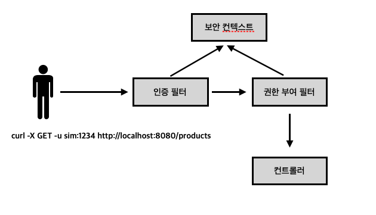

<br>

우선 유저가 서버에 요청을 보내면 이 요청을 인증 필터가 받아서 사용자를 인증한다. 인증하는 방법은 이전에 공부했으니 넘어가도록 하고 인증이 완료되면 AuthenticationProvider가 리턴한 Authentication 객체를 SecurityContext에 저장하고 요청을 권한 부여 필터에게 위임한다. 

해당 요청을 위임받은 권한 부여 필터는 보안 컨텍스트에서 해당 유저에대한 세부정보를 받아와서 유저의 권한을 확인하고 엔드포인트의 접근을 허용할 것인지 제한할 것인지 결정한다.

이러한 방식으로 스프링 시큐리티는 유저의 권한에 따라 기능에 제한을 둘수있다.

이제 이러한 권한에 따른 엔드포인트 제한을 적용하는 방법에 대해서 알아보자.

## 엔드포인트에 제한 적용하기

### hasAuthority & hasAnyAuthority
우리는 이전에 로그인을 하지않은 유저는 어떤 엔드포인트에도 접근하지못하게 코드를 작성했던 적이있다.

```java
@Configuration
public class SecurityConfig extends WebSecurityConfigurerAdapter {
    @Override
    protected void configure(HttpSecurity http) throws Exception {
        http.httpBasic();

        // 여기 부분
        http.authorizeRequests().anyRequest().authenticated();
    }
}
```

바로 위와 같은 방식으로 인증을 하지않은 유저의 경우에 엔드포인트에 접근제한을 만들어줬었다.
유저의 권한에 따라 임의의 엔드포인트에 접근을 제한하고 허용하도록 코드를 작성하기 위해서 앞으로 사용할 메서드들을 몇개 알아보자.

1. hasAuthority() : 애플리케이션의 제한을 구성하는 하나의 권한만을 매개변수로 삼는다.
2. hasAnyAuthority() : 애플리케이션의 제한을 구성하는 권한을 하나이상 받을 수 있다.
3. access() : SpEL(Spring Expression Language)을 기반으로 권한 부여 규칙을 구축하므로 액세스를 구성하는 데 무한한 가능성이 있지만 코드를 읽고 디버그하기 어려운 단점이 있다.

위에서 소개한 세가지의 메서드 중에서 글을 읽었을때 잘 이해가 가지않는 access() 메서드를 제외하고 1번과 2번의 메서드를 예를 통해서 이해해보자.

<br>

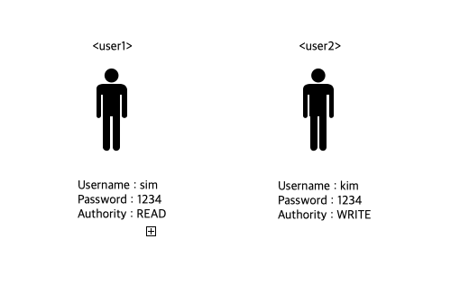

<br>

위의 이미지와 같은 유저 2명을 생성하고 엔드포인트에 대한 권한제한에 대한 코드를 작성해보자.

```java
// 유저 생성
@Configuration
public class ProjectConfig {
    @Bean
    public UserDetailsService userDetailsService(){
        UserDetails user1 = User.withUsername("sim")
                .password("1234")
                .authorities("READ")
                .build();

        UserDetails user2 = User.withUsername("kim")
                .password("1234")
                .authorities("WRITE")
                .build();

        InMemoryUserDetailsManager manager = new InMemoryUserDetailsManager();
        manager.createUser(user1);
        manager.createUser(user2);

        return manager;
    }

    @Bean
    public PasswordEncoder passwordEncoder(){
        return NoOpPasswordEncoder.getInstance();
    }

}

// 엔드포인트에 권한제한
@Configuration
public class SecurityConfig extends WebSecurityConfigurerAdapter {
    @Override
    protected void configure(HttpSecurity http) throws Exception {
        http.httpBasic();
        http.authorizeRequests().anyRequest().hasAuthority("READ");
    }
}
```
모든 요청에 대해서 READ라는 권한을 가진 유저만 접근을 허용하도록 코드를 작성했다.
위의 코드대로라면 READ라는 권한을 가진 유저1(sim)만이 /chap7에 접근할 수 있을 것이다. 한번 요청을 보내서 어떤 응답이 오는지 보도록 하자.

- user1(sim) : 권한 "READ"

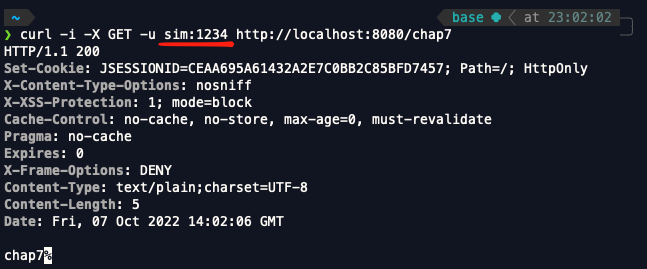

- user2(kim) : 권한 "WRITE"

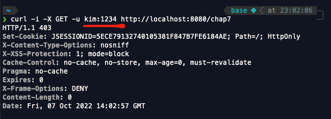

위의 이미지 두개를 비교해보면 READ권한을 가진 user1(sim)만이 정상적으로 응답을 받은것을 볼 수 있다. 이렇게 유저가 가진 권한에따라 임의의 엔드포인트에 접근을 허용 또는 제한하도록 코드를 작성할 수 있다.

###  access 사용하기

access는 hasAuthority와 hasAnyAuthority 메서드보다 조금 더 복잡하다고 느낄수있고 또 코드가 한눈에 들어오지 않다고 생각할수있다. 그렇기 때문에 가능한한 hasAuthority와 hasAnyAuthority 메서드를 사용하고 이 메서드들을 사용하지 못할때 access메서드를 사용하도록 하자.

그러면 어떻게 사용하는가 ! 예를 보면서 코드를 작성해보자.
```java
// 유저 생성
@Configuration
public class ProjectConfig {
    @Bean
    public UserDetailsService userDetailsService(){
        UserDetails user1 = User.withUsername("sim")
                .password("1234")
                .authorities("READ","WRITE", "UPDATE")
                .build();

        UserDetails user2 = User.withUsername("kim")
                .password("1234")
                .authorities("READ", "WRITE")
                .build();

        InMemoryUserDetailsManager manager = new InMemoryUserDetailsManager();
        manager.createUser(user1);
        manager.createUser(user2);

        return manager;
    }

    @Bean
    public PasswordEncoder passwordEncoder(){
        return NoOpPasswordEncoder.getInstance();
    }

}

// 엔드포인트에 권한제한
@Configuration
public class SecurityConfig extends WebSecurityConfigurerAdapter {
    @Override
    protected void configure(HttpSecurity http) throws Exception {
        http.httpBasic();
        http.authorizeRequests().anyRequest().access("hasAuthority('READ') and !hasAuthority('UPDATE')");
    }
}
```

위와 같이 코드를 작성하고 /chap7로 요청을 보내보자.

- user1(sim) : 권한 "READ", "WRITE", "UPDATE"
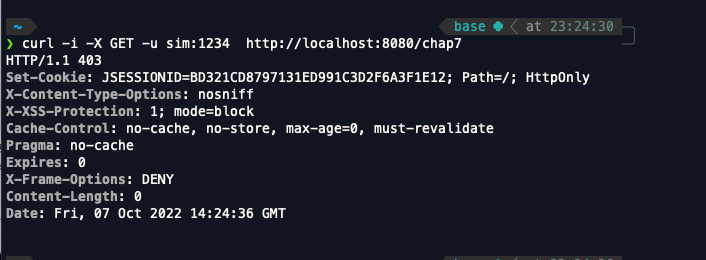

- user2(kim) : 권한 "READ", "WRITE",
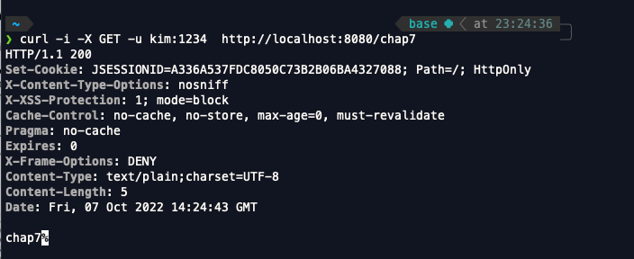

READ 권한이 있고 UPDATE 권한은 없는 유저만이 접근이 허용되기때문에 user2(kim)만이 응답을 정상적으로 받은것을 볼 수 있다. 이렇게 hasAuthority와 hasAnyAuthority만으로 적절하게 유저의 접근을 제한하지 못하는 경우에 access() 메서드를 사용하도록 하자.


### 참고

```java
@Configuration
public class SecurityConfig extends WebSecurityConfigurerAdapter {

    @Override
    protected void configure(HttpSecurity http) throws Exception {
        http.httpBasic();
        http.authorizeRequests().anyRequest().permitAll();
    }
}
```
우선 SecurityConfig를 위처럼 바꾼 후에 
```bash
curl -X -u song:1234 GET http://localhost:8080/chap7
```
위처럼 코드처럼 요청을 보내면 정상적으로 응답을 받을까? 아니면 받지못할까? 

- 응답

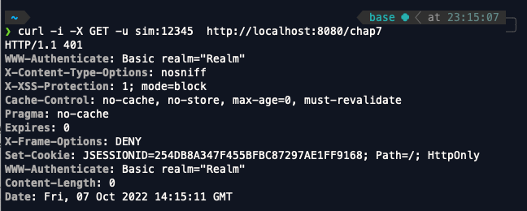

왜 permitAll()를 사용했음에도 불구하고 StatusCode가 왜 500이 뜬걸까 ? 그 이유는 -u username:password를 통해서 유저정보를 요청과 함께 보냈을때는 인증필터가 받아서 인증정보가 맞는지 확인하고 맞지않다면 권한 부여 필터에게 해당 요청을 위임하지않고 맞다면 해당 요청을 위임한다.

그러면 이제 역할에 따른 접근 제한에 대해서 알아볼텐데 권한에 따른 접근 제한과 매우 비슷하기때문에 간단하게 알아보고 넘어가자.

<br>

## 유저의 역할에 따른 접근 제한

만약에 네이버 카페와 같은 웹사이트를 만들어서 유저들과 매니저들의 권한에 차이를 줘야한다고 생각해보자. 유저들은 글을 쓰고 읽고 업데이트하고 자신이 작성한 글만 삭제할 수 있는 권한이 있지만 매니저들은 유저들이 가지고 있는 권한과 더불어서 해당 카페의 규칙에 준수하지 않는 글은 바로 삭제할 수 있는 권한이 있어야할것이다.

이렇게 권한들이 많은 경우에 권한들을 그룹화한 ? 역할을 통해서 접근제한을 구현할 수 있다. (역할은 일종의 배지역할을 한다.) 그렇다면 어떻게 역할을 통해서 접근 제한을 구현할 수 있을까 ?

### 구현하기

구현하기에 앞서 역할을 통해 권한 제한을 하기위해서 필요한 메서드 세가지를 알아보자.

1. hasRole() : 애플리케이션이 요청을 승인할 역할 이름을 매개변수로 받는다.
2. hasAnyRole() : 애플리케이션이 요청을 승인할 여러 역할의 이름을 매개 변수로 받는다.
3. access() : 애플리케이션이 요청을 승인할 역할을 스프링 식으로 지정한다. 역할을 지정하는 데는 hasRole() 또는 hasAnyRole()을 SpEL 식으로 이용할 수 있다.

위의 세개의 메서드들은 권한을 통한 요청 승인을 사용할때 필요했던 메서드들과 같은 방식으로 사용하면된다. 다른 점은 역할을 매개변수로 받는다는 것 뿐이다.


```java
// 유저 생성
@Configuration
public class ProjectConfig {
    @Bean
    public UserDetailsService userDetailsService(){
        UserDetails user1 = User.withUsername("sim")
                .password("1234")
                .authorities("READ","WRITE", "UPDATE")
                .build();

        UserDetails user2 = User.withUsername("kim")
                .password("1234")
                .authorities("READ", "WRITE")
                .build();

        InMemoryUserDetailsManager manager = new InMemoryUserDetailsManager();
        manager.createUser(user1);
        manager.createUser(user2);

        return manager;
    }

    @Bean
    public PasswordEncoder passwordEncoder(){
        return NoOpPasswordEncoder.getInstance();
    }

}

// 엔드포인트에 권한제한
@Configuration
public class SecurityConfig extends WebSecurityConfigurerAdapter {
    @Override
    protected void configure(HttpSecurity http) throws Exception {
        http.httpBasic();
        http.authorizeRequests().anyRequest().hasRole("ADMIN");
    }
}
```

위의 코드를 살펴보면 .roles()의 매개변수로 문자열을 받는데 이 메서드는 GrantedAuthority 객체를 만들고 지정한 이름에 자동으로 ROLE_ 접두사를 추가한다.

- 참고
roles() 메서드의 매개 변수에 ROLE_ 접두사가 포함되지 않도록 주의하자. role()의 매개변수에 실수로 접두사가 포함되면 메서드가 예외를 발생시킨다. 요약하자면 authorities() 메서드를 호출할 때는 ROLE_접두사를 지정하지만, roles() 메서드에는 ROLE_ 접두사를 포함하지 않는다.

그렇다면 이제 요청을 보내고 응답결과를 확인해보자.

- user1(sim) : 역할 ADMIN

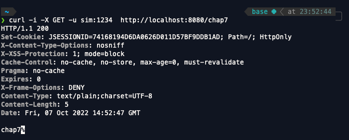

- user2(kim) : 역할 MANAGER

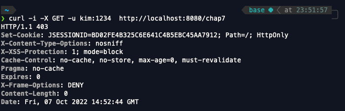

예상한대로 결과가 나왔다. 메서드의 이름 그대로 사용하면된다. 그렇다면 access도 전과 같은 방식으로 사용해보자.

```java
@Configuration
public class SecurityConfig extends WebSecurityConfigurerAdapter {

    @Override
    protected void configure(HttpSecurity http) throws Exception {
        http.httpBasic();
        http.authorizeRequests().anyRequest().access("hasRole('ADMIN') and hasRole('MANAGER')");
    }
}
```
이번에는 hasRole() 메서드를 사용하는 대신 access() 메서드를 사용해보자.

- user1(sim) : 역할 ADMIN

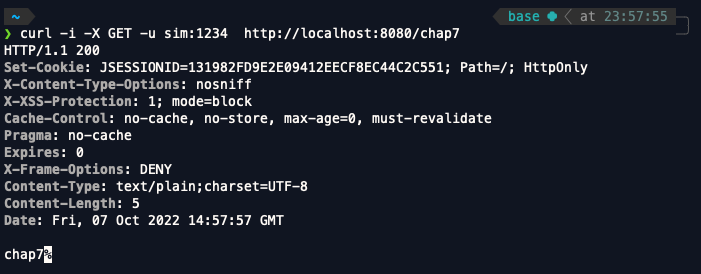

- user2(kim) : 역할 MANAGER

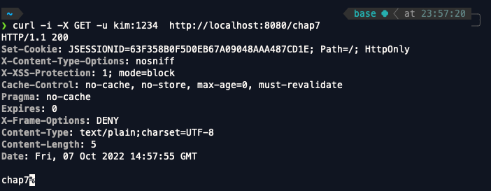

예상했던대로 결과가 나왔다. 역할을 통한 접근 제어를 할때도 hasRole(), hasAnyRole()로 표한하기 어려울때 access() 메서드를 사용하도록 하자.

## 모든 유저 접근 제한하기
모든 유저의 접근을 제한해야할때 사용하는 메서드가 있는데 바로 denyAll() 메서드이다. denyAll() 메서드를 사용해서 작성한 예를보고 마무리하도록 하자.

```java
@Configuration
public class SecurityConfig extends WebSecurityConfigurerAdapter {

    @Override
    protected void configure(HttpSecurity http) throws Exception {
        http.httpBasic();
        http.authorizeRequests().anyRequest().denyAll();
    }
}sss
```

