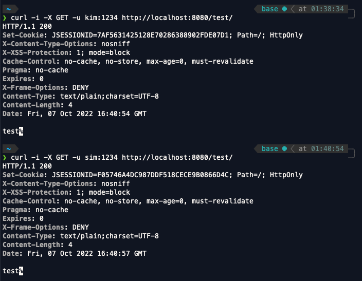
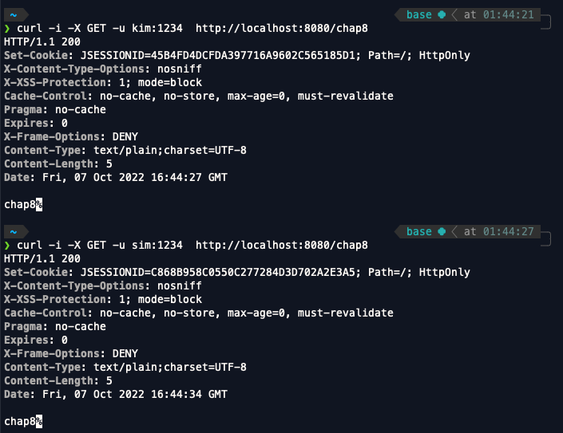

<br>

- 스프링 시큐리티 인 액션을 읽고 내용을 정리한 파일입니다.

<br>
<br>
<br>

# 엔드포인트를 선택해서 접근 제한 구현하기

지금까지 스프링 시큐리티를 통해 접근 제한을 구현했던 코드를 살펴보자.

```java
@Configuration
public class SecurityConfig extends WebSecurityConfigurerAdapter {

    @Override
    protected void configure(HttpSecurity http) throws Exception {
        http.httpBasic();
        http.authorizeRequests().anyRequest().authenticated();
    }
}
```
지금까지는 모든 엔드포인트(anyRequest())에 대해서 authenticated() 메서드를 사용해 접근 제어를 구현해줬다.

그렇다면 특정 엔드포인트에 대해서 접근 제어를 구현하기 위해서는 어떻게 해야할까 ? 특정 엔드포인트에 대해 접근 제어를 구현해줄 메서드 세가지를 보고가도록 하자.

1. mvc선택기(mvcMatchers()) : 경로에 MVC 식을 이용해 엔드포인트를 선택한다.
2. 앤트 선택기(antMatchers()) : 경로에 앤트 식을 이용해서 엔드포인트를 선택한다.
3. 정규식 선택기 : 경로에 정규식(regex)을 이용해 엔드포인트를 선택한다.

mvcMatchers()와 antMatchers()의 매개변수로 method와 url 혹은 url만을 입력하면 된다. 매우 간단하기때문에 바로 예제로 넘어가보자.

```java
// config.ProjectConfig
@Configuration
public class ProjectConfig {
    @Bean
    public UserDetailsService userDetailsService(){
        UserDetails user1 = User.withUsername("sim")
                .password("1234")
                .authorities("READ")
                .build();

        UserDetails user2 = User.withUsername("kim")
                .password("1234")
                .authorities("READ")
                .build();

        InMemoryUserDetailsManager manager = new InMemoryUserDetailsManager();
        manager.createUser(user1);
        manager.createUser(user2);

        return manager;
    }

    @Bean
    public PasswordEncoder passwordEncoder(){
        return NoOpPasswordEncoder.getInstance();
    }

}

// config.SecurityConfig
@Configuration
public class SecurityConfig extends WebSecurityConfigurerAdapter {
    @Override
    protected void configure(HttpSecurity http) throws Exception {
        http.httpBasic();
        http.authorizeRequests()
                .mvcMatchers("/chap8").hasAnyAuthority("READ","WRITE");
    }
}

// controller.Chap8Controller
@RestController
public class Chap8Controller {
    @RequestMapping(value = "/chap8", method = RequestMethod.GET)
    public @ResponseBody String chap8(){
        return "chap8";
    }
}
```

이렇게 코드를 작성한 후 프로젝트를 실행하고 요청을 보내보자.

- 요청결과



위의 코드에서 mvcMatcher 메서드로 /chap8 엔드포인트의 권한을 설정해주고 요청을 보냈더니 모두 200 정상응답을 받은것을 볼 수 있다.

```java
@Configuration
public class SecurityConfig extends WebSecurityConfigurerAdapter {
    @Override
    protected void configure(HttpSecurity http) throws Exception {
        http.httpBasic();
        http.authorizeRequests()
//                .mvcMatchers("/chap8").hasAnyAuthority("READ","WRITE")
                .antMatchers("/chap8").hasAnyAuthority("READ","WRITE")
                .anyRequest().authenticated();
    }
}
```
위처럼 코드를 바꾼후 /chap8로 요청을 보내봐도 같은 응답을 받을 수 있는 것을 볼 수 있다. 아래는 요청을 보낸 후 받은 응답 이미지다.

-요청 결과 



만약 /chap8/hello 라는 요청을 보내도 정상적으로 응답을 받아올 수 있다는 점을 꼭 기억하자.

그렇다면 url /movies/ironman/ko_kr와 /movies/ironman/us_en의 엔드포인트의 권한 설정을 해줘야하는데 한번에 좀 더 간편하게 할수는 없을까 ?

당연히 할 수 있다. 이 두 url은 /movies/ironman 까지는 url이 같기때문에 \*\*를 이용해서 antMatchers("/movies/ironman/**") 혹은 mvcMatchers("/movies/ironman/\*\*") 사용해서 작성하면 된다. 굳이 이 방법이 아니더라도 /movies/\*\*로 작성해도 괜찮다.

## 정규식 선택기

정규식을 사용해서 좀 더 복잡한 엔드포인트의 권한 설정을 해줄 수 있는데 아직 정규식은 본인이 잘 모르기때문에 간단한 예만 보고 넘어가자.

```java
@Configuration
public class SecurityConfig extends WebSecurityConfigurerAdapter {
    @Override
    protected void configure(HttpSecurity http) throws Exception {
        http.httpBasic();
        http.authorizeRequests()
                .mvcMatchers("/email/{email:.*.(.+@.+\\.com").permitAll()
                .anyRequest().denyAll();
    }
}
```
위의 mvcMatchers()안의 문자열은 이메일 형식에 .com으로 끝나는 주소가 포함되는 엔드포인트를 나타내는 정규식이다. 조금 복잡하지만 간단하게 나타낼 수 없는 엔드포인트를 잘 나타낼 수 있는 방법이므로 잘 사용하면 좋을 것 같다.


## mvcMatchers()와 antMatchers()의 차이

위에서 요청보낼때는 해당 부분까지 예제를 작성하지는 않았지만 antMatchers("/endpoint").authenticated()를 사용했다면 /endpoint/ 의 엔드포인트는 적용되지 않는다. 하지만 mvcMatchers("/endpoint").authenticated()를 통해서 엔드포인트의 접근 제한을 준다면 "/endpoint"는 물론 "/endpoint/"의 엔드포인트도 적용이 가능하다.

antMatchers() 보다는 mvcMatchers()가 조금 더 보안적으로 좋기때문에 antMatchers보다 mvcMatchers()를 사용하는것을 습관화해보도록 하자.
  

