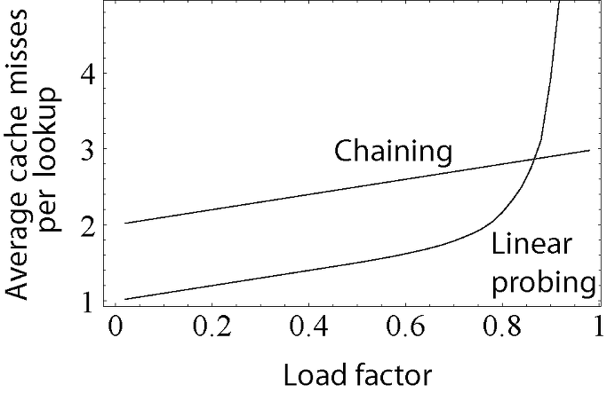
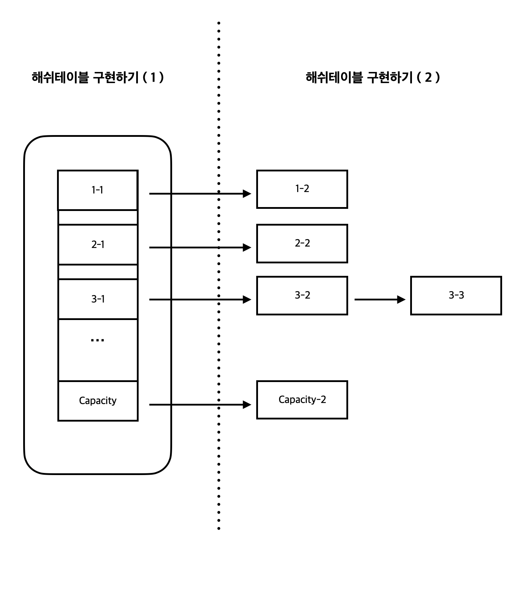

[//]: # (https://docs.oracle.com/javase/8/docs/api/ 의 HashTableTest 부분 참고)

# 해시테이블(HashTableTest)

해시테이블이란 해시함수(Hash Function)를 사용하여 변환한 값을 인덱스로 삼아 데이터의 값을 키와 함께
저장하여 검색을 빠르게 하기 위한 자료구조이다. 해시테이블은 키를 해쉬로 변경하여 값과 1대1로 매핑하기 떄문에 매우 빠른 속도로 검색할 수 있다는
장점이 있다. 하지만 이렇게 키를 해쉬로 변경하는 과정에서 다른 키 값을 가짐에도 불구하고 같은 해쉬 값을 가질 수 있어 해쉬 충돌(Hash Collision)이 발생하여
특정 키의 버킷에 많은 양의 데이터가 집중되어 해쉬테이블의 성능이 떨어질 수 있다.

입력 값이 무한한 입력값과는 다르게 유한한 출력값의 가짓수로 인해 발생하는 해쉬 충돌은 해쉬 함수를 잘 정의함으로써 해쉬 충돌로 발생하는 해쉬테이블의 성능 문제를
개선할 수 있다. 하지만 아무리 해쉬 함수를 잘 정의하더라도 해쉬함수의 입력값과 출력값이 가지는 차이점때문에 해쉬 충돌은 반드시 발생할 수 밖에 없다.(비둘기집 원리)

해시 충돌을 해결하는 방법에는 여러가지가 존재하는데 대표적으로 체이닝(Chaining)과 개방 주소법(Open Addressing)이 있다.
그리고 개방 주소법에는 선형 탐색(Linear Probing), 제곱 탐색(Quadratic Probing), 이중 해시(Double Hashin)이 존재하지만 이 외에도 믾은 방법들이 존재한다.

<br>

- 체이닝과 선형 탐색의 비교


<br>

체이닝 방식은 같은 키 값을 가지는 데이터들을 연결 리스트에 저장함으로써 복잡한 계산식을 사용할 필요가 개방주소법에 비해서 적다는 특징을 가지고 있다.
하지만 연결리스트에 데이터가 많이 저장될수록 해당 리스트에서 데이터를 찾을 때 성능 저하가 Linear하게 발생한다.
체이닝 방식과는 달리 개방주소법을 사용하면 지정한 메모리 외 추가적인 저장공간이 필요없고 삽입, 삭제시 오버헤드가 적다는 장점이 있으며 저장할 데이터가 적을 때
체이닝 방식보다 유리하다는 특징을 가지고 있다.

## 해시테이블 구현해보기

자바에서 기본적으로 제공하는 해시테이블 코드를 하나하나 뜯어보면서 공부해도 좋지만 시간이 꽤 걸릴 것 같기 때문에 우선 간단하게 해시테이블을 구현하는 클래스를 정의해보자.
이 해시테이블은 키와 밸류값으로 String 객체를 받을 것이고 hashCode() 메서드와 equals() 메서드는 String 클래스의 메서드를 그대로 사용할 것이다.

### 해시테이블 구현 (1)

```java
import java.util.Hashtable;
import java.util.LinkedList;

public class TestHashTablePackage.HashTable {
    class Node {
        String key;
        String value;

        Node(String key, String value) {
            this.key = key;
            this.value = value;
        }

        String getValue() {
            return value;
        }

        void setValue(String value) {
            this.value = value;
        }
    }

    LinkedList<Node>[] dataList;

    public Hashtable(int capacity) {
        dataList = new LinkedList[capacity];
    }
}
```

해시테이블을 구현하기 위해서 키와 밸류값을 가지는 Node 클래스를 TestHashTablePackage.HashTable 안에 정의했다. Node 클래스는 value 값을 가져오고 설정해줄 수 있는 getter 함수와 setter 함수가 정의되어있다.
그리고 TestHashTablePackage.HashTable 객체를 TestHashTablePackage.HashTable 생성자를 통해 생성할 경우 Node 객체만을 요소로 가지며 매개변수로 받은 capacity 값의 크기를 가지는 LinkedList가 생성된다.
여기까지 코드를 작성했다면 아래의 이미지의 해시테이블 구현하기 ( 1 ) 까지는 끝냈다.



이제 해시테이블의 dataList의 각 인덱스에 값이 삽입되면 Node 객체를 요소로 갖는 LinkedList를 생성한 후 이 LinkedList에 Node 객체를 넣을 수 있도록 코드를 작성해보자.

### 해시테이블 구현 (2)

위에서 작성했던 코드에서 추가해줘야 하는 코드는 Node 객체의 키 값의 해시코드를 구한 후 capacity 값으로 나눠 해당 노드가 들어갈 인덱스를 구하고
해당 인덱스에 LinkedList 객체를 만들어 Node 객체를 삽입할 수 있도록 하는 것이다. 아래의 코드를 보도록 하자.

```java
import java.util.Hashtable;
import java.util.LinkedList;

public class TestHashTablePackage.HashTable {

    ...
    
    LinkedList<Node>[] dataList;

    // getIndex()
    // 해시코드 값을 capacity 값과 동일한 dataList.length로 나눠
    // LinkedList에 노드가 들어갈 인덱스를 구하는 함수
    
    int getIndex(int hashcode) {
        return hashcode / dataList.length;
    }
    
    // searchKey()
    // dataList의 임의의 인덱스 값에 LinkedList와 key 값을 매개변수로 넣어 
    // LinkedList 안에 매개변수로 넣은 key 값과 같은 Node가 존재하는지 확인
    // 존재한다면 해당 Node 반환, 존재하지 않는다면 null 반환    
    Node searchKey(LinkedList<Node> list, String key) {
        if (list == null) return null;
        
        for (Node node : list){
            if (node.key.equals(key)){
                return node;
            }
        }
        return null;
    }
    
    // put(String key, String value)
    // 해당 key와 value 값으로 만들어지는 Node가 들어갈 인덱스를 key 값을 통해 구한다. 
    // 만약 dataList의 이전에 구한 인덱스의 값이 null 이라면 LinkedList 객체를 해당 인덱스에 할당하고 Node를 생성한 LinkedList에 추가한다.
    // 만약 dataList의 이전에 구한 인덱스의 값이 null 이 아니라면 매개변수로 받은 key 값을 가지는 Node가 LinkedList에 존재하는지 확인하고
    // 존재한다면 value 값을 덮어씌우고 존재하지 않는다면 Node를 생성한다.     
    void put(String key, String value) {
        int hashcode = key.hashCode();
        int index = getIndex(hashcode);
        
        LinkedList<Node> list = data[index];
        if (list == null){
            list = new LinkedList<Node>();
            data[index] = list;
        }
        
        Node node = searchKey(list, key);
        if (node == null){
            list.addLast(new Node(key, value));
        } else {
            node.value = value;
        }
    }
    
    // 매개변수로 받은 key 값을 가지는 Node가 있는지 확인하고 있다면 Node의 value 값을 반환, 없다면 Not Found를 반환한다.      
    String get(String key) {
        int hashcode = key.hashCode();
        int index = getIndex(hashcode);

        LinkedList<Node> list = data[index];
        Node node = searchKey(list, key);
        if (node == null) {
            return "Not Found";
        } else {
            return node.getValue();
        }
    }
}
```
이제 여기까지 했다면 아래 이미지의 해쉬테이블 구현하기 (2)까지 마무리한 것이다.


이제 여기까지 코드를 작성했다면 체이닝방식으로 구현된 해시테이블을 간단하게 구현해본 것이다.
마지막으로 우리가 만든 해시테이블이 잘 동작하는지 확인해보고 마치도록 하자.

### 해시테이블 테스트하기

- 테스트 코드

```java
import TestHashTablePackage.HashTable;

public class Test {
    public static void main(String[] args) {
        HashTable h = new HashTable(5);
        h.put("sung", "pretty");
        h.put("jin", "ugly");
        h.put("hee", "hansome");
        h.put("min", "sexy");
        h.put("lim", "lolo");

        System.out.println(h.get("sung"));
        System.out.println(h.get("jin"));
        System.out.println(h.get("hee"));
        System.out.println(h.get("min"));
        System.out.println(h.get("lim"));
    }
}
```

- 테스트 결과
```java
sung is pretty
messi is cute
hee is ugly
sim is reader
kim is follower
```

만약 해시테이블에 key에 따라 달라지는 hashcode 값과 index를 확인해보고 싶다면 해시테이블의 String get(String key) 메서드를 아래와 같이 변경하면 된다.
```java
public class TestHashTablePackage.HashTable {
    String get(String key) {
        int hashcode = key.hashCode();
        int index = getIndex(hashcode);

        System.out.println("key : " + key + ", hashcode : " + hashcode + ", index : " + index);
        System.out.println();
        
        LinkedList<Node> list = data[index];
        Node node = searchKey(list, key);
        if (node == null) {
            return "Not Found";
        } else {
            return node.getValue();
        }
    }
}
```

위와 같이 코드를 작성한 후 테스트 코드를 실행시키면 아래와 같은 결과가 출력되는 것을 확인할 수 있다. 

- 테스트 결과
```java
key : sung, hashcode : 3541915, index : 0
sung is pretty
        
key : messi, hashcode : 103786865, index : 0
messi is cute
        
key : hee, hashcode : 103176, index : 1
hee is ugly
        
key : sim, hashcode : 113879, index : 4
sim is reader
        
key : kim, hashcode : 106191, index : 1
kim is follower
```


