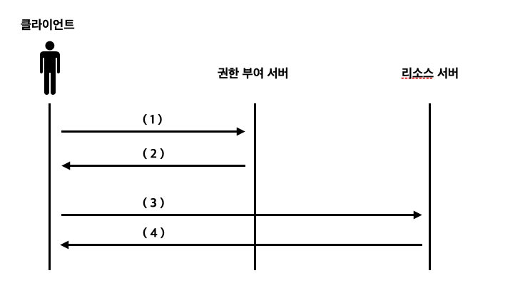

<br>

- 스프링 시큐리티 인 액션을 읽고 내용을 정리한 파일입니다.

<br>
<br>
<br>

# OAuth2 : 권한 부여 서버 구현하기

권한 부여 서버는 OAuth2 아키텍처에서 작동하는 구성 요소 중 하나이다. 권한 부여 서버는 사용자를 인증하고 클라이언트에게 토큰을 제공하는 역할을 한다.
우리는 이번에 권한 부여 서버를 구현할건데 스프링 시큐리티 OAuth2 종속성이 중단되어 클라이언트와 리소스 서버를 구현할 수 있는 대안은 있지만, 권한 부여 서버를 위한 대안은 아직 없다고 한다.

## 권한 부여 서버 구현하기

### 의존성 추가
이번엔 Maven 빌드 관리 툴을 사용해서 스프링 프로젝트를 만들었다. 만든 후 아래의 종속성들을 추가해주자.
```xml

 	<dependencies>
		<dependency>
			<groupId>org.springframework.boot</groupId>
			<artifactId>spring-boot-starter-web</artifactId>
		</dependency>
		<dependency>
			<groupId>org.springframework.boot</groupId>
			<artifactId>spring-boot-starter-oauth2-client</artifactId>
		</dependency>
		<dependency>
			<groupId>org.springframework.boot</groupId>
			<artifactId>spring-boot-starter-security</artifactId>
		</dependency>
    </dependencies>

	<dependencyManagement>
		<dependencies>
			<dependency>
				<groupId>org.springframework.cloud</groupId>
				<artifactId>spring-cloud-dependencies</artifactId>
				<version>Hoxton.SR1</version>
				<type>pom</type>
				<scope>import</scope>
			</dependency>
		</dependencies>
	</dependencyManagement>
```


### 사용자 추가하기

```java
@Configuration
public class WebSecurityConfig extends WebSecurityConfigurerAdapter {
    @Bean
    public UserDetailsService uds(){
        var uds = new InMemoryUserDetailsManager();
        var u = User.withUsername("sim")
                .password("1234")
                .authorities("read")
                .build();
        uds.createUser(u);
        return uds;
    }

    @Bean
    public PasswordEncoder passwordEncoder(){
        return NoOpPasswordEncoder.getInstance();
    }

    @Bean
    public AuthenticationManager authenticationManagerBean() throws Exception{
        return super.authenticationManagerBean();
    }
}
```

이렇게 WebSecurityConfig 클래스를 작성해줬다면 메모리에 username은 sim이고 비밀번호가 1234인 유저가 저장이 되었을것이다.
이제 유저까지 생성을 마쳤는데 권한 부여 서버에 클라이언트를 알려야한다. 권한 부여 서버에 클라이언트를 알린다는 것은 우리가 이전 12장에서 깃허브 홈페이지에서 애플리케이션을 등록한 후 애플리케이션의 Client_id와 Client_secret을 받아 요청을 보낼때 Client_id와 Client_secret을 함께 보내 클라이언트가 인증된 클라이언트임을 인증했던 것처럼 우리가 만들 권한 부여 서버에 클라이언트에 대한 정보를 저장해 요청을 보낸 클라이언트가 정상적인 클라이언트아닌지 확인할 수 있도록 해야한다는 의미이다. 우리가 만들 권한 부여 서버는 인증된 클라이언트의 요청만 수락하도록 할 것이다.

### 권한 부여 서버에 클라이언트 등록하기
```java
@Configuration
@EnableAuthorizationServer
public class AuthServerConfig extends AuthorizationServerConfigurerAdapter {
    @Autowired
    private AuthenticationManager authenticationManager;

    public void configure(AuthorizationServerEndpointsConfigurer endpoints) throws Exception {
        endpoints.authenticationManager(authenticationManager);
    }

    @Override
    public void configure(ClientDetailsServiceConfigurer clients) throws Exception {
        var service = new InMemoryClientDetailsService();

        var cd = new BaseClientDetails();
        cd.setClientId("client"); // 클라이언트 아이디 설정
        cd.setClientSecret("secret"); // 클라이언트 시크릿 설정
        cd.setScope(List.of("read")); // 클라이언트의 스코프 설정
        cd.setAuthorizedGrantTypes(List.of("password")); 

        service.setClientDetailsStore(
                Map.of("client", cd));


        clients.withClientDetails(service);
    }
}
```
이렇게 코드를 만들었다면 권한 부여 서버에게 클라이언트 아이디가 client이면서 클라이언트 시크릿이 secret인 클라이언트를 등록한 것이다. 이렇게 함으로써 권한 부여 서버에 등록되어있지않은 클라이언트의 요청을 거부할 수 있다.

BaseClientDetails는 UserDetailsService와 비슷하게 스프링 시큐리티가 이해할 수 있도록 클라이언트를 나타내는 인터페이스를 구현한 클래스이다. 

- 잘 기억하기
1. UserDetails는 사용자를 위한 것이고 ClientDetails는 클라이언트를 위한 것이다.
2. UserDetailsService는 사용자를 위한 것이고 ClientDetailsService는 클라이언트를 위한 것이다.
2. InMemoryUserDetailsManager는 사용자를 위한 것이고 InMemoryClientDetailsService는 클라이언트를 위한 것이다.
2. JdbcUserDetailsManager는 사용자를 위한 것이고 JdbcClientDetailsService는 클라이언트를 위한 것이다.

## 암호 그랜트 유형으로 권한 부여 서버 이용하기


1. 클라이언트에게 사용자의 자격 증명 정보를 전달함
2. 클라이언트가 권한 부여 서버에게 사용자의 자격 증명 정보를 전달함
3. 권한 부여 서버가 클라이언트에게 토큰을 전달함
4. 클라이언트가 권한 부여 서버에게 받은 토큰을 리소스 서버에게 전달함
5. 리소스 서버가 토큰을 가지고 유저 정보를 확인한 후 클라이언트에게 리소스를 전달

위의 이미지랑 내용은 암호 그랜트 유형으로 클라이언트가 리소스 서버의 리소스에 접근하는 과정이다.
여기서 우리가 구현한 권한 부여 서버가 해줘야 할 부분은 2, 3, 4 번의 과정이다. 
지금까지 코드를 잘 작성해뒀다면 이제 애플리케이션을 시작하고 테스트해보자. 우리가 구현한 권한 부여 서버는 /oauth/token 엔드포인트에서 토큰을 요청할 수 있다. 스프링 시큐리티가 이 엔드포인트를 자동으로 구성해줬기 때문이다. HTTP Basic으로 클라이언트의 자격 증명을 이용해 엔드포인트에 접근하고 필요한 세부 정보를 쿼리 매개 변수로 전달해보자.

- 토큰 발급받기
```bash
curl -v -X POST -u client:secret http://localhost:8080/oauth/token\?grant_type
\=password\&username\=sim\&password\=1234\&scope\=read
```

- 결과 
```bash
{"access_token":"90f23d21-39d4-42bd-812a-f4ef967255b4","token_type":"bearer","expires_in":43199,"scope":"read"}%
```

위에서받은 액세스 토큰은 스프링 시큐리티의 기본 구성에서 만들어 준 값으로 간단한 UUID 값이며 클라이언트는 리소스 서버가 노출하는 리소스를 이 토큰을 이용해 호출할 수 있다.

## 승인 코드 그랜트 유형 이용하기

승인 코드 그랜트 유형을 통해서 권한 부여 서버를 구현하려면 사용자를 한 번 리다이렉트 시켜줘야 한다. 그렇기 때문에 기존에 작성한 코드에서 클라이언트를 어디로 리다이렉트 시켜줄 것인지 작성해야 한다.

```java
@Configuration
@EnableAuthorizationServer
public class AuthServerConfig extends AuthorizationServerConfigurerAdapter {
    @Autowired
    private AuthenticationManager authenticationManager;

    public void configure(AuthorizationServerEndpointsConfigurer endpoints) throws Exception {
        endpoints.authenticationManager(authenticationManager);
    }

    @Override
    public void configure(ClientDetailsServiceConfigurer clients) throws Exception {
        clients.inMemory()
            .withClient("client")
            .secret("secret")
            .authorizedGrantTypes("authorization_code") // id가 client인 클라이언트는 승인 코드 그랜트만 이용할 수 있음
            .scopes("read")
            .redirectUris("http://localhost:9090/home") // 리다이렉트 URI 설정하기
                .and()
            .inMemory()
            .withClient("client2")
            .secret("secret2")
            .authorizedGrantTypes("authorization_code", "password", "refresh_token") // id가 client2인 클라이언트는 승인 코드, 암호, 갱신 토큰 허가를 모두 이용할 수 있음
            .scopes("read")
            .redirectUris("http://localhost:9090/home");

    }
}
```

위에서 설정한 리다이렉트 URI는 승인 코드를 받을때와 액세스 토큰을 발급받을 때 사용된다.
그리고 WebSecurityConfig 클래스를 아래와 같이 변경하자.
```java
@Configuration
public class WebSecurityConfig extends WebSecurityConfigurerAdapter {
    @Override
    protected void configure(HttpSecurity http) throws Exception {
        http.formLogin(); // 추가하기
    }
}
```
이렇게 코드를 잘 작성했다면 테스트하기 전 다시 한 번 승인 코드 그랜트 유형의 과정을 다시 한 번 살펴보자.


1. 사용자가 클라이언트에 접근하고 싶다고 알림
2. 권한 부여 서버에 이 작업을 할 수 있게 허락한다고 알려줌
3. 클라이언트가 권한 부여 서버에게 사용자의 계정에 접근하도록 허락했음을 알리고 자격 증명을 전달함
4. 권한 부여 서버가 클라이언트에게서 전달 받은 자격 증명을 확인함
5. 클라이언트가 승인 코드와 세부 정보를 자격 증명 서버에게 전달함
5. 권한 부여 서버가 클라이언트에게서 받은 정보를 확인하고 클라이언트에게 토큰을 전달함
6. 클라이언트가 권한 부여 서버에게 받은 토큰을 사용해 리소스 서버의 리소스에 접근함

위의 과정을 기억한 후 서버를 실행하고 테스트해보자.

### 승인 코드 그랜트 유형 테스트 1
서버를 실행한 후 위의 URI로 요청을 보내보자.
http://localhost:8080/oauth/authorize?response_type=code&client_id=client&scope=read

요청을 보냈다면 아래와 같은 응답을 받은 것을 확인할 수 있다.


해당 페이지에서 아이디와 비밀번호를 입력해보자.


알맞은 아이디와 비밀번호를 입력했다면 권한 부여 서버가 요청된 범위를 명시적으로 허가 또는 거부하도록 요청할 수 있는 페이지로 리다이렉트해줬을 것이다.
scope.read 를 Approve로 변경하고 Authoize 버튼을 눌러보자.

 

정상적으로 동작했다면 위와같이 권한 부여 서버가 클라이언트에게 설정해준 리다이렉트 URI로 리다이렉트 시켜줌과 동시에 승인 코드를 전달해준 것을 확인할 수 있을 것이다. 
해당 승인 코드를 가지고 권한 부여 서버에 액세스 토큰을 발급받기 위해 다시 curl 요청을 보내야한다.

- 액세스 토큰 발급 요청
```bash
curl -v -X POST -u client:secret "http://localhost:8080/oauth/token?grant_type=authorization_code&scope=read&code=L7367L"
```

- 권한 부여 서버로의 응답
```bash
{"access_token":"e08dbe66-2b40-4e94-822e-6028303b2e7b","token_type":"bearer","expires_in":43199,"scope":"read"}%
```

권한 부여 서버로부터 정상적으로 액세스 토큰을 발급받았다. 이제 이 토큰을 사용해 리소스 서버에게 리소스를 요청하면 리소스에 접근을 할 수 있다. 액세스 토큰을 발급받는데 사용한 승인 코드는 단 한 번만 사용할 수 있고 같은 코드를 사용해 다시 /oauth/token 엔드포인트를 호출하려고 하면 오류가 발생한다.

- 오류 발생 이미지

 


## 클라이언트 자격 증명 그랜트 유형 이용하기



1. 리소스에 접근하기 위해 클라이언트 자격 증명을 권한 부여 서버에게 전달한다.
2. 권한 부여 서버는 해당 클라이언트의 자격 증명을 확인하고 액세스 토큰을 전달한다.
3. 리소스에 접근하기 위해 리소스 서버에 토큰을 전달한다.
4. 리소스 서버는 토큰이 유효하다면 리로스를 전달한다.

위의 이미지와 내용은 12장에서 정리한 클라이언트 자격 증명 그랜트 유형에 관한 내용이다. 이 그랜트 유형은 백엔드와 백엔드 인증에 이용하며 이 그랜트 유형은 사용자의 인증없이도 클라이언트가 호출 할 수 있어야 한다.

```java
@Configuration
@EnableAuthorizationServer
public class AuthServerConfig extends AuthorizationServerConfigurerAdapter {
    @Autowired
    private AuthenticationManager authenticationManager;

    public void configure(AuthorizationServerEndpointsConfigurer endpoints) throws Exception {
        endpoints.authenticationManager(authenticationManager);
    }

    @Override
    public void configure(ClientDetailsServiceConfigurer clients) throws Exception {
        var service = new InMemoryClientDetailsService();

        var cd = new BaseClientDetails();
        cd.setClientId("client");
        cd.setClientSecret("secret");
        cd.setScope(List.of("info"));
        cd.setAuthorizedGrantTypes(List.of("client_credentials"));

        service.setClientDetailsStore(
                Map.of("client", cd));


        clients.withClientDetails(service);
    }
}
```
위와 같이 AuthServerConfig를 수정한 후에 서버를 실행한 후 테스트 해보자.

- 요청하기
```bash
curl -v -X POST -u client:secret "http://localhost:8080/oauth/token?grant_type=client_credentials&scope=info"
```

- 응답
```bash
{"access_token":"eccce73f-9757-47df-b76b-1aa7da65759a","token_type":"bearer","expires_in":43199,"scope":"info"}%
```

위에서 했던 다른 그랜트 유형들과 거의 비슷하지만 grant_type과 scope 값이 바뀌고 있는 것에 주목하자.
클라이언트 자격 증명 그랜트 유형에서 조심할 점은 클라이언트가 자체 자격 증명을 이용하는 것이 이 그랜트 유형의 유일한 조건이라는 점이다. 


## 갱신 토큰 그랜트 유형 사용하기

이것만 하면 12장에서 봤던 그랜트 유형들을 모두 구현해보는 것이다. 
갱신 토큰을 사용하면 승인 코드 그랜트 유형 및 암호 그랜트 유형과 함께 이용할 수 있다는 이점이 있다. 스프링 시큐리티가 기본적으로 제공하는 설정에서 갱신 토큰을 이용하려면 클라이언트의 허가 목록에 갱신 토큰 허가를 추가해야한다.

- AuthServerConfig 클래스 수정하기
```java
@Configuration
@EnableAuthorizationServer
public class AuthServerConfig extends AuthorizationServerConfigurerAdapter {
    @Autowired
    private AuthenticationManager authenticationManager;

    public void configure(AuthorizationServerEndpointsConfigurer endpoints) throws Exception {
        endpoints.authenticationManager(authenticationManager);
    }

    @Override
    public void configure(ClientDetailsServiceConfigurer clients) throws Exception {
        var service = new InMemoryClientDetailsService();

        var cd = new BaseClientDetails();
        cd.setClientId("client");
        cd.setClientSecret("secret");
        cd.setScope(List.of("read"));
        cd.setAuthorizedGrantTypes(List.of("password", "refresh_token"));

        service.setClientDetailsStore(
                Map.of("client", cd));


        clients.withClientDetails(service);
    }
}
```

이제 서버를 실행하고 정상적으로 권한 부여 서버가 갱신 토큰을 발급해주는지 확인해보자. 

- 요청
```bash
curl -v -X POST -u client:secret http://localhost:8080/oauth/token\?grant_type\=password\&username\=sim\&password\=1234\&sco
pe\=read
```

- 응답
```bash
{"access_token":"58166a12-353d-43c1-987a-57815dbaa2ba","token_type":"bearer","refresh_token":"0cee0325-5406-4be5-b60e-fbbbac053b05","expires_in":43199,"scope":"read"}%
```

응답에 refresh_token 값을 받아온 것을 확인할 수 있다. 매번 공부할때마다 새로운 내용이 많고 볼륨이 커지는 것 같은 느낌이 들지만 천천히 정리해보자..