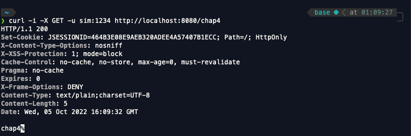

<br>

- 스프링 시큐리티 인 액션을 읽고 내용을 정리한 파일입니다.

<br>
<br>
<br>

스프링 시큐리티는 유저 인증을 위해 UserDetailsService와 PasswordEncoder를 사용한다. Password에 대해서 별로 중요하지 않게 생각하는 사람도 있겠지만 애플리케이션에서 Password는 매우 중요한 역할을 한다.

<br>

예를들어서 모바일 은행 애플리케이션을 내가 만들었다고 해보자. 이 애플리에키션에서 유저들은 로그인 후 해당 유저의 계좌에서 다른사람에게 돈을 보내고 받는등의 기능을 사용할 것이다.

이렇게 은행 애플리케이션에서 자신의 계좌에서만 돈을 보내고 받도록 권한을 부여하는 것은 새로운 기능을 추가하는 것보다 몇배는 중요한데 만약 다른 사람의 계좌에서 내 계좌로 돈을 송금할수있도록 애플리케이션을 고쳐서 사용하게되면 그로 인한 피해가 발생하고 애플리케이션의 신뢰도가 매우 떨어질 것이 분명하기 때문이다.

그렇기때문에 암호를 통한 유저의 인증은 애플리케이션을 만듦에 있어 매우 중요한 기능인데 암호 처리에 관한 중요성을 강조하는 것은 여기까지 하도록 하고 스프링 시큐리티는 어떻게 암호처리를 하고있을까 ?

<br>
<br>
<br>
<br>

# 스프링 시큐리티 암호 처리

<br>

스프링 시큐리티가 유저 인증을 할 때 AuthenticationProvider가 UserDetailsService와 PasswordEncoder를 사용한다는 것은 이전까지 공부해서 잘 알았는데 지금까지 PasswordEncoder가 코드로 어떻게 작성되어있고 어떻게 동작하는지에 대해서 알아보지 않았으니까 이번 기회에 알아보도록 하자.

<br>

```java
public interface PasswordEncoder {


	String encode(CharSequence rawPassword);

	boolean matches(CharSequence rawPassword, String encodedPassword);

	default boolean upgradeEncoding(String encodedPassword) {
		return false;
	}

}
```

<br>

위의 코드가 스프링 시큐리티에서 암호처리의 근간이 되었던 PasswordEncoder 인터페이스 코드이다. 해당 인터페이스는 rawPassword를 인코딩하는 메서드와 rawPassword가 인코딩된 패스워드가 일치하는지 확인하는 matches 메서드가 있다. 물론 이외에도 upgradeEncoding가 있지만 이 메서드는 우선 넘어가도록 하자.

우리는 지금까지 PasswordEncoder 인터페이스를 구현한 NoOpPasswordEncoder 클래스를 사용했는데 해당 클래스가 어떻게 작성되어있는지 확인해보자.

<br>
<br>
<br>

```java
@Deprecated
public final class NoOpPasswordEncoder implements PasswordEncoder {

	private static final PasswordEncoder INSTANCE = new NoOpPasswordEncoder();

	private NoOpPasswordEncoder() {
	}

	@Override
	public String encode(CharSequence rawPassword) {
		return rawPassword.toString();
	}

	@Override
	public boolean matches(CharSequence rawPassword, String encodedPassword) {
		return rawPassword.toString().equals(encodedPassword);
	}

	/**
	 * Get the singleton {@link NoOpPasswordEncoder}.
	 */
	public static PasswordEncoder getInstance() {
		return INSTANCE;
	}

}
```

<br>


해당 클래스의 encode 메서드를 보면 rawPassword에 어떠한 처리도 하지않은그대로의 rawPassword를 리턴해주는 것을 볼 수 있다. 한마디로 인코딩하지 않는다는 것이다.

이렇게 password의 인코딩처리를 해주지 않으면 보안상에 큰 문제가 되기때문에 클래스에 @Deprecated 어노테이션이 붙어있는 것을 볼 수 있다. 실제 프로젝트에서는 쓰지않는것이 좋지만 우리는 테스트를 위해 이전까지의 코드들에서 사용해왔다.

이제 NoOpPasswordEncoder의 matches 메서드도 확인해보자. encode 메서드와 마찬가지로 rawPassword의 값 그대로 일치하는지 equal 메서드를 통해서 확인하고 있는 것을 볼 수 있다.

이렇게 입력받은 패스워드를 그대로 DB에 저장하게 된다면 혹시라도 DB가 털렸을때 무진장 큰일이 나게된다. 그렇다면 PasswordEncoder 인터페이스를 구현한 다른 클래스는 어떤게 있을까 ?

<br>
<br>

1. NoOpPasswordEncoder - 암호를 인코딩하지않고 일반 텍스트 형태로 유지한다.
2. StandardPasswordEncoder - SHA-256 해싱 함수로 암호를 인코딩한다.
3. Pbkdf2PasswordEncoder - Pbkdf2 해싱 함수로 암호를 인코딩한다.
4. BCryptPasswordEncoder - bcrypt 해싱 함수로 암호를 인코딩한다.
5. SCryptPasswordEncoder - scrypt 해싱 함수로 암호를 인코딩한다.

<br>

위의 5가지 PasswordEncoder를 구현한 클래스다. 각각의 클래스마다 인코딩하는 방식이 다르기 때문에 사용하고싶은 클래스를 사용하면 되지만 프로젝트에서는 NoOpPasswordEncoder와 StandardPasswordEncoder는 쓰지 않는것을 추천한다. 왜냐하면 보안상 좋지않기 때문이다. 

<br>
<br>
<br>
<br>

## Pbkdf2PasswordEncoder

Pbkdf2PasswordEncoder는 패스워드를 Pbkdf2로 인코딩하는 클래스이다. Pbkdf2PasswordEncoder의 인스턴스를 만들때는 아래와 같은 옵션들이 존재한다.

<br>

```java
Pbkdf2PasswordEncoder p = new Pbkdf2PasswordEncoder();
Pbkdf2PasswordEncoder p = new Pbkdf2PasswordEncoder("secret")
Pbkdf2PasswordEncoder p = new Pbkdf2PasswordEncoder("secreat", 185000, 256);
```

<br>

Pbkdf2는 반복 횟수 인수만큼 HMAC를 수행하는 아주 단순하고 느린 해싱 함수인데 패스워드를 많은 횟수를 반복해서 인코딩할수록 성능에 영향을 주고  애플리케이션이 소비하는 리소스가 증가하므로 적절한 횟수로 인코딩하는 것을 권장한다.

<br>
<br>
<br>
<br>

## BCryptPasswordEncoder를 사용해보기

이전 chap2나 chap3에서 NoOpPasswordEncoder를 사용했던것처럼 chap4에서는 BCryptPasswordEncoder를 사용해보자.

<br>

```java
@Configuration
public class ProjectConfig {

    @Bean
    public UserDetailsService userDetailsService(){
        BCryptPasswordEncoder encoder = new BCryptPasswordEncoder();
        String password = "1234";

        UserDetails u = User.withUsername("sim")
                .password(encoder.encode(password))
                .authorities("read")
                .build();

        List<UserDetails> users = List.of(u);
        return new InMemoryUserDetailsManager(users);
    }

    @Bean
    public PasswordEncoder passwordEncoder(){
        return new BCryptPasswordEncoder();
    }
}
```
<br>


chap2와 chap3처럼 InMemoryUserDetailsManager를 사용하고 username = sim, password = 1234, authorities = "read"인 유저를 생성했다. 여기서 위의 ProjectConfig에서 주목해야할 부분은 아래에 작성된 코드이다.

<br>

```java
BCryptPasswordEncoder encoder = new BCryptPasswordEncoder();
String password = "1234";

UserDetails u = User.withUsername("sim")
            .password(encoder.encode(password))
            .authorities("read")
            .build();         
```

<br>

이 코드에서 User의 password가 BCryptPasswordEncoder클래스의 encoder 메서드를 통해서 인코딩되어 저장되는것을 볼 수 있는데 이렇게 유저의 비밀번호를 암호화해서 저장하는것이 보안에 좋다.

그렇다면 이제 프로젝트를 실행시킨 후 /chap4로 요청을 보내보도록 하자.

<br>

- 요청코드

```bash
curl -i -X GET -u sim:1234 http://localhost:8080/chap4
```

- 요청 결과



<br>

NoOpPasswordEncoder 대신 BCryptPasswordEncoder를 사용한다고해서 많은 부분에서 차이나는 것이 아니라 password를 인코딩하고 요청받은 유저의 패스워드가 디비에 저장된 유저의 패스워드가 일치하는지 PasswordEncoder의 matches 메서드를 통해 확인하는 부분만 차이가 나게된다.

패스워드를 인코딩할때에는 NoOpPasswordEncoder나 StandardPasswordEncoder가 아닌 다른 패스워드 인코더를 사용하도록 하자

<br>
<br>

## DelegatingPasswordEncoder

만약 하나의 프로젝트에 여러가지 인코더를 사용하게된다면 DelegatingPasswordEncoder사용하는 것도 좋은 방법이 될 수 있다.

DelegatingPasswordEncoder에 대해서는 따로 글을 작성하도록 하고 chap4의 정리는 여기서 마치도록 하자.


                
