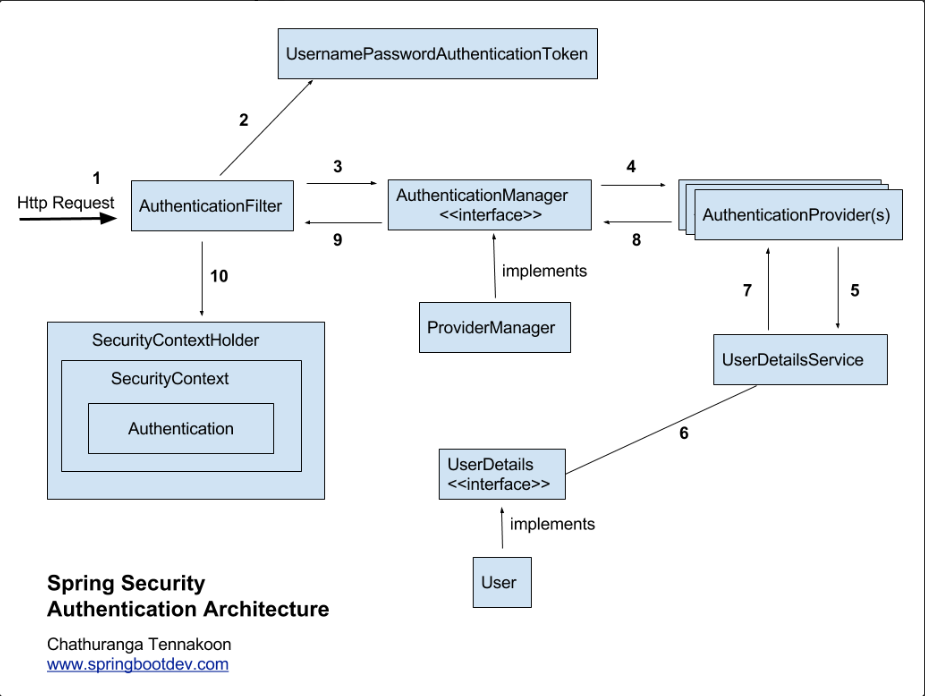
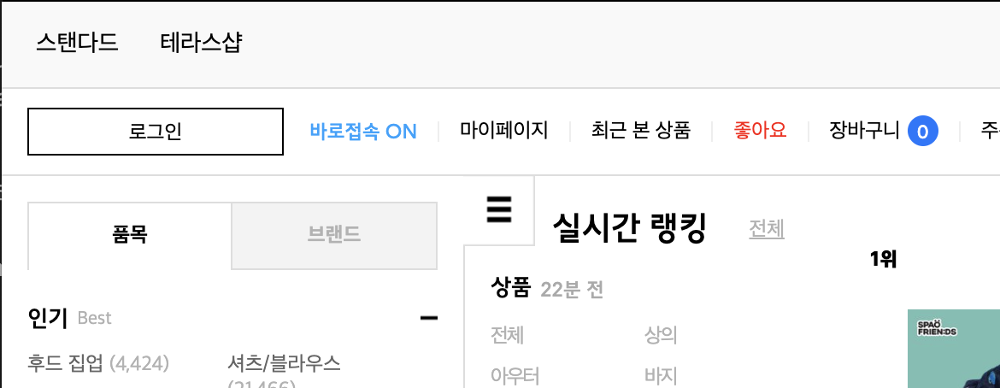
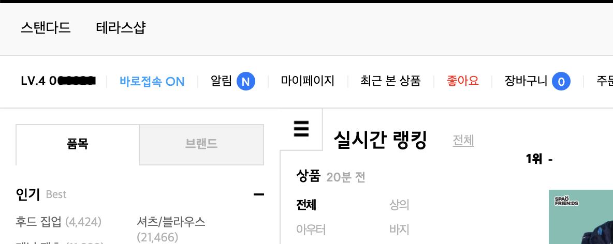
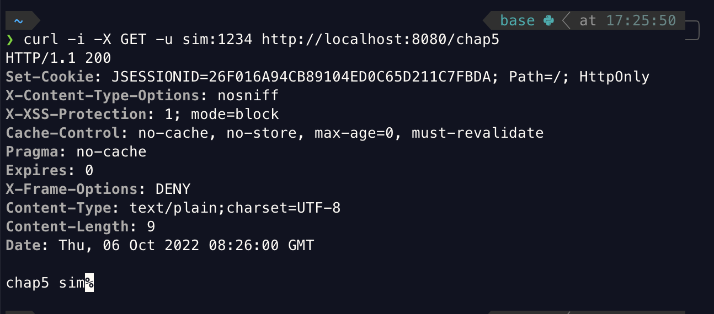

<br>

- 스프링 시큐리티 인 액션을 읽고 내용을 정리한 파일입니다.

<br>
<br>
<br>

# 인증 구현하기

이번 chap_5에서는 스프링 시큐리티에서 AuthenticationProvider가 어떻게 인증을 구현하는지 알아보도록 하자.

<br>



<br>

위의 이미지는 요청을 받았을 때 스프링 시큐리티가 유저를 인증하는 방법을 나타낸 이미지이다.

이전에도 알겠지만 필터가 url을 가로채서 AuthenticationManager에게 인증책임을 위임하고 AuthenticationManager는 AuthenticationProvider가 구현한 인증논리를 사용해 사용자를 인증을 한다.

이전까지는 AuthenticationProvider가 UserDetailsService와 PasswordEncoder를 사용해서 사용자의 정보를 가져오고 암호가 일치하는지 확인할 때 UserDetailsService와 PasswordEncoder가 어떻게 동작하는지 알아봤다.

이제는 AuthenticationProvider가 어떻게 UserDetailsService와 PasswordEncoder를 사용하는지 알아보자

<br>
<br>
<br>
<br>

## AuthenticationProvider 알아보기

<br>


우선 AuthenticationProvider가 구현하는 인증논리는 다양한 방법으로 작성될 수 있다. 예를들어 username과 password를 받아서 요청 받은 username이 데이터베이스에 있는지 또 있다면 password가 일치하는지를 알아내서 인증할수있고, password가 아닌 username과 지문정보를 사용해서 사용자 인증을 처리할 수 있다.

그렇다면 우선 AuthenticationProvider 인터페이스가 어떻게 작성되었는지 확인해보자.

<br>

```java
public interface AuthenticationProvider {

	Authentication authenticate(Authentication authentication) throws AuthenticationException;

	boolean supports(Class<?> authentication);

}
```

<br>

AuthenticationProvider는 Authentication 객체를 받아서 Authentication 객체를 리턴하는 authenticate 메서드는 인증이 실패하면 AuthenticationException을 발생시키고 인증을 지원하지않는 인증 객체를 받으면 null을, 인증이 성공했다면 완전히 인증된 객체를 나타내는 Authentication 인스턴스를 반환한다.

supports 메서드는 AuthenticationProvider가 Authentication 객체로 제공된 형식을 지원하면 true를 반환한다. supports 메서드에서 주의할 점은 이 메서드가 객체에 대해 true를 반환해도 authenticate() 메서드가 null을 반환해 요청을 거부할 수 있다는 점이다.

그러면 이제 여기서 다시 한번 궁금한건 Authentication 객체이다. Authentication 는 어떻게 구현되어있는지 확인해보자.

<br>

```java
public interface Authentication extends Principal, Serializable {

	Collection<? extends GrantedAuthority> getAuthorities();

	Object getCredentials();

	Object getDetails();

	Object getPrincipal();

	boolean isAuthenticated();

	void setAuthenticated(boolean isAuthenticated) throws IllegalArgumentException;

}
```

<br>

Authentication 인터페이스는 사용자(Principal)의 정보를 리턴하는 메서드들을 정의하고 있다. 

- isAuthenticated() : 인증 프로세스가 끝났으면 true를 반환하고 아직 진행중이면 false를 반환한다.
- getCredentials() : 인증 프로세스에 이용된 암호나 비밀을 반환한다.
- getAuthorities() : 인증된 요청에 허가된 권한의 컬렉션을 반환한다.

<br>

AuthenticationProvider의 authenticate() 메서드에서 완전히 인증된 객체는 isAuthenticated()의 true값을 리턴한다.

이외에도 몇개의 메서드가 더 있지만 Authentication 인터페이스에 관해서는 우선 넘어가도록 하자

<br>
<br>
<br>

## AuthenticationProvider 구현 과정
___

1. AuthenticationProvider 인터페이스를 구현하는 클래스를 선언한다.
2. 새 AuthenticationProvider가 어떤 종류의 Authentication 객체를 지원할지 결정한다.
    1. 정의하는 AuthenticationProvider가 지원하는 인증유형을 나타내도록 suppoert 메서드를 재정의한다.
    2. authenticate(Authentication a)메서드를 재정의해 인증 논리를 구현한다.
3. 새 AuthenticationProvider 구현의 인스턴스를 스프링 시큐리티에 등록한다.

위의 과정에 따라 하나씩 코드를 작성해보도록 하자.

<br>
<br>
<br>
<br>

## 1. AuthenticationProvider 인터페이스를 구현하는 클래스를 선언한다.
___

<br>
<br>

```java
// chap_5 :  src/main/java/config/CustomAuthenticationProvider
@Component
public class CustomAuthenticationProvider implements AuthenticationProvider {
    
    @Autowired
    private UserDetailsService userDetailsService;

    @Autowired
    private PasswordEncoder passwordEncoder;


}
```

<br>
<br>

```java
@Component
    public class ProjectConfig {
        @Bean
        public UserDetailsService userDetailsService(DataSource dataSource){

            return new JdbcUserDetailsManager(dataSource);
        }

        @Bean
        public PasswordEncoder passwordEncoder(){
            return NoOpPasswordEncoder.getInstance();
        }

}
```

CustomAuthenticationProvider에서 @Autowired로 애너테이션으로 ProjectConfig에 등록된 UserDetailsService와 PasswordEncoder를 사용할 수 있도록 했다.

당연하게도 이렇게 코드를 작성하면 에러가 발생할 것이다. 에러가 발생하는 이유는 AuthenticationProvider가 구현해줘야할 메서드들을 재정의해주지 않았기 때문이다.

<br>
<br>
<br>
<br>
<br>


## 2-1. CustomAuthenticationProvider의 suppoert 메서드를 재정의하기

<br>
<br>

```java
// chap_5 :  src/main/java/config/CustomAuthenticationProvider
@Component
public class CustomAuthenticationProvider implements AuthenticationProvider {

    @Autowired
    private UserDetailsService userDetailsService;

    @Autowired
    private PasswordEncoder passwordEncoder;


    @Override
    public boolean supports(Class<?> authenticationType) {
        return authenticationType.equals(UsernamePasswordAuthenticationToken.class);
    }

}
```

supports() 메서드는 매개변수로 받은 AuthenticationType이 UsernamePasswordAuthenticationToken의 클래스타입과 같다면 true를 반환하도록 코드를 작성했다.

이제 CustomAuthenticationProvider의 authenticate() 메서드를 재정의해보자.

<br>
<br>
<br>


## 2-2 authenticate(Authentication a) 재정의하기 + 빈으로 등록하기

<br>
<br>

```java
@Component
public class CustomAuthenticationProvider implements AuthenticationProvider {
    @Autowired
    private UserDetailsService userDetailsService;

    @Autowired
    private PasswordEncoder passwordEncoder;


    @Override
    public Authentication authenticate(Authentication authentication) throws AuthenticationException {
        String username = authentication.getName();
        String password = authentication.getCredentials().toString();

        UserDetails u = userDetailsService.loadUserByUsername(username);
        if(passwordEncoder.matches(password ,u.getPassword())){
            return new UsernamePasswordAuthenticationToken(
                    username,
                    password,
                    u.getAuthorities()
            );
        } else {
            throw new BadCredentialsException("error");
        }
    }

    @Override
    public boolean supports(Class<?> authenticationType) {
        return authenticationType.equals(UsernamePasswordAuthenticationToken.class);
    }
}
```

<br>

이번에 CustomAuthenticationProvider의 authenticate 메서드를 오버라이드 해봤는데 어떻게 오버라이드했는지 확인해보자.

우선 authenticate() 메서드는 매개변수로 받은 Authentication 객체에서 username과 password를 받아와서 UserDetailsService와 PasswordEncoder가 사용하여 유저 인증을 할 수 있도록 코드를 작성했다.

만약 매개변수로 받은 Authentication객체의 아이디와 비밀번호가 데이터베이스내의 유저의 정보와 일치한다면 UsernamePasswordAuthenticationToken을 반환하고 그렇지 않으면 BadCredentialsException 예외를 발생시키도록 오버라이딩했다.

마지막으로 CustomAuthenticationProvider를 빈으로 등록하기 위해서 @Component 어노테이션을 붙여줬다.

<br>
<br>
<br>
<br>


# SecuritContext 사용하기

<br>

SecuritContext는 프로젝트에서 유저 인증을 마친후에 인증된 엔티티에 대한 세부 정보를 사용할 때 사용한다. 

- 유저의 세부정보를 사용하는 예시
<table>
    <tr>
        <td>
        <td>
    </tr>
</table>

이렇게 로그인 후 유저의 아이디를 메인페이지에 띄운다던지 여러가지 유저의 정보를 사용하기 위해서는 인증된 엔티티에 대한 유저 정보를 사용할 수 있어야한다.

스프링 시큐리티는 이렇게 유저정보를 사용하기 위해서 SecuritContext를 사용한다. 그렇다면 스프링 시큐리티는 유저인증 후 유저에 대한 정보를 SecuritContext에 어떻게 저장하고 있을까 ?

## SecurityContext가 동작하는 방식 알아보기

우선 위에서 공부한 AuthenticationProvider가 유저를 인증헀던 방법에 대해서 다시 한번 생각해보자. AuthenticationProvider는 authenticate() 메서드를 통해서 유저인증을 마치고 Authentication 객체를 리턴했다. 그렇다면 리턴된 Authentication 객체는 어디로 이동할까 ?

그걸 알기위해서 이전에도 계속 봤던 이미지를 다시 한번 보도록하자.

<br>


<br>

위의 이미지의 AuthenticationProvder > AuthenticationManager > AuthenticationFilter > SecurityContextHolder까지 가는 8번부터 10번까지를 주의깊게 보면 AuthenticationProvder의 authenticate() 메서드에서 Authentication 객체가 리턴되어 어디로 가는지 알수 있을 것이다.

이정도까지 보고 이제 SecurityContext가 어떻게 구현되었는지 코드를 보도록 하자.

<br>

```java
public interface SecurityContext extends Serializable {

	Authentication getAuthentication();
	void setAuthentication(Authentication authentication);

}
```

<br>

위의 코드를 보면 SecurityContext가 가지고있는 책임은 Authentication객체를 저장하고 리턴해주는 것이라고 유추할 수 있다. 

<br>
<br>


## SecurityContext가 관리되는 방식

스프링 시큐리티 인 액션에서는 SecurityContext가 어떻게 관리되는지를 설명하면서 스레드를 사용하는데 스레드에 대해 아직 잘 알지못해서 넘어가도록 하자.

<br>
<br>
<br>

<br>

## SecurityContext의 데이터 사용하기

우리는 유저 데이터를 사용하기 위해서 유저 정보가 담긴 Authentication 객체에서 유저 정보를 가져와야한다. 하지만 Authentication는 SecurityContext에 저장되어 있고 SecurityContext는 SecurityContextHolder에 저장되어있다. 그렇다면 Authentication를 가져오기 위해서는 Authentication의 저장순서의 역순으로 데이터를 가져오면되는데 /chap5로 유저가 로그인 후 요청을 보내면 chap5 username의 형식으로 데이터를 받을 수 있도록 Controller를 수정해보자 

<br>

```java
@RestController
public class Controller {
    @RequestMapping(value = "chap5", method = RequestMethod.GET)
    public @ResponseBody String chap5(){
        SecurityContext context = SecurityContextHolder.getContext();
        String username = context.getAuthentication().getName();
        
        return "chap5" + username;
    }
}
```

<br>

위의 코드를 보기전에 설명을 다시해보자면 Authentication 객체는 Authentication SecurityContext > SecurityContextHolder 로 저장되어있기때문에 해당 Authentication 객체를 가져오기 위해서는  SecurityContextHolder > SecurityContext > Authentication 순으로 가져와야한다. 이점에 주목해서 코드를 보도록 하자.

우선 SecurityContextHolder의 getContext() 메서드를 사용해 SecurityContext를 저장했다. 그 후 context 에서 Authentication 객체를 가져오기위해서 context의 getAuthentication() 메서드를 사용했고 그렇게 가져온 Authentication 객체에서 name값을 가져오기 위해서 getName() 메서드를 사용했다.

그렇게 시큐리티 컨텍스트에서 username을 가져온 후 chap5 username의 데이터를 리턴하도록 컨트롤러 코드를 작성했다. 마지막으로 정상적으로 해당 데이터가 넘어오는지 확인해보고 마치도록 하자.

<br>
<br>

- 요청 코드
```bash
curl -i -X GET -u sim:1234 http://localhost:8080/chap5
 ```

- 응답 이미지



정상적으로 username 값을 가져와 출력한 것을 볼 수 있다. 이렇게 시큐리티 컨텍스트를 사용하면 유저 인증 후 해당 유저의 정보를 손쉽게 사용할 수 있다.