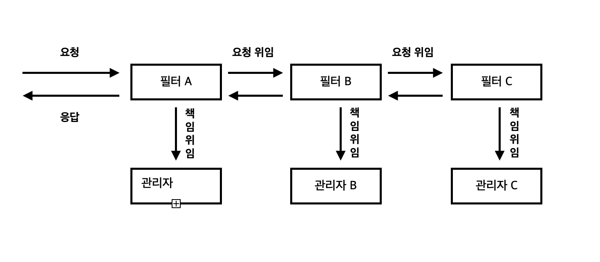
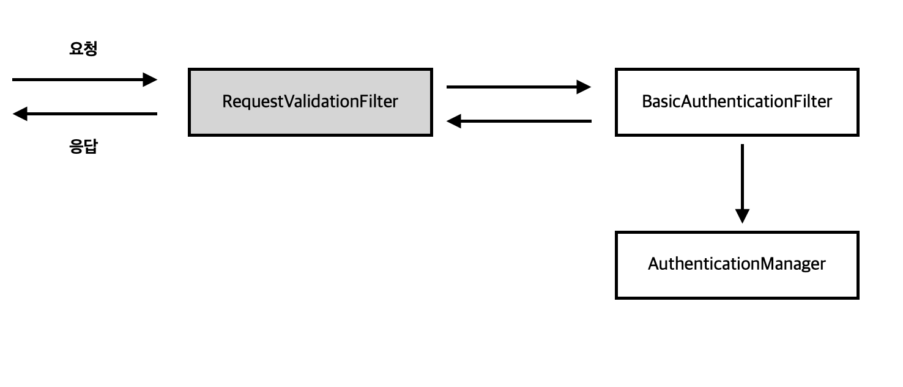
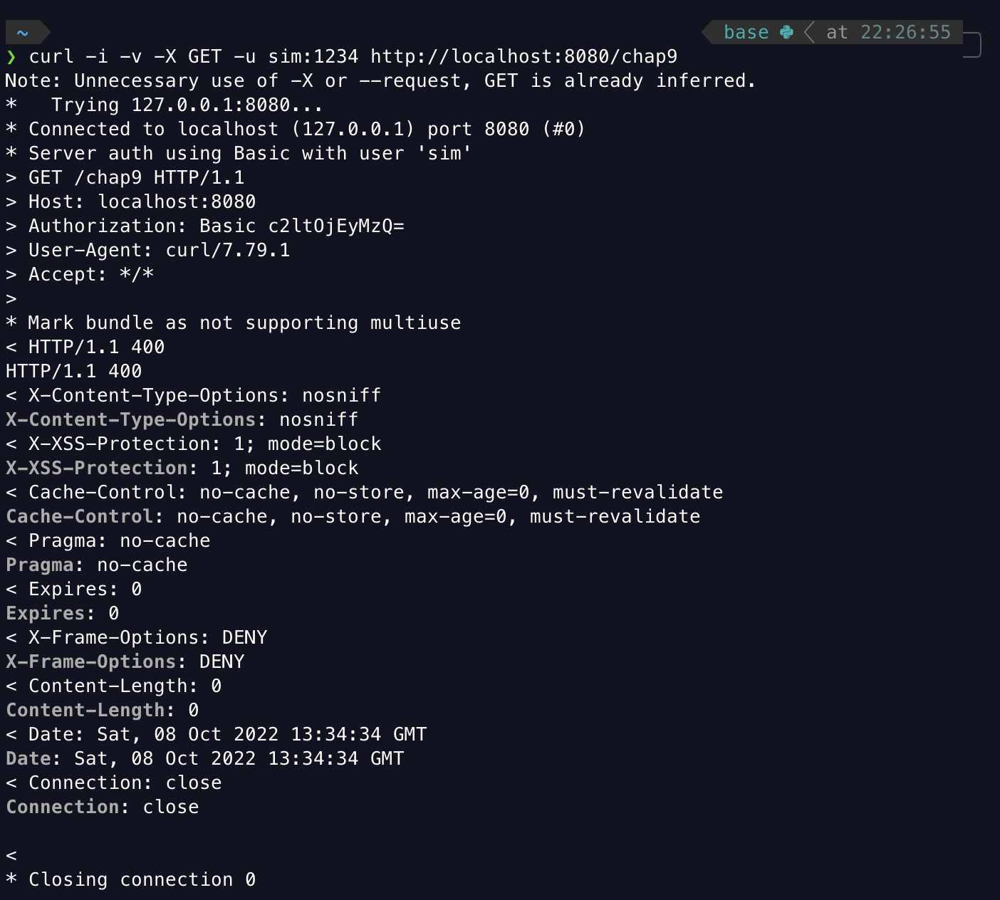
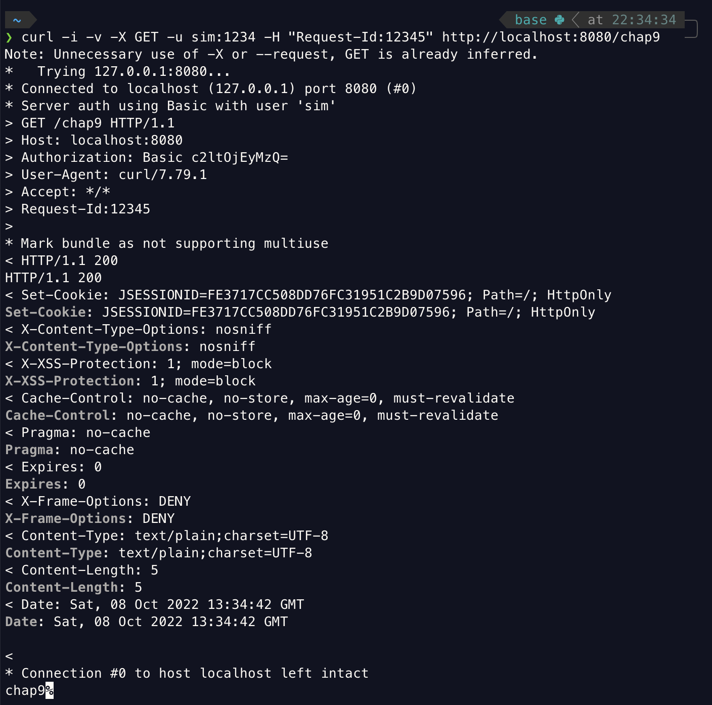
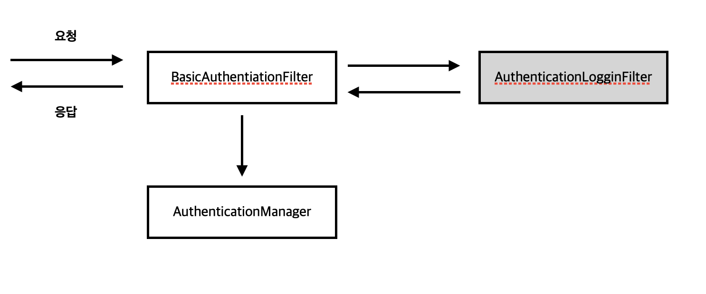
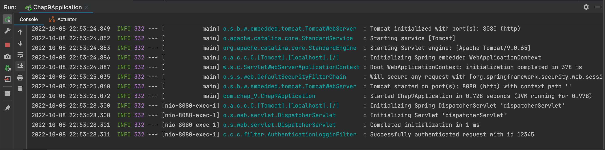
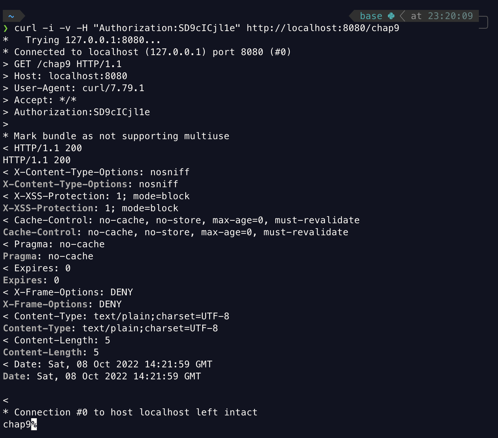

<br>

- 스프링 시큐리티 인 액션을 읽고 내용을 정리한 파일입니다.

<br>
<br>
<br>

우리는 지금까지 스프링 시큐리티를 공부하면서 여러번 필터에 대한 내용을 공부했다. HTTP 요청에 적용되는 책임을 위임하는 HTTP 필터와 인증 성공 후 권한 부여 구성을 처리하는 특정한 필터에 대해서도 공부했다. 스프링 시큐리티의 HTTP 필터는 일반적으로 요청에 적용해야 하는 각 책임을 관리하며 책임의 체인을 형성한다. 필터는 요청을 수신하고 그 논리를 실행하며 최종적으로 체인의 다음 필터에 요청을 위임한다.

<br>

<br>



<br>
<br>

<br>

# 필터 구현하기

<br>

이번에는 책임의 HTTP 필터 체인을 맞춤 구성하는 방법에 대해서 공부할 것이다. 실제 애플리케이션에는 다양한 요구 사항이 있어 기본 구성으로는 부족한 경우가 많다. 그렇기때문에 체인에 구성 요소를 추가하거나 기존 구성 요소를 대체해야 하는데 예를들어 기본 구현에서 HTTP Basic 인증 방식으로는 보안상 조금 부족하기 때문에 지문인식을 통한 유저 인증, OTP를 통한 유저 인증 방식 혹은 로깅 등을 구현하기 위해서 기본 구성방식 외의 체인을 원하는 방식으로 추가할 수 있다.

인증 필터는 요청을 가로채고 인증 책임을 권한 부여 관리자에게 위임한다. 그렇기 때문에 인증 이전에 특정 논리를 실행하려면 인증 필터 앞에 필터를 추가하면된다. 만약 로깅을 구현한다면 인증 필터 뒤에 로깅을 처리해줄 필터를 추가해주면 된다.

스프링 시큐리티 아키텍처의 필터는 일반적은 HTTP 필터로 필터를 만들려면 javax.servlet 패키지의 Filter 인터페이스를 구현해야하고 다른 HTTP 필터와 마찬가지로 doFilter() 메서드를 재정의해 논리를 구현해야한다.


<br>

```java
// javax.servlet 패키지의 Filter 인터페이스
public interface Filter {

    public default void init(FilterConfig filterConfig) throws ServletException {}
    public void doFilter(ServletRequest request, ServletResponse response,
            FilterChain chain) throws IOException, ServletException;
    public default void destroy() {}

}
```


<br>

1. ServletRequest : HTTP 요청을 나타낸다. ServletRequest 객체를 이용해 요청에 대한 세부 정보를 얻는다.
2. ServletResponse : HTTP 응답을 나타낸다. ServletResponse 객체를 이용해 응답을 클라이언트로 다시 보내기 전에 또는 더 나아가 필터 체인에서 응답을 변경한다.
3. FilterChain : 필터 체인을 나타낸다. FilterChain 객체는 체인의 다음 필터로 요청을 전달한다.


<br>

필터 체인은 필터가 작동하는 순서가 정의된 필터의 모음을 나타낸다. 
1. BasicAuthenticationFilter : HTTP Basic 인증을 처리한다.
2. CsrfFilter : CSRF(사이트간 요청 위조)를 처리한다.
3. CorsFilter : CORS(교차 출처 리소스 공유) 권한 부여 규칙을 처리한다.


<br>

## 참고

<br>

HTTP Basic 인증 방식을 이용하려면 HttpSecurity 클래스의 httpBasic() 메서드를 호출해야 한다고 배웠는데, httpBasic() 메서드를 호출하면 필터 체인에 BasicAuthenticationFilter 가 추가된다. 이와 비슷하게, 개발자가 작성하는 구성에 따라 필터 체인의 정의가 영향을 받는다.

<br>
<br>
<br>
<br><br>

## 필터 추가하기
<br>


필터의 추가는 다른 필터를 기준으로 추가된다. 기존에 존재하는 필터의 앞이나 뒤에 새 필터를 추가할 수 있다.

<br>

### 기존 필터 앞에 필터 추가하기

<br>
<br>


기존 필터 앞에 필터를 추가하기 위한 간단한 시나리오를 살펴보자.
1. 모든 요청에는 Request-Id 헤더가 존재한다. 이 헤더는 요청을 추적하므로 필수이며 인증을 수행하기 전에 해당 필터가 있는지 검증한다.
2. 인증 프로세스에는 데이터베이스 쿼리나 다른 리소스를 소비하는 작업이 포함될 수 있으므로 요청의 형식이 유효하지 않으면 이런 작업을 실행할 필요가 없다.

<br>



<br>
<br>


위의 1번과 2번의 시나리오에 맞는 필터를 추가해주려면 어떻게 해야할까? 
당연하게도 필터를 추가해주려면 우선 필터를 구현해야하고 구현한 필터를 필터 체인에 추가해줘야한다.

그러면 필터를 추가해보자.

<br>


```java
public class RequestValidationFilter implements Filter {
    @Override
    public void doFilter(ServletRequest request, ServletResponse response, FilterChain filterChain) throws IOException, ServletException {
        var httpRequest = (HttpServletRequest) request;
        var httpResponse = (HttpServletResponse) response;

        String requestId = httpRequest.getHeader("Request-Id");

        if (requestId == null || requestId.isBlank()){
            httpResponse.setStatus(HttpServletResponse.SC_BAD_REQUEST);
            return;
        }

        filterChain.doFilter(request, response);
    }
}
```

<br>


만약 받은 요청에 Request-Id 라는 헤더의 값이 없다면 StatusCode 400을 반환하고 값이 있다면 doFilter() 메서드를 통해 다음 필터로 요청을 전달한다.

<br>

```java
@Configuration
public class SecurityConfig extends WebSecurityConfigurerAdapter {

    @Override
    protected void configure(HttpSecurity http) throws Exception {
        http.addFilterBefore(
                new RequestValidationFilter(),
                BasicAuthenticationFilter.class)
                .authorizeRequests().anyRequest().authenticated();
        http.httpBasic();
    }
}
```

<br>

BasicAuthenticationFilter의 필터의 앞에 RequestValidationFilter를 필터를 추가해줬다. 이렇게 코드를 작성함으로써 BasicAuthenticationFilter가 인증을 하기 전에 Request-Id 헤더 값이 없다면 바로 400을 반환하고 있다면 BasicAuthenticationFilter가 인증을 처리하고 다음 필터에게 요청을 전달한다.

<br>
<br>


- 요청 1

```bash 
curl -i -v -X GET -u sim:1234 http://localhost:8080/chap9
```

- 응답 1

<br>



<br>

- 요청 2

<br>


```bash 
curl -i -v -X GET -u sim:1234 -H "Request-Id:12345" http://localhost:8080/chap9
```

<br>


- 응답 2



<br>
<br>
<br>
<br>


### 기존 필터 뒤에 필터 추가하기

<br>
<br>


이제 필터 체인에서 기존 필터 뒤에 맞춤형 필터를 추가하는 과정에 대해서 알아보자. 기존 필터 뒤에 맞춤형 필터를 추가함으로서 기존 필터 다음에 원하는 논리를 실행할 수 있다.

<br>


이번에는 인증 후에 다른 시스템에 알림을 전달하기 위해서 간단한 로깅을 해야한다는 시나리오에 맞는 필터를 작성해보자.

<br>



<br>
<br>


위의 시나리오에 맞는 필터는 인증 후 BasicAuthenticationFilter는 우리가 만들 AuthenticationLogginFilter에게 요청을 전달할 것이다. 그렇다면 이제 코드를 작성해보자. 


<br>

```java
public class AuthenticationLogginFilter implements Filter {

    private final Logger logger = Logger.getLogger(AuthenticationLogginFilter.class.getName());

    @Override
    public void doFilter(ServletRequest request, ServletResponse response, FilterChain chain)
                                        throws IOException, ServletException {
        var httpRequest = (HttpServletRequest) request;
        var requestId = httpRequest.getHeader("Request-Id");

        logger.info("Successfully authenticated request with id "+ requestId);

        chain.doFilter(request, response);
    }
}
```

<br>

```java
@Configuration
public class SecurityConfig extends WebSecurityConfigurerAdapter {

    @Override
    protected void configure(HttpSecurity http) throws Exception {
        http.addFilterBefore(
                new RequestValidationFilter(),
                    BasicAuthenticationFilter.class)
            .addFilterAfter(
                new AuthenticationLogginFilter(),
                    BasicAuthenticationFilter.class)
                .authorizeRequests().anyRequest().authenticated();
        http.httpBasic();
    }
}
```

- 요청

<br>

```java
curl -i -v -u sim:1234 -H "Request-Id:12345" http://localhost:8080/chap9
```

<br>

- 응답

<br>


<br>

- 로그 확인
<br>



<br>


인증 후에 정상적으로 로그가 출력되는 것을 확인했다.

<br>
<br>
<br>
<br>

## 기존의 필터 교체하기

HTTP Basic 인증 흐름 대신 조금 다른 인증을 구현해서 애플리케이션이 사용자를 인증하기 위한 자격 증명으로 사용자 이름과 암호대신 다른 접근법을 적용하기 원한다고 가정해보자.
HTTP Basic 인증 흐름 대신에 구현할 방법은 여러가지가 있다. 예를들어 아래와 같은 인증 방법들말이다.

<br>


1. 인증을 위한 정적 헤더 값에 기반을 둔 식별
2. 대칭 키를 이용해 인증 요청 서명
3. 인증 프로세스에 OTP(일회용 암호) 이용

<br>
<br>


1번과 같은 경우에는 정적 키에 기반을 둔 식별에서 클라이언트는 HTTP 요청의 헤더에 항상 동일한 문자열 하나를 앱으로 전달하는데 애플리케이션은 이러한 값을 예를 들어 데이터베이스나 비밀 볼트에 저장하고 이 정적 값을 바탕으로 클라이언트를 식별한다. 이 방식의 경우에 보안 수준이 낮지만 단순해 많이 사용한다고 한다.

2번과 같은 경우는 대칭 키로 요청에 서명하고 검증하며 클라이언트와 서버가 모두 키의 값을 안다. 즉 클라이언트와 서버가 키를 공유한다. 클라이언트는 이 키로 요청의 일부를 서명하고 서버는 같은 키로 서명이 유효한지 확인한다. 서버는 각 클라이언트의 개별 키를 데이터베이스나 비밀 볼트에 저장할 수 있다.

3번은 유저가 문자 메세지 또는 인증 공급자 앱으로부터 OTP를 받아 서버에 인증하는 방식이다.

이번에 필터를 만들때 사용할 시나리오에서는 모든 요청에 대해 같은 정적 키 값을 이용한다. 사용자가 인증을 받으려면 그림 9.12와 같이 Authorization 헤더에 정적 키의 정확한 값을 추가해야한다.

필터 클래스인 StaticKeyAuthenticationFilter를 구현하는 것으로 시작해보자.

<br>
<br>

```java
// config.filter.StaticKeyAuthenticationFilter
public class StaticKeyAuthenticationFilter implements Filter {

    @Value("@{authorization.key}")
    private String authorizationKey;

    @Override
    public void doFilter(ServletRequest request, ServletResponse response, FilterChain chain) throws IOException, ServletException {
        var httpRequest = (HttpServletRequest) request;
        var httpResponse = (HttpServletResponse) response;
        String authentication = httpRequest.getHeader("Authorization");

        if (authorizationKey.equals(authentication)){
            chain.doFilter(request,response);
        } else {
            httpResponse.setStatus(HttpServletResponse.SC_UNAUTHORIZED);
        }
    }
}
```

<br>

```java
// config.SecurityConfig
@Configuration
public class SecurityConfig extends WebSecurityConfigurerAdapter {

    @Autowired
    private StaticKeyAuthenticationFilter staticKeyAuthenticationFilter;

    @Override
    protected void configure(HttpSecurity http) throws Exception {
        http.addFilterAt(staticKeyAuthenticationFilter,
                BasicAuthenticationFilter.class)
                .authorizeRequests().anyRequest().permitAll();
    }
}
```

<br>


```java
// Chap9Application
@SpringBootApplication(exclude = {UserDetailsServiceAutoConfiguration.class})
public class Chap9Application {

    public static void main(String[] args) {
        SpringApplication.run(Chap9Application.class, args);
    }

}
```
<br>


```java
// application.properties
authorization.key=SD9cICjl1e
```

<br>


위와 같이 StaticKeyAuthenticationFilter를 BasicAuthenticationFilter와 같은 위치에 추가했을 경우 스프링 시큐리티는 위치에 필터가 하나라고 가정하지 않는다. 즉 필터가 실행되는 순서를 보장하지 않는다. 그렇기 때문에 여러 필터를 체인의 같은 위치에 추가하지 않는 것이 좋다. 필터가 호출되는 순서가 정해져 있는 것이 이치에 맞으며 순서를 알아야 논리를 이해하고 유지 관리하기 쉽다.

위의 코드에서는 @SpringBootApplication(exclude = {UserDetailsServiceAutoConfiguration.class})를 통해서 UserDetailsService의 자동 구성을 비활성화 할 수 있다.

- 요청 

<br>

```
 curl -i -v -H "Authorization:SD9cICjl1e" http://localhost:8080/chap9
```

<br>

- 응답

<br>



마지막으로 스프링 시큐리티가 제공하는 필터에 대해서 알아보자.
스프링 시큐리티에는 Filter 인터페이스를 구현하는 여러 추상 클래스가 있으며, 이를 위해 필터 정의를 확장할 수 있다. 예를들어 GenericFilterBean 클래스를 확장하면 필요할 때 web.xml 설명자 파일에 정의하여 초기화 매개 변수를 이용할 수 있다. 

OncePerRequestFilter는 GenericFilterBean을 확장하는 더 유용한 클래스다. 프레임 워크는 필터 체인에 추가한 필터를 요청당 한 번만 실행하도록 보장하지 않는다.
하지만 OncePerRequestFilter는 이름이 의미하듯 필터의 doFilter() 메서드가 요청당 한 번만 실행되도록 논리를 구현한다.

애플리케이션에 이러한 기능이 필요하면 스프링이 제공하는 클래스를 이용하는 것이 좋지만 필요가 없다면 최대한 간단하게 구현할 수 있는 방법을 선택하는 것이 좋다.


